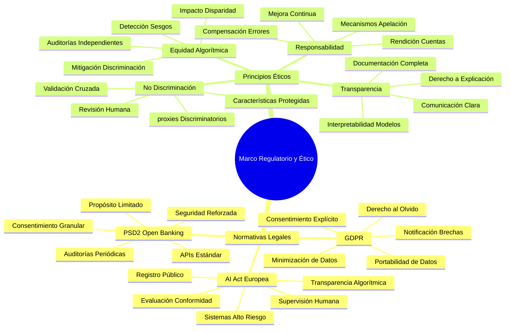
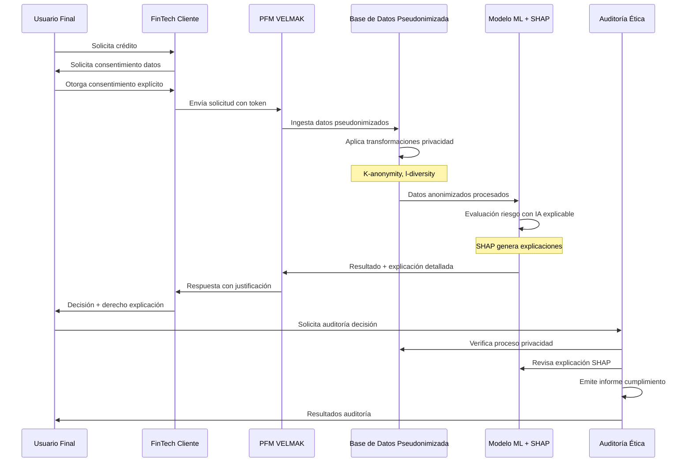

# **CAPÍTULO 10: GESTIÓN DE LA PRIVACIDAD Y ÉTICA DEL DATO**

## **10.1 Descripción de los aspectos de privacidad y ética del dato relevantes para la empresa y su modelo de datos**

La naturaleza intrínsecamente sensible de los datos financieros y alternativos procesados por PFM VELMAK establece un marco de responsabilidad ética y legal que trasciende el mero cumplimiento normativo para convertirse en pilar fundamental de la propuesta de valor de la empresa. Los datos financieros tradicionales como historiales de crédito, saldos de cuenta y patrones de gasto constituyen información personal sensible bajo el Reglamento General de Protección de Datos (GDPR), requiriendo niveles elevados de protección y justificación explícita para su procesamiento. Los datos alternativos, aunque potencialmente menos obvios en su sensibilidad, pueden revelar aspectos íntimos del comportamiento personal, preferencias de consumo, patrones de vida y circunstancias socioeconómicas que, combinados adecuadamente, pueden generar perfiles detallados de los individuos con precisión preocupante. Esta confluencia de información financiera y comportamental crea un ecosistema de datos cuya gestión responsable requiere no solo medidas técnicas robustas, sino additionally una reflexión ética profunda sobre los límites apropiados del análisis predictivo en el contexto financiero (European Data Protection Board, 2023).

El riesgo ético inherente a la creación de sistemas algorítmicos de "caja negra" representa quizás el desafío más significativo desde una perspectiva de responsabilidad corporativa y social. Los modelos de machine learning complejos, aunque potencialmente más precisos, pueden aprender correlaciones espurias o discriminatorias presentes en los datos históricos que perpetúan o amplifican sesgos existentes en la sociedad. El riesgo particularmente agudo en el contexto del scoring crediticio radica en la posibilidad de que el sistema niegue acceso a crédito a sectores vulnerables basándose en proxies de características protegidas como origen étnico, género o situación socioeconómica, utilizando variables aparentemente neutrales como patrones de consumo en ciertos establecimientos, frecuencia de visitas a áreas geográficas específicas, o tipos de dispositivos utilizados. Estas discriminaciones indirectas, aunque no intencionadas, pueden tener consecuencias devastadoras en la vida de las personas afectadas, perpetuando ciclos de exclusión financiera y desigualdad social (IBM, 2024).

La asimetría de información y poder entre PFM VELMAK como proveedor de tecnología, los clientes FinTech que utilizan los servicios de scoring, y los consumidores finales cuyos datos son procesados crea una dinámica ética compleja que requiere mecanismos de equilibrio y transparencia. Los consumidores finales a menudo no tienen conocimiento directo de que sus datos están siendo utilizados para evaluaciones de riesgo, ni comprensión de cómo ciertos comportamientos pueden impactar sus oportunidades financieras futuras. Esta falta de transparencia se complica adicionalmente por la naturaleza B2B2C del modelo de negocio, donde la responsabilidad directa de la comunicación con el consumidor recae en los clientes FinTech, pero la responsabilidad ética del diseño y funcionamiento de los algoritmos permanece en PFM VELMAK. Esta distribución de responsabilidades requiere acuerdos contractuales claros, mecanismos de auditoría compartida, y protocolos de comunicación efectivos que aseguren que los consumidores finales ejerzan efectivamente sus derechos de información, rectificación y explicación (McKinsey & Company, 2023).

El impacto potencial de errores algorítmicos en la vida de las personas eleva la consideración ética más allá de la precisión técnica para incluir dimensiones de justicia distributiva y equidad procesal. Un falso negativo en una evaluación de riesgo crediticio no representa simplemente un error técnico, sino la negación de oportunidades fundamentales como acceso a vivienda, educación o capital emprendedor, con consecuencias potencialmente permanentes en la trayectoria vital de los individuos afectados. Esta gravedad del impacto exige estándares más elevados de diligencia debida en el diseño e implementación de los sistemas, incluyendo mecanismos robustos de apelación y revisión humana, compensaciones por errores demostrados, y procesos continuos de mejora que aprendan de los fallos del sistema. La ética del diseño algorítmico en este contexto requiere una mentalidad de "primum non nocere" adaptada a la era digital, donde la prevención del daño se convierte en principio rector por encima de la optimización métrica (Harvard Business Review, 2024).

La tensión entre innovación tecnológica y protección de derechos fundamentales constituye el dilema ético central que PFM VELMAK debe navegar en su operación cotidiana. Por un lado, la capacidad de procesar datos alternativos a gran escala ofrece oportunidades sin precedentes para inclusión financiera, permitiendo evaluar la solvencia de individuos previamente excluidos del sistema financiero tradicional. Por otro lado, esta misma capacidad de análisis detallado del comportamiento personal crea riesgos significativos de intrusión, vigilancia y potencial discriminación que requieren salvaguardias robustas. La resolución de esta tensión no reside en la elección extrema entre innovación o protección, sino en el desarrollo de un enfoque equilibrado que maximice los beneficios sociales de la tecnología mientras minimiza sus riesgos potenciales mediante diseño ético, supervisión humana continua y transparencia radical sobre los límites y capacidades del sistema (European Commission, 2024).

## **10.2 Análisis de las mejores prácticas y regulaciones pertinentes**

El marco regulatorio europeo establecido por el Reglamento General de Protección de Datos (GDPR) constituye la base fundamental sobre la cual se construye la estrategia de privacidad de PFM VELMAK, estableciendo principios rigurosos que guían el procesamiento de datos personales en toda la Unión Europea. El principio de minimización de datos requiere que PFM VELMAK recolecte únicamente aquellos datos estrictamente necesarios para la finalidad específica de evaluación de riesgo crediticio, evitando la tentación de acumular información adicional por su potencial valor futuro. El principio de limitación de la finalidad asegura que los datos recolectados para scoring crediticio no sean posteriormente utilizados para otros propósitos sin consentimiento explícito adicional, como marketing dirigido o evaluación de comportamiento en otros contextos. El principio de limitación del plazo de conservación establece la obligación de eliminar datos personales cuando ya no sean necesarios para su propósito original, implementando políticas de retención diferenciadas según la sensibilidad y relevancia de cada tipo de información (European Data Protection Board, 2023).

El derecho al olvido, consagrado en el artículo 17 del GDPR, representa una obligación particularmente relevante para un sistema de scoring que mantiene perfiles actualizados de comportamiento financiero y personal. PFM VELMAK debe implementar mecanismos efectivos que permitan a los individuos solicitar la eliminación de sus datos personales del sistema, incluyendo la eliminación de registros históricos, modelos derivados y cualquier copia de seguridad que contenga su información. Este derecho se complica técnicamente por la naturaleza de los modelos de machine learning, donde los datos de entrenamiento pueden influir sutilmente en las predicciones del modelo incluso después de la eliminación de los datos brutos. La implementación efectiva del derecho al olvido requiere técnicas avanzadas como machine learning unlearning, que permiten eliminar la influencia de datos específicos de modelos entrenados sin necesidad de reentrenar completamente desde cero, un área de investigación activa con implicaciones prácticas directas para la operación de PFM VELMAK (IBM, 2024).

La Directiva PSD2 sobre Servicios de Pago en el Mercado Interior Europeo establece el marco regulatorio específico para el acceso a datos financieros mediante Open Banking, creando tanto oportunidades como obligaciones para PFM VELMAK. PSD2 obliga a las entidades bancarias a compartir datos de clientes con terceros autorizados mediante APIs estandarizadas, pero establece requisitos estrictos de consentimiento explícito, seguridad y propósito limitado. La implementación de PSD2 requiere que PFM VELMAK obtenga consentimiento granular y específico para cada tipo de dato financiero accedido, mantenga registros detallados de todos los consentimientos otorgados, y implemente mecanismos robustos de autenticación y autorización que aseguren que solo entidades autorizadas accedan a información financiera sensible. La directiva additionally establece obligaciones de notificación a autoridades competentes en caso de brechas de seguridad que comprometan datos financieros, requiriendo planes de respuesta a incidentes específicos para este tipo de información (European Banking Authority, 2023).

La inminente AI Act europea establece un marco regulatorio específico para sistemas de inteligencia artificial clasificados como de alto riesgo, categoría que incluye explícitamente los sistemas de evaluación de crédito utilizados por instituciones financieras. Esta regulación exige que PFM VELMAK implemente un sistema de gestión de calidad completo, incluyendo evaluaciones de conformidad previas al despliegue, sistemas de supervisión humana continua, y documentación exhaustiva sobre el funcionamiento, entrenamiento y validación de los modelos. La AI Act additionally requiere transparencia sobre el uso de sistemas de IA, obligando a informar a los usuarios cuando están interactuando con sistemas algorítmicos y proporcionando explicaciones significativas sobre las decisiones tomadas. El establecimiento de un registro público de sistemas de IA de alto riesgo en la Unión Europea additionally aumentará la visibilidad y escrutinio sobre las operaciones de PFM VELMAK, requiriendo preparación para mayor transparencia y justificación de las prácticas algorítmicas implementadas (European Commission, 2024).

Las mejores prácticas en mitigación de sesgos algorítmicos complementan el marco regulatorio formal con estándares técnicos y éticos que aseguran la equidad y no discriminación de los sistemas de scoring. La literatura académica reciente sobre fairness in machine learning establece múltiples métricas y técnicas para detectar y mitigar sesgos, incluyendo demographic parity, equalized odds, y counterfactual fairness. La implementación de estas técnicas requiere análisis continuos del impacto disparidad de los modelos en diferentes grupos demográficos, identificación de características que actúen como proxies de atributos protegidos, y ajuste algorítmico para asegurar resultados equitativos sin sacrificar excesivamente la precisión predictiva general. Las auditorías algorítmicas independientes constituyen otra mejor práctica fundamental, permitiendo evaluaciones externas de la equidad y transparencia de los sistemas por expertos independientes que puedan identificar sesgos o problemas no evidentes para los desarrolladores internos (IBM, 2024).

## **10.3 Propuesta de estrategias y herramientas para garantizar la privacidad y ética del dato en el modelo de datos mejorado**

La implementación de técnicas de anonimización y pseudonimización desde la ingesta de datos constituye la primera línea de defensa técnica para garantizar la privacidad en el modelo de datos mejorado de PFM VELMAK. La pseudonimización, que reemplaza identificadores directos como nombres, números de documento o cuentas bancarias por identificadores irreversibles generados criptográficamente, permite el procesamiento y análisis de datos sin exposición de identidades directas. Esta técnica se complementa con la anonimización avanzada mediante técnicas como k-anonymity, l-diversity y t-closeness, que aseguran que cada individuo no pueda ser identificado mediante combinaciones de atributos cuasi-identificadores. La implementación de estas técnicas requiere un diseño cuidadoso del pipeline de datos, aplicando transformaciones de privacidad inmediatamente después de la recolección y antes de cualquier procesamiento analítico, asegurando que ni siquiera el equipo técnico interno acceda a información identificable (European Data Protection Board, 2023).

El cifrado de extremo a extremo representa otra capa fundamental de protección técnica, asegurando que los datos permanezcan cifrados tanto en tránsito como en reposo, con claves de cifrado gestionadas mediante sistemas de gestión de claves robustos como AWS KMS o Azure Key Vault. La implementación de cifrado homomórfico para ciertos cálculos específicos permite realizar operaciones analíticas sobre datos cifrados sin necesidad de descifrarlos previamente, eliminando completamente el riesgo de exposición durante el procesamiento. Adicionalmente, la implementación de técnicas de secure multi-party computation permite que múltiples partes colaboren en análisis conjuntos sin compartir sus datos brutos, particularmente útil para colaboraciones con otras entidades FinTech o instituciones financieras donde se desea beneficiarse de datos agregados sin comprometer la privacidad individual (IBM, 2024).

Las librerías de explicabilidad como SHAP (SHapley Additive exPlanations) y LIME (Local Interpretable Model-agnostic Explanations) en Python constituyen herramientas fundamentales para garantizar la transparencia algorítmica y el derecho a explicación de los usuarios finales. SHAP permite descomponer cada predicción individual en contribuciones específicas de cada característica, proporcionando explicaciones granulares y matemáticamente consistentes sobre por qué el modelo tomó una decisión particular. LIME complementa estas capacidades generando modelos locales simplificados que aproximan el comportamiento del modelo complejo en vecindades específicas, permitiendo explicaciones intuitivas sobre casos individuales. La implementación de estas herramientas no solo cumple con los requisitos de la AI Act, sino que additionally proporciona mecanismos efectivos para detectar sesgos, identificar características problemáticas y facilitar la apelación de decisiones por parte de los usuarios afectados (Lundberg & Lee, 2017).

El diseño de un sistema de supervisión humana continua constituye otro pilar fundamental de la estrategia ética de PFM VELMAK, asegurando que las decisiones algorítmicas críticas sean revisadas por humanos calificados antes de su implementación final. Este sistema incluye múltiples capas de supervisión, desde revisores técnicos que validan la calidad y equidad de los modelos antes del despliegue, hasta expertos en cumplimiento que aseguran la adherencia a normativas y principios éticos. La implementación de "human-in-the-loop" para decisiones de alto riesgo, como rechazo de solicitudes de crédito para individuos vulnerables o evaluaciones cercanas a umbrales críticos, permite capturar matices y contextos que los algorítmicos pueden no considerar adecuadamente. Los supervisores humanos additionally pueden identificar patrones emergentes de sesgo o problemas éticos que no son evidentes en las métricas automáticas, facilitando la mejora continua del sistema (European Commission, 2024).

La implementación de mecanismos robustos de apelación y revisión constituye la garantía final de equidad y transparencia del sistema, permitiendo que los usuarios afectados por decisiones algorítmicas puedan solicitar revisión humana y obtener correcciones cuando se demuestren errores o sesgos. El proceso de apelación incluye múltiples etapas: solicitud inicial de revisión por parte del usuario, análisis técnico de la decisión mediante herramientas de explicabilidad, evaluación contextual por expertos en riesgo, y resolución final con explicación detallada de los fundamentos de la decisión. Las decisiones de apelación additionally alimentan un sistema de aprendizaje continuo que identifica patrones de error sistemático y ajusta los modelos para evitar repeticiones futuras. La transparencia completa sobre las tasas de apelación exitosas y los tipos de errores corregidos additionally genera confianza en el sistema y demuestra el compromiso de PFM VELMAK con la mejora continua y la rendición de cuentas (McKinsey & Company, 2023).

El establecimiento de un comité de ética algorítmica multidisciplinar constituye la estructura de gobernanza que supervisa y guía todas las decisiones relacionadas con privacidad y ética en PFM VELMAK. Este comité, compuesto por expertos técnicos, legales, éticos y de dominio financiero, se reúne periódicamente para evaluar nuevos desarrollos, revisar incidentes éticos, y establecer políticas actualizadas sobre el uso responsable de datos y algoritmos. El comité additionally mantiene canales abiertos con sociedad civil, academia y reguladores para asegurar que las prácticas de PFM VELMAK se mantengan alineadas con estándares emergentes y expectativas sociales. Esta estructura de gobernanza no solo asegura el cumplimiento normativo, sino que additionally posiciona a PFM VELMAK como líder responsable en el uso ético de inteligencia artificial en el sector financiero, generando confianza diferenciadora en el mercado (Harvard Business Review, 2024).
