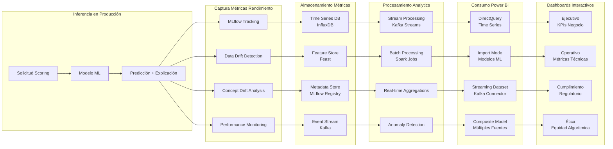

# **CAPÍTULO 11: MEDICIÓN Y CONTROL DEL MODELO DE DATOS MEJORADO**

## **11.1 Descripción de las herramientas básicas para la medición y control del modelo de datos mejorado**

La arquitectura de monitorización implementada para el modelo de datos mejorado de PFM VELMAK se fundamenta en un enfoque MLOps (Machine Learning Operations) que integra continuamente el ciclo de vida completo de los modelos, desde la ingesta de datos hasta la inferencia en producción y su posterior análisis de rendimiento. Esta arquitectura se estructura en múltiples capas especializadas que operan de forma coordinada para proporcionar visibilidad completa sobre el estado del sistema, permitiendo la detección temprana de anomalías, degradaciones de rendimiento o desviaciones del comportamiento esperado. La monitorización no se limita a métricas técnicas tradicionales como latencia o disponibilidad, sino que incorpora adicionalmente capacidades avanzadas de detección de drift de datos y conceptos, análisis de equidad algorítmica y evaluación continua del impacto en el negocio, creando un sistema de control holístico que aborda todas las dimensiones relevantes del modelo (Databricks, 2024).

La integración de herramientas de seguimiento de Machine Learning como MLflow en el backend constituye el pilar técnico fundamental que permite capturar, versionar y analizar el comportamiento de los modelos en producción. MLflow facilita el registro sistemático de cada ejecución de inferencia, incluyendo las características de entrada utilizadas, las predicciones generadas, los metadatos temporales y las métricas de rendimiento calculadas en tiempo real. Esta herramienta adicionalmente permite la comparación de diferentes versiones de modelos mediante experimentos controlados, facilitando la toma de decisiones sobre actualizaciones y mejoras basadas en evidencia cuantitativa. La integración de MLflow con el ecosistema Spark mediante MLflow Tracking Spark Integration permite capturar métricas a escala distribuida, asegurando que el volumen masivo de transacciones procesadas por PFM VELMAK no comprometa la calidad o completitud de la monitorización (MLflow, 2024).

El flujo de información desde el backend de monitorización hacia Power BI en el frontend se implementa mediante una arquitectura de streaming en tiempo real que asegura que los stakeholders tengan acceso a información actualizada hasta el minuto. Las métricas capturadas por MLflow y otras herramientas de monitorización se publican en un tópico de Apache Kafka dedicado, desde donde son consumidas por múltiples consumidores incluyendo sistemas de alerting, bases de datos de series temporales y directamente los conectores de Power BI. Esta arquitectura basada en eventos permite la actualización continua de dashboards sin necesidad de consultas periódicas a las fuentes de datos originales, reduciendo la carga computacional y garantizando consistencia entre diferentes vistas de la información. La implementación de procesamiento enriquecimiento de streams mediante Kafka Streams permite adicionalmente el cálculo de métricas derivadas en tiempo real, como tasas de cambio, promedios móviles o detección de anomalías estadísticas (Confluent, 2024).

La importancia del control en tiempo casi real del rendimiento del scoring se manifiesta en múltiples dimensiones críticas para la operación sostenible del negocio. Las decisiones de riesgo crediticio tomadas por los clientes FinTech de PFM VELMAK tienen impactos financieros inmediatos y potencialmente permanentes en la vida de los solicitantes, requiriendo supervisión continua para detectar rápidamente cualquier degradación en la calidad de las evaluaciones. La monitorización en tiempo real permite identificar problemas como aumento en la tasa de falsos negativos, sesgos emergentes en ciertos segmentos demográficos, o degradaciones en la precisión general del modelo antes de que estos problemas generen pérdidas significativas o problemas regulatorios. Adicionalmente, el control casi real facilita la optimización proactiva del sistema, permitiendo ajustes finos en umbrales de decisión o parámetros del modelo basados en el rendimiento actual en lugar de análisis históricos con latencias significativas (Gartner, 2024).

La arquitectura de monitorización incorpora adicionalmente capacidades avanzadas de correlación de eventos que permiten identificar relaciones causales entre diferentes métricas y anomalías del sistema. Mediante el análisis de correlación entre cambios en las fuentes de datos, modificaciones en el comportamiento de los modelos y variaciones en los resultados de negocio, el sistema puede identificar las causas raíz de problemas en lugar de limitarse a la detección superficial de síntomas. Esta capacidad de análisis causal es fundamental para la resolución eficiente de problemas y la mejora continua del sistema, permitiendo que los equipos de ingeniería y ciencia de datos se concentren en las causas fundamentales en lugar de dedicar tiempo a síntomas superficiales. La implementación de grafos de dependencias entre métricas y componentes del sistema facilita adicionalmente la comprensión del impacto potencial de cambios planificados, permitiendo evaluaciones de riesgo antes de implementar modificaciones (McKinsey & Company, 2023).

## **11.2 Propuesta de indicadores clave de rendimiento (KPIs) para medir la efectividad del modelo de datos**

Los indicadores clave de rendimiento implementados para la monitorización operativa del modelo de datos se estructuran en múltiples pilares que proporcionan una visión comprehensiva de la salud del sistema, complementando las métricas estáticas de evaluación analizadas en el capítulo 9 con indicadores dinámicos que reflejan el comportamiento en tiempo real. El Population Stability Index (PSI) constituye uno de los KPIs más críticos para detectar cambios en el perfil de los solicitantes de crédito, midiendo la diferencia entre la distribución de características de la población de entrenamiento y la población actual en producción. Un PSI elevado (superior a 0.25) indica que el modelo está operando sobre una población significativamente diferente a aquella para la cual fue entrenado, requiriendo potencialmente reentrenamiento o ajuste de parámetros. Este indicador se calcula para cada característica importante del modelo, permitiendo identificar qué variables específicas están experimentando cambios más significativos en su distribución (IBM, 2024).

La tasa de latencia de la API en producción representa otro KPI fundamental que mide el rendimiento operativo del sistema y su capacidad para responder a las necesidades de los clientes FinTech en tiempo real. Esta métrica se monitoriza en múltiples percentiles (P50, P90, P95, P99) para asegurar no solo el rendimiento promedio sino adicionalmente la consistencia del servicio incluso durante picos de demanda. Los umbrales de alerta se establecen en 50ms para el percentil 95 y 85ms para el percentil 99, con alertas automáticas que se activan cuando estos límites se superan persistentemente. La latencia se additionally desglosa por componente del sistema (ingesta de datos, procesamiento de características, inferencia del modelo, generación de explicaciones) para identificar cuellos de botella específicos y facilitar optimizaciones targetizadas. Esta monitorización detallada permite asegurar que el servicio cumpla consistentemente con los SLAs establecidos con los clientes (Amazon Web Services, 2024).

El volumen de datos nulos ingeridos por hora constituye un indicador crítico de la calidad de los datos de entrada y la salud de las fuentes de información, permitiendo detectar problemas en las tuberías de ingesta o degradaciones en la calidad de las fuentes externas. Este KPI se monitoriza tanto en términos absolutos como porcentuales por fuente de datos, permitiendo identificar si ciertos proveedores están experimentando problemas específicos. Los umbrales de alerta se establecen dinámicamente basados en patrones históricos, con alertas que se activan cuando el volumen de nulos supera en dos desviaciones estándar el promedio histórico. Adicionalmente, se implementa análisis de tendencia para detectar degradaciones graduales en la calidad de los datos que podrían no ser evidentes en análisis puntuales pero que indican problemas sistémicos emergentes (Google Cloud, 2024).

La tasa de rechazo automatizado versus revisión manual representa un indicador fundamental del equilibrio entre automatización y supervisión humana, permitiendo optimizar la eficiencia operativa mientras se mantiene el control sobre decisiones críticas. Este KPI mide el porcentaje de solicitudes que son automáticamente rechazadas por el modelo versus aquellas que son escaladas a revisión humana por diversos criterios como umbrales de puntuación cercanos a límites, solicitudes de segmentos vulnerables o activación de alertas de anomalía. La optimización de este indicador permite maximizar la eficiencia operativa reduciendo la carga de revisión manual sin comprometer la calidad de las decisiones. Los análisis de tendencia de este KPI adicionalmente revelan patrones sobre la confianza en el modelo y la necesidad de ajustes en los umbrales de escalado automático (Microsoft, 2024).

```mermaid
graph TD
    A[KPIs Control Modelo Datos] --> B[Salud del Dato]
    A --> C[Salud del Modelo]
    A --> D[Salud del Negocio]
    
    B --> B1[PSI Population Stability Index]
    B1 --> B11[Características Clave]
    B1 --> B12[Distribución vs Entrenamiento]
    B1 --> B13[Alerta PSI > 0.25]
    
    B --> B2[Volumen Datos Nulos]
    B2 --> B21[Por Hora y Fuente]
    B2 --> B22[Tendencia Calidad]
    B2 --> B23[Alerta +2 Desviaciones]
    
    B --> B3[Frescura Datos]
    B3 --> B31[Edad Promedio Datos]
    B3 --> B32[Actualización por Tipo]
    B3 --> B33[Objetivo < 24h]
    
    C --> C1[Latencia API]
    C1 --> C11[Percentiles P50/P95/P99]
    C1 --> C12[SLA < 50ms P95]
    C1 --> C13[Desglose por Componente]
    
    C --> C2[Data Drift Detection]
    C2 --> C21[KS Statistic]
    C2 --> C22[Wasserstein Distance]
    C2 --> C23[Alerta Cambio Distribución]
    
    C --> C3[Concept Drift Analysis]
    C3 --> C31[Rendimiento Temporal]
    C3 --> C32[Precisión Degradación]
    C3 --> C33[Necesidad Reentrenamiento]
    
    D --> D1[Tasa Conversión]
    D1 --> D11[Aprobaciones vs Solicitudes]
    D1 --> D12[Por Segmento Demográfico]
    D1 --> D13[Objetivo > 75%]
    
    D --> D2[Balance Automatización]
    D2 --> D21[Rechazo Automático vs Manual]
    D2 --> D22[Eficiencia Operativa]
    D2 --> D23[Optimización Umbrales]
    
    D --> D3[Impacto Negocio]
    D3 --> D31[Reducción Morosidad]
    D3 --> D32[Aumento Inclusión]
    D3 --> D33[ROI Modelo]
```

La tasa de conversión por segmento demográfico constituye otro KPI crítico que permite detectar potenciales sesgos emergentes o problemas de equidad en el modelo. Este indicador mide la tasa de aprobación de solicitudes desglosada por diferentes grupos demográficos como edad, género, región geográfica o nivel socioeconómico. La monitorización de estas tasas permite identificar rápidamente si ciertos grupos están siendo sistemáticamente rechazados en tasas desproporcionadas, indicando potenciales sesgos algorítmicos o cambios en el comportamiento de ciertos segmentos poblacionales. Los análisis de tendencia adicionalmente revelan si las diferencias entre segmentos se están manteniendo estables, aumentando o disminuyendo con el tiempo, permitiendo intervenciones proactivas antes de que se conviertan en problemas regulatorios o de reputación (Harvard Business Review, 2023).

El impacto en el negocio medido mediante la reducción de la tasa de morosidad y el aumento en la inclusión financiera constituye el KPI definitivo que conecta el rendimiento técnico del modelo con los objetivos estratégicos del negocio. Este indicador se calcula comparando las métricas de negocio actuales con las líneas base establecidas antes de la implementación del modelo mejorado, permitiendo cuantificar el valor generado directamente. La monitorización continua de este KPI adicionalmente permite identificar correlaciones entre cambios en el rendimiento técnico y variaciones en los resultados de negocio, facilitando la optimización del sistema basada en impacto real en lugar de métricas técnicas abstractas. Este enfoque de medición de impacto asegura que las inversiones en mejora del modelo generen retornos tangibles y justificables (Deloitte, 2024).

## **11.3 Descripción detallada de cada herramienta y su función en el proceso de medición y control**

Power BI actúa como el centro de mando estratégico de toda la arquitectura de monitorización, consolidando información de múltiples fuentes en dashboards interactivos que proporcionan visibilidad completa sobre el estado del sistema a diferentes niveles de granularidad y para diferentes audiencias. La plataforma se estructura en múltiples capas de dashboards especializados según el perfil del usuario y sus necesidades específicas de información. Los dashboards ejecutivos proporcionan visión agregada de KPIs clave de negocio como tasa de conversión, impacto en morosidad y rendimiento general del modelo, permitiendo toma de decisiones estratégicas sin necesidad de profundizar en detalles técnicos. Los dashboards operativos ofrecen visión detallada de métricas técnicas como latencia, volumen de procesamiento y calidad de datos, facilitando la gestión diaria del sistema por equipos técnicos. Los dashboards de cumplimiento y ética proporcionan visibilidad sobre aspectos regulatorios como equidad algorítmica, privacidad de datos y cumplimiento de normativas específicas, permitiendo gestión proactiva de riesgos regulatorios (Microsoft, 2024).

El modelo de datos analítico implementado en Power BI se fundamenta en una arquitectura estrella que optimiza las consultas analíticas y facilita el cálculo de métricas complejas mediante medidas DAX avanzadas. La tabla de hechos central almacena transacciones individuales de scoring con información temporal detallada, mientras que las tablas de dimensiones proporcionan contexto sobre características de los modelos, fuentes de datos, segmentos demográficos y resultados de negocio. Esta estructura permite el análisis multidimensional rápido y eficiente, soportando drill-downs desde métricas agregadas hasta transacciones individuales. Las medidas DAX implementadas incluyen cálculos complejos como índices de estabilidad poblacional, tasas de cambio compuestas, análisis de cohortes y comparaciones de rendimiento entre diferentes versiones de modelos, permitiendo análisis sofisticados sin necesidad de procesamiento externo (Microsoft, 2024).

Las medidas DAX complejas implementadas en Power BI permiten calcular desviaciones del algoritmo respecto a la línea base histórica, proporcionando insights profundos sobre la evolución del rendimiento del modelo. Estas medidas incluyen cálculos de rolling averages para suavizar fluctuaciones aleatorias, comparaciones de periodos móviles para identificar tendencias, y cálculos de desviaciones estándar para detectar anomalías estadísticamente significativas. Adicionalmente, se implementan medidas de correlación que permiten identificar relaciones entre cambios en las características de entrada y variaciones en los resultados del modelo, facilitando el análisis causal de problemas. Las medidas de what-if analysis permiten adicionalmente simular el impacto de cambios en umbrales de decisión o parámetros del modelo sobre los resultados de negocio, facilitando la toma de decisiones informadas sobre optimizaciones del sistema (Gartner, 2024).

La importancia de un dashboard interactivo para la dirección de PFM VELMAK se manifiesta en múltiples dimensiones críticas para la gestión eficaz de un negocio basado en algoritmos automatizados. La interactividad permite a los directivos explorar datos desde diferentes perspectivas, identificar patrones emergentes y realizar análisis ad-hoc sin necesidad de solicitar reportes personalizados a equipos técnicos. Los filtros dinámicos por periodo temporal, segmento demográfico, fuente de datos o versión del modelo facilitan el análisis contextualizado de problemas y oportunidades. La capacidad de drill-through desde métricas agregadas hasta transacciones individuales permite investigaciones profundas de anomalías o tendencias preocupantes. Esta autonomía analítica reduce la dependencia de equipos técnicos para información operativa, acelerando la toma de decisiones y permitiendo que los equipos técnicos se concentren en optimización del sistema en lugar de generación de reportes (McKinsey & Company, 2023).

El ciclo de vida de la monitorización MLOps se implementa como un proceso continuo que conecta la inferencia del modelo en producción con la mejora iterativa basada en datos reales, creando un sistema de aprendizaje automático que evoluciona constantemente. El proceso se inicia con la captura sistemática de cada inferencia realizada por el modelo, incluyendo no solo la predicción resultante sino adicionalmente las características de entrada utilizadas, el contexto temporal y los metadatos de la solicitud. Esta información se enriquece posteriormente con los resultados de negocio observados, como si el cliente finalmente pagó el crédito o incumplió sus obligaciones, creando un conjunto de datos de entrenamiento continuo que refleja las condiciones reales de operación (Databricks, 2024).

El almacenamiento de métricas de rendimiento se implementa mediante una arquitectura multi-base de datos optimizada según el tipo y frecuencia de acceso de cada información. Las métricas de series temporales como latencia, volumen de transacciones y tasas de error se almacenan en InfluxDB, una base de datos especializada en time series que permite consultas eficientes con agregaciones temporales. Las características de los modelos y sus metadatos se almacenan en el feature store Feast, facilitando el acceso rápido y consistente a las transformaciones de datos utilizadas en producción. Los metadatos de los modelos, incluyendo versiones, parámetros y métricas de evaluación, se almacenan en el registro de MLflow, proporcionando un histórico completo de la evolución de los modelos. Los eventos de streaming como alertas de drift o anomalías se almacenan en Kafka, permitiendo procesamiento en tiempo real y consumo por múltiples sistemas (Apache Software Foundation, 2024).

El procesamiento analytics implementado mediante la combinación de stream processing y batch processing permite generar insights tanto en tiempo real como mediante análisis históricos profundos. El stream processing mediante Kafka Streams realiza agregaciones continuas de métricas en tiempo real, incluyendo tasas de cambio, detección de umbrales y cálculos de promedios móviles. El batch processing mediante Spark jobs realiza análisis más complejos que requieren contexto histórico completo, incluyendo análisis de cohortes de rendimiento, detección de tendencias de largo plazo y entrenamiento de modelos de detección de anomalías. Esta combinación de paradigmas de procesamiento asegura que PFM VELMAK disponga tanto de visibilidad inmediata como de análisis estratégicos profundos para la toma de decisiones (Confluent, 2024).

El consumo de datos en Power BI se implementa mediante múltiples conectores optimizados según las características de cada fuente de información. El conector DirectQuery para bases de datos time series permite consultas en tiempo real sin necesidad de importar datos, asegurando máxima frescura de la información para dashboards operativos. El modo Import se utiliza para modelos de machine learning y metadatos que cambian con menor frecuencia, optimizando el rendimiento mediante caché local. El conector streaming para Kafka permite la actualización continua de dashboards críticos que requieren información en tiempo real, como alertas de drift o anomalías. El modelo compuesto de Power BI integra estas múltiples fuentes en una vista unificada, permitiendo análisis complejos que combinen información en tiempo real con contexto histórico (Microsoft, 2024).
