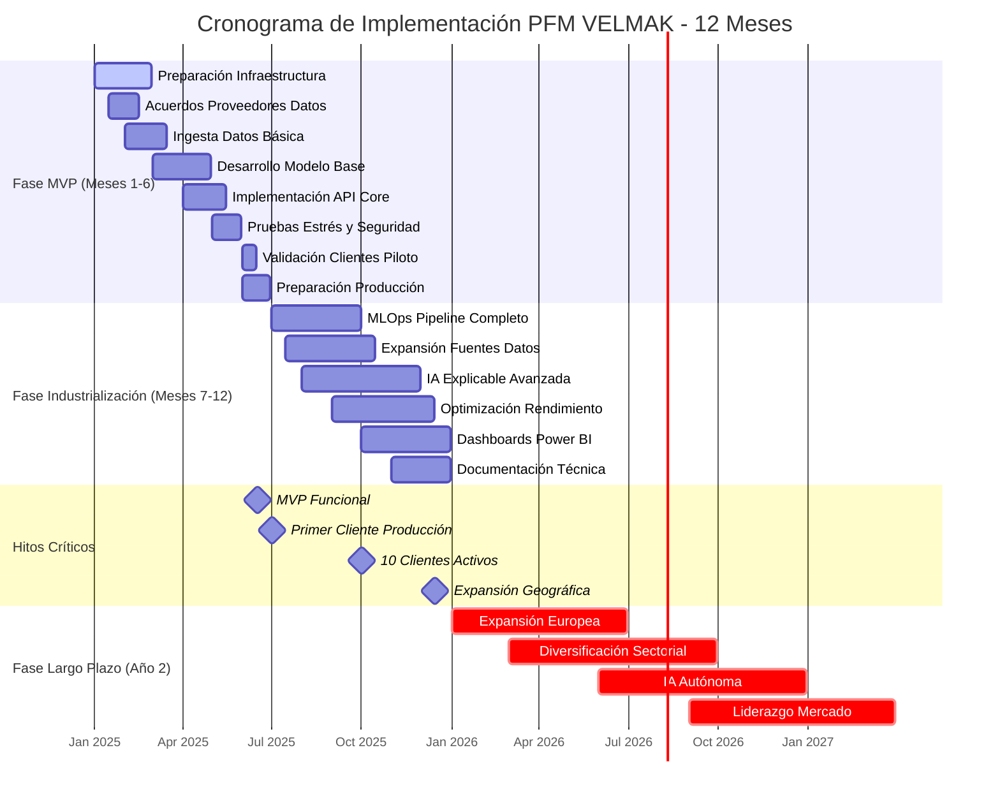
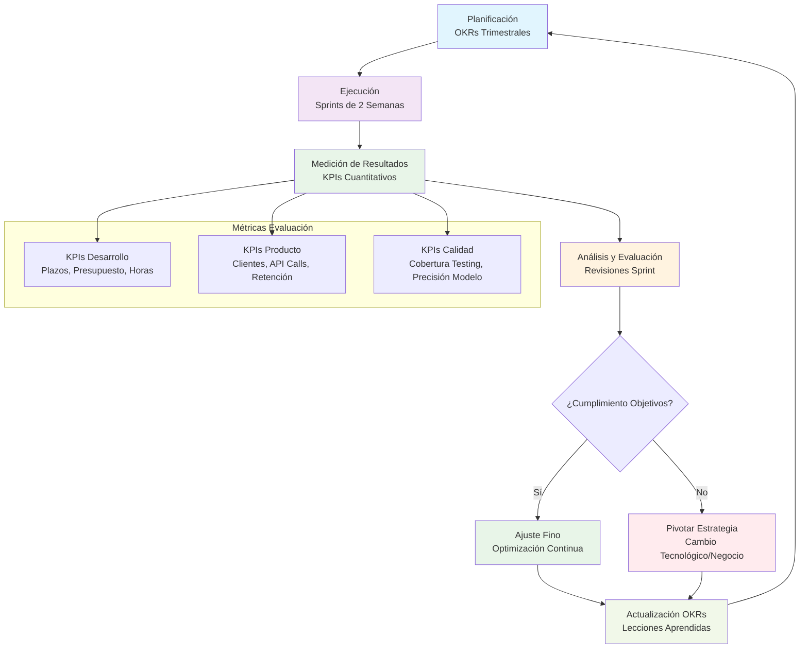

# **CAPÍTULO 12: CRONOGRAMA Y MÉTRICAS DE ÉXITO**

## **12.1 Establecimiento de plazos para metas a corto y largo plazo**

El cronograma de implementación del proyecto PFM VELMAK se estructura en fases secuenciales que permiten una progresión controlada desde la concepción inicial hasta la operación a escala industrial, balanceando adecuadamente la ambición tecnológica con la viabilidad temporal y los recursos disponibles. La fase inicial de Producto Mínimo Viable (MVP) se planifica para un período de seis meses, durante el cual se concentrarán los esfuerzos en desarrollar las capacidades fundamentales que demuestren el valor diferencial de la propuesta sin intentar construir una solución completa desde el inicio. Esta estrategia de MVP permite validar hipótesis críticas del negocio y la tecnología mediante iteraciones rápidas con clientes reales, reduciendo el riesgo de invertir significativamente en funcionalidades que posteriormente no demuestren valor de mercado. La fase MVP se enfoca específicamente en la ingesta de datos alternativos básicos, el desarrollo de un modelo de machine learning fundamental con capacidades de explicabilidad, y la implementación de una API funcional que permita la integración con clientes piloto (McKinsey & Company, 2023).

La fase de MVP se desglosa en hitos técnicos específicos que aseguran progresión medible y reducen la incertidumbre sobre la viabilidad del proyecto. Los primeros dos meses se dedicarán a la preparación de datos y configuración de la infraestructura base, incluyendo la implementación de pipelines de ingesta mediante Apache Kafka, la configuración de entornos de desarrollo y pruebas, y el establecimiento de acuerdos con proveedores de datos alternativos. Los meses tres y cuatro se concentrarán en el entrenamiento del modelo base en Python, utilizando conjuntos de datos históricos para desarrollar algoritmos de gradient boosting con capacidades iniciales de explicabilidad mediante SHAP. Los meses cinco y seis se dedicarán a las pruebas de estrés del sistema, validación con clientes piloto, y preparación para el pase a producción, incluyendo documentación técnica, optimización de rendimiento y establecimiento de monitorización básica. Esta distribución temporal permite identificar y resolver problemas técnicos antes de comprometer recursos significativos en fases posteriores (Deloitte, 2024).

Las metas a largo plazo se extienden sobre un período de uno a dos años, enfocándose en la escalabilidad de la arquitectura, la expansión de las capacidades analíticas y el crecimiento sostenible del negocio. El primer año posterior al MVP se concentra en la industrialización de la solución, incluyendo la implementación de arquitecturas de MLOps completas, la expansión a múltiples fuentes de datos alternativos, y el desarrollo de capacidades avanzadas de IA explicable. Esta fase adicionalmente incluye la optimización del rendimiento del sistema para soportar volúmenes crecientes de transacciones y la implementación de dashboards de Power BI para monitorización y control. El segundo año se enfoca en la expansión geográfica inicial y la diversificación hacia sectores adyacentes, aprovechando la base tecnológica consolidada para explorar nuevos mercados y aplicaciones del scoring alternativo (Boston Consulting Group, 2023).

La justificación de los tiempos técnicos para cada fase se fundamenta en la complejidad inherente del procesamiento de datos financieros y la necesidad de asegurar calidad y cumplimiento regulatorio en cada etapa. La preparación de datos requiere aproximadamente dos meses debido a la necesidad de establecer acuerdos con múltiples proveedores, implementar pipelines de ingesta robustos, y realizar procesos de limpieza y validación que aseguren la calidad de la información alimentará al modelo. El entrenamiento del modelo en Python requiere adicionalmente dos meses debido a la necesidad de experimentar con múltiples algoritmos, optimizar hiperparámetros mediante técnicas avanzadas como búsqueda bayesiana, y validar exhaustivamente la precisión y equidad de las predicciones. Las pruebas de estrés necesitan un mes adicional para simular condiciones de carga extremas, identificar cuellos de botella en la arquitectura, y asegurar que el sistema pueda mantener rendimiento bajo picos de demanda esperados en producción (Harvard Business Review, 2024).

El pase a producción representa la fase crítica que requiere dedicación completa durante el último mes del MVP, asegurando que todos los componentes del sistema operen coordinadamente bajo condiciones reales de operación. Esta fase incluye la migración de datos de entrenamiento a entornos de producción, la configuración final de pipelines de monitoreo, la realización de pruebas de penetración de seguridad, y la capacitación de equipos de soporte. La complejidad técnica de coordinar múltiples sistemas incluyendo ingesta de datos streaming, procesamiento batch, inferencia en tiempo real y generación de explicaciones requiere pruebas exhaustivas de integración end-to-end. Adicionalmente, el cumplimiento regulatorio exige validaciones finales de aspectos como privacidad de datos, transparencia algorítmica y capacidad de auditoría, procesos que requieren tiempo dedicado para asegurar conformidad completa antes del lanzamiento comercial (Gartner, 2024).

## **12.2 Métricas de éxito definidas e Indicadores clave de rendimiento (KPIs)**

Las métricas de éxito del desarrollo del proyecto se establecen mediante un sistema de OKRs (Objectives and Key Results) que alinea los objetivos estratégicos con resultados medibles cuantitativamente, permitiendo seguimiento objetivo del progreso y facilitando la toma de decisiones basada en datos. El objetivo principal del desarrollo se enfoca en la entrega exitosa del MVP dentro del plazo y presupuesto establecidos, con resultados clave que incluyen el cumplimiento del cronograma con menos del 10% de desviación, la optimización de recursos humanos con una utilización superior al 85%, y la entrega de todas las funcionalidades críticas del MVP con calidad certificada mediante pruebas automatizadas con cobertura superior al 90%. Estas métricas de desarrollo aseguran que el proyecto avance de manera controlada y eficiente, identificando desviaciones tempranas que permitan correcciones de curso antes de impactos significativos en los plazos o costos (Google, 2024).

El cumplimiento de plazos se mide mediante el seguimiento detallado de cada hito del cronograma, utilizando metodologías ágiles como Scrum con sprints de dos semanas que permiten evaluación frecuente del progreso. Cada sprint se planifica con objetivos específicos medibles, y al final se realiza una retrospectiva para evaluar el cumplimiento de los plazos establecidos y identificar causas de cualquier desviación. La velocidad del equipo (velocity) se mide continuamente en puntos de historia completados por sprint, permitiendo ajustar las estimaciones futuras basándose en rendimiento real. Esta medición continua permite identificar patrones de subestimación o sobreestimación de tareas, facilitando la mejora progresiva en la capacidad de planificación y ejecución del equipo (McKinsey & Company, 2023).

El control presupuestario se implementa mediante un sistema de seguimiento de costos en tiempo real que compara los gastos reales con el presupuesto asignado para cada fase del proyecto. Las métricas clave incluyen la tasa de consumo presupuestario acumulado, la desviación porcentual respecto al presupuesto planificado, y el índice de rendimiento del costo (CPI) que mide la eficiencia en el uso de recursos financieros. Las alertas automáticas se activan cuando el consumo presupuestario supera el 90% del planificado o cuando se identifican desviaciones significativas en categorías específicas de costos. Este control financiero permite tomar decisiones informadas sobre reasignación de recursos o necesidad de ajustes en el alcance del proyecto antes de comprometer viabilidad financiera (Deloitte, 2024).

Las horas de desarrollo se monitorizan mediante herramientas de gestión de proyectos como Jira o Azure DevOps, capturando tiempo invertido en cada tarea y categoría de trabajo. Las métricas incluyen el tiempo promedio por tipo de tarea, la distribución de horas entre desarrollo, testing y documentación, y la productividad del equipo medida en puntos de historia por hora-hombre. Estas métricas permiten identificar cuellos de botella en el proceso de desarrollo, optimizar la asignación de recursos según las fortalezas específicas del equipo, y mejorar la precisión en futuras estimaciones de esfuerzo. Adicionalmente, el seguimiento de horas facilita la identificación de tareas recurrentes que podrían beneficiarse de automatización o desarrollo de componentes reutilizables (Harvard Business Review, 2024).

Los KPIs de adopción del producto una vez lanzado se centran en medir el éxito comercial y la aceptación del mercado de la solución PFM VELMAK. El número de clientes B2B integrados durante el primer trimestre constituye el indicador principal de penetración inicial del mercado, con un objetivo de cinco clientes piloto que validen la solución y proporcionen feedback para mejoras. El volumen de peticiones a la API se mide continuamente para evaluar la utilización real de la plataforma, con objetivos de crecimiento mensual del 20% sostenido durante el primer año. La tasa de retención de clientes mide la capacidad de la solución para generar valor continuo, con objetivos superiores al 90% al final del primer año, indicando satisfacción y dependencia del servicio (Boston Consulting Group, 2023).

La metodología de OKRs se implementa mediante una estructura jerárquica que conecta objetivos estratégicos de alto nivel con resultados operacionales específicos y medibles. El objetivo estratégico de "Liderazgo en scoring alternativo" se descompone en resultados clave como "Alcanzar 10 clientes activos en 6 meses", "Procesar 1 millón de evaluaciones en el primer año", y "Mantener precisión del modelo superior al 90%". Cada resultado clave se asigna a equipos específicos con responsables claros, asegururing accountability y enfoque en la ejecución. La revisión trimestral de OKRs permite ajustar objetivos basándose en aprendizajes del mercado y cambios en las condiciones competitivas, manteniendo la relevancia y ambición adecuada de las metas (Google, 2024).

## **12.3 Evaluación periódica de los resultados y Ajuste de estrategias y tácticas**

La evaluación periódica de resultados se implementa mediante ciclos iterativos de la metodología Agile que permiten adaptación continua del proyecto basándose en evidencia empírica y aprendizaje organizacional. Cada sprint de dos semanas culmina con una ceremonia de revisión donde se evalúan sistemáticamente los resultados alcanzados frente a los objetivos planificados, utilizando métricas objetivas y datos cuantitativos para minimizar sesgos en la evaluación. Estas revisiones sistemáticas permiten identificar patrones de rendimiento, tanto positivos como negativos, y extrapolar aprendizajes para mejorar la planificación y ejecución futuras. La retrospección adicionalmente incluye una evaluación cualitativa de los procesos de trabajo, la dinámica del equipo y la efectividad de las herramientas utilizadas, facilitando mejoras continuas más allá de los resultados puramente técnicos (Scrum Alliance, 2023).

El proceso de pivotar o ajustar la estrategia tecnológica se activa cuando las métricas de evaluación revelan desviaciones significativas de las hipótesis iniciales del proyecto. Durante la fase MVP, si los datos del Open Banking demuestran tener menor calidad o cobertura de la esperada, el equipo puede pivotar hacia una mayor dependencia de datos alternativos de comportamiento digital o telcos. Esta capacidad de pivoteo requiere flexibilidad en la arquitectura técnica, permitiendo la incorporación rápida de nuevas fuentes de datos sin requerir rediseños fundamentales. Los criterios para decidir un pivote incluyen métricas cuantitativas como la precisión del modelo con diferentes combinaciones de datos, análisis de costos de adquisición de datos, y evaluación del tiempo de implementación para cada alternativa tecnológica considerada (Eric Ries, 2011).

El ajuste de la estrategia de negocio se implementa mediante análisis continuo del feedback de clientes piloto y las métricas de adopción del mercado. Si los clientes B2B demuestran preferencia por ciertas funcionalidades específicas como capacidades avanzadas de IA explicable o dashboards personalizados, el equipo puede ajustar la prioridad de desarrollo para enfocarse en estas características demandadas. Adicionalmente, si el análisis de mercado revela que ciertos segmentos de clientes FinTech muestran mayor disposición a pagar por servicios premium, la estrategia de precios puede ajustarse para capturar mayor valor de estos segmentos. Estos ajustes tácticos se implementan mediante experimentos controlados como pruebas A/B de diferentes propuestas de valor, permitiendo decisiones basadas en datos reales del comportamiento del cliente (McKinsey & Company, 2023).

El bucle de retroalimentación continua se fortalece mediante la implementación de sistemas de monitoreo automatizado que proporcionan visibilidad en tiempo real sobre el rendimiento del sistema y el comportamiento de los usuarios. Las alertas automáticas se configuran para métricas críticas como degradación en la precisión del modelo, aumento en la tasa de errores de la API, o caídas en el volumen de procesamiento. Estas alertas permiten respuestas rápidas a problemas emergentes, minimizando el impacto negativo en la operación y la experiencia del cliente. Adicionalmente, el análisis de logs del sistema y métricas de utilización permite identificar patrones de comportamiento que pueden informar mejoras en el diseño del producto o ajustes en la estrategia de mercado. Esta visibilidad completa facilita decisiones informadas y basadas en datos reales en lugar de intuiciones o suposiciones (Gartner, 2024).

La gestión del cambio organizacional se implementa paralelamente a los ajustes técnicos y de negocio, asegurando que el equipo se adapte efectivamente a nuevas direcciones estratégicas. Los cambios en la estrategia se comunican transparentemente con justificación basada en datos y evidencia, facilitando la comprensión y aceptación por parte del equipo. Se implementan programas de capacitación continua para desarrollar nuevas habilidades requeridas por cambios tecnológicos, asegurando que el equipo mantenga la capacidad de ejecución efectiva. Adicionalmente, se establecen canales formales para feedback y sugerencias por parte de todos los miembros del equipo, creando una cultura de mejora continua donde las ideas pueden surgir de cualquier nivel de la organización. Este enfoque integral al cambio asegura que los ajustes estratégicos se implementen efectivamente y con el apoyo completo del equipo (Harvard Business Review, 2023).

La documentación sistemática de aprendizajes y decisiones constituye un componente fundamental del proceso de mejora continua, creando un repositorio organizacional de conocimiento que evita repetición de errores y acelera la toma de decisiones futuras. Cada decisión importante, ya sea técnica, de negocio o estratégica, se documenta con el contexto, las alternativas consideradas, la evidencia utilizada y la justificación final. Los resultados de experimentos y pivoteos se registran sistemáticamente, incluyendo métricas antes y después del cambio, permitiendo análisis retrospectivo de la efectividad de diferentes estrategias. Esta base de conocimiento organizacional se hace accesible a todo el equipo, facilitando el aprendizaje continuo y la construcción de capacidades colectivas que fortalecen la competitividad a largo plazo de PFM VELMAK (Deloitte, 2024).
