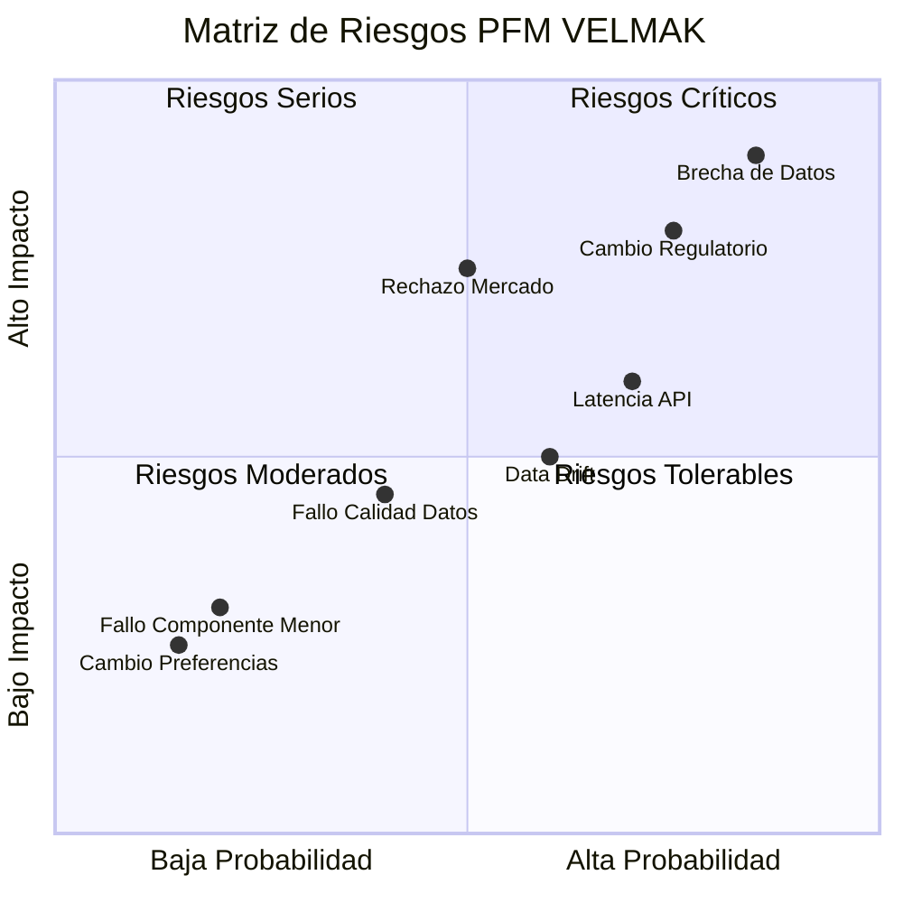
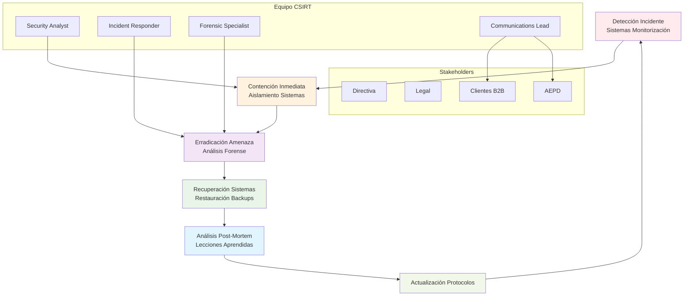

# **CAPÍTULO 14: RIESGOS Y CONTINGENCIAS**

## **14.1 Identificación de riesgos**

La identificación comprehensiva de riesgos constituye el pilar fundamental sobre el cual se construye la estrategia de gestión de contingencias de PFM VELMAK, reconociendo que la naturaleza innovadora del proyecto y el entorno regulatorio dinámico del sector FinTech generan múltiples fuentes de incertidumbre que requieren gestión proactiva. Los riesgos tecnológicos representan quizás la categoría más inmediata y potencialmente disruptiva, incluyendo eventos como caídas masivas de la infraestructura Cloud que podrían interrumpir completamente el servicio de scoring, o fenómenos de Data Drift masivo donde las distribuciones de las características de entrada cambian drásticamente, invalidando la precisión de los modelos entrenados. Estos riesgos tecnológicos se agravan por la complejidad inherente de las arquitecturas Big Data implementadas, donde múltiples componentes interconectados mediante Kafka, Spark y MongoDB crean superficies de ataque y puntos potenciales de fallo que requieren monitorización continua y redundancia estratégica (ISACA, 2024).

Los riesgos legales y regulatorios constituyen otra categoría fundamental de amenazas, particularmente agudas en el contexto europeo donde el marco normativo evoluciona rápidamente hacia mayores exigencias de transparencia, privacidad y responsabilidad algorítmica. El endurecimiento potencial del Reglamento General de Protección de Datos (GDPR) podría introducir nuevas restricciones sobre el procesamiento de datos financieros o aumentar las multas por incumplimiento hasta niveles que amenacen la viabilidad económica del proyecto. La implementación de la AI Act europea adicionalmente podría clasificar los sistemas de scoring crediticio como de alto riesgo con requisitos adicionales de supervisión humana, documentación y registro público, aumentando significativamente los costes operativos y de cumplimiento. Estos riesgos regulatorios se complican por la naturaleza transfronteriza de los datos y servicios de PFM VELMAK, potencialmente sujeta a múltiples jurisdicciones con requisitos conflictivos o complementarios (European Data Protection Board, 2024).

Los riesgos de negocio y mercado representan amenazas fundamentales a la sostenibilidad económica del proyecto, incluyendo el rechazo sistemático de las instituciones financieras B2B a confiar en sistemas de IA para decisiones críticas de riesgo crediticio. Este rechazo podría manifestarse como resistencia cultural interna en los bancos tradicionales, preocupaciones sobre responsabilidad legal en caso de decisiones incorrectas, o preferencia por sistemas legacy probados frente a soluciones innovadoras pero menos establecidas. Adicionalmente, el riesgo de entrada de competidores grandes como Google, Amazon o Microsoft en el espacio de scoring alternativo podría erosionar la ventaja competitiva de PFM VELMAK mediante acceso superior a datos, capacidades computacionales masivas o ecosistemas integrados más completos. Estos riesgos de mercado se agravan por los ciclos de venta típicamente largos del sector financiero, donde la adopción de nuevas tecnologías requiere extensos procesos de evaluación, aprobación regulatoria interna y pruebas piloto (McKinsey & Company, 2023).

Los riesgos operativos y de seguridad constituyen una categoría crítica que combina aspectos técnicos y organizacionales, incluyendo brechas de seguridad que podrían comprometer datos financieros sensibles de clientes finales, o fallos en la calidad de los datos que podrían generar decisiones incorrectas con consecuencias significativas. Una brecha de seguridad podría no solo resultar en multas regulatorias significativas bajo GDPR (hasta el 4% de los ingresos globales), sino adicionalmente en daño reputacional catastrófico que podría destruir la confianza de los clientes B2B y hacer insostenible el modelo de negocio. Los fallos en la calidad de datos, aunque menos dramáticos, podrían generar gradualmente degradación en la precisión de los modelos, pasando desapercibidos hasta que causen pérdidas significativas a los clientes finales. Estos riesgos operativos se complican por la naturaleza distribuida de la arquitectura de PFM VELMAK, donde múltiples fuentes de datos externas y componentes interconectados aumentan la superficie de posibles fallos (ISO/IEC, 2024).

Los riesgos éticos y de reputación representan una categoría emergente pero fundamental en el contexto de sistemas de IA aplicados a decisiones financieras que afectan directamente la vida de las personas. La detección de sesgos sistemáticos que discriminen injustamente contra ciertos grupos demográficos podría generar escándalos públicos, acciones legales colectivas y pérdida completa de confianza en el sistema. Adicionalmente, la opacidad percibida de las decisiones algorítmicas, incluso con capacidades de explicabilidad implementadas, podría generar críticas de académicos, reguladores y sociedad civil sobre la "caja negra" de la IA en decisiones financieras críticas. Estos riesgos éticos se agravan por la asimetría de poder entre PFM VELMAK como proveedor de tecnología y los consumidores finales afectados por las decisiones, creando tensiones sobre la rendición de cuentas y transparencia que requieren gestión proactiva y comunicación efectiva (Harvard Business Review, 2024).

## **14.2 Evaluación de impacto y probabilidad de riesgos**

La evaluación sistemática de riesgos mediante metodologías cuantitativas y cualitativas permite priorizar recursos de mitigación hacia las amenazas más significativas para la sostenibilidad de PFM VELMAK. La metodología implementada combina análisis probabilístico cuantitativo para riesgos con datos históricos disponibles y evaluación cualitativa experta para riesgos emergentes sin precedentes históricos claros. Para cada riesgo identificado se evalúa tanto la probabilidad de ocurrencia en una escala de uno a cinco (muy baja a muy alta) como el impacto potencial en una escala similar (muy bajo a muy catastrófico), permitiendo la construcción de una matriz de riesgos que clasifica las amenazas en categorías desde críticas hasta tolerables. Esta evaluación se actualiza trimestralmente para reflejar cambios en el entorno operativo, regulatorio y tecnológico que puedan alterar el perfil de riesgo del proyecto (COSO, 2023).

Los riesgos críticos, caracterizados por alta probabilidad de ocurrencia y alto impacto potencial, requieren atención inmediata y recursos significativos de mitigación. En esta categoría se ubican las brechas de seguridad de datos, con probabilidad alta debido al creciente número de ciberataques contra instituciones FinTech e impacto catastrófico debido a las multas GDPR, daño reputacional y potencial responsabilidad legal. Adicionalmente, el cambio regulatorio hacia mayor restricción de datos financieros presenta alta probabilidad dada la tendencia europea hacia mayor protección de datos, con impacto alto debido a costes de cumplimiento adicionales y potenciales limitaciones operativas. Estos riesgos críticos justifican inversiones significativas en medidas preventivas como sistemas avanzados de ciberseguridad, equipos legales especializados y arquitecturas diseñadas para cumplimiento regulatorio flexible (ISACA, 2024).

Los riesgos serios, con alta probabilidad pero impacto moderado o probabilidad moderada con alto impacto, requieren monitoreo continuo y planes de contingencia bien desarrollados. En esta categoría se ubica la latencia de API, con probabilidad alta debido a la complejidad de las arquitecturas Big Data pero impacto moderado manejable mediante redundancia y optimización. El rechazo del mercado B2B presenta probabilidad moderada debido a la innovación disruptiva del modelo pero impacto alto en términos de viabilidad económica, requiriendo estrategias de mitigación enfocadas en educación del mercado, pruebas piloto y construcción de confianza gradual. Estos riesgos serios justifican inversiones en monitorización avanzada, planes de respuesta rápida y estrategias de comunicación proactiva (Deloitte, 2024).

Los riesgos moderados, con probabilidad e impacto moderados, requieren monitoreo periódico y planes de respuesta básicos. En esta categoría se incluyen eventos como Data Drift gradual de los modelos, con probabilidad moderada debido a la naturaleza evolutiva de los patrones de consumo financiero pero impacto moderado manejable mediante sistemas de reentrenamiento automático. Los fallos en calidad de datos de proveedores externos adicionalmente presentan probabilidad moderada debido a la dependencia de múltiples fuentes pero impacto moderado mitigable mediante diversificación de proveedores y sistemas de validación de calidad. Estos riesgos moderados justifican inversiones en sistemas de monitorización automatizados y contratos de nivel de servicio con proveedores (Gartner, 2024).

Los riesgos tolerables, con baja probabilidad y bajo impacto, requieren principalmente monitoreo pasivo y documentación de procedimientos de respuesta básicos. En esta categoría se ubican eventos como fallos menores en componentes no críticos del sistema, con baja probabilidad debido a la redundancia implementada y bajo impacto manejable mediante sistemas automáticos de failover. Adicionalmente, cambios menores en preferencias de clientes B2B presentan baja probabilidad debido a la naturaleza sticky de los servicios de scoring y bajo impacto manejable mediante ajustes incrementales en el producto. Estos riesgos tolerables no justifican inversiones significativas en mitigación pero requieren awareness y procedimientos básicos de respuesta (ISO/IEC, 2024).

El análisis cuantitativo adicional permite estimar el valor en riesgo (VaR) para diferentes escenarios, facilitando la cuantificación del impacto potencial en términos financieros y operativos. Para riesgos como brechas de seguridad, el VaR se calcula considerando tanto costes directos como multas regulatorias, costes de notificación a afectados, y costes indirectos como pérdida de clientes y daño reputacional. Para riesgos regulatorios, el VaR incluye costes de adaptación tecnológica, consultoría legal, y potenciales reducciones en ingresos debido a limitaciones operativas. Este análisis cuantitativo permite tomar decisiones informadas sobre inversiones en mitigación basadas en relación coste-beneficio, asegurando que los recursos se asignen eficientemente hacia los riesgos con mayor impacto potencial en la sostenibilidad del negocio (McKinsey & Company, 2023).

## **14.3 Estrategias de mitigación de riesgos**

Las estrategias de mitigación de riesgos técnicos se fundamentan en el diseño proactivo de arquitecturas resilientes que incorporen principios de seguridad, escalabilidad y tolerancia a fallos desde su concepción. La implementación de Apache Kafka como sistema de mensajería distribuida proporciona capacidades nativas de replicación y particionamiento que aseguran continuidad del servicio incluso ante fallos parciales de componentes. La arquitectura de microservicios implementada mediante contenedores Docker y orquestación Kubernetes permite aislamiento de fallos, escalabilidad independiente de componentes y recuperación rápida mediante reinicios automáticos. La redundancia geográfica de datos mediante réplicas multi-region en MongoDB Atlas asegura disponibilidad incluso ante desastres regionales, mientras que los backups incrementales automatizados permiten recuperación granular hasta puntos específicos en el tiempo. Estas características arquitectónicas mitigan significativamente riesgos como caídas de infraestructura, pérdida de datos y degradación del servicio (Apache Software Foundation, 2024).

Las prácticas MLOps implementadas constituyen otra capa fundamental de mitigación de riesgos técnicos, particularmente aquellos relacionados con degradación del rendimiento de los modelos y drift de datos. La implementación de pipelines automatizados de monitoreo continuo mediante MLflow Tracking permite detección temprana de anomalías en las predicciones o características de entrada, activando alertas automáticas cuando se superan umbrales predefinidos. Los sistemas de reentrenamiento automático basados en detección de drift mediante Population Stability Index y KS statistic permiten adaptación proactiva de los modelos a cambios en las distribuciones de datos, manteniendo precisión óptima sin intervención manual. La implementación de feature stores centralizados mediante Feast asegura consistencia en las transformaciones de datos entre entrenamiento e inferencia, eliminando una fuente común de errores en producción. Estas prácticas MLOps reducen significativamente el riesgo de degradación silenciosa del rendimiento y facilitan recuperación rápida ante problemas detectados (Databricks, 2024).

Las auditorías de código y seguridad constituyen otra estrategia fundamental de mitigación, implementando revisiones sistemáticas por expertos externos e internos para identificar vulnerabilidades antes de que puedan ser explotadas. Las auditorías de seguridad incluyen análisis estático de código mediante herramientas como Snyk y SonarQube para detectar vulnerabilidades conocidas, pruebas de penetración (pentesting) realizadas por firmas especializadas, y análisis de arquitectura de seguridad mediante frameworks como OWASP Top 10. Las auditorías de código adicionalmente incluyen revisiones de calidad y rendimiento mediante pair programming, code reviews formales y análisis de complejidad ciclomática, asegurando que el códigobase mantenga estándares elevados de mantenibilidad y eficiencia. Estas auditorías se realizan trimestralmente y después de cambios significativos en la arquitectura, asegurando detección temprana de problemas (ISACA, 2024).

El cifrado de datos mediante técnicas avanzadas de criptografía moderna mitiga significativamente riesgos asociados a brechas de seguridad y cumplimiento regulatorio. La implementación de cifrado AES-256 para datos en reposo (data at rest) en todas las bases de datos y sistemas de almacenamiento asegura que incluso en caso de acceso no autorizado a la infraestructura, los datos permanezcan protegidos. El cifrado TLS 1.3 para datos en tránsito (data in transit) entre todos los componentes del sistema y con clientes externos previene ataques de intermediación (man-in-the-middle) y escuchas no autorizadas. La implementación adicional de gestión de claves mediante AWS KMS o Azure Key Vault, con rotación automática de claves y control de acceso granular, asegura que solo procesos y usuarios autorizados puedan acceder a los datos. Estas medidas de cifrado cumplen con los requisitos más estrictos de GDPR y estándares de seguridad de la industria financiera (NIST, 2024).

La formación continua del equipo en sesgos algorítmicos y ética de IA constituye una estrategia fundamental de mitigación de riesgos éticos y regulatorios. El equipo técnico recibe capacitación trimestral sobre técnicas avanzadas de detección y mitigación de sesgos, incluyendo fairness metrics como demographic parity, equalized odds y counterfactual fairness. Adicionalmente, se realiza formación continua sobre evolución del marco regulatorio europeo, incluyendo actualizaciones sobre GDPR, AI Act y directivas específicas del sector financiero. La implementación de comités de ética algorítmica multidisciplinares que incluyen expertos externos en derecho, ética y derechos humanos proporciona perspectiva externa sobre posibles problemas no evidentes para el equipo interno. Esta formación continua asegura que el equipo mantenga conciencia sobre riesgos emergentes y capacidad para implementar soluciones efectivas (Harvard Business Review, 2024).

## **14.4 Planes de contingencia y Planes de respuesta a crisis**

El protocolo de actuación post-incidente se estructura como un plan de respuesta coordinada que combina acciones técnicas inmediatas con comunicación estratégica para minimizar daño y restaurar confianza. La fase inicial de detección se implementa mediante sistemas de monitoreo automatizados que analizan logs, métricas de rendimiento y patrones de acceso anómalos en tiempo real, generando alertas automáticas al equipo de seguridad (CSIRT) cuando se identifican indicadores de compromiso. La fase de contención se activa inmediatamente tras detección, enfocándose en aislar los sistemas afectados mediante segmentación de red, desactivación de credenciales comprometidas y activación de sistemas de redundancia para mantener servicio crítico. Esta fase adicionalmente incluye preservación de evidencia forense mediante captura de memoria, volcado de logs y creación de imágenes de sistemas afectados para análisis posterior (NIST, 2024).

La fase de erradicación se concentra en eliminar completamente la causa raíz del incidente, incluyendo eliminación de malware, parcheo de vulnerabilidades explotadas y bloqueo de direcciones IP maliciosas. Esta fase requiere análisis forense detallado para comprender completamente el vector de ataque y asegurar que todos los sistemas comprometidos sean identificados y limpiados. La fase de recuperación posteriormente restaura los sistemas a operación normal mediante restauración desde backups limpios, verificación de integridad de sistemas y reactivación gradual de servicios con monitoreo intensivo. Durante esta fase se implementan medidas de seguridad adicionales basadas en lecciones aprendidas del incidente, incluyendo configuraciones reforzadas y controles de acceso más restrictivos (ISO/IEC, 2024).

El Plan de Recuperación ante Desastres (Disaster Recovery Plan) se implementa mediante una arquitectura multi-nube con replicación geográfica que permite recuperación completa en menos de cuatro horas following escenarios catastróficos. La estrategia incluye réplicas sincrónicas de bases de datos críticas en regiones geográficas separadas, sistemas de orquestación automática de failover que redirigen el tráfico a la región secundaria sin intervención manual, y backups incrementales almacenados en múltiples proveedores cloud para protección contra fallos de proveedor. Los planes de recuperación se prueban trimestralmente mediante simulaciones de desastres que incluyen escenarios como caída completa de una región, brechas de seguridad masivas o corrupción de datos. Estas pruebas aseguran que los equipos estén familiarizados con los procedimientos y que los sistemas funcionen según lo esperado bajo condiciones de estrés (DRI International, 2024).

El protocolo de comunicación de crisis se activa simultáneamente con la respuesta técnica, asegurando comunicación coordinada con todas las partes interesadas según plazos regulatorios y expectativas comerciales. La notificación a la Agencia Española de Protección de Datos (AEPD) se realiza dentro de las 72 horas requeridas por GDPR, incluyendo descripción detallada del incidente, datos afectados, medidas implementadas y planes de mitigación. La comunicación con clientes B2B se realiza de forma proactiva y transparente, proporcionando información clara sobre el impacto, medidas tomadas y pasos recomendados para proteger sus intereses. La comunicación interna asegura que todos los equipos estén alineados en mensajes y acciones, mientras que la comunicación externa gestiona la narrativa pública para minimizar daño reputacional. Este protocolo de comunicación se preaprueba legalmente y se actualiza trimestralmente para reflejar lecciones aprendidas y cambios regulatorios (European Data Protection Board, 2024).

El análisis post-mortem constituye la fase final del ciclo de respuesta a incidentes, enfocándose en aprendizaje organizacional y mejora continua de sistemas y procesos. Este análisis incluye revisión detallada de la cronología del incidente, identificación de causas raíz mediante técnicas como los cinco porqués o análisis de árbol de fallos, y evaluación de la efectividad de la respuesta implementada. Los resultados del post-mortem se documentan sistemáticamente y se compilan en una base de conocimientos organizacional que alimenta actualizaciones de políticas, procedimientos técnicos y programas de formación. Adicionalmente, se implementan proyectos específicos para abordar las vulnerabilidades identificadas, asignando responsables y plazos claros para asegurar implementación efectiva. Este enfoque de aprendizaje continuo transforma incidentes negativos en oportunidades de fortalecimiento organizacional y técnico (Harvard Business Review, 2024).
