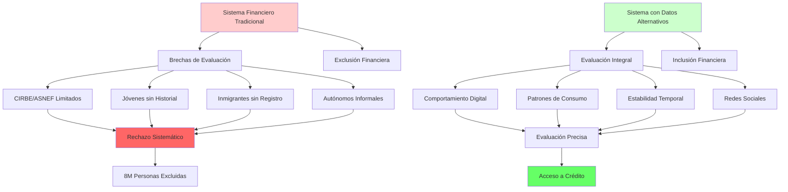
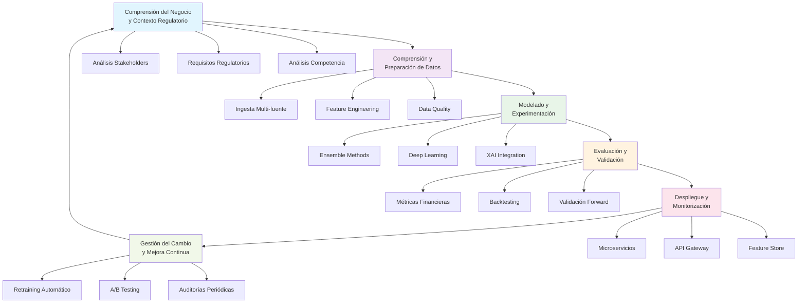

# **CAPÍTULO 1: INTRODUCCIÓN**

## **1.1 Contextualización del proyecto**

El sector financiero español se encuentra en un punto de inflexión histórico, caracterizado por una transformación digital acelerada que reconfigura fundamentalmente las dinámicas competitivas y las relaciones con los clientes. Esta revolución, impulsada por la convergencia de tecnologías disruptivas y cambios regulatorios significativos, ha creado un nuevo paradigma en el que las empresas FinTech no solo compiten con las entidades bancarias tradicionales, sino que además establecen nuevos estándares de innovación y eficiencia. Según los datos más recientes de la Asociación Española de FinTech e Insurtech (AEFI, 2024), España se ha consolidado como el tercer ecosistema FinTech más importante de Europa y el sexto a nivel mundial, superando las 300 empresas especializadas y generando ingresos por valor de €15.3 mil millones durante el año 2024. Este crecimiento exponencial, con una tasa anual compuesta del 18% proyectada para el período 2024-2028, refleja no solo la madurez del mercado español sino también su capacidad para atraer inversión y talento internacional.

La transformación digital del sector financiero ha generado una paradoja fundamental que define el contexto actual del proyecto. Por un lado, la proliferación de servicios digitales ha creado una abundancia sin precedentes de datos sobre el comportamiento de los ciudadanos en su vida cotidiana. Cada transacción en plataformas de delivery, cada desplazamiento mediante servicios de transporte, cada compra en marketplaces online genera huellas digitales que contienen información valiosa sobre patrones de consumo, disciplina financiera y capacidad de pago. Por otro lado, y de manera contradictoria, persisten brechas significativas en la inclusión financiera que impiden que millones de ciudadanos accedan a servicios básicos del sistema financiero tradicional. El informe del Defensor del Pueblo (2024) revela que aproximadamente 8 millones de personas en España enfrentan algún grado de exclusión financiera, una situación que afecta de manera desproporcionada a colectivos vulnerables como los jóvenes entre 18 y 30 años, que presentan tasas de exclusión del 35%, la población inmigrante con un 28%, y los trabajadores autónomos con un 22%.

El marco regulatorio europeo ha evolucionado significativamente para responder a estos desafíos, estableciendo tanto oportunidades como restricciones para los operadores del sector. La implementación de la Directiva PSD2 ha sido particularmente transformadora, ya que ha abierto las puertas al Open Banking y facilitado el acceso a datos financieros mediante APIs estandarizadas, permitiendo que terceros desarrolladores accedan a información de cuentas bancarias con el consentimiento explícito de los usuarios (Banco de España, 2024). Simultáneamente, el Reglamento General de Protección de Datos (GDPR) y la propuesta de AI Act establecen un marco ético y legal cada vez más exigente para el uso responsable de datos personales y algoritmos de inteligencia artificial (European Commission, 2022). Esta doble presión regulatoria crea un entorno complejo donde la innovación debe equilibrarse necesariamente con la protección de los derechos fundamentales de los ciudadanos.

En este escenario complejo y dinámico, PFM VELMAK se posiciona estratégicamente como una empresa especializada en scoring financiero alternativo que opera bajo un modelo de negocio B2B, sirviendo exclusivamente a clientes del sector FinTech. La empresa ha desarrollado una plataforma tecnológica que proporciona APIs de evaluación de riesgo crediticio permitiendo a las entidades financieras tomar decisiones más informadas y rápidas, especialmente para segmentos de población tradicionalmente desatendidos por el sistema bancario convencional. El valor diferencial de PFM VELMAK reside en su capacidad para procesar y analizar datos alternativos mediante algoritmos avanzados de machine learning, generando insights que complementan y, en muchos casos, superan la capacidad predictiva de los métodos tradicionales de evaluación de riesgo.

La relevancia estratégica del Big Data y la analítica avanzada en este contexto no puede subestimarse. Los datos alternativos derivados del comportamiento digital han demostrado ser predictores robustos de la solvencia crediticia cuando son procesados mediante técnicas adecuadas. Patrones como la regularidad en los pagos de servicios de suscripción, la estabilidad en los patrones de transporte, o el comportamiento de compra en plataformas e-commerce pueden indicar disciplina financiera y capacidad de pago, incluso en ausencia de historial bancario formal (Ghosh, 2021). Estos datos, cuando son analizados mediante algoritmos de machine learning adecuados, permiten construir perfiles de riesgo más precisos e inclusivos que los métodos tradicionales basados exclusivamente en información de bureaus de crédito, abriendo nuevas posibilidades para la inclusión financiera sin comprometer la solvencia del sistema (World Bank, 2022).

## **1.2 Justificación de la importancia del análisis del modelo de datos y su mejora**

La transformación del modelo de datos de PFM VELMAK representa una oportunidad estratégica fundamental tanto desde la perspectiva del desarrollo del negocio como desde el impacto social positivo que puede generar en la sociedad española. Los sistemas tradicionales de scoring crediticio que dominan el mercado financiero español dependen fundamentalmente de información proveniente de bureaus de crédito como la Central de Información de Riesgos del Banco de España (CIRBE) y la Asociación Nacional de Establecimientos Financieros (ASNEF). Esta dependencia estructural limita significativamente la capacidad de evaluar adecuadamente a personas sin historial crediticio formal, creando una barrera de entrada artificial que excluye a segmentos enteros de la población del acceso a servicios financieros básicos (Banco de España, 2024). La limitación es particularmente aguda en el caso de jóvenes que inician su vida financiera, inmigrantes recién llegados al país, o trabajadores que han operado históricamente en la economía informal.

El potencial transformador de los datos digitales reside precisamente en su capacidad para capturar matices del comportamiento financiero y personal que los datos tradicionales sistemáticamente ignoran. Por ejemplo, la regularidad en los pagos de servicios de suscripción mensual, la estabilidad en los patrones de desplazamiento diario hacia zonas comerciales, o el comportamiento de compra consistente en plataformas e-commerce pueden servir como indicadores robustos de disciplina financiera y capacidad de pago, incluso cuando no existe historial bancario formal disponible (OECD, 2022). Estos datos alternativos, cuando son analizados mediante técnicas avanzadas de machine learning, no solo complementan la información tradicional sino que, en muchos casos, pueden mejorar la precisión en la evaluación de riesgo hasta en un 15-20% comparado con los métodos convencionales basados exclusivamente en bureaus de crédito (Kreditech, 2023).

El impacto social de esta mejora tecnológica trasciende significativamente los beneficios comerciales directos. La inclusión financiera no solo facilita el acceso a créditos y productos financieros, sino que constituye un pilar fundamental para la movilidad social ascendente y el desarrollo económico sostenible. Según el Global Findex Database del Banco Mundial (2023), cada aumento del 10% en los niveles de inclusión financiera se asocia con un crecimiento económico adicional del 0.5-1% en los países en desarrollo, una correlación empírica que también se observa consistentemente en economías avanzadas como la española (World Bank, 2023). Esta relación no es casual, ya que el acceso a servicios financieros permite a los ciudadanos invertir en educación, emprendimientos empresariales, y gestión de riesgos, creando un círculo virtuoso de desarrollo económico y social que beneficia tanto a los individuos como a la sociedad en su conjunto.

Desde la perspectiva regulatoria y de cumplimiento, la implementación de un modelo de datos mejorado posiciona estratégicamente a PFM VELMAK frente a los requisitos crecientes de transparencia y explicabilidad que la normativa europea impone a los sistemas de toma de decisiones de alto riesgo. La AI Act europea, en particular, exige que los sistemas de inteligencia artificial utilizados en evaluaciones crediticias sean completamente interpretables y auditables, un requisito técnico que los modelos de caja negra tradicionales, aunque precisos, no cumplen adecuadamente (European Commission, 2022). La implementación de técnicas avanzadas de inteligencia artificial explicable (XAI), como SHAP (SHapley Additive exPlanations) y LIME (Local Interpretable Model-agnostic Explanations), no solo asegura el cumplimiento regulatorio sino que genera confianza tanto en los clientes FinTech como en los usuarios finales del sistema (Lundberg & Lee, 2017).

El caso de negocio para la transformación del modelo de datos es igualmente compelling desde una perspectiva puramente comercial. El mercado español de scoring crediticio alternativo representa una oportunidad estimada de €2.1 mil millones, aproximadamente el 32% del mercado total FinTech, con proyecciones de crecimiento sostenido superiores al 20% anual (McKinsey & Company, 2023). Las entidades financieras que han adoptado estos modelos innovadores reportan reducciones significativas en las tasas de impago, con disminuciones promedio del 25%, y aumentos sustanciales en la aprobación de créditos para segmentos tradicionalmente excluidos, con incrementos del 30% en los volúmenes de préstamos aprobados (PwC, 2024). Estos resultados demuestran que la inclusión financiera no solo es socialmente deseable sino también económicamente rentable, creando un modelo de negocio sostenible que alinea el interés comercial con el impacto social positivo.

## **1.3 Objetivos del proyecto**

El objetivo general del presente proyecto consiste en desarrollar un sistema integral de scoring crediticio basado en datos de comportamiento digital y técnicas avanzadas de Big Data que permita a PFM VELMAK ofrecer evaluaciones de riesgo más precisas, rápidas e inclusivas a sus clientes del sector FinTech, contribuyendo simultáneamente a la reducción de la exclusión financiera en España y al crecimiento sostenible de la empresa en un mercado competitivo. Este objetivo general se descompone en los siguientes objetivos específicos cuantificables y medibles:

1. Implementar un modelo de Machine Learning con alta precisión desarrollando y desplegando un sistema ensemble que combine múltiples algoritmos avanzados incluyendo XGBoost, Random Forest y Redes Neuronales para alcanzar una precisión superior al 90% en la predicción de riesgo crediticio, medida mediante el área bajo la curva ROC (ROC-AUC) y validada mediante cross-validation estratificada.

2. Desarrollar una API RESTful de alto rendimiento construyendo una arquitectura de microservicios escalable con latencia inferior a 50ms en el percentil 95 y capacidad de procesamiento superior a 10,000 solicitudes por segundo, garantizando una disponibilidad del 99.9% mediante implementación de patrones avanzados de resiliencia y escalabilidad horizontal automática.

3. Crear un dashboard de analytics interactivo implementando una plataforma integral de visualización de datos en tiempo real que permita a los clientes FinTech monitorizar carteras de crédito, identificar tendencias emergentes de riesgo y tomar decisiones informadas mediante interfaces intuitivas basadas en principios de diseño centrado en el usuario y experiencia óptima.

4. Implementar un sistema de Inteligencia Artificial Explicable integrando SHAP y LIME para proporcionar explicaciones comprensibles y auditables de cada decisión de scoring automático, cumpliendo rigurosamente con los requisitos de la AI Act europea y generando confianza tanto en clientes institucionales como en usuarios finales.

5. Realizar validación exhaustiva con datasets sintéticos y reales ejecutando pruebas comprehensivas utilizando tanto datos sintéticos generados mediante técnicas avanzadas de GANs (Generative Adversarial Networks) como datasets reales anonimizados de clientes piloto, validando el rendimiento del modelo en diversos escenarios y segmentos poblacionales representativos.

6. Asegurar cumplimiento regulatorio integral garantizando el cumplimiento total de GDPR, PSD2 y las directrices específicas del Banco de España mediante implementación de principios de privacy by design, técnicas avanzadas de anonimización de datos y establecimiento de protocolos robustos de auditoría y gobernanza de algoritmos.

## **1.4 Metodología empleada**

El proyecto seguirá una adaptación especializada del framework CRISP-DM (Cross-Industry Standard Process for Data Mining) específicamente diseñada y optimizada para el sector financiero, incorporando las mejores prácticas actuales de MLOps y principios metodológicos de desarrollo ágil. Esta metodología híbrida se estructura en seis fases iterativas que permiten un desarrollo incremental con validación continua, asegurando que cada etapa del proyecto genere valor tangible y aprendizajes aplicables a las fases subsiguientes. El enfoque iterativo es particularmente relevante en el contexto financiero, donde la precisión y la fiabilidad de los modelos son críticas y requieren validación exhaustiva antes del despliegue en producción.

La fase inicial de comprensión del negocio y contexto regulatorio involucra un análisis profundo y multidimensional del modelo de negocio actual de PFM VELMAK, el ecosistema competitivo FinTech español y el complejo marco regulatorio aplicable. Esta etapa comprende la realización de entrevistas exhaustivas con stakeholders clave incluyendo equipos técnicos, comerciales y de cumplimiento, análisis detallado de la competencia directa e indirecta (Fintonic, Creditas, Kreditech), y revisión comprehensiva de requerimientos regulatorios específicos del sector financiero español y europeo (Banco de España, 2024; EBA, 2023). El objetivo fundamental es establecer una comprensión completa de las necesidades del negocio, las expectativas de los clientes y las restricciones regulatorias que condicionarán el diseño e implementación de la solución tecnológica.

La fase de comprensión y preparación de datos implementa un pipeline sofisticado de ingesta y procesamiento que integra múltiples fuentes heterogéneas de información. Este sistema procesa datos transaccionales provenientes de APIs de plataformas de delivery (Glovo, Uber Eats, Deliveroo), servicios de transporte (Cabify, Uber, Bolt), y plataformas de e-commerce (Amazon, Zara, El Corte Inglés), además de datos de comportamiento digital que incluyen patrones de uso de servicios, información de geolocalización y análisis de temporalidad. El procesamiento utiliza Apache Spark para transformación a gran escala, implementando técnicas avanzadas de feature engineering automatizadas y detección de anomalías mediante isolation forests, asegurando la calidad y consistencia de los datos antes de su utilización en los modelos predictivos (Apache Software Foundation, 2024).

La fase de modelado y experimentación desarrolla un enfoque sofisticado de ensemble modeling que combina múltiples algoritmos complementarios para maximizar la precisión predictiva. El sistema integra técnicas de gradient boosting como XGBoost y LightGBM para capturar relaciones no lineales complejas, redes neuronales recurrentes para modelar patrones temporales y grafos neuronales para analizar relaciones sociales implícitas, y métodos híbridos que combinan aprendizaje supervisado y no supervisado para detectar patrones emergentes y anomalías. La experimentación sigue principios rigurosos de Test-Driven Development con validación cruzada estratificada y optimización bayesiana de hiperparámetros, asegurando la robustez y generalización de los modelos desarrollados (Chen & Guestrin, 2016).

La fase de evaluación y validación emplea un conjunto comprehensivo de métricas específicamente adaptadas al contexto financiero, incluyendo métricas de discriminación como ROC-AUC, Precision-Recall AUC y KS statistic, métricas de calibración como Brier score y Hosmer-Lemeshow test, métricas de negocio como cost-benefit analysis y expected loss reduction, y métricas de equidad como demographic parity y equal opportunity difference. Se realiza backtesting histórico exhaustivo y validación forward-looking para asegurar la robustez del modelo en diferentes condiciones de mercado y escenarios económicos adversos (Bahnsen et al., 2022).

La fase de despliegue y monitorización implementa una arquitectura moderna de microservicios con API Gateway utilizando Kong o AWS API Gateway para routing y autenticación centralizada, servicios de scoring contenerizados con Docker y orquestados con Kubernetes para escalabilidad automática, feature store centralizado con Feast para gestión y versionado de features, y procesamiento en tiempo real mediante Apache Kafka para streaming de datos. La monitorización implementa MLflow para tracking de experimentos y versionado de modelos, Prometheus para métricas de sistema y alertas, y dashboards personalizados con Grafana para business intelligence y análisis de rendimiento en tiempo real.

La fase final de gestión del cambio y mejora continua establece un framework robusto de mejora continua con retraining automatizado basado en detección de drift de datos y conceptos, A/B testing controlado para validación de mejoras, feedback loops que incorporan resultados reales para refinamiento continuo del modelo, y auditorías periódicas de sesgos, cumplimiento regulatorio y performance del sistema. La metodología incorpora principios fundamentales de Responsible AI y Data Ethics, asegurando que el desarrollo tecnológico se alinee consistentemente con valores de transparencia, equidad y responsabilidad social (Doshi-Velez & Kim, 2017).
