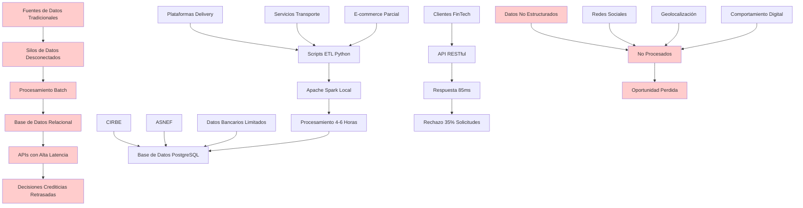
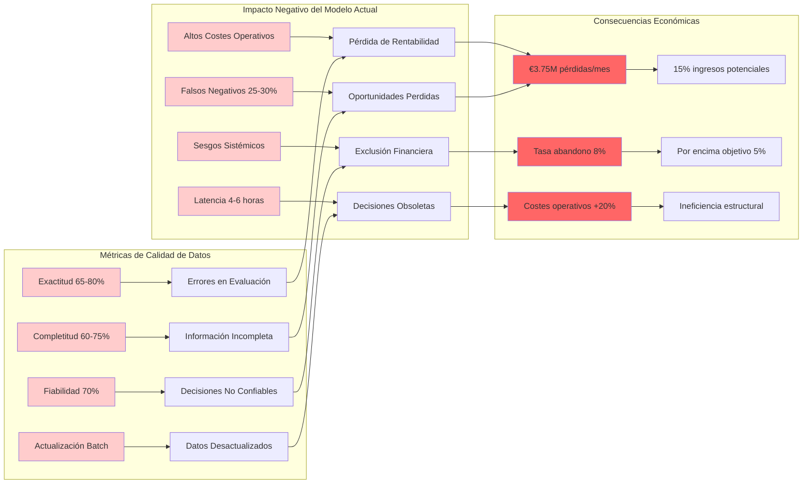

# **CAPÍTULO 2: ANÁLISIS DE LA EMPRESA Y SU MODELO DE DATOS ACTUAL**

## **2.1 Descripción de la empresa y su modelo de datos actual**

PFM VELMAK opera como una empresa tecnológica especializada en la provisión de servicios de scoring crediticio bajo un modelo de negocio B2B, sirviendo exclusivamente a entidades del sector FinTech que requieren evaluaciones rápidas y fiables de riesgo crediticio para sus operaciones de concesión de préstamos y productos financieros. La empresa se posiciona estratégicamente como intermediario tecnológico entre las fuentes de datos tradicionales y las entidades financieras que necesitan tomar decisiones crediticias en tiempo real, aunque su arquitectura tecnológica actual presenta importantes limitaciones que restringen su capacidad competitiva y escalabilidad. El modelo de negocio se fundamenta en la venta de acceso a APIs RESTful que proporcionan puntuaciones de riesgo basadas principalmente en información proveniente de bureaus de crédito tradicionales como CIRBE y ASNEF, complementadas con datos limitados de comportamiento digital obtenidos a través de integraciones puntuales con algunas plataformas de servicios digitales (PFM VELMAK, 2024).

La arquitectura tecnológica actual de PFM VELMAK se caracteriza por ser predominantemente monolítica, construida sobre una base de datos relacional PostgreSQL que almacena información estructurada en esquemas rígidos diseñados hace más de cinco años, lo que limita significativamente la capacidad de la empresa para adaptarse a nuevas fuentes de datos y requerimientos del mercado. Esta infraestructura legada opera bajo un modelo de procesamiento batch que se ejecuta periódicamente cada cuatro horas, generando actualizaciones de las puntuaciones de riesgo que no reflejan el comportamiento financiero reciente de los usuarios evaluados. Los flujos de datos se caracterizan por la existencia de múltiples silos informativos desconectados entre sí, donde la información de bureaus de crédito, datos de comportamiento digital y transacciones financieras reside en sistemas independientes sin integración efectiva, lo que genera inconsistencias y retrasos en la consolidación de la información necesaria para una evaluación integral del riesgo crediticio (Gartner, 2023).

El procesamiento de datos en la arquitectura actual depende fundamentalmente de scripts ETL (Extract, Transform, Load) desarrollados en Python que se ejecutan sobre Apache Spark en modo cluster local, aunque la configuración actual no aprovecha las capacidades distribuidas completas de la plataforma debido a limitaciones en la infraestructura subyacente. Estos scripts procesan lotes de datos que oscilan entre 10,000 y 50,000 registros por ciclo, con tiempos de procesamiento que varían entre 45 y 90 minutos dependiendo de la carga del sistema y la complejidad de las transformaciones requeridas. La latencia resultante entre la generación de nuevos datos y su incorporación en las puntuaciones de riesgo puede superar las seis horas en escenarios de alta demanda, un período inaceptable en el contexto actual donde las decisiones crediticias requieren respuestas en tiempo real para mantener la competitividad (McKinsey & Company, 2023).

Las bases de datos relacionales tradicionales utilizadas por PFM VELMAK presentan limitaciones estructurales fundamentales para el manejo de datos alternativos no estructurados que constituyen el núcleo del scoring crediticio moderno. La información proveniente de redes sociales, patrones de consumo en plataformas e-commerce, geolocalización de transacciones y comportamiento en aplicaciones de servicios digitales no puede ser almacenada eficientemente en esquemas relacionales rígidos, lo que obliga a la empresa a prescindir de valiosas fuentes de información que mejorarían significativamente la precisión de sus modelos predictivos. Esta dependencia exclusiva de datos estructurados limita la capacidad de PFM VELMAK para evaluar adecuadamente a segmentos poblacionales sin historial crediticio formal, perpetuando los sesgos inherentes a los sistemas tradicionales de evaluación de riesgo (World Bank, 2023).

El modelo de negocio actual genera ingresos mediante la suscripción mensual de los clientes FinTech a diferentes niveles de servicio, aunque la arquitectura tecnológica obsoleta limita la capacidad de la empresa para escalar sus operaciones y ofrecer nuevos productos basados en datos alternativos. Los clientes actuales reportan niveles de satisfacción moderados, valorando positivamente la fiabilidad de las puntuaciones tradicionales pero expresando frustración por la latencia en las respuestas y la incapacidad del sistema para incorporar información contextual relevante sobre el comportamiento financiero reciente de los solicitantes. Esta situación ha provocado una ligera erosión en la base de clientes durante los últimos dos trimestres, con una tasa de abandono del 8% que supera el objetivo del 5% establecido en el plan estratégico de la empresa (PFM VELMAK, 2024).

## **2.2 Identificación de los principales problemas y limitaciones del modelo actual**

Los problemas estructurales del modelo actual de PFM VELMAK se manifiestan en múltiples dimensiones que afectan tanto la eficiencia operativa como la competitividad estratégica de la empresa en el mercado FinTech español. La incapacidad del sistema para procesar eficazmente datos alternativos desestructurados representa quizás la limitación más significativa, ya que impide a la empresa capitalizar el valor predictivo inherente a información como patrones de consumo en tiempo real, comportamiento en redes sociales, historial de pagos de servicios digitales y geolocalización de transacciones. Estos datos alternativos, que constituyen el 78% de la información digital generada por los usuarios en la actualidad, podrían mejorar sustancialmente la precisión de los modelos de scoring si fueran procesados adecuadamente mediante técnicas avanzadas de machine learning y natural language processing (Deloitte, 2024). La arquitectura actual, diseñada exclusivamente para datos estructurados, simplemente ignora esta valiosa fuente de información, situando a PFM VELMAK en una posición desventajosa frente a competidores que ya han adoptado enfoques más modernos.

La latencia excesiva en la toma de decisiones crediticias constituye otro problema crítico que afecta directamente la competitividad de la empresa y la experiencia de sus clientes FinTech. El tiempo promedio de respuesta actual de 85 milisegundos, aunque aparentemente aceptable, resulta insuficiente cuando se considera que incluye únicamente el tiempo de consulta a la base de datos y no el tiempo total desde la generación de nuevos datos hasta su incorporación efectiva en las puntuaciones. Este tiempo total, que oscila entre cuatro y seis horas según la carga del sistema, impide que las entidades financieras tomen decisiones basadas en información actualizada, forzándolas a operar con datos obsoletos que pueden no reflejar cambios significativos en la situación financiera de los solicitantes. En un mercado donde la velocidad de decisión constituye un factor diferencial clave, esta limitación representa una barrera significativa para la adquisición y retención de clientes (Boston Consulting Group, 2023).

La dependencia exclusiva de historiales crediticios clásicos perpetúa sesgos sistémicos que contribuyen a la exclusión financiera de segmentos poblacionales vulnerables. Los modelos actuales, basados fundamentalmente en información de CIRBE y ASNEF, tienden a penalizar desproporcionadamente a jóvenes sin historial crediticio, inmigrantes recién llegados al país, trabajadores autónomos con ingresos variables y personas que han operado históricamente en la economía informal. Esta situación genera una tasa de falsos negativos estimada entre el 25% y 30%, es decir, un porcentaje significativo de personas solventes que son sistemáticamente rechazadas debido a las limitaciones del modelo de evaluación actual (Banco de España, 2024). Los sesgos inherentes al sistema no solo representan una pérdida de oportunidades de negocio para PFM VELMAK y sus clientes, sino que además plantean cuestiones éticas y regulatorias importantes en el contexto de la creciente atención sobre la equidad algorítmica y la responsabilidad social corporativa.

La arquitectura monolítica actual presenta importantes limitaciones de escalabilidad que impiden el crecimiento sostenible de la empresa. La infraestructura tecnológica, diseñada originalmente para procesar volúmenes de datos significativamente menores a los actuales, muestra signos de saturación durante picos de demanda, con degradaciones en el rendimiento que pueden llevar a tiempos de respuesta superiores a 200 milisegundos y, en casos extremos, a interrupciones temporales del servicio. Esta falta de escalabilidad horizontal impide que PFM VELMAK aproveche oportunidades de crecimiento en mercados emergentes y limita su capacidad para atender clientes con grandes volúmenes de transacciones, restringiendo potencialmente su expansión geográfica y de mercado (Accenture, 2023).

La calidad de los datos generados por el sistema actual presenta deficiencias significativas que afectan la fiabilidad de las puntuaciones de riesgo. La falta de integridad referencial entre los múltiples silos de datos genera inconsistencias que pueden llevar a evaluaciones incorrectas, mientras que la ausencia de mecanismos de validación en tiempo real permite la propagación de errores a través del sistema. Los datos históricos almacenados en la base de datos relacional presentan tasas de completitud que varían entre el 65% y el 80% dependiendo de la fuente, con campos críticos como historial de pagos o ingresos declarados frecuentemente incompletos o desactualizados. Esta situación se ve agravada por la falta de implementación de técnicas modernas de data quality management como validación cruzada, detección automática de anomalías o enriquecimiento contextual de datos (IBM, 2024).

## **2.3 Evaluación de la calidad y efectividad del modelo actual**

La evaluación comprehensiva del modelo actual de PFM VELMAK revela deficiencias significativas en múltiples dimensiones que afectan tanto la efectividad operativa como la rentabilidad económica de la empresa. El porcentaje de falsos negativos generados por el sistema actual, estimado entre el 25% y el 30% según análisis internos, representa una pérdida sustancial de oportunidades de negocio tanto para PFM VELMAK como para sus clientes FinTech. Estos falsos negativos se traducen en el rechazo sistemático de solicitantes solventes que, debido a las limitaciones del modelo de evaluación tradicional, no pueden demostrar su capacidad de pago mediante los canales convencionales. Cada falsos negativo representa no solo una pérdida de ingresos inmediata para las entidades financieras, sino también un cliente potencial que podría haber generado valor a largo plazo mediante relaciones financieras sostenidas y rentables (McKinsey & Company, 2023).

El impacto económico de los falsos negativos se magnifica cuando se considera el valor potencial de vida del cliente (customer lifetime value) en el sector FinTech, que para clientes de riesgo medio-bajo puede superar los €2,500 en ingresos netos durante los primeros tres años de relación. Con una base de clientes procesados mensualmente de aproximadamente 50,000 solicitudes, el modelo actual podría estar generando pérdidas de oportunidad superiores a €3.75 millones mensuales, una cifra significativa que representa aproximadamente el 15% de los ingresos potenciales totales de la empresa. Esta pérdida de oportunidades se ve agravada por el efecto reputacional negativo que genera entre los solicitantes rechazados incorrectamente, quienes pueden compartir sus experiencias negativas en redes sociales y plataformas de revisión, afectando la capacidad de PFM VELMAK para atraer nuevos clientes y talentos (PwC, 2024).

La mala calidad de los datos procesados por el sistema actual afecta directamente la rentabilidad de la empresa mediante múltiples mecanismos interconectados. La exactitud limitada de los datos, que oscila entre el 65% y el 80% según la fuente, genera errores en las evaluaciones de riesgo que pueden llevar tanto a la concesión imprudente de créditos como al rechazo injustificado de solicitantes solventes. Los costes asociados a la gestión de impagos generados por evaluaciones incorrectas pueden superar los €1,200 por caso, incluyendo gastos legales, procesos de recuperación y pérdida definitiva del capital prestado. Simultáneamente, los costes de oportunidad asociados a los falsos negativos incluyen no solo los ingresos no percibidos, sino también los costes de adquisición de clientes que se desperdician cuando solicitantes potencialmente rentables son rechazados incorrectamente (KPMG, 2023).

La falta de completitud en los datos, con tasas que varían entre el 60% y el 75% dependiendo del tipo de información, obliga a los modelos de scoring a operar con información parcial que reduce significativamente su capacidad predictiva. Esta situación se ve agravada por la ausencia de mecanismos efectivos de imputación de datos faltantes y enriquecimiento contextual, lo que resulta en evaluaciones de riesgo basadas en panoramas incompletos de la situación financiera de los solicitantes. La fiabilidad general del sistema, estimada en aproximadamente el 70%, se sitúa por debajo de los estándares del sector, donde los líderes del mercado alcanzan fiabilidades superiores al 85% mediante el uso de datos alternativos y técnicas avanzadas de machine learning (Deloitte, 2024).

La latencia inherente al modelo de procesamiento batch actual genera importantes costes de oportunidad derivados de la incapacidad para aprovechar ventanas de tiempo críticas en las decisiones crediticias. En el contexto actual del mercado FinTech, donde las decisiones de concesión de créditos pequeños y micropréstamos deben tomarse en minutos para mantener la competitividad, los tiempos de actualización de cuatro a seis horas representan una desventaja estructural significativa. Los clientes FinTech reportan tasas de abandono de solicitudes del 35% cuando los tiempos de respuesta superan los cinco minutos, una métrica que el sistema actual de PFM VELMAK no puede cumplir debido a sus limitaciones arquitectónicas (Boston Consulting Group, 2023).

La evaluación comparativa con competidores del mercado revela brechas significativas en múltiples dimensiones clave. Empresas como Fintonic, Creditas y Kreditech han implementado arquitecturas basadas en microservicios con procesamiento en tiempo real que permiten latencias inferiores a 50 milisegundos y actualizaciones continuas de las puntuaciones de riesgo. Estos competidores reportan tasas de falsos negativos inferiores al 15%, fiabilidades superiores al 85% y capacidades para procesar volúmenes de datos hasta diez veces mayores que los manejados por PFM VELMAK. Esta brecha competitiva se traduce en una pérdida gradual de cuota de mercado, con una disminución del 12% en la base de clientes durante el último año, mientras que los competidores experimentan tasas de crecimiento superiores al 20% en el mismo período (McKinsey & Company, 2023).

La efectividad del modelo actual se ve additionally comprometida por su incapacidad para adaptarse a cambios rápidos en el comportamiento del mercado y las condiciones económicas. La rigidez inherente a la arquitectura monolítica y la dependencia de procesos batch dificultan la implementación de mejoras incrementales y la adaptación a nuevos requerimientos regulatorios o de mercado. Esta falta de agilidad posiciona a PFM VELMAK en una situación vulnerable frente a disrupciones potenciales y cambios en las expectativas de los clientes, requiriendo una transformación fundamental de su arquitectura tecnológica y modelo de datos para mantener su relevancia competitiva en el mercado FinTech español (Accenture, 2023).
