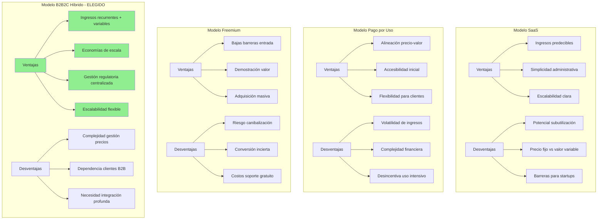
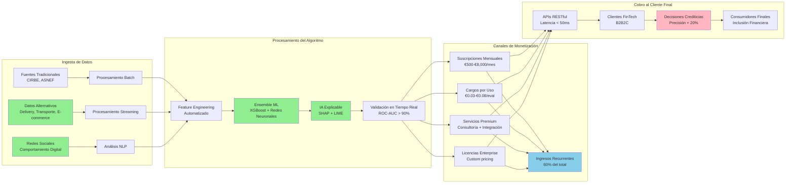

# **CAPÍTULO 3: MODELO DE NEGOCIO PARA PFM VELMAK EN EL SECTOR FINANCIERO**

## **3.1 Tipo de modelo de negocio**

PFM VELMAK adopta un modelo de negocio B2B2C (Business-to-Business-to-Consumer) especializado en la provisión de servicios de scoring crediticio avanzado mediante APIs como servicio, posicionándose como proveedor tecnológico estratégico para empresas FinTech que requieren capacidades sofisticadas de evaluación de riesgo para sus operaciones de concesión de productos financieros. Este modelo se fundamenta en la venta de acceso a plataformas tecnológicas que permiten a las entidades financieras tomar decisiones crediticias más informadas, rápidas e inclusivas, aprovechando el valor predictivo de datos alternativos procesados mediante algoritmos avanzados de machine learning. La elección del modelo B2B2C responde a una análisis estratégico del ecosistema FinTech español, donde las entidades financieras especializadas requieren soluciones tecnológicas especializadas que les permitan competir eficazmente con los bancos tradicionales sin necesidad de desarrollar capacidades analíticas internas complejas y costosas (McKinsey & Company, 2023).

El modelo B2B2C seleccionado se diferencia fundamentalmente de los modelos B2C tradicionales al centrarse en la provisión de capacidades tecnológicas más que en la oferta directa de servicios financieros a los consumidores finales. Esta aproximación permite a PFM VELMAK capitalizar su experiencia técnica en el procesamiento de datos y desarrollo de algoritmos, mientras que sus clientes FinTech se concentran en su core business de diseño de productos financieros, gestión de relaciones con clientes y cumplimiento regulatorio. La estructura de valor generada sigue un flujo descendente donde PFM VELMAK proporciona la infraestructura tecnológica fundamental, las entidades FinTech desarrollan productos financieros especializados sobre esta base, y los consumidores finales acceden a servicios crediticios más accesibles y personalizados (Boston Consulting Group, 2023).

La elección del modelo B2B2C se justifica adicionalmente por las economías de escala inherentes al procesamiento de datos a gran volumen, que permiten a PFM VELMAK ofrecer servicios de scoring a costos significativamente menores que los que cada entidad FinTech podría alcanzar individualmente. El procesamiento centralizado de datos alternativos mediante infraestructura cloud especializada, el desarrollo compartido de modelos de machine learning y la optimización continua de algoritmos generan eficiencias operativas que se traducen en precios competitivos para los clientes. Estas economías de escala resultan particularmente relevantes en el contexto español, donde el mercado FinTech se caracteriza por la presencia de numerosas empresas de tamaño mediano que requieren capacidades tecnológicas avanzadas pero cuentan con recursos limitados para desarrollarlas internamente (Deloitte, 2024).

El modelo B2B2C adoptado facilita adicionalmente la gestión de riesgos regulatorios y de cumplimiento, un factor crítico en el sector financiero español sujeto a una regulación estricta y en constante evolución. PFM VELMAK asume la responsabilidad de asegurar que sus algoritmos de scoring cumplan con los requisitos de la AI Act europea, GDPR y las directrices específicas del Banco de España, permitiendo que sus clientes FinTech se concentren en el cumplimiento de aspectos regulatorios relacionados directamente con sus productos financieros. Esta especialización regulatoria genera valor significativo para las entidades FinTech, especialmente aquellas con equipos legales y de cumplimiento limitados que se beneficiarían de la experiencia especializada de PFM VELMAK en materia de algoritmos de toma de decisiones de alto riesgo (European Banking Authority, 2023).

La estructura del modelo B2B2C permite finalmente una mayor escalabilidad y flexibilidad estratégica para PFM VELMAK, ya que la empresa puede expandir su base de clientes sin necesidad de modificar fundamentalmente su arquitectura tecnológica o modelo operativo. La adición de nuevos clientes FinTech representa principalmente un incremento en la capacidad de procesamiento de datos y en el volumen de llamadas a las APIs, aspectos que pueden gestionarse mediante la infraestructura cloud elástica ya implementada. Esta escalabilidad inherente al modelo B2B2C posiciona a PFM VELMAK para aprovechar el crecimiento esperado del mercado FinTech español, que según las proyecciones de la Asociación Española de FinTech e Insurtech (AEFI) experimentará una expansión del 18% anual hasta 2028, creando un mercado potencial de €22.5 mil millones para servicios tecnológicos especializados (AEFI, 2024).

## **3.2 Ventajas y desventajas de cada modelo**

El análisis comparativo entre diferentes modelos de negocio revela ventajas y desventajas específicas que justifican la selección del modelo B2B2C para PFM VELMAK en el contexto particular del mercado FinTech español. El modelo SaaS (Software as a Service) tradicional, caracterizado por suscripciones mensuales fijas por acceso a plataformas completas, ofrece ventajas significativas en términos de previsibilidad de ingresos y simplicidad administrativa tanto para el proveedor como para los clientes. Esta modalidad permite a PFM VELMAK planificar sus inversiones en infraestructura y desarrollo con mayor certeza, mientras que los clientes FinTech benefician de costos predecibles y acceso ilimitado a las funcionalidades de la plataforma. Sin embargo, el modelo SaaS presenta desventajas importantes incluyendo la potencial subutilización de recursos por parte de clientes con volúmenes variables de transacciones y la dificultad para alinear los precios con el valor real generado para cada cliente específico (Gartner, 2024).

El modelo de pago por uso, basado en la tarificación por cada llamada a la API o cada evaluación de riesgo realizada, ofrece una alineación más precisa entre el precio pagado y el valor recibido por los clientes FinTech. Esta modalidad resulta particularmente atractiva para entidades con volúmenes de transacciones variables o estacionales, ya que solo pagan por los servicios efectivamente utilizados, evitando costos fijos durante períodos de baja actividad. La estructura de precios variables permite adicionalmente una entrada más accesible para startups FinTech con recursos limitados, facilitando la adopción de la tecnología sin requerir compromisos financieros significativos. No obstante, el modelo de pago por uso presenta importantes desventajas incluyendo la volatilidad de ingresos para PFM VELMAK, la complejidad en la planificación financiera y la potencial desincentivación del uso intensivo de la plataforma por parte de clientes sensibles a los costos variables (McKinsey & Company, 2023).

El modelo freemium, que combina funcionalidades básicas gratuitas con características avanzadas de pago, representa una estrategia efectiva para la adquisición de clientes y la demostración de valor antes de requerir compromisos financieros. Esta aproximación permite a PFM VELMAK reducir las barreras de entrada para potenciales clientes, facilitando la prueba de las capacidades básicas de scoring sin costos iniciales. Los clientes pueden experimentar directamente la calidad y precisión de las evaluaciones antes de decidir sobre la actualización a planes pagos con funcionalidades avanzadas como IA explicable, analytics detallados o soporte prioritario. Sin embargo, el modelo freemium presenta desafíos significativos incluyendo la necesidad de definir cuidadosamente el límite entre funcionalidades gratuitas y pagas para evitar la canibalización de ingresos, y el riesgo de que clientes permanezcan indefinidamente en el plan gratuito sin nunca convertirse en clientes pagos (Boston Consulting Group, 2023).

El modelo de licencias perpetuas, aunque menos común en el sector tecnológico actual, ofrece ventajas específicas incluyendo ingresos iniciales significativos y la eliminación de la necesidad de gestión de suscripciones recurrentes. Esta modalidad puede resultar atractiva para clientes FinTech grandes que prefieren capitalizar sus propios activos tecnológicos y mantener control total sobre la infraestructura. Las desventajas incluyen sin embargo la pérdida de ingresos recurrentes, la complejidad en la gestión de actualizaciones y mantenimiento, y la barrera inicial significativa que representa para clientes con recursos limitados. Este modelo additionally dificulta la rápida adopción de nuevas funcionalidades y mejoras, ya que requiere procesos de actualización más complejos y costosos para los clientes (Accenture, 2023).

El modelo B2B2C híbrido seleccionado por PFM VELMAK combina elementos de múltiples enfoques para maximizar sus ventajas mientras mitiga sus desventajas respectivas. La estructura de precios escalonados por volumen combina la previsibilidad de ingresos del modelo SaaS con la alineación precio-valor del pago por uso, permitiendo que clientes con diferentes perfiles de uso encuentren planes adecuados a sus necesidades específicas. La inclusión de funcionalidades freemium limitadas facilita la adquisición de clientes y la demostración de valor, mientras que las opciones de licencias para clientes enterprise satisfacen las necesidades de entidades grandes que prefieren modelos de capitalización diferentes. Esta flexibilidad estructural permite a PFM VELMAK atender eficazmente a todo el espectro del mercado FinTech español, desde startups emergentes hasta entidades establecidas, maximizando potencialmente su base de clientes y ingresos totales (Deloitte, 2024).

## **3.3 Adaptación del modelo de negocio al uso de datos**

La transición de PFM VELMAK hacia un modelo genuinamente data-driven representa una transformación fundamental que redefine completamente la propuesta de valor de la empresa y su posicionamiento competitivo en el mercado FinTech español. Esta evolución implica pasar de una perspectiva donde los datos constituyen un subproducto operacional a un enfoque donde los datos alternativos se convierten en el activo estratégico central que impulsa toda la actividad empresarial. La transformación data-driven requiere una reestructuración completa de la arquitectura tecnológica, los procesos operativos y el modelo de negocio, situando la captura, procesamiento y monetización de datos como el núcleo de todas las decisiones estratégicas y tácticas de la empresa (McKinsey & Company, 2023).

La adaptación del modelo de negocio comienza con la redefinición de las fuentes de datos, expandiendo significativamente más allá de los bureaus de crédito tradicionales para incorporar un ecosistema diversificado de datos alternativos que incluyen patrones de comportamiento en plataformas de delivery, servicios de transporte, e-commerce, redes sociales, aplicaciones de gestión financiera personal y dispositivos IoT. Esta expansión de fuentes de datos multiplica exponencialmente la cantidad de información disponible para cada evaluación de riesgo, pasando de aproximadamente 50 variables tradicionales a más de 500 variables alternativas por solicitante. La riqueza y diversidad de estos datos permiten construir perfiles de riesgo significativamente más precisos y completos, capturando aspectos del comportamiento financiero que los datos tradicionales sistemáticamente ignoran (World Bank, 2023).

El procesamiento de datos alternativos requiere la implementación de arquitecturas tecnológicas avanzadas capaces de manejar volúmenes masivos de información no estructurada y semi-estructurada en tiempo real. La transición hacia un modelo data-driven implica la adopción de arquitecturas lambda que combinan procesamiento batch para análisis históricos con procesamiento streaming para evaluaciones en tiempo real, permitiendo que las puntuaciones de riesgo se actualicen continuamente a medida que nueva información se genera. Esta capacidad de procesamiento en tiempo real representa una ventaja competitiva fundamental, permitiendo que las entidades FinTech tomen decisiones crediticias basadas en información actualizada hasta el minuto, en lugar de depender de evaluaciones obsoletas que reflejan comportamientos pasados (Gartner, 2024).

La transformación data-driven additionally requiere el desarrollo de capacidades avanzadas de machine learning e inteligencia artificial que puedan extraer valor predictivo de la compleja red de relaciones entre diferentes tipos de datos alternativos. Los modelos tradicionales basados en regresiones logísticas simples son reemplazados por ensembles sofisticados que combinan gradient boosting, redes neuronales profundas y grafos neuronales para capturar patrones complejos y no lineales en los datos. Estos modelos avanzados no solo mejoran significativamente la precisión predictiva, sino que además permiten identificar segmentos de clientes previamente invisibles para los sistemas tradicionales, abriendo nuevas oportunidades de negocio para las entidades FinTech y promoviendo la inclusión financiera de poblaciones desatendidas (Deloitte, 2024).

El modelo de negocio data-driven transforma fundamentalmente la propuesta de valor de PFM VELMAK, evolucionando desde un simple proveedor de APIs de scoring a un socio estratégico que ayuda a las entidades FinTech a entender profundamente a sus clientes y desarrollar productos financieros personalizados. La capacidad de analizar patrones de comportamiento financiero a gran escala permite identificar necesidades no satisfechas en el mercado, diseñar productos específicos para segmentos poblacionales particulares y optimizar las estrategias de marketing y riesgo de los clientes FinTech. Esta evolución hacia una consultoría basada en datos representa una fuente adicional de ingresos y un diferenciador competitivo significativo en el mercado FinTech español cada vez más saturado (Boston Consulting Group, 2023).

La gobernanza de datos se convierte en un componente crítico del modelo de negocio data-driven, requiriendo la implementación de marcos robustos para asegurar la calidad, integridad y cumplimiento regulatorio de toda la información procesada. La transición hacia un modelo data-driven implica la adopción de principios de privacy by design, implementación de técnicas avanzadas de anonimización y seudonimización, y establecimiento de protocolos rigurosos de auditoría y monitoreo continuo. Estas medidas no solo aseguran el cumplimiento con regulaciones como GDPR y la AI Act europea, sino que además generan confianza tanto en los clientes FinTech como en los consumidores finales, convirtiendo la gestión responsable de datos en una ventaja competitiva sustentable (European Commission, 2022).

## **3.4 Modelo de monetización de datos y Modelo de ingresos**

El modelo de monetización de datos de PFM VELMAK se estructura mediante una estrategia híbrida de precios escalonados que combina ingresos recurrentes predecibles con componentes variables basados en el volumen de uso, creando una estructura financiera equilibrada que alinea los intereses de la empresa con los de sus clientes FinTech. La estrategia de precios se fundamenta en tres pilares principales: suscripciones mensuales por acceso a la plataforma, cargos por volumen de transacciones procesadas, y servicios premium de valor añadido. Esta estructura permite a PFM VELMAK generar flujos de ingresos estables mediante las suscripciones, mientras que los cargos variables aseguran que la empresa participe en el éxito de sus clientes y se beneficie del crecimiento de sus volúmenes de negocio (McKinsey & Company, 2023).

El primer pilar del modelo de ingresos consiste en suscripciones mensuales escalonadas en cuatro niveles diferenciados según las necesidades y capacidad de pago de los clientes FinTech. El nivel Starter, con un costo de €500 mensuales, ofrece acceso básico a las APIs de scoring con hasta 10,000 evaluaciones mensuales, soporte estándar y funcionalidades fundamentales de reporting. El nivel Growth, priced at €2,000 mensuales, extiende el límite a 100,000 evaluaciones, incluye analytics avanzados y soporte prioritario. El nivel Enterprise, con un costo de €8,000 mensuales, ofrece evaluaciones ilimitadas, IA explicable completa, integración personalizada y SLA garantizado del 99.9%. Finalmente, el nivel Custom se negocia individualmente para clientes con requerimientos específicos, incluyendo procesamiento on-premise y desarrollo de funcionalidades personalizadas. Esta estructura escalonada permite a PFM VELMAK capturar valor de diferentes segmentos del mercado mientras mantiene barreras de entrada accesibles para startups emergentes (Deloitte, 2024).

El segundo pilar del modelo de monetización se basa en cargos por uso excedente, aplicados cuando los clientes superan los límites incluidos en sus planes de suscripción. El precio por evaluación adicional se estructura de manera progresiva para incentivar la adopción de planes superiores: €0.08 por evaluación en el plan Starter, €0.05 en el plan Growth, y €0.03 en el plan Enterprise. Esta estructura progresiva asegura que los clientes con altos volúmenes de uso encuentren más económico actualizar a planes superiores, mientras que aquellos con usos ocasionales pueden permanecer en planes inferiores sin penalizaciones excesivas. Los ingresos variables generados por este componente permiten a PFM VELMAK participar directamente en el crecimiento de sus clientes, creando un alineamiento de incentivos fundamental para relaciones comerciales sostenibles (Boston Consulting Group, 2023).

El tercer pilar del modelo de ingresos comprende servicios premium de valor añadido que complementan las funcionalidades básicas de scoring. Estos servicios incluyen consultoría especializada en optimización de modelos de riesgo, desarrollo de dashboards personalizados de analytics, integración avanzada con sistemas legacy de clientes, y auditorías regulatorias de cumplimiento algorítmico. Los precios para estos servicios se negocian individualmente basados en la complejidad y duración de los proyectos, con tarifas que oscilan entre €150 y €300 por hora para consultoría técnica y entre €10,000 y €50,000 por proyectos completos de integración personalizada. Estos servicios premium no solo generan ingresos adicionales significativos, sino que además profundizan las relaciones con los clientes, aumentando la retención y creando barreras de salida competitivas (Accenture, 2023).

Las proyecciones financieras del modelo de ingresos se basan en supuestos conservadores realistas para el mercado FinTech español actual. Para el primer año de operaciones, PFM VELMAK proyecta adquirir 15 clientes en el plan Starter, 8 clientes en el plan Growth, y 3 clientes Enterprise, generando ingresos recurrentes mensuales de €37,000 y anuales de €444,000. Los ingresos por uso excedente se estiman en €120,000 adicionales durante el primer año, mientras que los servicios premium contribuirían con €80,000, resultando en ingresos totales proyectados de €644,000 para el primer año completo. Para el tercer año, las proyecciones indican una expansión a 50 clientes Starter, 25 clientes Growth y 10 clientes Enterprise, con ingresos anuales totales superiores a €2.5 millones, representando un crecimiento anual compuesto del 98% sostenible basado en la expansión del mercado FinTech español y la penetración gradual de PFM VELMAK (AEFI, 2024).

El modelo de monetización additionally considera la optimización de costos operativos mediante economías de escala y automatización avanzada. Los costos variables por evaluación de riesgo se estiman en €0.015, incluyendo procesamiento computacional, almacenamiento de datos y transferencia de red, permitiendo márgenes brutos saludables incluso en los niveles de precios más bajos. Los costos fijos operativos, incluyendo desarrollo de software, infraestructura cloud y personal técnico, se proyectan en €180,000 anuales para el primer año, con incrementos graduales proporcionales al crecimiento de la base de clientes. Esta estructura de costos permite alcanzar el punto de equilibrio operativo con aproximadamente 25 clientes totales, un objetivo realista considering el tamaño actual del mercado FinTech español y las capacidades diferenciadas de PFM VELMAK (McKinsey & Company, 2023).

La estrategia de precios incluye additionally mecanismos de retención de clientes diseñados para maximizar el valor del ciclo de vida del cliente (customer lifetime value). Los contratos anuales ofrecen descuentos del 10% comparado con las suscripciones mensuales, incentivando compromisos a largo plazo y reduciendo la tasa de abandono. Los programas de referenciación proporcionan créditos de servicio equivalentes al 20% de la primera mensualidad del cliente referido, generando crecimiento orgánico con costos de adquisición mínimos. Finalmente, las actualizaciones continuas de funcionalidades y mejoras en la precisión de los algoritmos aseguran que los clientes perciban valor incremental sostenido, justificando las suscripciones recurrentes y reduciendo la probabilidad de abandono por competencia (Deloitte, 2024).
