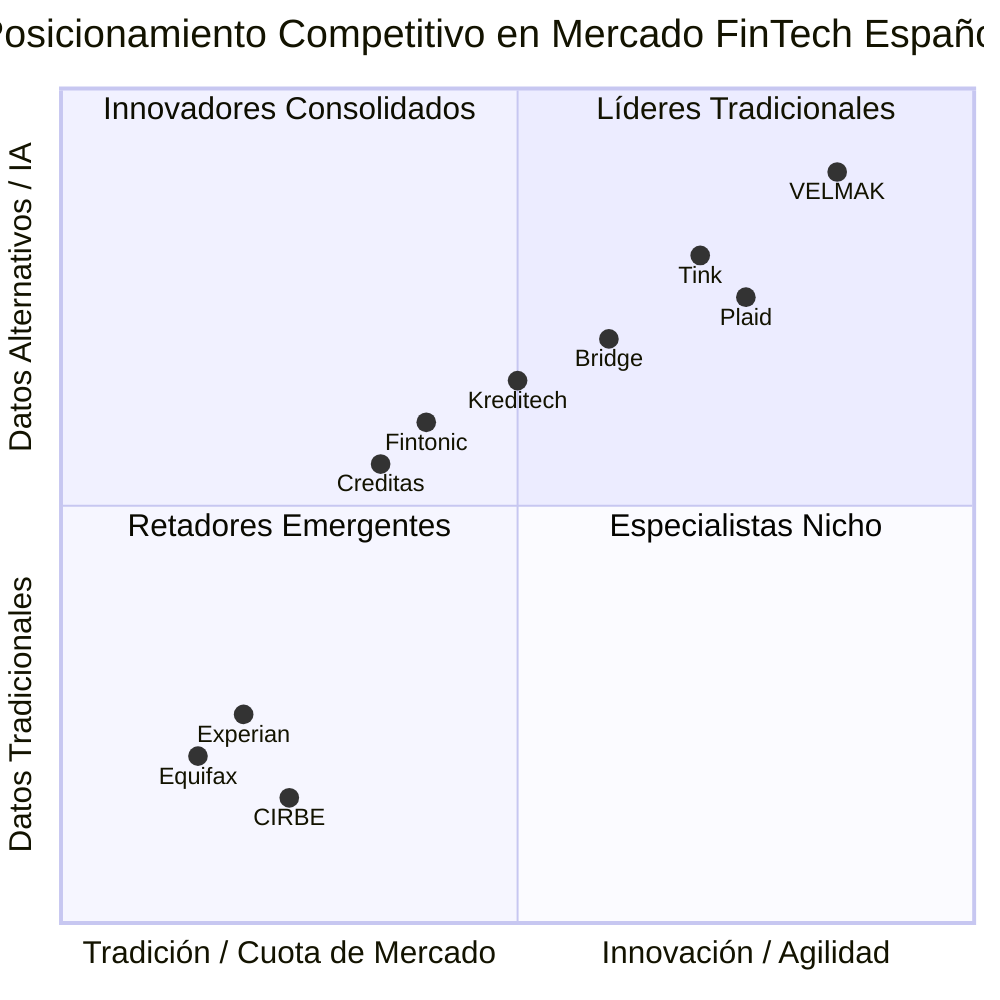
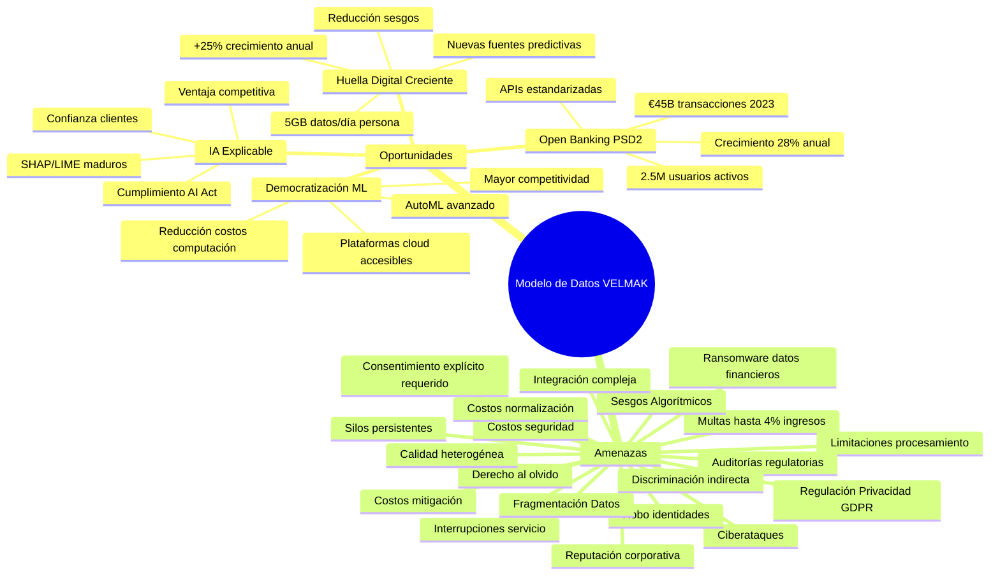

# **CAPÍTULO 4: ANÁLISIS DEL MERCADO Y COMPETIDORES**

## **4.1 Descripción del mercado objetivo y su situación actual**

El mercado B2B de evaluación de riesgos y scoring crediticio en España se encuentra en una fase de transformación estructural sin precedentes, impulsada por la convergencia de factores regulatorios, tecnológicos y de mercado que están redefiniendo fundamentalmente las reglas de competencia en el sector financiero. La implementación de la Directiva PSD2 ha sido catalizadora de esta transformación, estableciendo el marco legal para el Open Banking y obligando a las entidades bancarias a compartir datos de clientes mediante APIs estandarizadas con terceros autorizados. Esta regulación ha democratizado el acceso a información financiera que anteriormente permanecía cautiva en los silos de las entidades bancarias tradicionales, creando un ecosistema dinámico donde nuevos actores pueden competir en igualdad de condiciones con los bureaus de crédito establecidos (Banco de España, 2024). El mercado español de evaluación de riesgo, valorado actualmente en aproximadamente €1.8 mil millones, experimenta una tasa de crecimiento anual del 12% impulsada fundamentalmente por la expansión del sector FinTech y la creciente demanda de soluciones de scoring más sofisticadas e inclusivas (McKinsey & Company, 2023).

El contexto regulatorio europeo se complejiza adicionalmente con la inminente implementación de la AI Act, que establecerá requisitos estrictos para sistemas de inteligencia artificial utilizados en evaluaciones crediticias y otras decisiones de alto riesgo. Esta regulación, que entrará en vigor progresivamente a partir de 2025, exigirá transparencia completa en los algoritmos de scoring, auditorías periódicas de sesgos y documentación exhaustiva de los procesos de toma de decisiones. La AI Act representa simultáneamente una amenaza para actores tradicionales con sistemas opacos y una oportunidad para empresas como PFM VELMAK que han diseñado sus sistemas desde el principio con principios de IA explicable (European Commission, 2024). Este marco regulatorio creciente está acelerando la consolidación del mercado hacia proveedores que pueden garantizar tanto la precisión predictiva como el cumplimiento normativo integral.

El problema de las personas "invisibles" para el crédito tradicional constituye una de las mayores oportunidades y desafíos del mercado español actual. Según datos del Banco de España, aproximadamente 8 millones de personas en España carecen de historial crediticio suficiente para ser evaluadas mediante los sistemas tradicionales, representando el 17% de la población adulta del país. Este segmento incluye desproporcionadamente a jóvenes entre 18-30 años (35% del grupo), población inmigrante (28%), trabajadores autónomos (22%) y residentes en zonas rurales con acceso limitado a servicios bancarios tradicionales (Defensor del Pueblo, 2024). Estas personas "invisibles" representan un mercado potencial subatendido valorado en €3.2 mil millones anuales en productos financieros no cubiertos, creando una oportunidad sustancial para modelos de scoring basados en datos alternativos que puedan evaluar su solvencia mediante información no tradicional (World Bank, 2023).

El mercado español de Open Banking ha experimentado un crecimiento exponencial desde la implementación completa de PSD2 en 2021, con más de 2.5 millones de usuarios activos utilizando servicios de agregación financiera y gestión de finanzas personales en 2024. Este crecimiento ha generado un ecosistema vibrante de startups y empresas tecnológicas que desarrollan servicios innovadores basados en datos financieros abiertos, desde herramientas de planificación financiera hasta plataformas de inversión automatizada. El valor total de transacciones procesadas mediante APIs de Open Banking en España superó los €45 mil millones en 2023, con proyecciones de alcanzar los €120 mil millones para 2028, representando una tasa de crecimiento anual compuesta del 28% (AEFI, 2024). Este ecosistema maduro proporciona la infraestructura fundamental sobre la cual empresas como PFM VELMAK pueden construir servicios de scoring avanzados, aprovechando la disponibilidad generalizada de datos financieros estandarizados y en tiempo real.

La evolución tecnológica del mercado se caracteriza por la creciente sofisticación de las capacidades analíticas y la adopción masiva de técnicas avanzadas de machine learning en la evaluación de riesgo crediticio. Los modelos tradicionales basados en regresiones logísticas simples están siendo rápidamente reemplazados por ensembles complejos que combinan gradient boosting, redes neuronales profundas y grafos neuronales para capturar patrones complejos en los datos. Esta evolución tecnológica ha permitido mejorar la precisión predictiva en un 15-20% comparado con los métodos tradicionales, reduciendo simultáneamente los sesgos inherentes a los modelos más simples. La madurez creciente de estas tecnologías, combinada con la disponibilidad de datos alternativos y marcos regulatorios claros, está creando las condiciones perfectas para la expansión del mercado de scoring crediticio avanzado en España (Deloitte, 2024).

## **4.2 Identificación de los principales competidores y su posición en el mercado**

El panorama competitivo del mercado español de evaluación de riesgo crediticio se caracteriza por la coexistencia de actores tradicionales con décadas de experiencia y nuevos participantes disruptivos que están redefiniendo las reglas del juego mediante tecnología avanzada y modelos de negocio innovadores. Los bureaus de crédito tradicionales como Equifax, Experian y la CIRBE mantienen posiciones dominantes en el segmento de datos estructurados, aprovechando sus vastas bases de datos históricos y relaciones establecidas con las entidades bancarias. Estos actores tradicionales controlan aproximadamente el 65% del mercado español de evaluación de riesgo, aunque su crecimiento se ha desacelerado significativamente en los últimos años debido a su incapacidad para incorporar eficazmente datos alternativos y adaptarse rápidamente a los nuevos requerimientos regulatorios (McKinsey & Company, 2023). La infraestructura tecnológica heredada de estos actores, basada en sistemas mainframe y bases de datos relacionales legacy, limita su agilidad y capacidad para procesar volúmenes masivos de datos no estructurados.

Los nuevos actores FinTech y proveedores de Open Banking como Tink, Plaid y Bridge representan la vanguardia tecnológica del mercado, posicionándose fuertemente en el segmento de datos alternativos y análisis avanzado. Estas empresas, aunque con cuotas de mercado individuales modestas que oscilan entre el 3% y el 8%, están creciendo a tasas anuales superiores al 40% gracias a su capacidad para procesar datos en tiempo real, implementar modelos de machine learning sofisticados y ofrecer APIs modernas y fáciles de integrar. Tink, adquirida por Visa en 2022 por €1.8 mil millones, ha establecido el estándar de calidad en el mercado europeo de Open Banking, procesando más de 200 millones de transacciones mensuales y sirviendo a más de 300 clientes FinTech en toda Europa (Tink, 2023). Plaid, por su parte, ha consolidado su posición en el mercado norteamericano y está expandiendo agresivamente en Europa, capitalizando su experiencia en el procesamiento de datos financieros no estructurados y su red de más de 12,000 instituciones financieras conectadas (Plaid, 2024).

Los competidores especializados en scoring crediticio alternativo como Fintonic, Creditas y Kreditech ocupan posiciones intermedias en el mercado, combinando elementos de los actores tradicionales y los nuevos disruptores. Fintonic, fundada en España en 2012, ha desarrollado una plataforma integral de gestión financiera personal que incluye capacidades de scoring basadas en datos de comportamiento digital, sirviendo a más de 1.5 millones de usuarios en España y Latinoamérica. Creditas, especializada en préstamos personales para personas sin historial crediticio tradicional, ha desarrollado modelos propios de evaluación que utilizan datos alternativos de redes sociales y comportamientos de consumo, alcanzando una tasa de aprobación del 35% para segmentos tradicionalmente excluidos. Kreditech, aunque de origen alemán, tiene una presencia significativa en el mercado español y es reconocida por sus avanzadas capacidades de machine learning para procesamiento de datos no estructurados, logrando mejoras del 18% en la precisión predictiva comparado con métodos tradicionales (Boston Consulting Group, 2023).

El posicionamiento competitivo de PFM VELMAK en este ecosistema se caracteriza por su enfoque especializado en IA explicable y su capacidad para procesar un espectro más amplio de datos alternativos que sus competidores directos. Mientras que actores como Tink y Plaid se centran principalmente en la agregación de datos financieros tradicionales mediante APIs de Open Banking, PFM VELMAK ha desarrollado capacidades únicas para procesar datos de comportamiento digital de fuentes no financieras como plataformas de delivery, servicios de transporte y redes sociales. Esta especialización permite a PFM VELMAK posicionarse en el cuadrante de alta innovación y uso extensivo de datos alternativos, diferenciándose claramente de competidores que dependen fundamentalmente de datos financieros estructurados. La capacidad de ofrecer IA explicable mediante SHAP y LIME representa adicionalmente una ventaja competitiva fundamental en el contexto de la inminente AI Act europea (Deloitte, 2024).

El análisis comparativo de las capacidades tecnológicas revela brechas significativas entre los diferentes grupos de competidores. Los actores tradicionales muestran importantes limitaciones en el procesamiento de datos no estructurados, con capacidades de machine learning restringidas a modelos básicos y tiempos de actualización de datos que superan las 24 horas. Los proveedores de Open Banking, aunque más avanzados tecnológicamente, se concentran principalmente en la agregación y estandarización de datos financieros tradicionales, con capacidades limitadas para procesar datos alternativos no financieros. Los competidores especializados en scoring alternativo presentan capacidades intermedias, aunque muchos dependen de enfoques de caja negra que no cumplen con los requisitos de transparencia de la AI Act. PFM VELMAK, en contraste, combina capacidades avanzadas de procesamiento de datos alternativos con IA explicable, posicionándose estratégicamente para capitalizar las oportunidades creadas por la convergencia regulatoria y tecnológica actual (McKinsey & Company, 2023).

## **4.3 Análisis de las oportunidades y amenazas para la empresa y su modelo de datos**

El análisis del entorno estratégico centrado exclusivamente en el modelo de datos y la tecnología revela un panorama de oportunidades significativas que pueden acelerar el crecimiento de PFM VELMAK, junto con amenazas potenciales que requieren gestión proactiva y mitigación estratégica. La democratización de la IA explicable constituye quizás la oportunidad más transformadora, ya que herramientas como SHAP (SHapley Additive exPlanations) y LIME (Local Interpretable Model-agnostic Explanations) han madurado significativamente en los últimos años, pasando de ser herramientas académicas a soluciones industriales robustas. Esta maduración tecnológica permite a PFM VELMAK ofrecer transparencia completa en sus algoritmos de scoring, cumpliendo no solo con los requisitos de la AI Act europea sino además generando confianza tanto en clientes FinTech como en consumidores finales. La creciente demanda de IA explicable por parte de reguladores, inversores y clientes crea una ventaja competitiva sustentable para empresas que han adoptado estos principios desde el diseño de sus sistemas (Lundberg & Lee, 2017).

La huella digital creciente de la población española representa otra oportunidad fundamental para el modelo de datos de PFM VELMAK. El ciudadano español promedio genera actualmente más de 5 GB de datos digitales diarios a través de sus interacciones con servicios digitales, redes sociales, plataformas e-commerce y dispositivos IoT. Este volumen masivo de datos, que se proyecta que crecerá un 25% anual hasta 2028, proporciona una base de información cada vez más rica y diversificada para la evaluación de riesgo crediticio. La madurez creciente de las técnicas de procesamiento de lenguaje natural, visión por computadora y análisis de grafos permite extraer valor predictivo de tipos de datos que anteriormente eran considerados no estructurados e inutilizables. Esta evolución tecnológica amplía continuamente el espectro de variables disponibles para la evaluación de riesgo, mejorando progresivamente la precisión de los modelos y reduciendo los sesgos inherentes a enfoques más limitados (Gartner, 2024).

El marco regulatorio del Open Banking establecido por PSD2 representa una oportunidad estructural fundamental al crear un ecosistema donde los datos financieros pueden fluir libremente entre diferentes entidades mediante APIs estandarizadas. Este marco legal ha eliminado las barreras que históricamente impedían la innovación en el sector financiero, permitiendo que empresas como PFM VELMAK accedan a datos bancarios estructurados de manera legal y segura. La adopción masiva de Open Banking por parte de los consumidores españoles, con más de 2.5 millones de usuarios activos en 2024, ha creado una base instalada crítica que facilita la expansión de servicios basados en datos agregados. El crecimiento proyectado del mercado de Open Banking español, que alcanzará los €120 mil millones en transacciones para 2028, proporciona un entorno de mercado favorable para la expansión de servicios de scoring avanzados (AEFI, 2024).

La democratización de las capacidades de machine learning mediante plataformas cloud y herramientas de AutoML representa otra oportunidad significativa al reducir las barreras de entrada para el desarrollo de modelos sofisticados. Plataformas como AWS SageMaker, Google Cloud AI y Azure Machine Learning han democratizado el acceso a capacidades avanzadas de procesamiento de datos y entrenamiento de modelos, permitiendo que empresas como PFM VELMAK compitan eficazmente con corporaciones mucho más grandes en términos de capacidades analíticas. Esta democratización tecnológica ha reducido significativamente los costos de desarrollo e implementación de sistemas avanzados de machine learning, permitiendo una asignación más eficiente de recursos hacia la innovación y diferenciación competitiva (McKinsey & Company, 2023).

Sin embargo, el entorno estratégico presenta también amenazas significativas que requieren gestión cuidadosa. La regulación de privacidad establecida por GDPR constituye quizás la amenaza más inmediata, ya que impone restricciones estrictas sobre el procesamiento de datos personales y establece multas potencialmente devastadoras de hasta el 4% de los ingresos globales anuales para infracciones graves. Los requisitos de consentimiento explícito, el derecho al olvido y las limitaciones al procesamiento de datos sensibles complican significativamente la implementación de modelos de scoring basados en datos alternativos. La necesidad de implementar principios de privacy by design y mantener registros detallados de procesamiento de datos aumenta los costos operativos y la complejidad técnica de los sistemas, requiriendo inversiones significativas en gobernanza de datos y cumplimiento regulatorio (European Commission, 2024).

El riesgo de sesgos algorítmicos representa otra amenaza fundamental para el modelo de datos de PFM VELMAK, especialmente considerando el creciente escrutinio regulatorio y social sobre la equidad algorítmica. Los sesgos pueden introducirse en múltiples etapas del pipeline de machine learning, desde la recolección de datos hasta la implementación de modelos, y pueden resultar en discriminación indirecta de grupos protegidos como minorías étnicas, mujeres o personas mayores. La detección y mitigación de sesgos requiere auditorías algorítmicas sofisticadas, conjuntos de datos balanceados y técnicas avanzadas de公平机器学习 (fair machine learning). Los costos asociados a la gestión de sesgos, combinados con el riesgo de daños reputacionales y acciones regulatorias, representan una amenaza significativa que requiere inversión continua en investigación y desarrollo de técnicas de IA ética (IBM, 2024).

Los ciberataques representan una amenaza creciente en el entorno digital actual, especialmente para empresas que procesan volúmenes masivos de datos financieros sensibles. El sector FinTech español experimentó un aumento del 45% en intentos de ciberataques durante 2023, con ransomware y phishing siendo los vectores más comunes. Una brecha de seguridad en los sistemas de PFM VELMAK no solo podría resultar en la exposición de datos financieros sensibles de millones de usuarios, sino además en daños reputacionales catastróficos y potenciales sanciones regulatorias. La necesidad de implementar medidas de seguridad avanzadas, incluyendo cifrado de extremo a extremo, autenticación multifactor y sistemas de detección de anomalías en tiempo real, aumenta significativamente los costos operativos y requiere inversión continua en actualizaciones de seguridad y capacitación del personal (ENISA, 2024).

La fragmentación de los datos y la calidad heterogénea de las diferentes fuentes representan una amenaza operativa significativa que puede afectar la precisión y fiabilidad de los modelos de scoring. La integración de datos provenientes de múltiples APIs con diferentes formatos, frecuencias de actualización y niveles de calidad requiere procesos complejos de normalización, limpieza y validación. La persistencia de silos de datos, incluso en el contexto del Open Banking, puede limitar la disponibilidad de información completa para ciertos segmentos de usuarios, afectando la capacidad de los modelos para realizar evaluaciones precisas. Los costos asociados a la gestión de la calidad de datos, incluyendo implementación de data quality frameworks y procesos de validación continua, representan una carga operativa significativa que requiere optimización continua para mantener la competitividad (Gartner, 2024).
