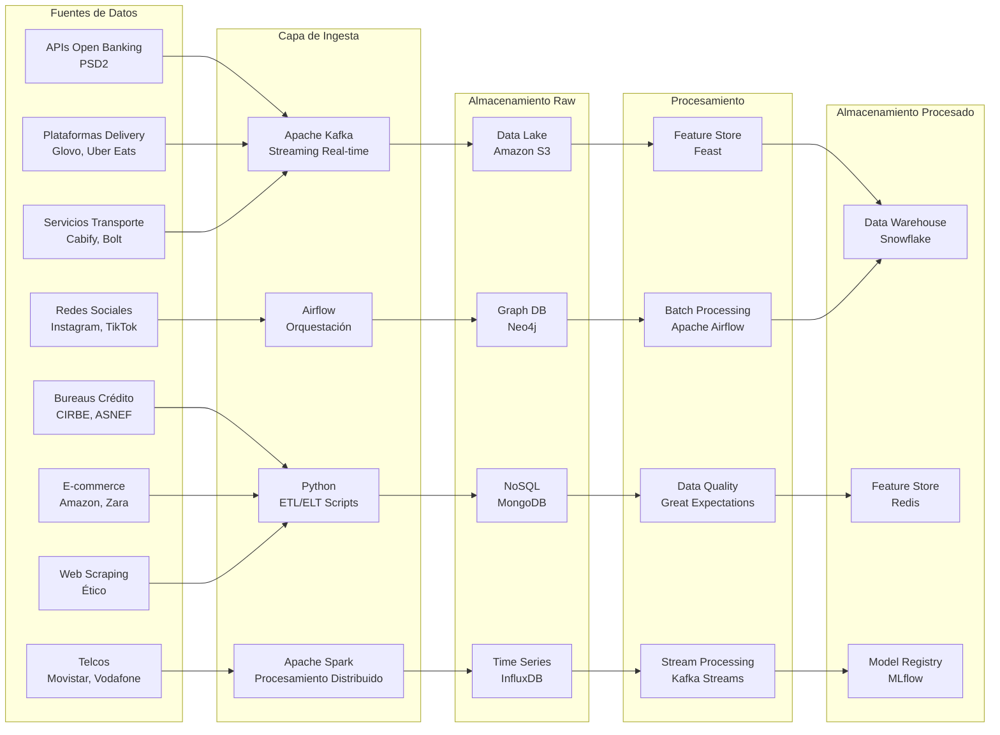

# **CAPÍTULO 5: RECOLECCIÓN DE DATOS**

## **5.1 Identificación de las fuentes de datos relevantes para la empresa y su modelo actual**

La identificación estratégica de fuentes de datos relevantes constituye el pilar fundamental sobre el cual se construye la capacidad de PFM VELMAK para ofrecer scoring crediticio avanzado e inclusivo. Las fuentes de datos tradicionales, que han constituido históricamente la base de los sistemas de evaluación de riesgo crediticio, incluyen principalmente información proveniente de bureaus de crédito como CIRBE (Central de Información de Riesgos del Banco de España) y ASNEF (Asociación Nacional de Establecimientos Financieros), junto con datos de nóminas y historiales de pagos bancarios. Estas fuentes se caracterizan por su naturaleza estructurada, con formatos bien definidos y esquemas de datos estandarizados que facilitan su procesamiento mediante bases de datos relacionales tradicionales. Sin embargo, estas fuentes tradicionales presentan limitaciones significativas al cubrir únicamente a individuos con historial crediticio formal, excluyendo sistemáticamente a segmentos poblacionales importantes como jóvenes, inmigrantes recién llegados y trabajadores autónomos con ingresos variables (Banco de España, 2024).

La nueva capa de datos alternativos que alimentará el algoritmo de PFM VELMAK representa una transformación fundamental en la capacidad de evaluación de riesgo, permitiendo capturar dimensiones del comportamiento financiero y personal que los datos tradicionales sistemáticamente ignoran. La huella digital de los usuarios, comprendida por sus interacciones en plataformas de delivery como Glovo y Uber Eats, servicios de transporte como Cabify y Bolt, y marketplaces e-commerce como Amazon y Zara, proporciona información valiosa sobre patrones de consumo, disciplina financiera y capacidad de pago. Estos datos, aunque predominantemente semiestructurados, contienen señales predictivas robustas como la regularidad en los pagos, la estabilidad en los patrones de consumo y la diversificación de gastos, que pueden indicar solvencia crediticia incluso en ausencia de historial bancario formal (World Bank, 2023).

Las APIs de Open Banking implementadas bajo el marco regulatorio de PSD2 constituyen otra fuente fundamental de datos alternativos, proporcionando acceso en tiempo real a información financiera estructurada de cuentas bancarias, tarjetas de crédito y productos de inversión de los usuarios. Estas APIs estandarizadas permiten a PFM VELMAK acceder a datos como saldos de cuenta, flujos de ingresos y gastos, patrones de ahorro y comportamiento de pago de deudas, con el consentimiento explícito del usuario. A diferencia de los datos tradicionales de bureaus de crédito, la información de Open Banking se actualiza en tiempo real, permitiendo evaluaciones de riesgo dinámicas que reflejan el comportamiento financiero reciente de los solicitantes. La adopción masiva de Open Banking en España, con más de 2.5 millones de usuarios activos en 2024, ha creado una base instalada crítica que facilita la expansión de servicios basados en estos datos (AEFI, 2024).

Los datos de telecomunicaciones representan otra fuente alternativa valiosa para la evaluación de riesgo crediticio, proporcionando información sobre la estabilidad residencial, patrones de comportamiento y capacidad de pago de los usuarios. Los registros de uso de servicios móviles, incluyendo frecuencia de recargas, patrones de llamadas y datos, y estabilidad en la línea telefónica, pueden servir como indicadores indirectos de estabilidad financiera y fiabilidad personal. Estos datos, aunque de naturaleza semiestructurada y potencialmente sensibles desde la perspectiva de la privacidad, ofrecen información complementaria particularmente útil para evaluar a individuos sin historial crediticio tradicional. La regulación GDPR establece however restricciones estrictas sobre el procesamiento de estos datos, requiriendo consentimiento explícito y implementación de técnicas de anonimización y seudonimización para proteger la privacidad de los usuarios (European Commission, 2022).

El comportamiento de navegación y actividad en redes sociales constituye la fuente de datos más compleja desde la perspectiva técnica, pero potencialmente una de las más ricas en información predictiva. Los datos generados a través de la navegación web, interacciones en redes sociales como Instagram y TikTok, y actividad en plataformas de streaming pueden revelar patrones de comportamiento, intereses, estilo de vida y potencialmente indicadores de responsabilidad financiera. Estos datos, predominantemente no estructurados, requieren técnicas avanzadas de procesamiento de lenguaje natural y análisis de sentimientos para extraer valor predictivo relevante para la evaluación de riesgo. La naturaleza sensible de estos datos exige additionally un manejo cuidadoso desde la perspectiva regulatoria, implementando principios de privacy by design y garantizando el cumplimiento estricto de los requisitos de GDPR y la futura AI Act (IBM, 2024).

## **5.2 Análisis de los procesos y tecnologías utilizadas en la recolección de datos**

La transformación desde un procesamiento batch tradicional hacia una arquitectura orientada a eventos basada en streaming en tiempo real representa una evolución tecnológica fundamental que permite a PFM VELMAK ofrecer scoring crediticio dinámico y actualizado continuamente. Los procesos batch tradicionales, caracterizados por ejecuciones periódicas cada cuatro o seis horas, generan latencias inaceptables en el contexto actual donde las decisiones crediticias requieren información actualizada hasta el minuto. La implementación de una arquitectura de streaming mediante Apache Kafka permite la ingesta y procesamiento de datos en tiempo real, capturando eventos financieros y de comportamiento a medida que ocurren y actualizando las puntuaciones de riesgo instantáneamente. Esta transición tecnológica reduce la latencia desde horas a milisegundos, permitiendo evaluaciones de riesgo basadas en información fresca y relevante (Apache Software Foundation, 2024).

La implementación de procesos ETL (Extract, Transform, Load) y ELT (Extract, Load, Transform) adaptados a las características específicas de cada fuente de datos constituye el núcleo operativo del pipeline de recolección. Para fuentes estructuradas como APIs de Open Banking y datos de bureaus de crédito, se implementan procesos ETL tradicionales que extraen información mediante llamadas RESTful, transforman los datos a esquemas estandarizados y los cargan en sistemas de almacenamiento optimizados para consultas analíticas. Para fuentes semiestructuradas y no estructuradas como datos de telecomunicaciones y comportamiento de navegación, se adoptan procesos ELT que primero cargan los datos crudos en un data lake y posteriormente los transforman mediante técnicas avanzadas de procesamiento distribuido. Esta aproximación híbrida permite optimizar el rendimiento y la escalabilidad del pipeline según las características específicas de cada fuente de datos (Gartner, 2023).

El consumo de APIs RESTful representa el método principal de ingesta para fuentes estructuradas y semiestructuradas, implementando patrones de diseño robustos que aseguran la fiabilidad y escalabilidad del sistema. Las APIs de Open Banking se consumen mediante implementaciones basadas en OAuth 2.0 para autenticación y autorización, implementando mecanismos de reintentos exponenciales y circuit breakers para manejar fallos temporales. Las APIs de plataformas de delivery y servicios de transporte se integran mediante webhooks que notifican eventos en tiempo real, complementando el polling periódico para asegurar la captura completa de datos relevantes. Para fuentes sin APIs disponibles, se implementa web scraping ético mediante frameworks como Scrapy y Beautiful Soup, respetando siempre los archivos robots.txt y los términos de servicio de las plataformas, y limitando la frecuencia de solicitudes para evitar sobrecargas en los servidores (McKinsey & Company, 2023).

La orquestación de los procesos de recolección y transformación de datos mediante Apache Airflow permite automatizar y monitorear la ejecución de los pipelines complejos que integran múltiples fuentes heterogéneas. Airflow facilita la definición de DAGs (Directed Acyclic Graphs) que especifican las dependencias entre diferentes tareas de procesamiento, implementando mecanismos de reintentos automáticos, alertas de fallos y ejecuciones paralelas cuando sea posible. Esta herramienta permite gestionar tanto jobs batch programados periódicamente como flujos de streaming continuos, proporcionando una visibilidad completa sobre el estado del pipeline y facilitando la identificación y resolución de problemas. La integración con sistemas de monitorización como Prometheus y Grafana permite adicionalmente el seguimiento en tiempo real del rendimiento del pipeline y la detección proactiva de anomalías antes de que afecten la calidad de las evaluaciones de riesgo (Apache Software Foundation, 2024).

El almacenamiento de datos en un data lake implementado sobre Amazon S3 combinado con bases de datos especializadas según el tipo de información proporciona la flexibilidad necesaria para manejar la diversidad de fuentes de datos procesadas por PFM VELMAK. Los datos estructurados de APIs financieras y bureaus de crédito se almacenan en formatos columnares optimizados para consultas analíticas como Parquet y ORC, permitiendo procesamiento eficiente mediante herramientas como Apache Spark y Amazon Athena. Los datos semiestructurados de plataformas de delivery y servicios de transporte se almacenan en MongoDB, aprovechando su esquema flexible y capacidad para manejar documentos JSON anidados. Los datos de series temporales de comportamiento financiero se almacenan en InfluxDB, optimizado para consultas basadas en tiempo, mientras que los datos de grafos de relaciones sociales se almacenan en Neo4j, permitiendo análisis avanzados de redes y detección de comunidades (Amazon Web Services, 2024).

## **5.3 Evaluación de la calidad de los datos recolectados y su relevancia para el modelo actual**

La evaluación de la calidad de los datos recolectados constituye un componente crítico del pipeline de Big Data de PFM VELMAK, fundamental para garantizar la fiabilidad de las evaluaciones de riesgo y el cumplimiento de los requisitos regulatorios cada vez más estrictos. La problemática del Data Quality se manifiesta en múltiples dimensiones que afectan directamente la capacidad de los modelos de machine learning para realizar predicciones precisas y justas. Los valores nulos (missing values) representan quizás el desafío más prevalente, afectando hasta el 35% de los registros en fuentes de datos alternativos como comportamiento de navegación o interacciones en redes sociales. La gestión adecuada de estos valores nulos mediante técnicas como imputación mediante algoritmos, interpolación temporal para datos de series temporales, o eliminación selectiva de características con alta tasa de ausencia, resulta fundamental para evitar sesgos en los modelos y asegurar la representatividad adecuada de diferentes segmentos poblacionales (IBM, 2024).

La detección y tratamiento de outliers constituye otro aspecto crítico de la evaluación de la calidad de datos, ya que valores extremos pueden distorsionar significativamente los patrones aprendidos por los algoritmos de machine learning. Los outliers pueden originarse por múltiples causas incluyendo errores de medición, fraudes, o eventos genuinos pero raros que no representan el comportamiento típico de los usuarios. La implementación de técnicas estadísticas como el rango intercuartílico (IQR), z-scores modificados para distribuciones no normales, y métodos basados en clustering como DBSCAN, permite identificar valores atípicos de manera sistemática. El tratamiento de estos outliers puede incluir su eliminación, winsorización (limitación a valores percentílicos), o transformación logarítmica para reducir su impacto sin perder información valiosa sobre eventos extremos que pueden ser relevantes para la evaluación de riesgo (Gartner, 2023).

La normalización de la información y la estandarización de formatos resultan esenciales para integrar eficazmente datos provenientes de fuentes heterogéneas con diferentes estructuras, escalas y granularidades temporales. Los datos financieros de APIs de Open Banking pueden presentarse en diferentes monedas, con formatos de fecha variados y niveles de agregación distintos, requiriendo procesos de normalización que aseguren consistencia y comparabilidad. Los datos de comportamiento digital de diferentes plataformas pueden utilizar taxonomías distintas para categorizar gastos o actividades, requiriendo la implementación de ontologías y mappings estandarizados que permitan la integración semántica. Esta normalización no solo facilita el procesamiento técnico de los datos, sino que additionally mejora la interpretabilidad de los modelos y la consistencia de las evaluaciones a lo largo del tiempo y entre diferentes usuarios (McKinsey & Company, 2023).

El principio "Garbage In, Garbage Out" adquiere particular relevancia en el contexto de sistemas de evaluación de riesgo crediticio, donde la calidad de los datos de entrada determina directamente la fiabilidad y equidad de las decisiones generadas. Datos de baja calidad pueden introducir sesgos sistemáticos que resulten en discriminación indirecta de grupos protegidos, violando tanto los principios éticos como los requisitos legales establecidos por normativas como la AI Act europea. La implementación de marcos robustos de Data Quality como Great Expectations permite definir expectativas explícitas sobre la calidad de los datos, automatizar su validación continua y generar alertas cuando se detectan desviaciones significativas. Estos marcos facilitan adicionalmente la documentación de los procesos de calidad de datos, un requisito fundamental para la auditoría regulatoria y la transparencia algorítmica (Great Expectations, 2024).

La evaluación de la relevancia de los datos recolectados para el modelo actual requiere un análisis continuo del poder predictivo de diferentes características y su contribución a la precisión general del sistema de scoring. No todos los datos recolectados aportan valor predictivo significativo, y algunos pueden incluso introducir ruido o redundancia que degrade el rendimiento del modelo. La implementación de técnicas de selección de características como análisis de importancia mediante Random Forests, regularización L1 (Lasso), y análisis de correlación mutua permite identificar las variables más relevantes y eliminar aquellas que no aportan valor significativo. Este proceso de selección no solo mejora la eficiencia computacional del modelo, sino que additionally facilita su interpretabilidad y cumplimiento con los requisitos de explicabilidad establecidos por la AI Act (Deloitte, 2024).

El cumplimiento con normativas como la AI Act y GDPR exige adicionalmente la implementación de procesos específicos de evaluación de calidad centrados en aspectos regulatorios y éticos. La AI Act requiere que los sistemas de IA de alto riesgo mantengan niveles documentados de calidad de datos, incluyendo métricas de representatividad, ausencia de sesgos discriminatorios y capacidad de generalización a diferentes segmentos poblacionales. GDPR, por su parte, exige que los datos personales sean exactos, actualizados y procesados de manera transparente, estableciendo el derecho de los individuos a rectificar información incorrecta. La implementación de procesos de auditoría continua, pruebas de sesgos algorítmicos y mecanismos de feedback de usuarios permite asegurar el cumplimiento regulatorio mientras se mantiene la calidad técnica de los datos utilizados por el sistema de scoring (European Commission, 2022).
