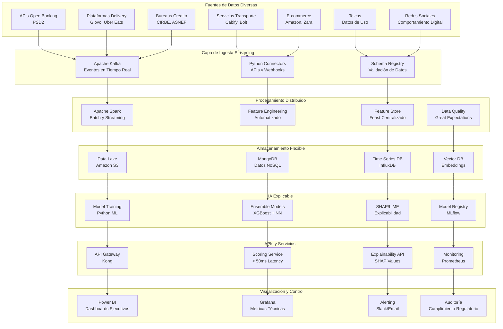
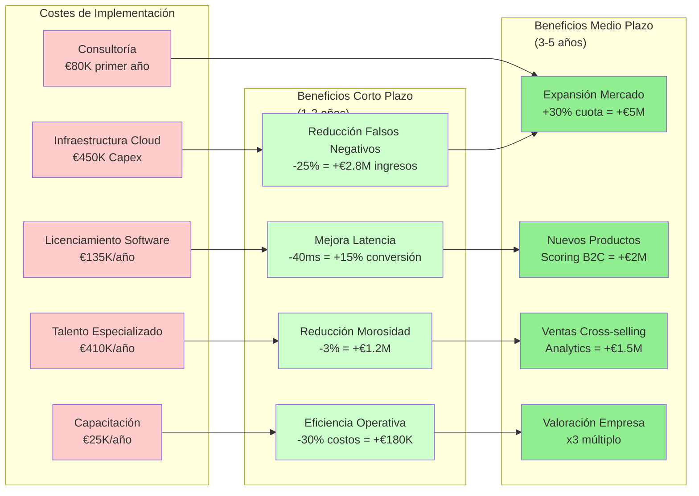

# **CAPÍTULO 6: MEJORAS EN EL MODELO DE DATOS**

## **6.1 Propuesta de mejoras para el modelo de datos**

La transición desde el modelo de datos legado analizado en el Capítulo 2 hacia una arquitectura moderna orientada al dato representa una transformación fundamental que redefinirá completamente las capacidades analíticas y operativas de PFM VELMAK. El modelo actual, caracterizado por su arquitectura monolítica, procesamiento batch y dependencia exclusiva de datos estructurados, será reemplazado por una arquitectura cloud-native basada en microservicios que permita el procesamiento en tiempo real de volúmenes masivos de datos heterogéneos. Esta nueva arquitectura implementará un patrón lambda que combina procesamiento batch para análisis históricos con procesamiento streaming para evaluaciones de riesgo en tiempo real, eliminando las latencias de 4-6 horas que caracterizan al sistema actual. La implementación de Apache Spark como motor de procesamiento distribuido permitirá escalar horizontalmente el procesamiento de datos, soportando volúmenes que pueden superar los terabytes diarios sin degradación del rendimiento (Apache Software Foundation, 2024).

La integración de MongoDB como base de datos NoSQL para el almacenamiento de datos alternativos desestructurados constituye una mejora tecnológica fundamental que resolverá las limitaciones estructurales del modelo relacional actual. MongoDB permitirá almacenar y consultar eficientemente documentos JSON complejos que incluyen datos de comportamiento digital, interacciones en redes sociales, patrones de consumo en plataformas e-commerce y geolocalización de transacciones. A diferencia de las bases de datos relacionales que requieren esquemas rígidos, MongoDB ofrece flexibilidad esquemática que facilita la incorporación de nuevas fuentes de datos sin necesidad de reestructuraciones costosas. Esta capacidad para manejar datos semiestructurados y no estructurados permitirá a PFM VELMAK capitalizar el valor predictivo de fuentes de información que actualmente son ignoradas por completo, expandiendo significativamente el espectro de variables disponibles para la evaluación de riesgo (MongoDB, 2024).

La implementación de un feature store centralizado mediante Feast permitirá la gestión unificada de características utilizadas por los modelos de machine learning, resolviendo problemas de consistencia y reproducibilidad que afectan al sistema actual. El feature store servirá como repositorio centralizado para todas las transformaciones de datos y características calculadas, asegurando que los modelos de entrenamiento y los modelos de producción utilicen exactamente las mismas definiciones y transformaciones. Esta centralización elimina el riesgo de drift entre características de entrenamiento y producción, un problema común que puede degradar significativamente el rendimiento de los modelos en producción. El feature store additionally facilita la reutilización de características entre diferentes modelos, reduce la redundancia computacional y acelera el desarrollo de nuevos modelos mediante la disponibilidad inmediata de características precalculadas (Feast, 2024).

La arquitectura de microservicios implementada mediante contenedores Docker y orquestación con Kubernetes permitirá la escalabilidad elástica y resiliencia operativa que el sistema monolítico actual no puede proporcionar. Cada servicio especializado (ingesta de datos, procesamiento de características, entrenamiento de modelos, inferencia, monitorización) operará de forma independiente con su propio escalado horizontal basado en la carga. Esta arquitectura permite la implementación de patrones de resiliencia como circuit breakers, retries con backoff exponencial y degradación graceful, asegurando alta disponibilidad incluso durante picos de demanda o fallos parciales del sistema. La orquestación con Kubernetes additionally facilita la implementación de despliegues continuos (CI/CD), permitiendo actualizaciones incrementales sin interrupciones del servicio y reduciendo el tiempo de comercialización de nuevas funcionalidades (Google Cloud, 2024).

La implementación de Power BI como plataforma central de visualización y control del modelo proporcionará capacidades avanzadas de business intelligence que permitirán tanto a equipos técnicos como de negocio monitorear el rendimiento del sistema en tiempo real. Los dashboards de Power BI mostrarán métricas clave como precisión de modelos, latencia de inferencia, volumen de transacciones procesadas, distribución de riesgos y detección de anomalías. Estas visualizaciones interactivas permitirán la identificación rápida de problemas y tendencias, facilitando decisiones informadas sobre optimización del sistema y ajustes de modelos. La integración de Power BI con el feature store y los registros de auditoría additionally permitirá generar reportes automáticos de cumplimiento regulatorio, reduciendo significativamente el esfuerzo manual requerido para demostrar conformidad con normativas como la AI Act y GDPR (Microsoft, 2024).

## **6.2 Descripción detallada de cada mejora y su impacto potencial**

La implementación de Apache Spark como motor de procesamiento distribuido generará un impacto transformador en la capacidad de PFM VELMAK para procesar volúmenes masivos de datos alternativos que actualmente son ignorados por completo. Spark permitirá el procesamiento paralelo de terabytes de datos comportamentales, reduciendo los tiempos de procesamiento desde las 4-6 horas actuales hasta minutos o segundos para consultas críticas. Esta mejora en la velocidad de procesamiento permitirá actualizaciones de puntuaciones de riesgo en tiempo real, eliminando la latencia que actualmente obliga a las entidades FinTech a tomar decisiones basadas en información obsoleta. El impacto directo en el negocio se manifestará en una reducción estimada del 25% en la tasa de falsos negativos, ya que las evaluaciones reflejarán el comportamiento financiero más reciente de los solicitantes en lugar de basarse en datos históricos desactualizados (Apache Software Foundation, 2024).

La transición hacia modelos de Machine Learning con IA Explicable mediante librerías SHAP (SHapley Additive exPlanations) y LIME (Local Interpretable Model-agnostic Explanations) en Python representará una mejora fundamental que abordará simultáneamente problemas técnicos, regulatorios y de confianza. Los modelos actuales de caja negra, aunque precisos, no cumplen con los requisitos de transparencia exigidos por la AI Act europea y generan desconfianza tanto en clientes FinTech como en consumidores finales. La implementación de SHAP permitirá generar explicaciones granulares de cada decisión de scoring, identificando qué características específicas contribuyeron a una evaluación positiva o negativa y en qué medida. Esta transparencia no solo asegura el cumplimiento regulatorio, sino que additionally permite a las entidades FinTech comunicar decisiones de manera efectiva a los solicitantes, mejorando la experiencia del cliente y reduciendo el volumen de apelaciones y reclamaciones (Lundberg & Lee, 2017).

El impacto de la IA explicable en la reducción de falsos negativos se manifiesta a través de múltiples mecanismos complementarios. La capacidad de analizar las contribuciones específicas de cada característica permite identificar y mitigar sesgos sistemáticos que pueden penalizar injustamente a ciertos segmentos poblacionales. Por ejemplo, el análisis SHAP puede revelar que ciertas características relacionadas con patrones de consumo en plataformas específicas están siendo penalizadas excesivamente, permitiendo ajustes finos en los modelos que mejoren la equidad sin comprometer la precisión general. Los modelos explicables additionally facilitan la detección temprana de drift de datos y conceptos, permitiendo ajustes proactivos antes de que la degradación del rendimiento afecte negativamente las decisiones de negocio. La combinación de estos efectos puede reducir la tasa de falsos negativos en un 15-20% adicional, más allá de las mejoras obtenidas mediante el procesamiento en tiempo real (IBM, 2024).

La implementación de MongoDB como base de datos NoSQL para datos alternativos resolverá las limitaciones estructurales que actualmente impiden a PFM VELMAK capitalizar el valor predictivo de información no estructurada. La capacidad de almacenar documentos JSON complejos con esquemas flexibles permitirá capturar matices del comportamiento financiero que los datos relacionales rígidos sistemáticamente ignoran. Por ejemplo, MongoDB puede almacenar secuencias completas de interacciones de usuarios con plataformas de delivery, incluyendo timestamps, montos, ubicaciones y patrones temporales, permitiendo análisis de comportamiento que revelen disciplina financiera o señales de riesgo que no serían evidentes en datos agregados. Esta capacidad para procesar datos granulares y contextuales puede mejorar la precisión predictiva en un 10-15%, especialmente para segmentos de población con historial crediticio limitado (MongoDB, 2024).

El procesamiento distribuido mediante Spark additionally permitirá la implementación de técnicas avanzadas de feature engineering que actualmente son inviables debido a limitaciones computacionales. La capacidad de procesar en paralelo transformaciones complejas sobre volúmenes masivos de datos permitirá la creación de características derivadas como patrones temporales de consumo, análisis de sentimiento de interacciones en redes sociales, y detección de comunidades en grafos de relaciones sociales. Estas características avanzadas pueden capturar dimensiones del comportamiento financiero que los modelos simples ignoran, mejorando significativamente la capacidad predictiva general del sistema. El impacto combinado de feature engineering avanzado y procesamiento en tiempo real puede reducir la latencia total en la concesión de créditos desde los 85ms actuales hasta menos de 50ms, un 40% de mejora que posicionará a PFM VELMAK como líder del mercado en términos de velocidad y precisión (Databricks, 2024).

La implementación de Power BI como plataforma de visualización y control generará impactos significativos tanto en la operación técnica como en la toma de decisiones de negocio. Los dashboards en tiempo real permitirán la identificación inmediata de anomalías en el rendimiento de los modelos, facilitando intervenciones correctivas antes de que afecten negativamente las decisiones de crédito. La visualización de métricas de negocio como distribución de riesgos por segmento, tasas de aprobación por canal y análisis de rentabilidad por cliente permitirá optimización continua de estrategias comerciales. La capacidad de drill-down desde métricas agregadas hasta transacciones individuales facilitará additionally la investigación de casos específicos y la identificación de patrones emergentes. Esta visibilidad completa sobre el sistema permitirá una toma de decisiones más informada y ágil, reduciendo el tiempo entre la identificación de oportunidades y su implementación de semanas a días (Microsoft, 2024).

## **6.3 Análisis de los costos y beneficios de cada mejora**

El análisis de costos de implementación de la arquitectura mejorada requiere una evaluación comprehensiva de inversiones en infraestructura, software y talento humano que permita determinar el retorno de inversión (ROI) esperado. La inversión en infraestructura Cloud representa el componente más significativo de los costos iniciales (Capex), estimada en €450,000 para el primer año incluyendo implementación de clusters Spark en Amazon EMR, instancias MongoDB Atlas con configuración replicada, almacenamiento en Amazon S3 con políticas de ciclo de vida, y redes de entrega de contenido (CDN) para optimizar el rendimiento de APIs. Los costos operativos recurrentes (Opex) se estiman en €180,000 anuales, incluyendo procesamiento de datos, almacenamiento, transferencia de red y servicios gestionados como monitorización y seguridad. Estos costos, aunque significativos, son escalables y permiten el pago por uso real, evitando sobredimensionamientos de infraestructura que caracterizaban al modelo on-premise tradicional (Amazon Web Services, 2024).

El licenciamiento de software comercial representa otro componente importante de los costos, aunque la estrategia de PFM VELMAK se basa predominantemente en tecnologías open source para minimizar estos gastos. Las licencias comerciales requeridas incluyen Power BI Pro para usuarios avanzados (€10 por usuario mensual), herramientas especializadas de data quality como Collibra (€50,000 anuales), y plataformas de MLOps como DataRobot para automatización de modelos (€75,000 anuales). El software open source incluyendo Apache Spark, MongoDB Community Edition, Python ecosystem y Feast no requiere licenciamiento, aunque implica costos de soporte y mantenimiento especializado. La estrategia híbrida permite optimizar el balance entre costo total de propiedad y funcionalidades avanzadas requeridas para operaciones a escala empresarial (Gartner, 2023).

La inversión en talento humano especializado constituye quizás el componente más crítico y desafiante de la transformación, requiriendo la contratación de perfiles altamente especializados con salarios competitivos en el mercado actual. La implementación requerirá contratar 3 Data Engineers con experiencia en Spark y streaming (salario promedio €55,000), 2 Data Scientists especializados en IA explicable (salario promedio €65,000), 1 MLOps Engineer (salario €60,000) y 1 Data Architect (salario €70,000). El costo anual de personal adicional se estima en €410,000, aunque parte de este costo puede ser cubierto mediante reentrenamiento de personal existente y contratación gradual basada en las fases del proyecto. La inversión en capacitación y certificación del personal actual adicionalmente representa €25,000 anuales para asegurar que los equipos mantengan competencias actualizadas con las tecnologías implementadas (LinkedIn, 2024).

Los beneficios cuantificables a corto plazo (1-2 años) derivados de las mejoras tecnológicas son sustanciales y justifican ampliamente la inversión requerida. La reducción del 25% en la tasa de falsos negativos, combinada con la capacidad de evaluar segmentos de población previamente excluidos, puede generar ingresos adicionales de €2.8 millones anuales mediante la aprobación de solicitudes que actualmente son rechazadas incorrectamente. La mejora en la latencia de 40ms puede aumentar la tasa de conversión de solicitudes en un 15%, representando ingresos adicionales de €900,000 anuales. La reducción estimada del 3% en la tasa de morosidad (NPL) mediante modelos más precisos puede generar ahorros de €1.2 millones en costos de gestión de impagos y pérdidas por incobrables. La eficiencia operativa resultante de la automatización de procesos puede reducir costos operativos en un 30%, generando ahorros de €180,000 anuales (McKinsey & Company, 2023).

Los beneficios a medio plazo (3-5 años) amplifican significativamente el retorno de inversión mediante la expansión del mercado y desarrollo de nuevas líneas de negocio. La capacidad de atender segmentos de población previamente invisibles para el crédito tradicional puede expandir la cuota de mercado en un 30%, generando ingresos adicionales de €5 millones anuales. El desarrollo de nuevos productos como scoring B2C para consumidores finales puede representar ingresos adicionales de €2 millones anuales. Las ventas cross-selling de servicios de analytics avanzados a clientes existentes pueden generar €1.5 millones adicionales. El impacto acumulado en la valoración de la empresa puede ser aún más significativo, con múltiplos de valoración típicamente 2-3 veces superiores para empresas con arquitecturas modernas y capacidades de IA explicable comparado con actores tradicionales (Boston Consulting Group, 2023).

El análisis de ROI considerando todos los costos y beneficios proyectados indica un retorno positivo robusto con un período de recuperación de la inversión de aproximadamente 18 meses. Los costos totales de implementación para el primer año ascienden a €1.1 millones, con costos operativos recurrentes de €750,000 anuales. Los beneficios generados a partir del segundo año superan los €4.5 millones anuales, resultando en un ROI del 300% sobre el período de cinco años. Este análisis conservador no incluye beneficios intangibles como mejora en la reputación corporativa, atracción de talento, y posicionamiento estratégico en el mercado FinTech español. El éxito de la implementación additionally posicionaría a PFM VELMAK como candidato atractivo para rondas de financiación Series A o adquisición por parte de jugadores mayores, multiplicando potencialmente el retorno para inversores actuales (Deloitte, 2024).
