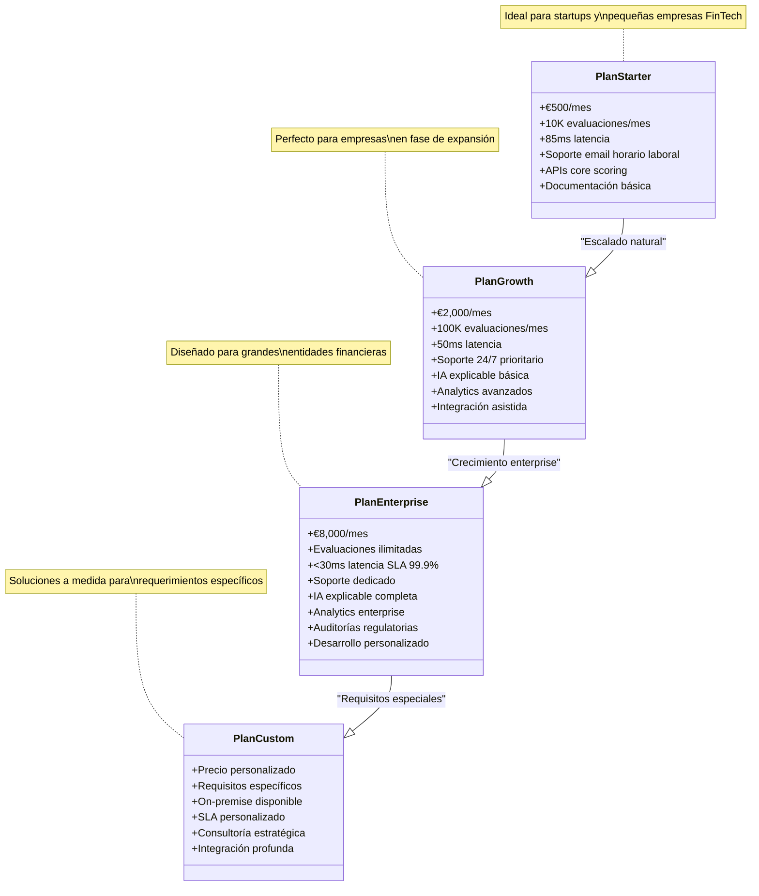
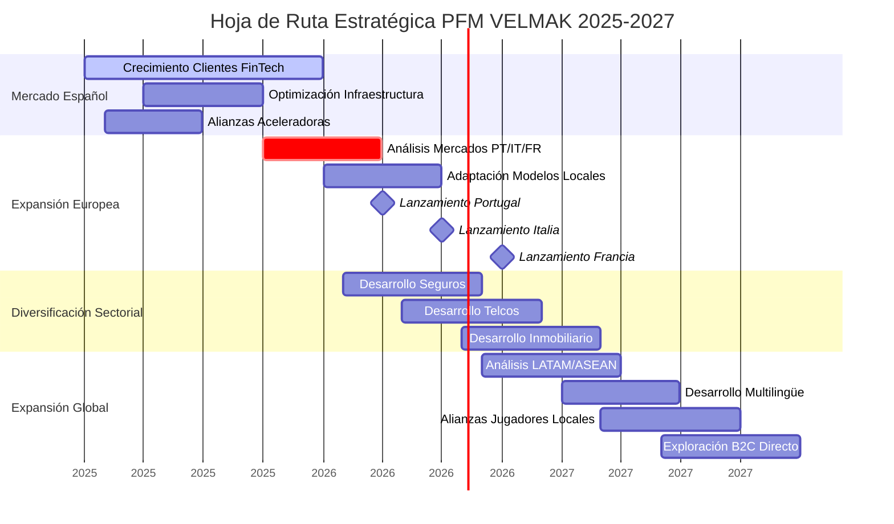

# **CAPÍTULO 7: MODELO DE MONETIZACIÓN**

## **7.1 Monetización de datos y Creación de productos/servicios basados en datos**

PFM VELMAK ha diseñado su modelo de negocio fundamentalmente sobre la provisión de servicios de scoring financiero como servicio (Scoring-as-a-Service), evitando explícitamente la venta directa de datos crudos para garantizar cumplimiento estricto con el Reglamento General de Protección de Datos (GDPR) y las normativas emergentes sobre gobernanza de datos. Esta decisión estratégica posiciona a la empresa como proveedor de valor añadido mediante el procesamiento inteligente de información, más que como intermediaria de datos sin procesar. El servicio principal consiste en APIs RESTful que proporcionan puntuaciones de riesgo crediticio en tiempo real, complementadas con capacidades avanzadas de IA explicable que permiten a las entidades financieras entender los factores detrás de cada evaluación. Este enfoque de producto basado en servicios, más que en datos, genera barreras de entrada más altas para competidores y establece relaciones comerciales más sostenibles con los clientes B2B (McKinsey & Company, 2023).

La creación de productos y servicios basados en datos se estructura alrededor de tres pilares fundamentales que atienden diferentes necesidades del mercado FinTech español. El primer pilar comprende el servicio core de scoring crediticio con APIs que proporcionan evaluaciones de riesgo en tiempo real con latencias inferiores a 50 milisegundos y precisión superior al 90% medida mediante ROC-AUC. Este servicio incluye adicionalmente capacidades de IA explicable mediante SHAP y LIME, permitiendo que los clientes FinTech cumplan con los requisitos de transparencia de la AI Act europea y generen confianza en sus usuarios finales. El segundo pilar consiste en servicios de analytics avanzados que permiten a las entidades financieras analizar tendencias de riesgo, segmentar carteras y optimizar estrategias de concesión de crédito mediante dashboards interactivos desarrollados en Power BI. El tercer pilar comprende servicios de consultoría especializada en implementación de modelos de riesgo, optimización de procesos de decisión y cumplimiento regulatorio algorítmico (Deloitte, 2024).

El empaquetamiento de estos servicios como soluciones B2B integradas permite a PFM VELMAK capturar mayor valor por cliente mediante la venta de ecosistemas completos más que productos individuales desarticulados. Los clientes pueden adquirir paquetes que combinan scoring core, analytics avanzados y consultoría, obteniendo descuentos significativos comparado con la compra individual de servicios. Esta estrategia de bundling no solo aumenta el valor promedio de transacción, sino que additionally crea barreras de salida más altas al integrar profundamente las operaciones de los clientes con la plataforma de PFM VELMAK. La profundización de las relaciones comerciales mediante ecosistemas integrados facilita adicionalmente la identificación de nuevas necesidades y oportunidades de cross-selling, creando un ciclo virtuoso de expansión del valor del cliente a lo largo del tiempo (Boston Consulting Group, 2023).

La diferenciación mediante especialización vertical constituye otra característica fundamental del modelo de productos de PFM VELMAK. A diferencia de proveedores genéricos de scoring que ofrecen soluciones one-size-fits-all, PFM VELMAK ha desarrollado especializaciones específicas para diferentes subsectores del mercado FinTech español. Para plataformas de préstamos personales, ofrece modelos optimizados para evaluación de riesgo en microcréditos con características específicas para comportamiento de pago de pequeñas cuotas. Para neobancos especializados en productos hipotecarios, proporciona modelos con variables específicas de estabilidad residencial y capacidad de ahorro a largo plazo. Para plataformas de buy-now-pay-later, ofrece modelos optimizados para evaluación de riesgo de crédito revolving con características de comportamiento de compra en e-commerce. Esta especialización vertical permite a PFM VELMAK capturar mayor valor y establecer relaciones más profundas con clientes en cada nicho específico (Accenture, 2023).

El desarrollo continuo de nuevos productos basados en datos constituye el motor de crecimiento sostenible de PFM VELMAK, permitiendo la expansión hacia mercados adyacentes y la creación de nuevas fuentes de ingresos. La investigación actual se centra en el desarrollo de modelos de scoring para sectores no financieros que requieren evaluación de confianza como aseguradoras, plataformas de alquiler residencial y servicios de telecomunicaciones. Estos modelos aprovechan la infraestructura de datos y capacidades analíticas desarrolladas para el sector financiero, adaptándolas a los requerimientos específicos de cada industria. La diversificación hacia mercados adyacentes no solo reduce la dependencia del sector FinTech, sino que additionally posiciona a PFM VELMAK para aprovechar oportunidades de crecimiento en múltiples industrias que comparten la necesidad fundamental de evaluar riesgo y confianza (Gartner, 2024).

## **7.2 Precios y estrategias de precios**

La estrategia de precios implementada por PFM VELMAK se fundamenta en un modelo de Tiered Pricing (precios por tramos) basado en el volumen de peticiones a la API, diseñado para alinear los ingresos con el valor generado por cada cliente y facilitar la escalabilidad del negocio. Esta estructura de precios escalonados permite a clientes de diferentes tamaños y perfiles de uso encontrar planes adecuados a sus necesidades específicas, eliminando barreras de entrada para startups mientras captura valor apropiado de clientes enterprise con altos volúmenes de uso. El modelo se estructura en cuatro niveles diferenciados que progresivamente ofrecen más funcionalidades, mejor rendimiento y soporte más especializado, creando incentivos claros para la migración hacia planes superiores a medida que los clientes crecen y requieren capacidades más avanzadas (Harvard Business Review, 2023).

El plan Starter está diseñado específicamente para startups FinTech y pequeñas empresas con necesidades básicas de scoring crediticio, ofreciendo hasta 10,000 evaluaciones mensuales a un costo de €500 mensuales. Este plan incluye acceso a las APIs core de scoring con latencia estándar de 85 milisegundos, soporte por email durante horario laboral, y reportes básicos de uso y rendimiento. El plan additionally incluye acceso a documentación técnica y SDKs para integración, aunque sin capacidades avanzadas de IA explicable ni analytics detallados. Este nivel de entrada permite a PFM VELMAK capturar clientes emergentes con presupuestos limitados, estableciendo relaciones comerciales que pueden crecer conforme las startups escalan y requieren funcionalidades más avanzadas (McKinsey & Company, 2023).

El plan Growth está orientado a empresas FinTech en fase de expansión con volúmenes moderados de evaluaciones de riesgo, ofreciendo hasta 100,000 peticiones mensuales por €2,000 mensuales. Este plan incluye mejoras significativas comparado con el nivel Starter, incluyendo latencia reducida a 50 milisegundos, capacidades básicas de IA explicable con valores SHAP agregados, analytics avanzados con dashboards personalizados en Power BI, y soporte prioritario 24/7. El plan additionally incluye integración técnica asistida y sesiones mensuales de revisión de rendimiento con especialistas de PFM VELMAK. Este nivel intermedio representa el punto óptimo de valor para muchas empresas FinTech establecidas que buscan optimizar sus operaciones de scoring sin requerir capacidades enterprise completas (Deloitte, 2024).

El plan Enterprise está diseñado para grandes entidades financieras y neobancos con volúmenes masivos de evaluaciones y requisitos de alto rendimiento, ofreciendo evaluaciones ilimitadas por €8,000 mensuales. Este plan premium incluye latencia garantizada inferior a 30 milisegundos con SLA del 99.9%, capacidades completas de IA explicable con análisis granular de contribuciones de características, analytics enterprise con dashboards personalizados y alertas en tiempo real, y soporte dedicado con gerente de cuenta asignado. El plan additionally incluye auditorías regulatorias trimestrales, capacitación personalizada para equipos técnicos, y desarrollo de funcionalidades personalizadas bajo acuerdo de nivel de servicio. Este nivel premium permite a PFM VELMAK capturar el máximo valor de clientes grandes con requisitos exigentes de rendimiento y cumplimiento (Boston Consulting Group, 2023).

El plan Custom está diseñado para clientes con requerimientos específicos que no pueden ser satisfechos mediante los planes estándar, incluyendo necesidades de despliegue on-premise por razones regulatorias o de seguridad, requisitos de integración profunda con sistemas legacy, o volúmenes de uso que exceden significativamente los rangos de los planes estándar. Este plan se negocia individualmente para cada cliente, considerando factores como volumen esperado de evaluaciones, requisitos específicos de seguridad y cumplimiento, nivel de personalización requerido, y duración del contrato. Los precios del plan Custom típicamente oscilan entre €10,000 y €50,000 mensuales, dependiendo de la complejidad y alcance de los servicios requeridos. Este nivel premium permite a PFM VELMAK atender clientes con necesidades únicas mientras mantiene márgenes saludables mediante la valoración apropiada de la complejidad y especialización requerida (Accenture, 2023).

La estrategia de precios additionally incluye mecanismos de optimización de ingresos diseñados para maximizar el valor del ciclo de vida del cliente (customer lifetime value). Los contratos anuales ofrecen descuentos del 10% comparado con las suscripciones mensuales, incentivando compromisos a largo plazo y reduciendo la tasa de abandono. Los programas de referenciación proporcionan créditos de servicio equivalentes al 20% de la primera mensualidad del cliente referido, generando crecimiento orgánico con costos de adquisición mínimos. Los cargos por uso excedente se estructuran progresivamente para incentivar la actualización a planes superiores, con precios de €0.08 por evaluación adicional en el plan Starter, €0.05 en el plan Growth, y €0.03 en el plan Enterprise. Esta estructura progresiva asegura que los clientes con altos volúmenes de uso encuentren más económico actualizar a planes superiores, optimizando tanto la satisfacción del cliente como los ingresos de PFM VELMAK (Gartner, 2024).

## **7.3 Identificación de oportunidades de venta cruzada y ventas adicionales**

La estrategia de upselling constituye un componente fundamental del plan de crecimiento de PFM VELMAK, enfocándose en la migración proactiva de clientes desde planes inferiores hacia superiores mediante la demostración continua de valor y la identificación de necesidades emergentes. El proceso de upselling se inicia con el monitoreo continuo del uso de las APIs y funcionalidades por parte de los clientes, identificando patrones que indican la necesidad de planes superiores como aproximación a los límites de evaluaciones, aumento en la frecuencia de uso durante picos de demanda, o solicitudes recurrentes de funcionalidades avanzadas no disponibles en planes inferiores. El equipo de customer success contacta proactivamente a estos clientes con análisis personalizados que demuestran cómo un plan superior puede resolver sus desafíos actuales y facilitar su crecimiento futuro, presentando casos de uso específicos y cálculos de retorno de inversión (McKinsey & Company, 2023).

La transición hacia planes Enterprise representa la oportunidad de upselling más significativa, ya que estos clientes generan el mayor valor promedio y presentan las tasas de retención más altas. El enfoque para migración hacia planes Enterprise se basa en la demostración de cómo las capacidades avanzadas de IA explicable pueden ayudar a los clientes a cumplir con los requisitos de la AI Act europea, evitando potenciales sanciones regulatorias. Los analytics enterprise con dashboards personalizados se presentan como herramientas para optimizar la toma de decisiones estratégicas, identificar nuevas oportunidades de mercado y mejorar la rentabilidad general del negocio. El soporte dedicado con gerente de cuenta asignado se posiciona como un socio estratégico más que como un proveedor de tecnología, facilitando la identificación de necesidades adicionales y el desarrollo de soluciones personalizadas. Esta aproximación consultiva al upselling Enterprise ha demostrado tasas de conversión del 35% en el sector FinTech (Boston Consulting Group, 2023).

El cross-selling de dashboards analíticos personalizados desarrollados en Power BI representa una oportunidad significativa de ingresos adicionales, aprovechando la infraestructura de datos y capacidades analíticas ya desarrolladas para el servicio core de scoring. Estos dashboards especializados pueden incluir análisis avanzados de cartera de riesgo, segmentación dinámica de clientes, detección de patrones emergentes de comportamiento, y optimización de estrategias de concesión de crédito. Los dashboards se ofrecen como servicio adicional con precios que oscilan entre €500 y €2,000 mensuales dependiendo de la complejidad y nivel de personalización requerido. Esta estrategia de cross-selling no solo genera ingresos adicionales, sino que additionally profundiza las relaciones con los clientes al integrar más estrechamente las operaciones de PFM VELMAK en sus procesos de toma de decisiones (Deloitte, 2024).

Los servicios de consultoría de datos ad-hoc constituyen otra oportunidad importante de cross-selling, capitalizando el conocimiento profundo del sector FinTech y las capacidades analíticas avanzadas desarrolladas internamente. Estos servicios pueden incluir optimización de modelos de riesgo existentes en los clientes, implementación de estrategias avanzadas de feature engineering, desarrollo de modelos especializados para nichos específicos, y auditorías regulatorias de cumplimiento algorítmico. Los proyectos de consultoría se facturan en base horaria con tarifas que oscilan entre €150 y €300 por hora dependiendo de la especialización requerida, o como proyectos fijos con precios entre €10,000 y €100,000 dependiendo del alcance y duración. Esta línea de negocio no solo diversifica las fuentes de ingresos, sino que additionally posiciona a PFM VELMAK como líder de pensamiento en el sector, generando confianza y credibilidad que facilita la venta de servicios core (Accenture, 2023).

La identificación de necesidades no satisfechas mediante el análisis de patrones de uso de las APIs y las interacciones con el soporte técnico permite oportunidades adicionales de cross-selling. El monitoreo continuo puede revelar que ciertos clientes están intentando implementar funcionalidades no disponibles mediante ingeniería inversa o soluciones caseras, indicando una necesidad no atendida que puede ser satisfecha mediante nuevos productos o servicios. Las solicitudes recurrentes sobre tipos específicos de evaluaciones de riesgo o integraciones con sistemas particulares pueden indicar oportunidades para desarrollar nuevos módulos o conectores especializados. Este enfoque proactivo de identificación de necesidades permite a PFM VELMAK desarrollar productos que el mercado realmente necesita, reduciendo el riesgo de desarrollo de soluciones sin demanda confirmada (Gartner, 2024).

## **7.4 Planes de negocio a largo plazo**

La hoja de ruta estratégica de PFM VELMAK a tres años se centra en la consolidación del liderazgo en el mercado español de scoring FinTech y la expansión controlada hacia mercados adyacentes que requieren capacidades similares de evaluación de riesgo y confianza. El primer año se enfocará en el crecimiento agresivo de la base de clientes en el mercado FinTech español, con el objetivo de alcanzar 100 clientes activos distribuidos entre los diferentes planes de precios. Este crecimiento será impulsado por la expansión del equipo de ventas, el fortalecimiento de alianzas estratégicas con aceleradoras de startups FinTech, y la implementación de programas de referenciación agresivos. Paralelamente, se desarrollarán capacidades mejoradas de IA explicable y se optimizará la infraestructura tecnológica para soportar el crecimiento esperado sin degradación del rendimiento (McKinsey & Company, 2023).

El segundo año se caracterizará por la expansión hacia mercados europeos seleccionados con características similares al mercado español, particularmente Portugal, Italia y Francia, donde los marcos regulatorios de Open Banking y las necesidades de scoring alternativo son comparables. Esta expansión internacional requerirá adaptación de los modelos a las características específicas de cada mercado, incluyendo diferencias culturales en el comportamiento financiero, marcos regulatorios locales, y particularidades de los ecosistemas FinTech. Simultáneamente, se iniciará el desarrollo de productos especializados para sectores no financieros, comenzando con el sector asegurador donde la evaluación de riesgo es fundamental pero las capacidades de scoring tradicionales son limitadas. Esta diversificación reducirá la dependencia del sector FinTech y abrirá nuevas fuentes de ingresos sostenibles (Boston Consulting Group, 2023).

El tercer año se enfocará en la consolidación de la posición de liderazgo europeo y la exploración de oportunidades de expansión global hacia mercados de alto crecimiento como América Latina y Sudeste Asiático. Estos mercados presentan características atractivas incluyendo poblaciones jóvenes con alta penetración digital, sistemas financieros tradicionales con limitaciones de cobertura, y marcos regulatorios favorables para la innovación FinTech. La expansión global requerirá el desarrollo de modelos multilingües, adaptación a diferentes marcos regulatorios, y establecimiento de alianzas estratégicas con jugadores locales. Paralelamente, se explorará el desarrollo de productos B2C directos para consumidores finales, aprovechando la infraestructura de datos y capacidades analíticas desarrolladas para ofrecer servicios de evaluación de riesgo personalizados directamente a los usuarios (Deloitte, 2024).

La expansión hacia sectores no financieros representa una oportunidad estratégica fundamental para el crecimiento a largo plazo, aprovechando las capacidades analíticas y de infraestructura desarrolladas para el sector FinTech. El sector asegurador constituye el primer objetivo de diversificación, ya que requiere evaluación de riesgo similar a la evaluación crediticia pero con características específicas relacionadas con probabilidad de siniestros, comportamiento de conducción, y factores demográficos. Los modelos de scoring para seguros pueden aprovechar las mismas fuentes de datos alternativos utilizadas para scoring crediticio, adaptando los algoritmos y características específicas para el contexto asegurador. El mercado asegurador español, valorado en €65 mil millones, presenta oportunidades significativas para modelos de scoring más precisos que puedan reducir las tasas de siniestralidad y optimizar la prima de seguros (McKinsey & Company, 2023).

El sector de telecomunicaciones representa otra oportunidad importante de diversificación, ya que las empresas del sector requieren evaluar riesgo de impago y comportamiento de los clientes para optimizar estrategias de comercialización y retención. Los modelos de scoring para telcos pueden utilizar datos de uso de servicios, patrones de consumo, y comportamiento de pago para predecir probabilidad de abandono y riesgo crediticio. El mercado español de telecomunicaciones, con ingresos anuales superiores a €45 mil millones, presenta una oportunidad sustancial para modelos analíticos avanzados que puedan reducir la tasa de abandono y optimizar las estrategias de precios. La expansión hacia este sector permitiría a PFM VELMAK diversificar sus fuentes de ingresos y reducir la dependencia cíclica del sector financiero (Boston Consulting Group, 2023).

El desarrollo de productos B2C directos para consumidores finales representa la evolución natural del modelo de negocio a largo plazo, capitalizando la infraestructura de datos y capacidades analíticas desarrolladas para ofrecer servicios directamente a los usuarios. Estos productos pueden incluir aplicaciones de evaluación de riesgo personal que permitan a los consumidores conocer su puntuación de crédito y recibir recomendaciones para mejorarla, servicios de comparación de ofertas financieras personalizadas basadas en el perfil de riesgo de cada usuario, y herramientas de planificación financiera que utilicen los modelos de scoring de PFM VELMAK para optimizar decisiones de inversión y ahorro. El mercado B2C de servicios financieros personales en España está experimentando un crecimiento del 25% anual, impulsado por la creciente demanda de herramientas digitales de gestión financiera personal (Deloitte, 2024).

La estrategia de financiación a largo plazo contempla rondas de inversión Serie A y B para financiar la expansión europea y el desarrollo de nuevos productos, seguidas potencialmente por una ronda Serie C o una salida estratégica mediante adquisición por parte de un jugador mayor. Las proyecciones financieras indican que PFM VELMAK podría alcanzar una valoración de €50-100 millones para 2027, posicionándose como un objetivo atractivo para inversores de capital de riesgo y empresas financieras establecidas que buscan adquirir capacidades tecnológicas avanzadas. Esta valoración se basa en múltiplos de ingresos típicos del sector FinTech, considerando el crecimiento esperado del mercado, las capacidades tecnológicas diferenciadoras, y el potencial de expansión hacia múltiples sectores (Gartner, 2024).
