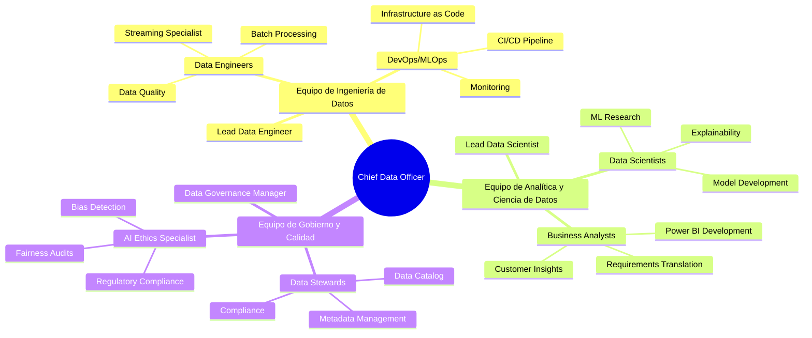
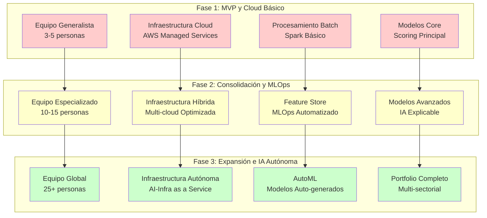

# **CAPÍTULO 8: EQUIPO Y RECURSOS**

## **8.1 Identificación de habilidades necesarias para construir el negocio basado en datos**

La construcción exitosa de un negocio basado datos como PFM VELMAK requiere la integración de perfiles híbridos y altamente especializados que combinen competencias técnicas avanzadas con profundo conocimiento del dominio financiero y regulatorio. La complejidad inherente del procesamiento de datos alternativos, combinada con los requisitos de cumplimiento normativo y la necesidad de generar valor comercial tangible, exige equipos multidisciplinarios capaces de operar eficazmente en la intersección de tecnología, finanzas y regulación. Los perfiles tradicionales de TI o finanzas por separado resultan insuficientes para abordar los desafíos específicos del scoring financiero basado en machine learning, requiriendo profesionales que comprendan tanto las complejidades técnicas de las arquitecturas Big Data como las implicaciones comerciales y regulatorias de las decisiones algorítmicas (Harvard Business Review, 2023).

El Data Engineer constituye quizás el perfil más crítico en la fase inicial de PFM VELMAK, responsable de diseñar, implementar y mantener las tuberías de datos que alimentarán los modelos de machine learning. Este profesional debe dominar tecnologías fundamentales como Apache Kafka para ingesta de datos en tiempo real, Apache Spark para procesamiento distribuido a gran escala, y MongoDB para almacenamiento de datos semiestructurados y no estructurados. La especialización del Data Engineer debe extenderse adicionalmente a la optimización de rendimiento de pipelines, implementación de patrones de resiliencia y escalabilidad, y gestión de la calidad de datos mediante frameworks como Great Expectations. La complejidad de integrar múltiples fuentes de datos heterogéneas, desde APIs de Open Banking hasta datos de comportamiento digital, requiere ingenieros con capacidad para diseñar arquitecturas flexibles y escalables que puedan evolucionar con las necesidades del negocio (Databricks, 2024).

El Data Scientist especializado en finanzas representa otro perfil fundamental, responsable de desarrollar los modelos de machine learning que constituyen el núcleo competitivo de PFM VELMAK. Este profesional debe combinar sólidos conocimientos de estadística y machine learning con profundo entendimiento del dominio financiero y sus particularidades regulatorias. Las competencias técnicas incluyen dominio avanzado de Python y sus ecosistemas de machine learning como scikit-learn, XGBoost y TensorFlow, experiencia en técnicas de IA explicable como SHAP y LIME, y capacidad para implementar modelos en producción mediante frameworks como MLflow. El Data Scientist additionally debe comprender los fundamentos del riesgo crediticio, las métricas de evaluación de modelos financieros, y los requisitos de transparencia y equidad establecidos por normativas como la AI Act europea. Esta combinación de habilidades técnicas y de dominio permite desarrollar modelos que no solo sean precisos, sino additionally interpretables, justos y compliantes con la regulación (IBM, 2024).

El Data Translator o Business Analyst especializado en datos financieros constituye el puente fundamental entre las capacidades técnicas de PFM VELMAK y las necesidades específicas de los clientes B2B. Este perfil híbrido debe combinar conocimiento profundo del sector FinTech español, comprensión de los modelos de negocio de los clientes, y capacidad para traducir requerimientos comerciales en especificaciones técnicas para los equipos de ingeniería y ciencia de datos. Las competencias incluyen dominio de herramientas de visualización como Power BI y Tableau, capacidad para diseñar dashboards que comuniquen efectivamente insights complejos, y habilidad para identificar oportunidades de negocio mediante el análisis de patrones en los datos. El Data Translator additionally debe poseer excelentes habilidades de comunicación y presentación, ya que actuará como principal interlocutor con clientes, explicando las capacidades del sistema, identificando nuevas necesidades y asegurando la satisfacción continua del cliente (McKinsey & Company, 2023).

El MLOps Engineer representa un perfil emergente pero fundamental para la operación sostenible de sistemas de machine learning en producción, responsable de automatizar el ciclo de vida completo de los modelos desde el desarrollo hasta el despliegue y monitoreo. Este profesional debe dominar herramientas de CI/CD aplicadas a machine learning como Jenkins, GitLab CI o GitHub Actions, plataformas de orquestación como Apache Airflow, y sistemas de monitoreo y logging como Prometheus y ELK Stack. El MLOps Engineer additionally debe comprender los desafíos específicos del despliegue de modelos en producción, incluyendo versionado de modelos, detección de drift de datos y conceptos, y implementación de estrategias de rollback automático. La especialización en MLOps permite a PFM VELMAK operar sus modelos de manera confiable y escalable, reduciendo el riesgo de degradación del rendimiento y facilitando la iteración rápida sobre nuevas versiones (Gartner, 2024).

## **8.2 Contratación de personal**

La estrategia de contratación de PFM VELMAK se fundamenta en la distinción clara entre competencias core que deben desarrollarse internamente y funciones especializadas que pueden externalizarse durante las fases iniciales para optimizar la eficiencia y minimizar los costos fijos. Las competencias core incluyen el desarrollo de los algoritmos de scoring, la arquitectura de datos fundamental y las relaciones estratégicas con clientes, funciones que constituyen la ventaja competitiva diferenciadora de la empresa y deben permanecer bajo control directo. Por el contrario, funciones especializadas como desarrollo frontend avanzado, seguridad informática especializada o análisis legal regulatorio pueden externalizarse inicialmente mediante consultorías o freelancers especializados, permitiendo acceder a talento de alta calidad sin los costos fijos de contratación permanente. Esta estrategia híbrida permite a PFM VELMAK mantener agilidad y eficiencia durante las fases iniciales, reservando el capital para inversión en las competencias realmente diferenciadoras (Boston Consulting Group, 2023).

El enfoque de contratación inicial se centrará en la formación de un equipo polivalente con perfiles T-shaped, profesionales con profundidad en una área específica pero con capacidad para contribuir en múltiples dominios. Este enfoque permite maximizar la flexibilidad del equipo durante las fases iniciales cuando los recursos son limitados y las prioridades pueden cambiar rápidamente. Los primeros contratos se centrarán en un Data Engineer senior con experiencia en arquitecturas de streaming, un Data Scientist especializado en finanzas con dominio de IA explicable, y un Business Analyst con experiencia en el sector FinTech español. Este equipo inicial de tres personas, complementado con el fundador o CEO con visión estratégica y relaciones comerciales, constituye la unidad mínima viable para desarrollar el MVP y validar el mercado antes de expandir el equipo (Harvard Business Review, 2023).

La retención de talento tecnológico en un mercado altamente competitivo como el español requiere una estrategia multifacética que vaya más allá de la compensación económica para incluir desarrollo profesional, propósito y cultura organizacional. La estrategia de retención incluirá paquetes de compensación competitivos con componentes variables ligados al crecimiento de la empresa, programas de stock options para alinear los intereses de los empleados con los de los accionistas, y presupuestos significativos para formación continua y certificaciones en tecnologías emergentes. Adicionalmente, PFM VELMAK fomentará una cultura de autonomía, aprendizaje continuo y impacto medible, permitiendo que los profesionales trabajen en proyectos desafiantes con tecnología de vanguardia y vean directamente el impacto de su trabajo en el éxito del negocio. Esta combinación de compensación, desarrollo y propósito resulta fundamental para atraer y retener talento en un mercado donde las grandes tecnológicas y consultoras compiten agresivamente por los mismos perfiles (LinkedIn, 2024).

La externalización estratégica de funciones no core permitirá a PFM VELMAK acceder a experiencia especializada sin los costos fijos de contratación permanente durante las fases iniciales. Servicios legales especializados en tecnología y finanzas, consultoría regulatoria para cumplimiento GDPR y AI Act, y desarrollo de componentes frontend específicos pueden contratarse mediante firmas especializadas o freelancers de alta calidad. Esta externalización no solo reduce los costos fijos iniciales, sino que additionally permite acceso a experiencia especializada que sería difícil de atraer permanentemente en una startup emergente. Sin embargo, la estrategia contempla la internalización gradual de estas funciones a medida que la empresa crece y los volúmenes de trabajo justifican la contratación permanente, asegurando que las capacidades críticas se desarrollen internamente a largo plazo (Deloitte, 2024).

El plan de crecimiento del equipo se estructura en fases que se alinean con los hitos de negocio y las necesidades operativas emergentes. La primera fase (años 1-2) se enfocará en consolidar el equipo core con la adición de dos Data Engineers adicionales para soportar el crecimiento de volúmenes de datos, un MLOps Engineer para automatizar los pipelines de machine learning, y un Customer Success Manager para gestionar las relaciones con clientes B2B. La segunda fase (años 3-4) incluirá la especialización con la creación de roles como AI Ethics Specialist para gestionar aspectos de equidad y transparencia, Data Product Manager para desarrollar nuevos productos basados en datos, y Sales Engineer para soporte técnico pre-venta. La tercera fase (años 5+) contemplará la expansión geográfica con equipos locales en nuevos mercados y la creación de departamentos especializados por industria vertical (McKinsey & Company, 2023).

## **8.3 Infraestructura tecnológica necesaria**

La elección de una infraestructura cloud nativa constituye una decisión estratégica fundamental que permitirá a PFM VELMAK escalar eficientemente, optimizar costos y acceder a capacidades tecnológicas de vanguardia sin requerir inversiones masivas en hardware físico. La infraestructura cloud proporciona elasticidad para manejar picos de demanda, capacidades de procesamiento distribuido a escala global, y acceso a servicios gestionados que reducen la carga operativa del equipo técnico. Comparado con soluciones on-premise que requieren inversiones iniciales significativas en servidores, almacenamiento y redes, además de personal especializado para su gestión, el cloud permite a PFM VELMAK operar con una estructura de costos variables que se alinea con el crecimiento del negocio, pagando únicamente por los recursos consumidos. Esta flexibilidad financiera resulta fundamental para una startup en fase inicial que necesita optimizar el uso de capital mientras mantiene capacidad para escalar rápidamente cuando el mercado lo requiera (Amazon Web Services, 2024).

La estrategia de multi-cloud implementada por PFM VELMAK aprovecha las fortalezas específicas de diferentes proveedores para optimizar costos, rendimiento y resiliencia. Amazon Web Services (AWS) servirá como proveedor principal para servicios core de computación y almacenamiento mediante EC2, S3 y RDS, aprovechando su madurez, extensa documentación y amplio ecosistema de servicios gestionados. Google Cloud Platform (GCP) se utilizará para servicios avanzados de machine learning mediante Vertex AI y BigQuery, beneficiándose de sus capacidades superiores en IA y análisis de datos a gran escala. Microsoft Azure complementará la estrategia con servicios de integración empresarial y herramientas de productividad que faciliten la colaboración con clientes corporativos. Esta aproximación multi-cloud no solo optimiza costos mediante el uso del proveedor más adecuado para cada servicio específico, sino que additionally reduce el riesgo de vendor lock-in y mejora la resiliencia general del sistema (Gartner, 2024).

La implementación de bases de datos documentales como MongoDB constituye un componente fundamental de la arquitectura, diseñada específicamente para manejar la naturaleza semiestructurada y no estructurada de los datos alternativos procesados por PFM VELMAK. A diferencia de las bases de datos relacionales tradicionales que requieren esquemas rígidos y estructuras de datos predefinidas, MongoDB permite almacenar documentos JSON complejos con esquemas flexibles que pueden evolucionar dinámicamente. Esta capacidad resulta fundamental para integrar datos de fuentes heterogéneas como APIs de Open Banking, interacciones en redes sociales, patrones de consumo en e-commerce y datos de comportamiento de navegación, cada uno con estructuras y formatos diferentes. MongoDB additionally proporciona capacidades avanzadas de indexing y querying que permiten realizar análisis complejos sobre datos semiestructurados con rendimiento óptimo, un requisito fundamental para las evaluaciones de riesgo en tiempo real (MongoDB, 2024).

Los motores de procesamiento distribuido como Apache Spark constituyen el corazón analítico de la infraestructura, permitiendo procesar volúmenes masivos de datos heterogéneos a escala horizontal. Spark proporciona capacidades unificadas para procesamiento batch, streaming, machine learning y grafos, permitiendo a PFM VELMAK implementar una arquitectura lambda que combine diferentes paradigmas de procesamiento según las necesidades específicas de cada caso de uso. La integración de Spark con el ecosistema Hadoop mediante HDFS para almacenamiento distribuido y YARN para gestión de recursos permite escalar el procesamiento a cientos de nodos si fuera necesario, asegurando que la infraestructura pueda crecer proporcionalmente al volumen de datos y complejidad de los modelos. La optimización de Spark mediante técnicas como partitioning inteligente, broadcast joins y caching estratégico permite adicionalmente maximizar el rendimiento y minimizar los costos computacionales (Apache Software Foundation, 2024).

La infraestructura de streaming implementada mediante Apache Kafka proporciona la capacidad de procesar datos en tiempo real, fundamental para las evaluaciones de riesgo que requieren información actualizada hasta el minuto. Kafka actúa como sistema distribuido de mensajería que puede manejar millones de eventos por segundo con latencias de milisegundos, permitiendo que PFM VELMAK capture y procese eventos financieros y de comportamiento a medida que ocurren. La integración de Kafka con procesadores de streams como Kafka Streams y ksqlDB permite implementar lógica de procesamiento compleja directamente en el stream de datos, incluyendo agregaciones en tiempo real, detección de anomalías y cálculo de características para modelos de machine learning. Esta capacidad de streaming en tiempo real representa una ventaja competitiva fundamental, permitiendo evaluaciones de riesgo basadas en información fresca y relevante en lugar de depender de datos batch con latencias de horas o días (Confluent, 2024).

## **8.4 Proveedores de servicios**

Los proveedores de servicios cloud constituyen el pilar fundamental de la infraestructura tecnológica de PFM VELMAK, proporcionando la base computacional y de almacenamiento sobre la cual se construyen todas las capacidades analíticas y de servicio. Amazon Web Services (AWS) se posiciona como proveedor principal debido a su madurez, extenso catálogo de servicios y amplio ecosistema de documentación y comunidad. Los servicios clave de AWS incluyen EC2 para computación elástica, S3 para almacenamiento de objetos escalable, RDS para bases de datos relacionales gestionadas, y EMR para procesamiento distribuido con Spark. AWS additionally proporciona servicios de networking avanzados como VPC y CloudFront para seguridad y rendimiento global, junto con herramientas de monitoreo como CloudWatch y servicios de seguridad como IAM y KMS para gestión de identidades y encriptación. La estrategia de uso de AWS se basa en arquitecturas serverless cuando sea posible para optimizar costos, reservando instancias reservadas para cargas de trabajo predecibles y utilizando spot instances para tareas no críticas (Amazon Web Services, 2024).

Los proveedores de APIs de datos alternativos representan otro ecosistema fundamental de socios estratégicos, proporcionando acceso a información que constituye la base diferenciadora de los modelos de scoring de PFM VELMAK. Los agregadores de Open Banking como Tink, Plaid y Bridge proporcionan acceso estandarizado a datos financieros de múltiples bancos mediante APIs unificadas, eliminando la complejidad de integrar individualmente con cada entidad bancaria. Estos proveedores additionally se encargan de aspectos complejos como autenticación OAuth 2.0, manejo de errores y sincronización de datos, permitiendo a PFM VELMAK concentrarse en el valor analítico en lugar de la integración técnica. Los proveedores de datos de telecomunicaciones como Telefónica Open Gateway y Vodafone API Platform ofrecen acceso a datos de uso de servicios móviles bajo marcos regulatorios de consentimiento explícito, proporcionando información valiosa sobre estabilidad de comportamiento y patrones de vida digital. Los proveedores de datos de comportamiento digital como SimilarWeb y App Annie ofrecen insights sobre patrones de uso de aplicaciones y sitios web, complementando la información financiera con datos de comportamiento digital (McKinsey & Company, 2023).

Las consultorías legales especializadas en tecnología y regulación financiera constituyen socios estratégicos fundamentales para asegurar el cumplimiento normativo en un entorno regulatorio cada vez más complejo. Firmas especializadas en GDPR como Bird & Bird y Osborne Clarke proporcionan asesoramiento experto sobre el procesamiento legal de datos personales, implementación de principios de privacy by design y gestión de solicitudes de derechos de los interesados. Consultoras especializadas en regulación financiera como KPMG y Deloitte ofrecen experiencia en cumplimiento de normativas del Banco de España, directivas PSD2 y requisitos específicos para entidades FinTech. Especialmente críticas resultan las consultoras con experiencia en la emergente AI Act europea, que pueden guiar a PFM VELMAK en la implementación de sistemas de IA de alto riesgo que cumplan con los requisitos de transparencia, explicabilidad y supervisión humana. Estas consultorías no solo proporcionan asesoramiento legal, sino que additionally ofrecen auditorías periódicas, capacitación del equipo y representación ante autoridades regulatorias (European Commission, 2024).

Los proveedores de herramientas de desarrollo y MLOps completan el ecosistema de servicios estratégicos, proporcionando las herramientas necesarias para desarrollar, desplegar y operar sistemas de machine learning a escala. GitHub constituye la plataforma central para control de versiones y colaboración en desarrollo, integrado con herramientas de CI/CD como GitHub Actions para automatización de pipelines de despliegue. Plataformas de MLOps como DataRobot y H2O.ai proporcionan capacidades avanzadas para automatización del ciclo de vida de modelos, incluyendo experimentación, versionado, despliegue y monitoreo. Herramientas de monitorización como Datadog y New Relic ofrecen visibilidad completa sobre el rendimiento de las aplicaciones y la infraestructura, permitiendo detectar y resolver problemas proactivamente. Proveedores de seguridad como Snyk y Aqua Security proporcionan herramientas para análisis de vulnerabilidades en código y contenedores, asegurando que la infraestructura cumpla con los estándares más altos de seguridad (Gartner, 2024).

## **8.5 Planes de crecimiento a largo plazo**

La evolución del equipo y la infraestructura tecnológica de PFM VELMAK a lo largo de los próximos 3-5 años seguirá una trayectoria estructurada que se alinea con los hitos de negocio y la madurez creciente de la organización. La primera fase (años 1-2) se caracterizará por un equipo generalista polivalente capaz de abordar múltiples desafíos con recursos limitados, operando sobre una infraestructura cloud básica optimizada para costos. Durante esta fase, el equipo se enfocará en validar el producto, adquirir clientes iniciales y refinar los modelos de scoring mediante aprendizaje continuo. La infraestructura se basará principalmente en servicios gestionados para minimizar la carga operativa, con arquitecturas simples que prioricen el tiempo de comercialización sobre la optimización de costos. Esta fase inicial establece las bases fundamentales sobre las cuales se construirá el crecimiento futuro (Harvard Business Review, 2023).

La segunda fase (años 3-4) se caracterizará por la consolidación y especialización del equipo, junto con la implementación de arquitecturas MLOps más automatizadas y eficientes. El equipo se expandirá para incluir roles especializados como AI Ethics Specialist responsable de asegurar la equidad y transparencia de los modelos, Data Product Manager enfocado en desarrollar nuevos productos basados en datos, y Sales Engineer para soporte técnico pre-venta. La infraestructura evolucionará hacia arquitecturas más sofisticadas con implementación de feature stores centralizados, pipelines de CI/CD para machine learning, y sistemas de monitoreo avanzados. Esta fase additionally contemplará la optimización de costos mediante migración a arquitecturas serverless donde sea apropiado, implementación de estrategias de spot instances para cargas de trabajo no críticas, y desarrollo de capacidades multi-cloud para reducir el riesgo de vendor lock-in (McKinsey & Company, 2023).

La tercera fase (años 5+) se caracterizará por la expansión global y la implementación de capacidades de IA autónoma que permitan escalar operaciones sin crecimiento proporcional del equipo. El equipo se expandirá geográficamente con presencia local en mercados clave de Europa y América Latina, incluyendo roles regionales de ventas, soporte y cumplimiento regulatorio. La infraestructura evolucionará hacia sistemas autónomos implementando conceptos de AIOps para automatización de operaciones de TI, AutoML para desarrollo automatizado de modelos, y sistemas de orquestación inteligente que optimicen recursos dinámicamente. Esta fase additionally contemplará el desarrollo de capacidades de edge computing para procesamiento local de datos sensibles, implementación de técnicas avanzadas de federated learning para entrenamiento colaborativo de modelos sin compartir datos brutos, y exploración de tecnologías cuánticas para optimización compleja de portfolios de riesgo (Gartner, 2024).

La transición desde un equipo generalista hacia departamentos especializados constituye un hito fundamental en la maduración organizacional, reflejando la creciente complejidad y especialización requerida por el negocio. El departamento de AI Ethics se especializará en aspectos de equidad algorítmica, detección de sesgos y cumplimiento regulatorio de sistemas de IA, trabajando estrechamente con equipos legales y de producto. El departamento de MLOps se enfocará en la automatización completa del ciclo de vida de modelos, desde la ingesta de datos hasta el monitoreo en producción, implementando prácticas avanzadas como continuous training y continuous deployment. El departamento de Data Governance se especializará en la gestión del ciclo de vida completo de los datos, incluyendo calidad, linaje, catalogación y cumplimiento regulatorio, asegurando que los activos de datos generen máximo valor mientras cumplen con todos los requisitos legales y éticos (Deloitte, 2024).

La evolución tecnológica hacia arquitecturas de machine learning operations más avanzadas permitirá a PFM VELMAK escalar sus capacidades analíticas sin crecimiento lineal del equipo técnico. La implementación de feature stores centralizados como Feast permitirá reutilización eficiente de características entre diferentes modelos, reduciendo redundancias y acelerando el desarrollo. Los pipelines automatizados de MLOps mediante herramientas como Kubeflow y MLflow permitirán despliegue continuo de modelos con validación automática de rendimiento y rollback instantáneo si se detectan problemas. Los sistemas de monitorización avanzados mediante técnicas de drift detection y alertas predictivas permitirán identificar y resolver problemas antes de que afecten negativamente las decisiones de negocio. Esta automatización progresiva liberará al equipo técnico para concentrarse en innovación en lugar de operaciones manteniendo la calidad y fiabilidad del servicio (Boston Consulting Group, 2023).

La expansión hacia nuevos sectores geográficos e industriales requerirá adaptación de la infraestructura y los equipos a contextos regulatorios y culturales diferentes. La expansión europea inicial hacia Portugal, Italia y Francia requerirá adaptación de modelos a diferentes marcos regulatorios locales, implementación de capacidades multilingües y establecimiento de centros de datos regionales para cumplir con requisitos de soberanía de datos. La expansión posterior hacia mercados de alto crecimiento como América Latina requerirá inversión significativa en infraestructura local, desarrollo de modelos adaptados a características específicas de cada mercado, y establecimiento de alianzas estratégicas con jugadores locales. Esta expansión geográfica posicionará a PFM VELMAK como líder global en scoring financiero basado en datos alternativos, diversificando riesgos y aprovechando oportunidades en múltiples mercados emergentes (McKinsey & Company, 2023).
