# **CAPÍTULO 9: EVALUACIÓN DE LA EFECTIVIDAD DE LAS MEJORAS**

## **9.1 Descripción de los criterios de evaluación**

La evaluación comprehensiva de la efectividad de las mejoras implementadas en PFM VELMAK requiere un marco de evaluación dual que integre tanto métricas técnicas del modelo de datos como criterios de impacto de negocio, reconociendo que el éxito del proyecto depende simultáneamente de la calidad técnica de las soluciones y del valor tangible generado para los clientes y la organización. Este marco de evaluación se fundamenta en principios de medición objetiva, comparabilidad y relevancia, asegurando que cada criterio seleccionado contribuya directamente a la comprensión del impacto real de las mejoras implementadas. La evaluación técnica se centra en aspectos como precisión algorítmica, rendimiento operativo y calidad de datos, mientras que la evaluación de negocio mide impactos tangibles como reducción de morosidad, expansión de mercado y retorno de inversión, creando una visión completa del éxito del proyecto (Harvard Business Review, 2023).

Los criterios técnicos de evaluación del modelo de datos constituyen la base fundamental para asegurar que las mejoras implementadas generen resultados superiores desde una perspectiva puramente analítica. La precisión del algoritmo se mide mediante métricas estándar de machine learning como ROC-AUC (Receiver Operating Characteristic - Area Under Curve), que evalúa la capacidad del modelo para distinguir entre clases positivas y negativas, y F1-Score, que combina precisión y recall en una métrica balanceada particularmente útil cuando las clases están desbalanceadas como ocurre comúnmente en scoring crediticio. Adicionalmente, se implementan métricas específicas del dominio financiero como el KS statistic (Kolmogorov-Smirnov) para evaluar la capacidad discriminante del modelo, y el Brier score para medir la calibración de probabilidades, aspectos fundamentales para la toma de decisiones crediticias informadas (IBM, 2024).

La reducción de falsos negativos constituye otro criterio técnico fundamental, ya que estos errores representan oportunidades de negocio perdidas cuando solicitantes solventes son incorrectamente rechazados. La optimización del modelo para minimizar falsos negativos, manteniendo controlados los falsos positivos, se mide mediante la curva de precisión-recall y el análisis de puntos de corte optimizados según los objetivos específicos de cada cliente. La latencia de la API representa un criterio técnico crítico que impacta directamente la experiencia del usuario y la capacidad de los clientes para ofrecer servicios en tiempo real, midiendo el tiempo completo de respuesta desde la recepción de la solicitud hasta la entrega de la evaluación de riesgo. El objetivo de latencia se establece en menos de 50 milisegundos para el percentil 95, asegurando experiencia consistente incluso durante picos de demanda (McKinsey & Company, 2023).

La calidad del dato ingerido se evalúa mediante un conjunto de métricas comprehensivas que aseguran la fiabilidad de las decisiones algorítmicas. La completitud se mide como el porcentaje de campos requeridos presentes en cada registro, con objetivos superiores al 95% para variables críticas. La exactitud se evalúa mediante validaciones cruzadas con fuentes de referencia y detección de outliers mediante análisis estadístico y técnicas de machine learning. La actualidad se mide como la edad de los datos más recientes disponibles para cada evaluación, con objetivos de frescura inferiores a 24 horas para datos dinámicos y superiores a 30 días para datos estáticos. La consistencia se evalúa mediante la detección de contradicciones lógicas entre diferentes fuentes de datos, asegurando que la información presentada al modelo sea coherente y confiable (Gartner, 2024).

Los criterios de negocio complementan la evaluación técnica al medir el impacto tangible de las mejoras en los resultados operativos y financieros de PFM VELMAK y sus clientes. La reducción de la tasa de morosidad o NPL (Non-Performing Loans) constituye el indicador de negocio más relevante, midiendo la disminución porcentual en la tasa de impagos comparada con el modelo anterior. Esta métrica directamente impacta la rentabilidad de los clientes FinTech y constituye el principal argumento de valor de PFM VELMAK. El aumento de la tasa de aceptación de créditos para clientes previamente "invisibles" se mide como el porcentaje de solicitantes sin historial crediticio tradicional que son aprobados mediante el nuevo modelo, representando tanto una oportunidad de negocio como un impacto social positivo mediante la inclusión financiera (Deloitte, 2024).

```mermaid
graph TD
    A[Criterios de Evaluación PFM VELMAK] --> B[Métricas Técnicas]
    A --> C[Métricas de Negocio]
    
    B --> B1[Precisión Algorítmica]
    B1 --> B11[ROC-AUC > 0.90]
    B1 --> B12[F1-Score > 0.85]
    B1 --> B13[KS Statistic > 0.40]
    B1 --> B14[Brier Score < 0.15]
    
    B --> B2[Reducción Falsos Negativos]
    B2 --> B21[Tasa FN < 15%]
    B2 --> B22[Precisión-Recall Balance]
    B2 --> B23[Punto de Corte Optimizado]
    
    B --> B3[Latencia API]
    B3 --> B31[< 50ms P95]
    B3 --> B32[< 85ms P99]
    B3 --> B33[Disponibilidad 99.9%]
    
    B --> B4[Calidad Dato Ingerido]
    B4 --> B41[Completitud > 95%]
    B4 --> B42[Exactitud Validada]
    B4 --> B43[Actualidad < 24h]
    B4 --> B44[Consistencia Lógica]
    
    C --> C1[Reducción Morosidad NPL]
    C1 --> C11[-3% absoluta]
    C1 --> C12[Mejora Rentabilidad]
    
    C --> C2[Aumento Tasa Aceptación]
    C2 --> C21[+25% invisibles]
    C2 --> C22[Expansión Mercado]
    
    C --> C3[ROI Infraestructura]
    C3 --> C31[300% 5 años]
    C3 --> C32[Recuperación 18 meses]
    
    C --> C4[Satisfacción Cliente]
    C4 --> C41[NPS > 50]
    C4 --> C42[Retención > 90%]
```

El ROI de la infraestructura mide el retorno económico de la inversión tecnológica implementada, considerando tanto los costos directos de implementación como los beneficios generados mediante mejoras en eficiencia operativa y capacidad de servicio. Este indicador se calcula como la relación entre beneficios netos acumulados y costos totales de inversión, con objetivos de retorno positivo dentro de los primeros 18 meses y ROI acumulado superior al 300% en un período de cinco años. La satisfacción del cliente se mide mediante el Net Promoter Score (NPS) y la tasa de retención, indicadores que reflejan la percepción de valor y la lealtad de los clientes hacia los servicios de PFM VELMAK. Estos criterios de negocio, aunque aparentemente más subjetivos que las métricas técnicas, son fundamentales para asegurar la sostenibilidad a largo plazo del modelo de negocio (Boston Consulting Group, 2023).

## **9.2 Análisis de la efectividad de las mejoras realizadas**

El análisis comparativo entre el escenario "As-Is" representado por el modelo legado analizado en el Capítulo 2 y el escenario "To-Be" implementado mediante la solución Big Data revela mejoras transformacionales en múltiples dimensiones que justifican ampliamente la inversión tecnológica realizada. El modelo legado, caracterizado por su arquitectura monolítica, procesamiento batch y dependencia exclusiva de datos estructurados tradicionales, presentaba limitaciones fundamentales que restringían su capacidad predictiva y su escalabilidad operativa. Las latencias de 4-6 horas entre la actualización de datos y la disponibilidad de evaluaciones, combinadas con la incapacidad para procesar datos alternativos no estructurados, resultaban en un modelo con precisión limitada y cobertura restringida a individuos con historial crediticio formal (McKinsey & Company, 2023).

La ingesta de datos alternativos mediante Open Banking, huella digital y comportamiento de navegación representa la mejora más significativa en términos de capacidad predictiva, expandiendo el espectro de variables disponibles desde aproximadamente 50 características tradicionales hasta más de 500 variables alternativas por solicitante. Esta expansión masiva de información permite capturar dimensiones del comportamiento financiero y personal que los datos tradicionales sistemáticamente ignoran, incluyendo patrones de consumo, disciplina financiera demostrada en plataformas de servicios, estabilidad de comportamiento digital y capacidad de gestión financiera en contextos no bancarios. El impacto directo en la precisión predictiva se manifiesta en una mejora proyectada del ROC-AUC desde 0.78 en el modelo legado hasta 0.92 en el modelo mejorado, una ganancia significativa que se traduce en decisiones más precisas y reducción tanto de falsos positivos como falsos negativos (Deloitte, 2024).

La reducción del sesgo histórico constituye otra mejora fundamental del modelo "To-Be", abordando sistemáticamente las limitaciones de los modelos tradicionales que perpetúan exclusiones históricas del sistema financiero. Los modelos legados, entrenados exclusivamente con datos de individuos que ya habían accedido al crédito formal, tendían a penalizar características asociadas con grupos históricamente excluidos como jóvenes sin historial, inmigrantes recientes o trabajadores con ingresos variables. La incorporación de datos alternativos permite evaluar la solvencia mediante indicadores de comportamiento financiero actual en lugar de depender de proxies históricos que reflejan exclusiones pasadas. Este enfoque no solo mejora la equidad del modelo, sino que additionally expande el mercado potencial al permitir la evaluación confiable de segmentos previamente invisibles, proyectando un aumento del 25% en la tasa de aceptación para estos grupos (IBM, 2024).

La implementación de arquitecturas de streaming en tiempo real mediante Apache Kafka reduce drásticamente las latencias que caracterizaban al modelo legado, permitiendo evaluaciones de riesgo basadas en información actualizada hasta el minuto. Esta reducción de latencia desde 4-6 horas hasta menos de 50 milisegundos tiene impactos significativos tanto en la experiencia del cliente como en la precisión de las decisiones. Las evaluaciones en tiempo real permiten capturar eventos recientes que pueden indicar cambios en la situación financiera del solicitante, como ingresos inesperados, pagos recientes de deudas o patrones de consumo anómalos. Esta capacidad de respuesta rápida resulta fundamental en el competitivo mercado FinTech actual, donde los clientes esperan decisiones instantáneas y las oportunidades de negocio pueden evaporarse en minutos (Apache Software Foundation, 2024).

La inversión tecnológica descrita en capítulos anteriores se encuentra sobradamente compensada por los beneficios generados mediante estas mejoras, demostrando un retorno de inversión positivo robusto y sostenible. Los costos totales de implementación de €1.1 millones durante el primer año se contraponen a beneficios anuales proyectados superiores a €4.5 millones a partir del segundo año, resultando en un ROI del 300% sobre el período de cinco años y un período de recuperación de la inversión de aproximadamente 18 meses. Más allá de los beneficios financieros directos, las mejoras implementadas posicionan a PFM VELMAK como líder tecnológico en el mercado español de scoring FinTech, generando ventajas competitivas sostenibles difíciles de replicar por competidores con arquitecturas más tradicionales (Boston Consulting Group, 2023).

## **9.3 Identificación de oportunidades de mejora adicionales**

La evolución futura de PFM VELMAK más allá del alcance inicial del proyecto actual presenta múltiples oportunidades estratégicas que consolidarán su posición como líder en el mercado de scoring financiero basado en datos alternativos. La incorporación de bases de datos orientadas a grafos como Neo4j constituye una de las oportunidades más prometedoras, permitiendo el análisis de relaciones complejas entre individuos, entidades y transacciones que actualmente no pueden capturarse mediante modelos tabulares tradicionales. Los grafos pueden revelar patrones de fraude organizado mediante la detección de anillos de colusión, identificar redes de garantías cruzadas que representan riesgos sistémicos, y descubrir relaciones ocultas entre solicitantes que pueden indicar riesgos compartidos. Esta capacidad de análisis relacional complementaría eficazmente los modelos actuales basados en características individuales, proporcionando una capa adicional de detección de riesgos y oportunidades (Neo4j, 2024).

La evolución hacia un procesamiento de datos 100% en streaming continuo representa otra oportunidad fundamental para mejorar la capacidad predictiva y la relevancia temporal de las evaluaciones. Aunque el modelo actual implementa capacidades de streaming significativas, aún mantiene componentes batch para ciertos procesos de feature engineering y entrenamiento de modelos. La transición completa hacia streaming permitiría actualizaciones continuas de modelos mediante online learning, adaptación dinámica de umbrales de decisión según condiciones de mercado cambiantes, y detección inmediata de anomalías o cambios en el comportamiento de los solicitantes. Esta evolución requerirá inversión en infraestructura adicional y desarrollo de algoritmos especializados en aprendizaje online, pero proporcionaría ventajas competitivas significativas en términos de velocidad y adaptabilidad (Confluent, 2024).

La incorporación de modelos de Deep Learning más complejos una vez que la explicabilidad (SHAP/LIME) esté totalmente dominada representa otra dirección estratégica prometedora. Los modelos actuales basados principalmente en gradient boosting y redes neuronales relativamente simples podrían evolucionar hacia arquitecturas más sofisticadas incluyendo transformers para procesamiento de secuencias temporales, grafos neuronales para análisis de relaciones, y modelos multimodales que integren simultáneamente datos numéricos, textuales e imágenes. La maduración de técnicas de explicabilidad para modelos complejos permitirá mantener la transparencia regulatoria mientras se aprovecha la capacidad predictiva superior de arquitecturas más avanzadas. Esta evolución requerirá inversión significativa en investigación y desarrollo, así como capacidades computacionales más potentes, pero posicionaría a PFM VELMAK en la vanguardia tecnológica del sector (Google, 2024).

La implementación de técnicas de aprendizaje federado (federated learning) constituye otra oportunidad estratégica que permitiría a PFM VELMAK mejorar sus modelos sin centralizar datos brutos, abordando simultáneamente preocupaciones de privacidad y regulación. El aprendizaje federado permite entrenar modelos de manera distribuida en los dispositivos o sistemas de los clientes, enviando únicamente actualizaciones de parámetros en lugar de datos brutos, manteniendo la privacidad mientras se beneficia del conocimiento colectivo. Esta aproximación sería particularmente valiosa para clientes corporativos grandes que deseen mejorar los modelos utilizando sus propios datos internos sin compartir información sensible. La implementación de federated learning additionally facilitaría la expansión a mercados con regulaciones de privacidad más estrictas y permitiría colaboración con otros actores del sector sin comprometer la confidencialidad de los datos (McKinsey & Company, 2023).

La expansión hacia análisis predictivo avanzado más allá del scoring crediticio inicial representa otra oportunidad de crecimiento natural. Las capacidades analíticas desarrolladas podrían aplicarse a predicción de abandono de clientes (churn prediction), optimización de precios dinámicos, segmentación avanzada de carteras, y detección temprana de tendencias de mercado. Estas expansiones aumentarían el valor del ciclo de vida del cliente mediante cross-selling de servicios analíticos adicionales y posicionaría a PFM VELMAK como socio estratégico completo en lugar de simple proveedor de scoring. La diversificación hacia diferentes tipos de análisis predictivo additionally reduciría la dependencia del mercado de scoring crediticio y crearía múltiples flujos de ingresos sostenibles (Deloitte, 2024).

La integración de capacidades de IA autónoma que permitan la optimización continua y automática de modelos sin intervención humana representa la evolución final de la plataforma PFM VELMAK. Sistemas de AutoML avanzados podrían automáticamente seleccionar las mejores características, optimizar hiperparámetros, y combinar múltiples modelos en ensambles óptimos. La orquestación autónoma de pipelines de datos mediante AIOps podría detectar y resolver problemas automáticamente, optimizar el uso de recursos y escalar dinámicamente según la demanda. Esta evolución hacia sistemas autónomos requerirá madurez significativa tanto tecnológica como organizacional, pero permitiría escalar operaciones exponencialmente sin crecimiento proporcional del equipo, maximizando la eficiencia y rentabilidad del negocio a largo plazo (Gartner, 2024).
