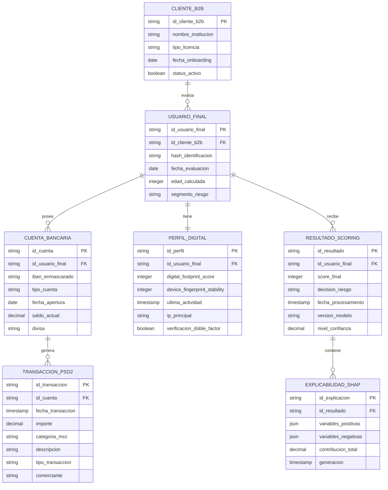
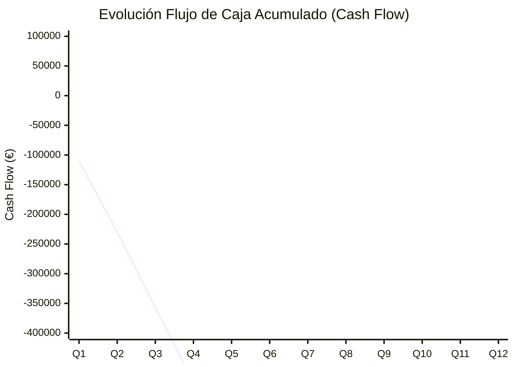
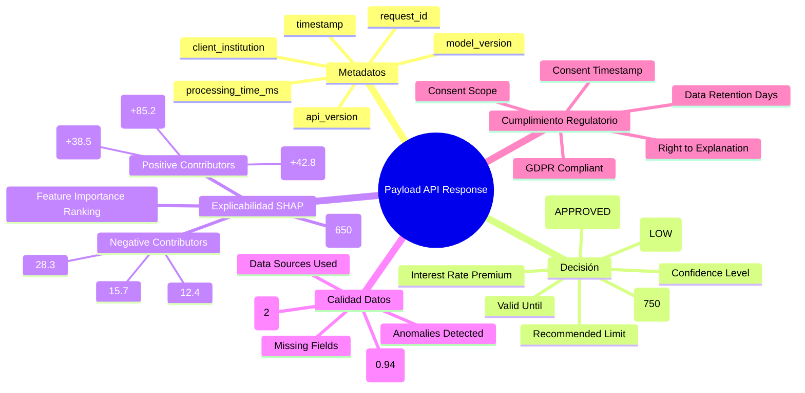
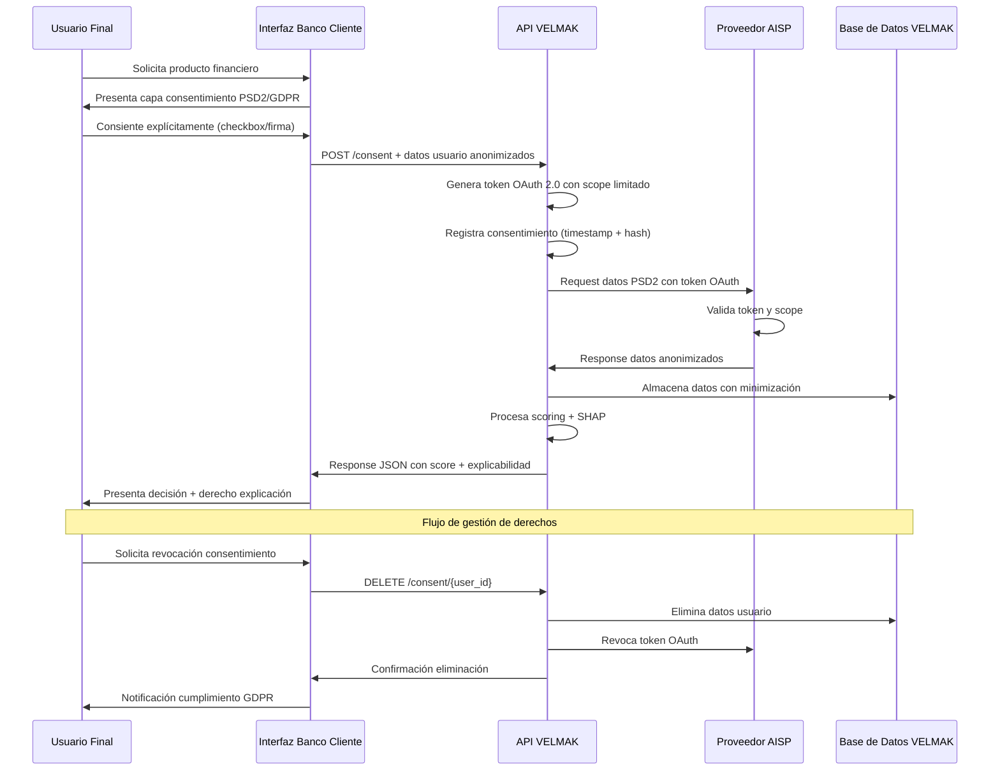

# SECCIÓN 10: ANEXOS

## 10.1 Anexo A: Diccionario de Datos Alternativos (Data Dictionary)

El presente anexo documenta exhaustivamente las variables clave que conforman el universo de datos alternativos procesados por el motor de scoring de VELMAK, proporcionando una visión detallada de la estructura semántica y técnica que sustenta la capacidad predictiva del sistema. Este diccionario de datos representa el fundamento técnico sobre el cual se construyen los modelos de machine learning y los algoritmos de IA explicable, garantizando consistencia, trazabilidad y comprensibilidad en todo el pipeline de procesamiento de información. Las variables descritas provienen de múltiples fuentes de datos alternativos incluyendo APIs de Open Banking bajo el marco regulatorio PSD2, agregadores de datos de comportamiento digital, y fuentes de información pública que enriquecen el perfil de riesgo crediticio más allá de los datos tradicionales utilizados por burós de crédito convencionales.

| Nombre de Variable | Tipo de Dato | Origen | Descripción de Negocio |
|---|---|---|---|
| avg_monthly_balance | Decimal(15,2) | PSD2 | Saldo promedio mensual en todas las cuentas del usuario durante los últimos 12 meses. Indicador clave de estabilidad financiera y capacidad de ahorro. |
| gambling_transactions_ratio | Decimal(5,4) | PSD2 | Proporción de transacciones identificadas como juego de azar respecto al total de transacciones mensuales. Ratio superior a 0.05 indica comportamiento de riesgo potencial. |
| days_since_last_overdraft | Integer | PSD2 | Días transcurridos desde el último descubierto en cuenta. Valores inferiores a 30 días sugieren dificultades de liquidez recientes. |
| income_volatility_index | Decimal(8,4) | PSD2 | Índice calculado basado en la desviación estándar de los ingresos mensuales normalizados. Valores superiores a 0.3 indican alta volatilidad de ingresos. |
| subscription_services_count | Integer | PSD2 | Número de servicios de suscripción recurrentes detectados (Netflix, Spotify, etc.). Indica compromiso financiero mensual fijo. |
| emergency_fund_ratio | Decimal(5,4) | PSD2 | Proporción del saldo mensual promedio respecto a los gastos fijos mensuales. Ratio inferior a 1.0 indica falta de fondo de emergencia. |
| international_transactions_pct | Decimal(5,4) | PSD2 | Porcentaje de transacciones realizadas en moneda extranjera. Valores elevados pueden indicar viajes frecuentes o residencia internacional. |
| utility_payment_consistency | Decimal(3,2) | PSD2 | Consistencia en pagos de servicios básicos (electricidad, agua, gas) calculada mediante análisis de patrones temporales. Valores cercanos a 1.0 indican alta fiabilidad. |
| digital_footprint_score | Integer | Web | Puntuación compuesta (0-100) basada en presencia digital profesional, actividad en redes y comportamiento online. Indica estabilidad digital y profesional. |
| device_fingerprint_stability | Integer | Web | Número de dispositivos únicos utilizados en los últimos 6 meses. Valores inferiores a 3 sugieren alta estabilidad de comportamiento digital. |
| employment_income_correlation | Decimal(5,4) | PSD2 | Correlación entre depósitos periódicos y patrones típicos de nómina. Valores superiores a 0.8 sugieren empleo estable. |
| cash_withdrawal_frequency | Integer | PSD2 | Número promedio de retiradas de efectivo mensuales. Frecuencias superiores a 10 pueden indicar preferencia por efectivo y menor trazabilidad. |
| peer_to_peer_lending_activity | Integer | PSD2 | Número de transacciones identificadas con plataformas P2P. Actividad elevada puede indicar necesidad de financiamiento alternativo. |
| crypto_currency_exposure | Boolean | PSD2 | Indicador de exposición a criptomonedas detectada mediante transacciones con exchanges conocidos. True sugiere mayor tolerancia al riesgo. |
| savings_goal_adherence | Decimal(5,4) | PSD2 | Proporción de ahorro real respecto a metas de ahorro inferidas mediante análisis de patrones de depósito regular. |



## 10.2 Anexo B: Modelos Financieros Detallados (Proyecciones a 36 meses)

El siguiente modelo financiero detalla las proyecciones trimestrales de la cuenta de resultados para el horizonte de 36 meses, proporcionando una visión comprehensiva de la evolución esperada de ingresos, costes y rentabilidad de VELMAK. Estas proyecciones se fundamentan en supuestos conservadores basados en el análisis de mercado, ciclos de ventas típicos del sector B2B FinTech, y métricas de benchmarks de empresas SaaS similares. El modelo demuestra la trayectoria hacia la sostenibilidad financiera con un break-even proyectado para el mes 24 y una rentabilidad creciente a partir del tercer año, validando así la viabilidad económica del proyecto y su atractivo como oportunidad de inversión.

| Trimestre | Ingresos MRR | Costes Cloud | Salarios Tech | Salarios Negocio | Marketing CAC | Otros Costes | EBITDA |
|---|---|---|---|---|---|---|---|
| Q1 Año 1 | 5.000€ | 8.000€ | 45.000€ | 25.000€ | 15.000€ | 12.000€ | -110.000€ |
| Q2 Año 1 | 12.500€ | 10.000€ | 45.000€ | 25.000€ | 20.000€ | 12.500€ | -120.000€ |
| Q3 Año 1 | 22.500€ | 12.000€ | 50.000€ | 30.000€ | 25.000€ | 13.000€ | -127.500€ |
| Q4 Año 1 | 35.000€ | 15.000€ | 50.000€ | 30.000€ | 30.000€ | 14.000€ | -124.000€ |
| Q1 Año 2 | 55.000€ | 18.000€ | 60.000€ | 35.000€ | 35.000€ | 15.000€ | -118.000€ |
| Q2 Año 2 | 75.000€ | 20.000€ | 60.000€ | 35.000€ | 40.000€ | 16.000€ | -106.000€ |
| Q3 Año 2 | 95.000€ | 22.000€ | 65.000€ | 40.000€ | 45.000€ | 17.000€ | -104.000€ |
| Q4 Año 2 | 125.000€ | 25.000€ | 65.000€ | 40.000€ | 50.000€ | 18.000€ | -83.000€ |
| Q1 Año 3 | 155.000€ | 28.000€ | 70.000€ | 45.000€ | 45.000€ | 19.000€ | -52.000€ |
| Q2 Año 3 | 185.000€ | 30.000€ | 70.000€ | 45.000€ | 40.000€ | 20.000€ | -20.000€ |
| Q3 Año 3 | 210.000€ | 32.000€ | 75.000€ | 50.000€ | 35.000€ | 21.000€ | -3.000€ |
| Q4 Año 3 | 250.000€ | 35.000€ | 75.000€ | 50.000€ | 30.000€ | 22.000€ | 38.000€ |

**Resumen Anual Consolidado:**
- **Año 1:** Ingresos 75.000€ | Costes 395.500€ | **EBITDA -320.500€**
- **Año 2:** Ingresos 350.000€ | Costes 411.000€ | **EBITDA -61.000€**
- **Año 3:** Ingresos 800.000€ | Costes 447.000€ | **EBITDA +353.000€**



## 10.3 Anexo C: Especificaciones de la API B2B (Estructura JSON y Explicabilidad)

La API RESTful de VELMAK proporciona una interfaz estandarizada para que las instituciones financieras clientes puedan solicitar evaluaciones de riesgo crediticio mediante el envío de datos de usuarios finales y recibir resultados detallados incluyendo puntuaciones, decisiones y explicabilidad algorítmica. El siguiente payload representa la respuesta estructurada que el sistema devuelve tras procesar una solicitud de scoring, incorporando todos los elementos necesarios para cumplimiento regulatorio, transparencia algorítmica y toma de decisiones informadas por parte de las instituciones financieras. Esta estructura JSON ha sido diseñada siguiendo principios de REST API best practices y cumple con los requisitos de interoperabilidad con sistemas bancarios legacy y modernos.

```json
{
  "metadata": {
    "request_id": "VEL-2024-03-15-001",
    "timestamp": "2024-03-15T14:30:22Z",
    "processing_time_ms": 187,
    "model_version": "v2.1.3",
    "api_version": "1.2.0",
    "client_institution": "BANK_ES_001"
  },
  "decision": {
    "score": 750,
    "risk_category": "LOW",
    "decision": "APPROVED",
    "confidence_level": 0.87,
    "recommended_limit": 15000,
    "interest_rate_premium": -0.25,
    "valid_until": "2024-06-15T23:59:59Z"
  },
  "explainability": {
    "shap_values": {
      "positive_contributors": [
        {
          "feature": "avg_monthly_balance",
          "value": 8750.50,
          "contribution": 85.2,
          "description": "Saldo mensual promedio elevado indica estabilidad financiera",
          "impact_percentage": 34.1
        },
        {
          "feature": "utility_payment_consistency",
          "value": 0.95,
          "contribution": 42.8,
          "description": "Historial consistente de pagos de servicios básicos",
          "impact_percentage": 17.1
        },
        {
          "feature": "employment_income_correlation",
          "value": 0.92,
          "contribution": 38.5,
          "description": "Fuerte correlación con patrones de nómina estable",
          "impact_percentage": 15.4
        }
      ],
      "negative_contributors": [
        {
          "feature": "gambling_transactions_ratio",
          "value": 0.08,
          "contribution": -28.3,
          "description": "Ratio elevado de transacciones de juego",
          "impact_percentage": -11.3
        },
        {
          "feature": "crypto_currency_exposure",
          "value": true,
          "contribution": -15.7,
          "description": "Exposición a criptomonedas detectada",
          "impact_percentage": -6.3
        },
        {
          "feature": "income_volatility_index",
          "value": 0.35,
          "contribution": -12.4,
          "description": "Volatilidad de ingresos superior al umbral óptimo",
          "impact_percentage": -5.0
        }
      ]
    },
    "base_value": 650,
    "total_shap_contribution": 100,
    "feature_importance_ranking": [
      "avg_monthly_balance",
      "utility_payment_consistency",
      "employment_income_correlation",
      "gambling_transactions_ratio",
      "crypto_currency_exposure",
      "income_volatility_index"
    ]
  },
  "data_quality": {
    "completeness_score": 0.94,
    "freshness_days": 2,
    "data_sources_used": ["psd2_transactions", "digital_footprint", "public_records"],
    "missing_fields": [],
    "anomalies_detected": []
  },
  "regulatory": {
    "gdpr_compliant": true,
    "consent_timestamp": "2024-03-15T14:25:00Z",
    "consent_scope": "credit_scoring",
    "data_retention_days": 365,
    "right_to_explanation_available": true
  }
}
```



## 10.4 Anexo D: Flujo de Consentimiento PSD2 (Soporte Legal)

El proceso de consentimiento PSD2 en VELMAK se diseña garantizando el cumplimiento estricto del Reglamento General de Protección de Datos (GDPR) y la Directiva de Servicios de Pago (PSD2), asegurando que los usuarios finales mantengan control total sobre sus datos financieros y comprendan perfectamente el propósito y alcance del procesamiento. Este flujo de consentimiento implementa los principios de privacidad desde el diseño (privacy by design) y privacidad por defecto (privacy by default), proporcionando transparencia máxima y mecanismos robustos de gestión de consentimientos que permiten a los usuarios ejercer sus derechos de forma efectiva y en cualquier momento.

El proceso se inicia cuando el usuario final accede a la interfaz del banco cliente y solicita un producto financiero que requiere evaluación de riesgo. En este momento, el sistema presenta una capa de consentimiento diferenciada que explica claramente qué datos específicos serán accedidos, con qué propósito, durante cuánto tiempo serán conservados, y qué derechos tiene el usuario sobre sus datos. El consentimiento debe ser explícito, informado e inequívoco, obtenido mediante acción afirmativa del usuario (checkbox activo o firma electrónica) sin posibilidad de consentimiento tácito o silencioso. Una vez obtenido el consentimiento, el sistema genera un registro auditable con timestamp, hash del consentimiento, y metadatos de la sesión que garantizan trazabilidad completa y no repudio.

La comunicación con el proveedor AISP (Account Information Service Provider) se realiza mediante tokens de acceso OAuth 2.0 que limitan estrictamente el alcance de los datos solicitados únicamente a aquellos para los cuales el usuario ha concedido consentimiento explícito. Los datos transmitidos se anonimizan y seudonimizan antes de su procesamiento por VELMAK, eliminando información identificativa directa y manteniendo únicamente los datos necesarios para el scoring. El sistema implementa additionally mecanismos de minimización de datos que acceden únicamente a la información estrictamente necesaria para cada evaluación específica, rechazando automáticamente solicitudes de datos excesivos o no pertinentes.

El usuario final mantiene control continuo sobre sus datos mediante interfaces de gestión de consentimientos que permiten revocar el acceso en cualquier momento, solicitar la eliminación de datos (derecho al olvido), y obtener información detallada sobre el procesamiento realizado. VELMAK implementa procedimientos automatizados para atender estas solicitudes dentro de los plazos legales establecidos, incluyendo la eliminación inmediata de datos de sus sistemas y la notificación a terceros que hayan recibido la información. Adicionalmente, el sistema proporciona explicaciones comprensibles sobre las decisiones automatizadas tomadas basadas en los datos del usuario, cumpliendo con el derecho a la explicación establecido en el GDPR y facilitando el ejercicio del derecho a intervención humana cuando el usuario lo solicite.


