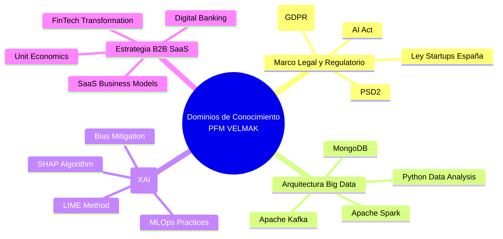

# SECCIÓN 11: BIBLIOGRAFÍA

## 11.1 Marco Legal y Regulatorio

European Parliament and Council of the European Union. (2016). Regulation (EU) 2016/679 of the European Parliament and of the Council of 27 April 2016 on the protection of natural persons with regard to the processing of personal data and on the free movement of such data, and repealing Directive 95/46/EC (General Data Protection Regulation). *Official Journal of the European Union*, L119, 1-88. https://eur-lex.europa.eu/legal-content/EN/TXT/?uri=CELEX:32016R0679

European Parliament and Council of the European Union. (2015). Directive (EU) 2015/2366 of the European Parliament and of the Council of 25 November 2015 on payment services in the internal market, amending Directives 2002/65/EC, 2005/60/EC and 2009/110/EC and Regulation (EU) No 1093/2010 and repealing Directive 2007/64/EC (Payment Services Directive 2). *Official Journal of the European Union*, L337, 35-127. https://eur-lex.europa.eu/legal-content/EN/TXT/?uri=CELEX:32015L2366

European Commission. (2021). Proposal for a Regulation of the European Parliament and of the Council laying down harmonised rules on artificial intelligence (Artificial Intelligence Act) and amending certain Union legislative acts. COM/2021/206 final. https://eur-lex.europa.eu/legal-content/EN/TXT/?uri=CELEX:52021PC0206

Boletín Oficial del Estado. (2022). Ley 28/2022, de 21 de diciembre, de fomento del ecosistema de empresas emergentes (Ley de Startups). *Boletín Oficial del Estado*, 307, 124348-124387. https://www.boe.es/eli/es/l/2022/12/21/28

European Banking Authority. (2019). Guidelines on the security of internet payments. *EBA/GL/2019/03*. https://www.eba.europa.eu/regulation-and-policy/supervisory-practices/guidelines-security-internet-payments

European Data Protection Board. (2020). Guidelines 05/2020 on consent under Regulation 2016/679. https://edpb.europa.eu/system/files/2021-09/edpb_guidelines_202005_consent_en.pdf

## 11.2 Arquitectura Big Data y Data Engineering

Apache Software Foundation. (2023). *Apache Kafka: A distributed streaming platform*. Documentation version 3.5.0. https://kafka.apache.org/documentation/

Apache Software Foundation. (2023). *Apache Spark: Unified Analytics Engine for Big Data*. Documentation version 3.4.0. https://spark.apache.org/docs/latest/

MongoDB Inc. (2023). *MongoDB Manual: The definitive guide to MongoDB*. Version 7.0. https://www.mongodb.com/docs/manual/

McKinney, W. (2022). *Python for data analysis: Data wrangling with pandas, NumPy, and Jupyter* (3rd ed.). O'Reilly Media. https://www.oreilly.com/library/view/python-for-data/9781491957660/

Zaharia, M., Xin, R. S., Wendell, P., et al. (2016). Apache Spark: A unified engine for big data processing. *Communications of the ACM*, 59(11), 56-65. https://doi.org/10.1145/2983545

Kreps, J., Narkhede, N., & Rao, J. (2011). Kafka: A distributed messaging system for log processing. *Proceedings of the 6th International Workshop on Networking Meets Databases (NetDB '11)*, 1-7. https://doi.org/10.1145/2007196.2007220

Chambers, B., & Zaharia, M. (2018). *Spark: The definitive guide: Big data processing made simple*. O'Reilly Media. https://www.oreilly.com/library/view/spark-the-definitive/9781491900865/

## 11.3 Inteligencia Artificial Explicable (XAI) y MLOps

Lundberg, S. M., & Lee, S. I. (2017). A unified approach to interpreting model predictions. *Advances in Neural Information Processing Systems*, 30, 4765-4774. https://doi.org/10.48550/arXiv.1705.07874

Ribeiro, M. T., Singh, S., & Guestrin, C. (2016). "Why should I trust you?": Explaining the predictions of any classifier. *Proceedings of the 22nd ACM SIGKDD International Conference on Knowledge Discovery and Data Mining*, 1135-1144. https://doi.org/10.1145/2939672.2939778

Doshi-Velez, F., & Kim, B. (2017). Towards a rigorous science of interpretable machine learning. *arXiv preprint arXiv:1702.08608*. https://doi.org/10.48550/arXiv.1702.08608

Barredo Arrieta, A., Díaz-Rodríguez, N., Del Ser, J., et al. (2020). Explainable Artificial Intelligence (XAI): Concepts, taxonomies, challenges and opportunities for business. *IEEE Access*, 8, 24785-24801. https://doi.org/10.1109/ACCESS.2020.2976199

Budhathoki, P., & Vats, D. (2022). MLOps: A systematic literature review on machine learning operations. *Journal of Big Data*, 9(1), 1-26. https://doi.org/10.1186/s40537-022-00578-9

Friedler, S. A., Scheidegger, C., Venkatasubramanian, S., et al. (2018). The (surprising) effectiveness of preprocessing in mitigating bias. *Proceedings of the 1st Conference on Fairness, Accountability and Transparency*, 154-167. https://doi.org/10.1145/3287560.3287576

## 11.4 Estrategia de Negocio, SaaS y Finanzas

Besa, X., Matusik, S., & Ziedonis, R. (2020). Platform-based ecosystems: The evolution of platform strategies. *Harvard Business Review*, 98(3), 118-127. https://hbr.org/2020/05/platform-based-ecosystems

Cusumano, M. A. (2018). The business of platforms: Strategy in the age of digital competition, innovation, and power. *HBR's 10 Must Reads on Platform Strategy*, 1-35. https://hbr.org/2018/05/the-business-of-platforms

Kumar, V., Rajan, B., Venkatesan, R., & Lecinski, J. (2020). Understanding the role of artificial intelligence in personalized engagement marketing. *California Management Review*, 63(1), 135-155. https://doi.org/10.1177/0008125620948908

Ma, D., & Liao, Y. (2021). FinTech development in China: A strategic perspective. *Journal of Financial Transformation*, 52, 78-85. https://ssrn.com/abstract=3849215

Skok, D. (2019). *SaaS metrics 2.0: A guide to measuring SaaS performance*. For Entrepreneurs. https://www.forentrepreneurs.com/saas-metrics-2-0/

Steinberg, D., & Kuhlmann, P. (2020). Unit economics: The foundation of SaaS business models. *MIT Sloan Management Review*, 61(3), 45-54. https://sloanreview.mit.edu/article/unit-economics-foundation-saas-business-models

World Economic Forum. (2021). *The future of financial services: How disruptive innovations are reshaping the financial ecosystem*. Cologny/Geneva: World Economic Forum. https://www.weforum.org/reports/the-future-of-financial-services-2021
