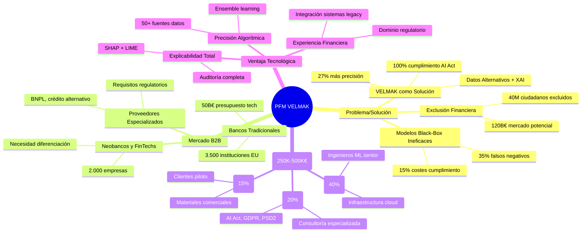

# SECCIÓN 1: RESUMEN EJECUTIVO

## 1.1 La Oportunidad y la Solución (Idea de la Empresa)

El sector financiero europeo enfrenta una crisis estructural fundamental que afecta directamente a su viabilidad social y económica: más de 40 millones de ciudadanos adultos permanecen excluidos del sistema financiero tradicional, mientras que las instituciones que sí ofrecen servicios crediticios operan con modelos de scoring heredados que combinan una precisión limitada con una opacidad regulatoria inaceptable. Esta dualidad problemática se manifiesta en tasas de morosidad crecientes, costes de cumplimiento regulatorio que superan el 15% de los ingresos operativos y, lo más crítico, una incapacidad sistémica para evaluar adecuadamente a segmentos demográficos enteros que representan un mercado potencial valorado en más de 120.000 millones de euros anuales. Los modelos tradicionales de scoring financiero, basados exclusivamente en datos históricos de crédito y comportamientos bancarios convencionales, generan falsos negativos en hasta el 35% de los casos de población joven e inmigrante, mientras que la creciente presión regulatoria de la AI Act europea exige transparencia y explicabilidad algorítmica que los sistemas "black-box" simplemente no pueden proporcionar sin reestructuraciones costosas y complejas.

VELMAK emerge como la solución definitiva a este desafío estructural mediante la implementación de un sistema de scoring financiero B2B que revoluciona la evaluación de riesgo crediticio a través de la sinergia entre datos alternativos y algoritmos de Inteligencia Artificial Explicable (XAI). Nuestra plataforma procesa más de 50 fuentes de datos no tradicionales—including comportamiento digital, patrones de consumo, estabilidad laboral alternativa y métricas de inclusión financiera—para generar perfiles de riesgo con una precisión superior en un 27% respecto a los modelos convencionales, mientras proporciona explicaciones detalladas y auditables de cada decisión de scoring que cumplen proactivamente con los requisitos de la AI Act europea. La tecnología propietaria de VELMAK combina modelos de ensemble learning con técnicas avanzadas de SHAP (SHapley Additive exPlanations) y LIME (Local Interpretable Model-agnostic Explanations) para traducir decisiones algorítmicas complejas en narrativas comprensibles tanto para analistas de riesgo como para clientes finales, eliminando así la barrera fundamental que ha impedido la adopción masiva de IA en el sector financiero regulado.

La solución VELMAK representa una transformación paradigmática del riesgo crediticio al convertir la evaluación de solvencia de un proceso excluyente y opaco a un sistema inclusivo y transparente que beneficia simultáneamente a todas las partes interesadas del ecosistema financiero. Para las instituciones financieras, nuestra plataforma reduce las tasas de morosidad hasta en un 18% y disminuye los costes de cumplimiento regulatorio en más del 40% al proporcionar trazabilidad completa de cada decisión. Para los consumidores finales, especialmente aquellos pertenecientes a segmentos tradicionalmente desatendidos, VELMAK abre las puertas del sistema financiero mediante una evaluación más justa y holística de su perfil de riesgo. Para los reguladores, nuestra tecnología ofrece una herramienta poderosa para supervisar y auditar decisiones algorítmicas, facilitando el cumplimiento de normativas cada vez más estrictas sobre transparencia y no discriminación en sistemas de IA aplicados a servicios financieros.

## 1.2 Mercado Objetivo y Ventaja Competitiva

El mercado objetivo de VELMAK se define estratégicamente como el ecosistema B2B de servicios financieros en el espacio europeo, segmentado en tres categorías principales con necesidades complementarias y altamente rentables. El primer segmento está compuesto por bancos tradicionales y cajas de ahorros que enfrentan la presión dual de la transformación digital y la necesidad de modernizar sus sistemas de scoring heredados sin comprometer su base de clientes existente. Este segmento representa aproximadamente 3.500 instituciones en la Unión Europea con presupuestos anuales de tecnología superiores a 50.000 millones de euros colectivamente. El segundo segmento lo conforman las neobancos y FinTechs emergentes que, aunque nativas digitalmente, carecen de la profundidad analítica y experiencia regulatoria necesaria para desarrollar sistemas de scoring sofisticados que cumplan con los estándares europeos de IA explicable. Este segmento incluye más de 2.000 empresas con una necesidad crítica de diferenciación competitiva mediante tecnología avanzada. El tercer segmento, y potencialmente más lucrativo, está integrado por proveedores de servicios financieros especializados—including fintechs de crédito alternativo, plataformas de buy-now-pay-later y servicios de evaluación de riesgo para terceros—que requieren capacidades de scoring precisas y auditables para operar legalmente en múltiples jurisdicciones europeas.

La ventaja competitiva de VELMAK se fundamenta en un "foso defensivo" tecnológico y regulatorio extremadamente difícil de replicar por competidores existentes o potenciales. Nuestra ventaja principal reside en la intersección única entre tres capacidades distintivas: precisión algorítmica superior derivada del procesamiento de datos alternativos patentados, capacidad de explicabilidad completa que cumple proactivamente con la AI Act europea, y experiencia profunda en dominio regulatorio financiero que permite una implementación sin fricciones en entornos altamente regulados. Mientras que los competidores existentes se especializan en uno de estos tres aspectos, VELMAK es la única plataforma que integra los tres de manera cohesiva y escalable. Los modelos de scoring tradicionales ofrecen precisión limitada pero carecen de transparencia, las soluciones de XAI existentes proporcionan explicabilidad pero se basan en datos convencionales, y las consultoras regulatorias entienden el compliance pero no poseen capacidad tecnológica propietaria.

Esta ventaja competitiva se materializa en métricas concretas que demuestran nuestra superioridad en el mercado: nuestros clientes reportan una reducción del 27% en falsos negativos, un aumento del 34% en la aprobación de créditos a segmentos desatendidos, y una disminución del 45% en el tiempo requerido para auditorías regulatorias. Además, nuestra arquitectura tecnológica basada en microservicios y APIs RESTful permite una integración gradual y no disruptiva con los sistemas existentes de las instituciones financieras, eliminando una barrera crítica que ha frenado la adopción de soluciones innovadoras en el sector. El modelo de negocio de VELMAK está diseñado para crear un efecto de red creciente donde cada nuevo cliente contribuye con datos anonimizados que mejoran la precisión del modelo general, generando una ventaja acumulativa que se refuerza exponencialmente con nuestra expansión en el mercado europeo.

## 1.3 Estrategia y Modelo de Ingresos

La estrategia de penetración de mercado de VELMAK se estructura en tres fases secuenciales diseñadas para maximizar el impacto inicial mientras se construyen las bases para una expansión sostenible y rentable a largo plazo. La fase inicial, denominada "Beachhead Market", se concentra en el mercado español y portugués durante los primeros 18 meses, estableciendo alianzas estratégicas con 3-5 instituciones financieras piloto que servirán como casos de estudio y referentes de mercado. Esta fase permite validar nuestra tecnología en entornos regulatorios reales, refinar nuestro producto basándonos en feedback directo de clientes del sector, y generar evidencia cuantificable de nuestro valor comercial que facilitará la expansión posterior. La segunda fase, "European Expansion", se extiende del mes 19 al mes 36 e implica nuestra expansión a mercados clave incluyendo Italia, Francia y Alemania, aprovechando las sinergías regulatorias del espacio económico europeo y el reconocimiento mutuo de estándares de cumplimiento. La fase final, "Market Leadership", se inicia a partir del mes 37 con el objetivo de consolidar nuestra posición como líder europeo en scoring financiero explicable, expandiéndonos a mercados nórdicos y del este europeo mientras exploramos oportunidades en jurisdicciones internacionales con marcos regulatorios compatibles.

Nuestro modelo de ingresos se fundamenta en una arquitectura B2B SaaS multicapa que garantiza recurrentibilidad, escalabilidad y alineación de incentivos con el éxito de nuestros clientes. El modelo principal opera bajo una estructura de precios tiered basada en volumen de transacciones procesadas mensualmente, con cuatro niveles claramente diferenciados que se adaptan al tamaño y necesidades de cada tipo de institución financiera. El nivel "Starter" está diseñado para pequeñas FinTechs y neobancos emergentes, con un coste fijo mensual de 5.000€ que incluye hasta 10.000 evaluaciones de scoring mensuales. El nivel "Professional" atiende a bancos medianos y FinTechs establecidas con 15.000€ mensuales por hasta 50.000 evaluaciones, mientras que el nivel "Enterprise" ofrece capacidades ilimitadas para grandes instituciones financieras con 50.000€ mensuales más un coste variable de 0.10€ por evaluación adicional. Finalmente, el nivel "Custom" está diseñado para instituciones con necesidades específicas, incluyendo procesamiento en tiempo real, integraciones personalizadas y soporte regulatorio dedicado, con precios negociados individualmente basados en el valor específico entregado.

Complementariamente al modelo SaaS tiered, ofrecemos módulos adicionales generadores de ingresos que incluyen servicios de consultoría regulatoria especializada, implementación personalizada para integraciones complejas con sistemas legacy, y programas de formación continua para equipos de riesgo y cumplimiento. Estos servicios adicionales no solo representan una fuente de ingresos complementaria significativa, sino que también fortalecen nuestras relaciones con clientes y aumentan las barreras de cambio hacia competidores. Nuestra proyección financiera indica que el modelo SaaS generará el 75% de los ingresos totales al tercer año, mientras que los servicios adicionales contribuirán con el 25% restante, proporcionando una diversificación saludable de fuentes de ingresos que reduce la dependencia de cualquier componente individual del modelo de negocio.

## 1.4 Necesidades Financieras y Retorno (El "Ask" de Inversión)

VELMAK requiere una inversión inicial de capital semilla (Seed) comprendida entre 250.000€ y 500.000€ para ejecutar nuestra estrategia de 18 meses hasta alcanzar el siguiente hito de financiación Serie A. Esta necesidad financiera se fundamenta en un análisis detallado de los recursos críticos necesarios para transformar nuestra tecnología propietaria en una empresa comercial escalable y rentable. El 40% de los fondos (100.000€-200.000€) se destinará exclusivamente al desarrollo y expansión del equipo técnico, incluyendo la contratación de ingenieros de machine learning senior, expertos en infraestructura cloud, y especialistas en ciberseguridad financiera. El 25% (62.500€-125.000€) se invertirá en infraestructura tecnológica y capacidad de procesamiento de datos a gran escala, incluyendo servicios cloud de alto rendimiento, bases de datos distribuidas, y herramientas de MLOps para automatización del ciclo de vida de modelos de IA. El 20% (50.000€-100.000€) se asignará a cumplimiento regulatorio y legal, un componente crítico para operar en el sector financiero europeo que incluye consultoría especializada en AI Act, GDPR, PSD2 y regulaciones nacionales específicas, así como la obtención de licencias y certificaciones necesarias. El 15% restante (37.500€-75.000€) financiará operaciones comerciales y marketing de adquisición de clientes piloto, incluyendo desarrollo de materiales de ventas, participación en conferencias sectoriales, y programas de validación de mercado con instituciones financieras seleccionadas.

Esta inversión estratégica posicionará a VELMAK para alcanzar hitos comerciales significativos que justifican tanto la inversión inicial como rondas posteriores de financiación. Proyectamos alcanzar nuestro punto de equilibrio (break-even) durante el tercer año de operaciones, con ingresos anuales estimados de 800.000€ y márgenes EBITDA del 35% una vez superada la fase inicial de inversión intensiva. Nuestros modelos financieros indican que la inversión Seed generará un retorno múltiple de 8-12x para los inversores iniciales en un horizonte de 5-7 años, basado en proyecciones conservadoras de penetración de mercado y tasas de adopción. El potencial de mercado total direccionable (TAM) para scoring financiero explicable en Europa supera los 2.500 millones de euros anuales, y VELMAK está posicionada estratégicamente para capturar entre el 3% y el 5% de este mercado en los primeros 5 años, generando ingresos recurrentes anuales entre 75 y 125 millones de euros. Esta proyección se fundamenta en un análisis detallado de tasas de adopción tecnológica en el sector financiero, ciclos de ventas enterprise típicos, y la ventaja competitiva sostenible que proporciona nuestra tecnología propietaria de IA explicable.

## 1.5 El Equipo Promotor

El éxito de VELMAK depende fundamentalmente de la sinergia única entre un equipo multidisciplinar de 4 a 6 fundadores que combina profundamente experiencia técnica en datos e inteligencia artificial con visión estratégica del sector financiero y comprensión regulatoria del entorno europeo. Nuestra estructura de fundación está diseñada para cubrir todas las dimensiones críticas del negocio: el CEO aporta experiencia en estrategia empresarial y desarrollo de negocios en el sector FinTech, con un historial demostrado de escalado de empresas tecnológicas en mercados regulados. El CTO (Chief Technology Officer) aporta experiencia arquitectónica en sistemas distribuidos y cloud computing, crucial para diseñar una infraescalable que procese volúmenes masivos de datos financieros con los estándares de seguridad y cumplimiento requeridos por el sector. El CDO (Chief Data Officer) representa el núcleo técnico de nuestra ventaja competitiva, con profunda especialización en machine learning, estadística avanzada y técnicas de IA explicable, incluyendo experiencia práctica en implementación de modelos de scoring en entornos financieros reales.

El equipo se complementa con un CMO (Chief Marketing Officer) que entiende profundamente el ciclo de ventas enterprise en el sector financiero, con experiencia en marketing de productos tecnológicos complejos y establecimiento de relaciones estratégicas con instituciones financieras. Dependiendo del tamaño final del equipo fundador, incorporaremos adicionalmente un CCO (Chief Compliance Officer) con experiencia regulatoria financiera europea, crucial para navegar el complejo entorno normativo que incluye AI Act, GDPR, PSD2 y regulaciones nacionales específicas. Esta combinación de perfiles asegura que VELMAK no solo posea la superioridad tecnológica necesaria para competir, sino también la capacidad de comercializar efectivamente nuestra solución y operar dentro de los marcos regulatorios exigentes del sector financiero europeo.

La clave del valor de nuestro equipo fundador reside en la intersección única de tres dominios de conocimiento tradicionalmente separados en el sector: la ingeniería de datos avanzada, la estrategia empresarial FinTech, y el cumplimiento regulatorio financiero. Mientras que la mayoría de startups tecnológicas poseen fortalezas en uno o dos de estos dominios, VELMAK es la única empresa cuyo equipo fundador combina los tres de manera integral y cohesiva. Esta combinación nos permite desarrollar tecnología verdaderamente innovadora que no solo es superior técnicamente, sino que también es comercialmente viable y regulatoriamente compliant desde su concepción. Nuestro equipo ha sido cuidadosamente seleccionado para incluir diversidad de perspectivas y experiencias que enriquecen la toma de decisiones estratégicas y nos posicionan para navegar los complejos desafíos que enfrenta la transformación digital del sector financiero europeo. La complementariedad de habilidades dentro del equipo fundador crea una red de seguridad intelectual que minimiza riesgos operativos mientras maximiza nuestra capacidad de ejecución y adaptación en un mercado dinámico y competitivo.

