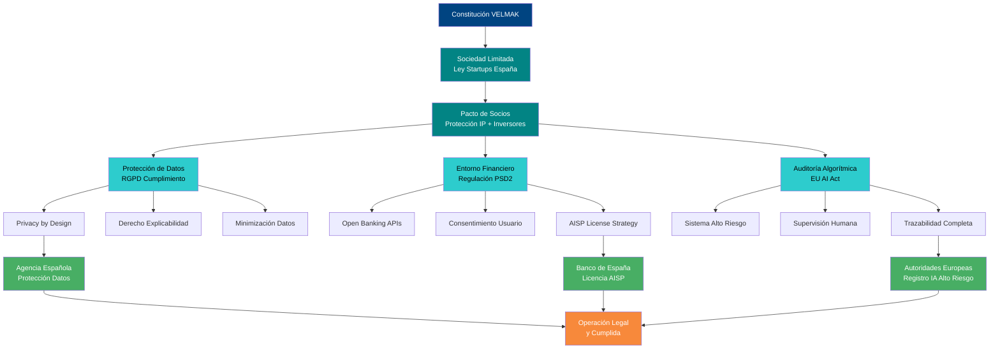

# SECCIÓN 2: PLAN JURÍDICO-LEGAL

## 2.1 Forma Jurídica y Constitución de la Sociedad

La elección de la Sociedad Limitada como forma jurídica para VELMAK responde a una análisis estratégico exhaustivo que considera tanto las necesidades operativas iniciales como las expectativas de crecimiento y futuras rondas de inversión. La S.L. se presenta como la figura jurídica óptima para startups tecnológicas en fase inicial debido a su flexibilidad estructural, responsabilidad limitada de los socios y régimen fiscal adaptado a empresas innovadoras. Esta forma jurídica permite a los fundadores limitar su responsabilidad personal al capital aportado, protegiendo así el patrimonio personal frente a posibles contingencias empresariales, un aspecto fundamental en el sector FinTech donde la exposición regulatoria y los riesgos tecnológicos pueden generar responsabilidades significativas. Además, la S.L. ofrece una estructura societaria ágil que facilita la toma de decisiones rápidas, crucial en un entorno tecnológico en constante evolución como el del scoring financiero basado en IA.

El marco normativo español ha evolucionado favorablemente para empresas como VELMAK con la aprobación de la Ley 28/2022 de 21 de diciembre, de fomento del ecosistema de empresas emergentes, conocida como Ley de Startups. Esta legislación introduce beneficios específicos para empresas de base tecnológica que VELMAK puede aprovechar estratégicamente, incluyendo un tipo reducido del Impuesto sobre Sociedades del 15% durante los primeros cuatro años de actividad en lugar del tipo general del 25%, siempre que se cumplan los requisitos de innovación y creación de empleo cualificado. Adicionalmente, la ley establece un marco más flexible para la participación de empleados mediante stock options, un instrumento fundamental para atraer y retener talento técnico especializado en IA y Big Data que constituye el activo principal de VELMAK. La ley también simplifica trámites administrativos y ofrece acceso a programas de aceleración y financiación pública, recursos que pueden complementar las rondas de financiación privadas.

El Pacto de Socios constituye el documento jurídico más crítico para VELMAK desde el día cero, ya que debe regular de manera exhaustiva las relaciones entre los fundadores, proteger la propiedad intelectual del algoritmo de scoring y establecer las reglas para futuras rondas de inversión. Este documento debe incluir cláusulas específicas sobre propiedad intelectual que establezcan que todo el código, algoritmos y modelos desarrollados durante la actividad de la empresa pertenezcan exclusivamente a la sociedad, incluso cuando sean desarrollados por los socios fuera del horario laboral. Es fundamental incluir cláusulas de no competencia y no divulgación con períodos de duración proporcionales y geográficamente limitados para proteger el know-how técnico y los secretos comerciales del sistema de scoring. El Pacto también debe regular el mecanismo de entrada de inversores, estableciendo cláusulas anti-dilución preferentes para los fundadores en las primeras rondas de financiación, así como derechos de preferencia en la suscripción de nuevas acciones y mecanismos de drag-along y tag-along que faciliten futuras operaciones de venta o entrada de capital riesgo.

La estructura de gobierno corporativo definida en los estatutos sociales debe reflejar la naturaleza tecnológica y regulatoria de VELMAK, estableciendo órganos de administración que combinen agilidad operativa con supervisión adecuada. Se recomienda un Consejo de Administración inicial compuesto por los fundadores con roles claramente definidos: CEO para la dirección estratégica y relaciones con inversores, CTO para la supervisión técnica y arquitectura del sistema, CDO para la dirección de datos y cumplimiento normativo, y CCO para asegurar el cumplimiento regulatorio financiero y de protección de datos. Esta estructura debe complementarse con la creación de un Comité Técnico-Científico asesor que incluya expertos externos en IA explicable, regulación FinTech y derecho de datos, proporcionando así una supervisión independiente que refuerce la confianza de clientes e inversores en la solidez y compliance del sistema.

## 2.2 Marco Regulatorio Tecnológico (GDPR y AI Act)

El cumplimiento normativo en materia de protección de datos constituye un pilar fundamental de la estrategia de VELMAK, transformando los requisitos legales en una ventaja competitiva diferencial en el mercado del scoring financiero. El Reglamento General de Protección de Datos (RGPD) europeo establece un marco exhaustivo que VELMAK cumple mediante una arquitectura de datos diseñada por defecto y por diseño (privacy by design and by default). Nuestro sistema implementa principios fundamentales como la minimización de datos, procesando exclusivamente la información estrictamente necesaria para la evaluación de riesgo crediticio, y la limitación de la finalidad, utilizando los datos exclusivamente para los fines de scoring para los que fueron recopilados con consentimiento explícito del usuario. La plataforma incorpora mecanismos robustos de seudonimización y anonimización que permiten realizar análisis estadísticos y entrenamiento de modelos sin identificar individualmente a los sujetos, cumpliendo así con el principio de minimización de datos mientras se preserva la utilidad analítica de la información.

El derecho a la explicabilidad, reconocido en el Considerando 71 del RGPD y reforzado por la jurisprudencia del Tribunal de Justicia de la Unión Europea, constituye un elemento central del modelo de negocio de VELMAK. Nuestro sistema proporciona explicaciones detalladas y comprensibles sobre cómo cada factor contribuye a la decisión de scoring, utilizando técnicas avanzadas de IA explicable como SHAP (SHapley Additive exPlanations) y LIME (Local Interpretable Model-agnostic Explanations) que traducen decisiones algorítmicas complejas en narrativas comprensibles para usuarios no técnicos. Esta capacidad no solo cumple con las obligaciones legales de transparencia en decisiones automatizadas con efectos jurídicos significativos, sino que además representa una ventaja competitiva fundamental en un mercado donde la opacidad de los modelos "black-box" constituye una barrera para la adopción por parte de instituciones financieras reguladas. El sistema también garantiza los derechos de acceso, rectificación, supresión y portabilidad de datos mediante interfaces específicas que permiten a los usuarios ejercer estos derechos de manera sencilla y directa, sin necesidad de intermediarios técnicos.

La futura Artificial Intelligence Act europea clasificará los sistemas de scoring de VELMAK como sistemas de IA de alto riesgo debido a su impacto significativo en los derechos y libertades de las personas, particularmente en el acceso a servicios financieros. Esta clasificación impondrá obligaciones específicas que VELMAK está preparada para cumplir mediante una arquitectura de compliance integrada desde el diseño inicial del sistema. Los requisitos de la AI Act para sistemas de alto riesgo incluyen la implementación de un sistema de gestión de riesgos basado en el ciclo de vida completo del modelo, desde el diseño hasta el despliegue y monitorización continua. Nuestro sistema incorpora pruebas rigurosas de sesgos algorítmicos y discriminación, validaciones de robustez frente a ataques adversariales, y mecanismos de supervisión humana que permiten la intervención y corrección de decisiones automatizadas cuando sea necesario. La AI Act también requerirá transparencia sobre el funcionamiento del sistema, documentación técnica completa, y registro en un base de datos europea de sistemas de IA de alto riesgo antes de su puesta en servicio.

El cumplimiento proactivo con la AI Act posiciona a VELMAK estratégicamente en el mercado, convirtiendo las obligaciones regulatorias en barreras de entrada para competidores menos preparados. Nuestra plataforma implementa un sistema de trazabilidad completa que registra cada decisión de scoring con metadatos detallados sobre el modelo utilizado, los datos procesados, las explicaciones generadas y las revisiones humanas realizadas. Este sistema no solo facilita las auditorías regulatorias exigidas por la AI Act, sino que también proporciona valor añadido a clientes institucionales que necesitan demostrar a sus propios reguladores la solidez y transparencia de sus sistemas de evaluación de riesgo. Adicionalmente, VELMAK establece un proceso de actualización continua de modelos que incluye evaluaciones periódicas de impacto en derechos fundamentales, documentación de cambios y notificaciones a autoridades competentes cuando se detecten riesgos significativos, cumpliendo así con los requisitos de gobernanza y supervisión continua establecidos en la regulación europea.

## 2.3 Regulación Financiera y Licencias (PSD2)

La operativa de VELMAK con datos financieros se enmarca en el ecosistema regulatorio establecido por la Directiva PSD2 (Directiva (UE) 2015/2366) sobre servicios de pago en el mercado interior, que ha transformado radicalmente el acceso a datos financieros mediante el principio de Open Banking. Esta directiva obliga a las entidades de crédito a facilitar el acceso a las cuentas de pago de sus clientes a terceros proveedores autorizados, siempre que el cliente haya dado su consentimiento explícito, creando así un marco legal que permite a VELMAK acceder a datos transaccionales de alta calidad para alimentar sus modelos de scoring. La implementación de PSD2 ha generado un ecosistema de APIs estandarizadas que facilitan la agregación de datos de múltiples entidades financieras, proporcionando a VELMAK una fuente rica y actualizada de información sobre comportamiento financiero que complementa eficazmente los datos alternativos procesados por nuestro sistema.

El modelo de negocio de VELMAK requiere definir estratégicamente si operará como Proveedor de Servicios de Información de Cuentas (AISP - Account Information Service Provider) autorizado directamente ante el Banco de España, o si inicialmente colaborará con partners tecnológicos ya autorizados para optimizar el time-to-market. La opción de obtener licencia AISP propia implica un proceso de autorización complejo que requiere demostrar solidez financiera, capacidad técnica, ciberseguridad robusta y cumplimiento de normativas de protección de datos, pero proporciona control directo sobre la cadena de valor y márgenes más elevados a largo plazo. Esta ruta implica la constitución de capital social mínimo, suscripción de pólizas de seguro de responsabilidad civil profesional, y la implementación de sistemas de seguridad de la información certificados según estándares internacionales como ISO 27001. Adicionalmente, requiere el establecimiento de procedimientos de gestión de incidencias y continuidad de negocio, así como la designación de un responsable de supervisión ante el Banco de España.

La estrategia alternativa de colaboración con partners AISP autorizados permite a VELMAK acelerar su entrada al mercado mientras desarrolla internamente las capacidades para obtener su propia licencia. Este enfoque reduce significativamente la complejidad regulatoria inicial y los costes de cumplimiento, permitiendo a VELMAK concentrar recursos en el desarrollo tecnológico y la validación de mercado. Los partners seleccionados deben ser proveedores establecidos con sólida reputación regulatoria y capacidad técnica para integrarse mediante APIs estandarizadas con la plataforma VELMAK. Los acuerdos de colaboración deben incluir cláusulas específicas sobre responsabilidad en caso de brechas de seguridad, confidencialidad de datos compartidos, y niveles de servicio garantizados, estableciendo así un marco de colaboración que proteja tanto a VELMAK como a sus clientes finales. Esta estrategia híbrida permite a VELMAK generar ingresos y validar su modelo de negocio mientras prepara su transición hacia la obtención de licencia propia.

La regulación PSD2 también establece requisitos específicos sobre el consentimiento del usuario que VELMAK cumple mediante un sistema de gestión de consentimientos granular y transparente. Los usuarios deben dar su autorización explícita para cada entidad financiera cuyos datos desean compartir, con la posibilidad de revocar dicho consentimiento en cualquier momento. Nuestra plataforma implementa un sistema de gestión de consentimientos que registra cada autorización con metadatos detallados sobre el alcance, duración y propósito del procesamiento, facilitando así el cumplimiento de las obligaciones de transparencia y rendición de cuentas. Adicionalmente, VELMAK garantiza la seguridad de las comunicaciones mediante cifrado de extremo a extremo, autenticación multifactor y certificados digitales que cumplen con los requisitos técnicos establecidos en las Especificaciones Técnicas de la RTS (Regulatory Technical Standards) de PSD2.

## 2.4 Obligaciones Fiscales y Tributarias

El régimen fiscal aplicable a VELMAK como Sociedad Limitada española opera principalmente bajo el Impuesto sobre Sociedades, con un tipo general del 25% sobre los beneficios obtenidos, aunque la Ley de Startups permite la aplicación de un tipo reducido del 15% durante los primeros cuatro períodos impositivos. Esta reducción fiscal constituye una ventaja competitiva significativa que permite a VELMAK reinvertir una mayor proporción de sus beneficios en desarrollo tecnológico y expansión internacional. El cálculo de la base imponible se realiza mediante la diferencia entre ingresos y gastos deducibles, incluyendo los costes de investigación y desarrollo, salarios del personal cualificado, amortizaciones de activos tecnológicos y gastos de cumplimiento regulatorio. Es fundamental implementar una política de provisiones adecuada para cubrir riesgos fiscales potenciales, incluyendo provisiones para insolvencias de clientes, litigios regulatorios y ajustes valorativos de activos intangibles como el software y los algoritmos desarrollados.

La gestión del Impuesto sobre el Valor Añadido (IVA) en el modelo B2B SaaS de VELMAK presenta particularidades específicas derivadas de su operativa transfronteriza dentro de la Unión Europea. Las ventas de servicios digitales a empresas profesionales en otros estados miembros de la UE están sujetas al régimen de prestación de servicios intracomunitarios, aplicando el tipo impositivo del país del cliente mediante el mecanismo de la ventanilla única OSS (One-Stop Shop). Este sistema simplifica significativamente la gestión del IVA para empresas que operan en múltiples estados miembros, evitando la necesidad de registrarse en cada país individualmente. VELMAK debe implementar sistemas de facturación electrónica que identifiquen correctamente el lugar de prestación del servicio, apliquen los tipos impositivos correspondientes según la ubicación del cliente, y generen las declaraciones informativas periódicas exigidas por la Agencia Tributaria española y las autoridades fiscales de otros estados miembros.

La estrategia fiscal de VELMAK debe aprovechar intensivamente las deducciones por I+D+i establecidas en la legislación española, particularmente relevantes para una empresa tecnológica que desarrolla algoritmos de machine learning y sistemas de IA explicable. El régimen de deducciones por investigación y desarrollo permite deducir hasta el 25% de los gastos realizados en actividades de investigación científica e innovación tecnológica, con un límite de 1 millón de euros anuales y una deducción adicional del 17% para excesos sobre esa cantidad. Los gastos elegibles incluyen salarios de personal investigador, costes de material y equipos, amortización de activos utilizados en I+D, y costes de patentamiento y defensa de la propiedad industrial. El desarrollo del algoritmo de scoring de VELMAK, la investigación en técnicas de IA explicable, y la implementación de sistemas de cumplimiento regulatorio automatizado constituyen actividades claramente elegibles para estas deducciones.

La planificación fiscal internacional de VELMAK debe considerar la estructura óptima para su expansión europea, evaluando la conveniencia de crear filiales en otros estados miembros o mantener una estructura centralizada desde España. La creación de una sociedad holding en un estado miembro con régimen fiscal más favorable podría considerarse para futuras rondas de financiación internacional, aunque esta decisión debe analizarse cuidadosamente considerando las normas anti-abuso y los requisitos de sustancia económica establecidos en las directivas europeas anti-elusión fiscal. Adicionalmente, VELMAK debe implementar políticas de precios de transferencia adecuadas para transacciones entre entidades del grupo, documentando las metodologías utilizadas y garantizando que las operaciones se realicen en condiciones de mercado para evitar ajustes fiscales y posibles sanciones.

