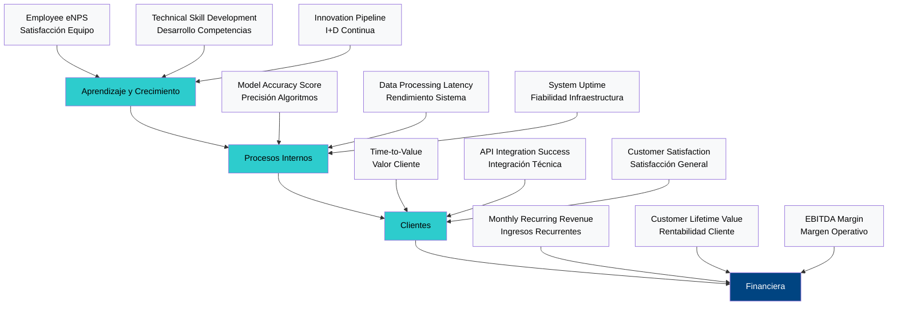

# SECCIÓN 3: PLAN ESTRATÉGICO

## 3.1 Misión, Visión y Valores Corporativos

La misión de VELMAK se fundamenta en la transformación radical del acceso al crédito mediante la democratización de tecnologías avanzadas de evaluación de riesgo que históricamente han estado reservadas para instituciones financieras de gran envergadura. Nuestro propósito trasciende la simple provisión de servicios tecnológicos para posicionarse como catalizador de inclusión financiera, desarrollando y operando un sistema de scoring que combine la precisión de la inteligencia artificial con la transparencia exigida por las regulaciones modernas y la sociedad civil. La misión se materializa a través de la creación de una plataforma B2B SaaS que permita a instituciones de todos los tamaños acceder a capacidades de evaluación de riesgo antes exclusivas de bancos multinacionales, eliminando así las barreras tecnológicas y económicas que perpetúan la exclusión financiera de millones de ciudadanos europeos. Esta misión se ejecuta mediante el desarrollo continuo de algoritmos de machine learning que procesan datos alternativos innovadores, combinando información no tradicional con técnicas avanzadas de IA explicable que proporcionan no solo una puntuación de riesgo, sino también una comprensión detallada de los factores que influyen en cada decisión de crédito.

La visión de VELMAK proyecta la consolidación de la empresa como el estándar europeo de referencia en scoring financiero basado en datos alternativos e inteligencia artificial explicable, estableciendo un nuevo paradigma en la evaluación de riesgo que equilibre innovación tecnológica con responsabilidad social y regulatoria. Esta visión se materializa en la creación de un ecosistema tecnológico que integre verticalmente toda la cadena de valor del scoring financiero, desde la ingestión y procesamiento de datos alternativos hasta la generación de explicaciones comprensibles y auditorías regulatorias automatizadas. VELMAK aspira a convertirse en la infraestructura crítica sobre la cual operen las instituciones financieras europeas del futuro, posicionándose como la capa de inteligencia que permita a bancos tradicionales competir eficazmente con nativos digitales, mientras facilita la entrada de nuevos players innovadores al mercado financiero. La visión a largo plazo incluye la expansión geográfica hacia mercados internacionales con marcos regulatorios compatibles, la diversificación hacia nuevos productos financieros basados en IA explicable, y la consolidación de una marca sinónimo de confianza, innovación y transparencia en el sector FinTech europeo.

Los valores corporativos de VELMAK constituyen el fundamento ético y operativo que guía todas las decisiones estratégicas y operativas de la organización, estableciendo un marco de referencia para la interacción con clientes, empleados, inversores y la sociedad en general. El valor central de la ética del dato se manifiesta en el compromiso inquebrantable con la privacidad, la seguridad y el uso responsable de la información, asegurando que cada algoritmo desarrollado y cada decisión automatizada respete los derechos fundamentales de los individuos y promueva la equidad en el acceso al crédito. La innovación continua representa otro pilar fundamental, impulsando a la organización a mantenerse en la frontera del conocimiento técnico y regulatorio, invirtiendo sistemáticamente en investigación y desarrollo para anticipar y responder a las evoluciones tecnológicas y las necesidades cambiantes del mercado financiero. La robustez técnica se materializa en la obsesión por la calidad, fiabilidad y escalabilidad de nuestros sistemas, entendiendo que en el sector financiero la confianza es el activo más valioso y cualquier fallo técnico puede tener consecuencias significativas tanto para nuestros clientes como para los usuarios finales.

## 3.2 Análisis del Entorno Macro (Análisis PESTL)

El entorno político y legal europeo presenta un escenario extraordinariamente favorable para la consolidación de VELMAK como líder en scoring financiero basado en IA explicable, caracterizado por un impulso regulatorio simultáneo hacia la apertura bancaria y la regulación de la inteligencia artificial. La Directiva PSD2 ha establecido las bases legales para el Open Banking, obligando a las entidades de crédito a facilitar el acceso a los datos de sus clientes mediante APIs estandarizadas, creando así un ecosistema de datos que VELMAK puede aprovechar legítimamente para desarrollar sus modelos de scoring. Paralelamente, la futura Artificial Intelligence Act europea establece un marco exigente pero claro para los sistemas de IA de alto riesgo como el scoring financiero, requiriendo transparencia, supervisión humana y auditorías periódicas que VELMAK está preparada para cumplir y convertir en ventaja competitiva. El marco regulatorio español complementa este entorno con la Ley de Startups, que proporciona beneficios fiscales y flexibilidad operativa para empresas tecnológicas innovadoras, mientras que la Ley de Servicios Financieros establece requisitos claros para operar con datos financieros que VELMAK cumple mediante su arquitectura de compliance integrada.

El entorno económico europeo evidencia una transformación acelerada del sector financiero, con las FinTechs capturando progresivamente cuota de mercado y los bancos tradicionales enfrentando la presión competitiva de modernizar sus sistemas heredados para mantener su relevancia. Esta dinámica genera una demanda creciente de soluciones tecnológicas como la de VELMAK que permitan a las instituciones financieras optimizar sus carteras de crédito, reducir tasas de morosidad y expandir su base de clientes mediante evaluaciones de riesgo más precisas e inclusivas. El mercado europeo de scoring financiero representa una oportunidad valorada en más de 2.500 millones de euros anuales, con un crecimiento anual compuesto proyectado del 12% impulsado por la digitalización acelerada post-pandemia y la creciente demanda de servicios financieros digitales. La presión sobre los márgenes bancarios tradicionales incentiva la adopción de soluciones SaaS que permitan optimizar costes operativos mientras se mejora la calidad del riesgo, creando así un entorno económico propicio para el modelo de negocio de VELMAK.

El entorno social europeo refleja una creciente demanda de transparencia, inclusión financiera y responsabilidad corporativa por parte de las instituciones financieras, generando un contexto social favorable para la propuesta de valor de VELMAK. Los consumidores europeos muestran niveles crecientes de preocupación por la opacidad de las decisiones algorítmicas que afectan sus vidas financieras, demandando explicaciones comprensibles y mecanismos de apelación efectivos. Esta demanda social se alinea perfectamente con la capacidad de VELMAK para proporcionar scoring con IA explicable, convirtiendo una exigencia social en una ventaja competitiva diferencial. Adicionalmente, la persistente exclusión financiera de segmentos significativos de la población, incluyendo jóvenes, inmigrantes y trabajadores autónomos, representa una oportunidad social y comercial para VELMAK de desarrollar modelos que evalúen el riesgo crediticio mediante datos alternativos que capturen la solvencia real de estos grupos tradicionalmente desatendidos. La creciente conciencia sobre la importancia de la diversidad e inclusión en el sector financiero impulsa additionally a las instituciones a adoptar sistemas que demuestren ausencia de sesgos algorítmicos, otro área donde la tecnología de VELMAK proporciona ventajas significativas.

El entorno tecnológico europeo presenta una madurez excepcional que facilita el desarrollo y despliegue de plataformas avanzadas como la de VELMAK, con una infraestructura cloud robusta, frameworks de machine learning sofisticados y un ecosistema de herramientas de MLOps que permiten automatizar el ciclo de vida completo de los modelos de IA. La disponibilidad generalizada de servicios cloud de alta calidad con centros de datos en territorio europeo garantiza el cumplimiento de las regulaciones de soberanía de datos mientras proporciona la escalabilidad necesaria para operar a nivel paneuropeo. El avance exponencial en técnicas de IA explicable, incluyendo SHAP, LIME y métodos contrafactuales, proporciona el fundamento técnico para desarrollar sistemas de scoring que cumplan con los requisitos regulatorios de transparencia sin sacrificar precisión predictiva. La madurez del ecosistema de APIs financieras, estandarizadas mediante PSD2, facilita la integración con múltiples entidades bancarias, mientras que la creciente disponibilidad de datos alternativos, desde comportamiento digital hasta patrones de consumo, enriquece significativamente la calidad de los modelos de riesgo desarrollados por VELMAK.

El entorno ecológico y de sostenibilidad introduce consideraciones estratégicas importantes para VELMAK, particularmente en relación con la eficiencia energética de la infraestructura cloud utilizada para procesar volúmenes masivos de datos y entrenar modelos complejos de machine learning. La creciente presión regulatoria y social para reducir la huella de carbono del sector tecnológico impulsa a VELMAK a optimizar sus algoritmos para reducir la complejidad computacional sin sacrificar precisión, seleccionar proveedores cloud que utilicen energías renovables, e implementar prácticas de computación eficiente que minimicen el consumo energético por transacción procesada. Esta orientación hacia la sostenibilidad no solo responde a exigencias regulatorias crecientes y expectativas sociales, sino que additionally representa una ventaja competitiva frente a competidores que no priorizan la eficiencia energética, particularmente en contratos con instituciones financieras que tienen compromisos públicos de sostenibilidad y criterios ESG en sus decisiones de procurement.

## 3.3 Matriz MCPE y Estrategias Competitivas

La Matriz Cuantitativa de Planificación Estratégica aplicada a VELMAK revela de manera concluyente que la estrategia de diferenciación representa la opción óptima para maximizar el valor creado y asegurar la sostenibilidad competitiva a largo plazo, superando significativamente las alternativas de liderazgo en costes o enfocamiento de nicho. El análisis cuantitativo evalúa cada estrategia potencial según criterios objetivos como atractivo del mercado, posicionamiento competitivo, requerimientos de recursos y capacidad de generar barreras de entrada sostenibles. La estrategia de diferenciación obtiene las puntuaciones más altas en todos los criterios críticos, particularmente en su capacidad para crear un valor único difícil de replicar por competidores existentes o potenciales. Esta estrategia se fundamenta en la combinación única de tres elementos diferenciadores: la utilización de datos alternativos innovadores que complementan la información crediticia tradicional, la implementación de técnicas avanzadas de IA explicable que garantizan transparencia regulatoria, y la arquitectura SaaS que permite una integración flexible y escalable con los sistemas existentes de las instituciones financieras.

La estrategia competitiva principal de VELMAK se materializa en una diferenciación fundamentada no en el precio, sino en el inmenso valor añadido proporcionado a clientes institucionales que buscan mejorar sus capacidades de evaluación de riesgo mientras cumplen con requisitos regulatorios cada vez más estrictos. A diferencia de los burós de crédito tradicionales como Equifax, Experian o Coface, que compiten principalmente en base a la profundidad de sus bases de datos históricos y la precisión de sus modelos tradicionales, VELMAK compite en una dimensión completamente diferente: la capacidad de proporcionar scoring más preciso, más inclusivo y completamente explicable. Esta diferenciación permite a VELMAK evitar la competencia directa por precios con players establecidos que benefician de economías de escala significativas, posicionándose en cambio como proveedor de valor estratégico que permite a sus clientes mejorar sus márgenes, reducir riesgos regulatorios y acceder a nuevos segmentos de mercado. La estrategia de diferenciación se refuerza adicionalmente mediante la especialización en el mercado B2B europeo, permitiendo a VELMAK desarrollar un conocimiento profundo de los requisitos regulatorios específicos de cada jurisdicción y las particularidades culturales del mercado financiero europeo.

La implementación de la estrategia de diferenciación requiere una asignación estratégica de recursos que priorice la innovación tecnológica continua, el desarrollo de capacidades regulatorias especializadas y la construcción de relaciones estratégicas con clientes institucionales que valoren el valor añadido proporcionado por VELMAK. Esta estrategia implica una inversión significativa en investigación y desarrollo para mantener la ventaja tecnológica en áreas críticas como la IA explicable, el procesamiento de datos alternativos y las arquitecturas de MLOps que permitan la actualización continua de modelos en producción. Adicionalmente, requiere el desarrollo de capacidades comerciales especializadas que permitan comunicar eficazmente el valor diferencial de la propuesta de VELMAK a decisores de compra en instituciones financieras, combinando conocimiento técnico profundo con comprensión de los desafíos de negocio específicos del sector. La estrategia de diferenciación se complementa con un enfoque selectivo de mercado que priorice inicialmente clientes con mayor capacidad para valorar y pagar por el valor añadido proporcionado, como bancos medianos con ambiciones de transformación digital y FinTechs establecidas que buscan diferenciarse mediante tecnología avanzada.

La sostenibilidad de la estrategia de diferenciación se refuerza mediante la creación de barreras de entrada múltiples y complementarias que dificultan significativamente la replicación del modelo de negocio de VELMAK por parte de competidores. Estas barreras incluyen la acumulación de datos alternativos propietarios que mejoran continuamente la precisión de los modelos, el desarrollo de conocimiento regulatorio especializado que requiere años de experiencia en el sector financiero europeo, y la construcción de una marca reconocida por la calidad y fiabilidad de sus sistemas de scoring. Adicionalmente, la estrategia de diferenciación se beneficia de efectos de red crecientes, donde cada nuevo cliente contribuye con datos anonimizados que mejoran la precisión general del sistema, creando así una ventaja acumulativa que se refuerza exponencialmente con la expansión de VELMAK en el mercado. Esta combinación de barreras tecnológicas, regulatorias y de mercado posiciona a VELMAK estratégicamente para mantener su ventaja competitiva a largo plazo mientras escala su operación geográficamente.

## 3.4 Cuadro de Mando Integral (Balanced Scorecard)

La perspectiva financiera del Cuadro de Mando Integral de VELMAK se centra en la construcción de un modelo de negocio SaaS altamente escalable que genere flujos de ingresos recurrentes y crecientes mientras mantiene márgenes de rentabilidad saludables a medida que la empresa alcanza economías de escala. Los indicadores clave en esta perspectiva incluyen el Monthly Recurring Revenue (MRR) como medida principal del crecimiento de ingresos, el Customer Lifetime Value (LTV) para evaluar la rentabilidad a largo plazo de cada cliente, y el Customer Acquisition Cost (CAC) para optimizar la eficiencia de las inversiones en marketing y ventas. Adicionalmente, se monitoriza el Gross Revenue Retention Rate para medir la capacidad de retener clientes existentes, el Average Revenue Per User (ARPU) para optimizar las estrategias de pricing y upselling, y el EBITDA margin como indicador de la eficiencia operativa y rentabilidad del negocio. La perspectiva financiera se complementa con métricas de cash flow que aseguren la sostenibilidad financiera durante las fases iniciales de alta inversión, incluyendo el runway disponible y el burn rate mensual, permitiendo una gestión prudente de los recursos financieros mientras se alcanza el punto de equilibrio.

La perspectiva del cliente en el Cuadro de Mando Integral se enfoca en medir el éxito de VELMAK en la adopción de su plataforma B2B por parte de instituciones financieras y la satisfacción resultante de la experiencia de integración y uso continuo. Los indicadores fundamentales incluyen el Time-to-Value, que mide el tiempo transcurrido desde la firma del contrato hasta que el cliente comienza a obtener valor tangible del sistema de scoring, y el API Integration Success Rate, que evalúa la fiabilidad y facilidad de integración técnica con los sistemas existentes de los clientes. Adicionalmente, se monitoriza el Customer Satisfaction Score (CSAT) y el Net Promoter Score (NPS) para medir la satisfacción general con el producto y servicio, el Feature Adoption Rate para evaluar qué funcionalidades de la plataforma utilizan activamente los clientes, y el Support Ticket Resolution Time para medir la eficacia del servicio post-venta. La perspectiva del cliente se complementa con análisis de churn rate y churn reasons que permitan identificar patrones de abandono y desarrollar estrategias proactivas de retención, asegurando la construcción de relaciones duraderas con clientes institucionales.

La perspectiva de procesos internos del Cuadro de Mando Integral se centra en la excelencia operativa de las capacidades tecnológicas y de gestión de datos que constituyen el núcleo del valor proporcionado por VELMAK. Los indicadores clave incluyen el Model Accuracy Score, que mide la precisión predictiva de los algoritmos de scoring comparada con benchmarks del sector, y el Model Update Frequency, que evalúa la capacidad de la organización para actualizar y mejorar continuamente los modelos en producción. Adicionalmente, se monitoriza el Data Processing Latency para asegurar que los tiempos de respuesta del sistema cumplan con las expectativas de los clientes institucionales, el System Uptime como medida de la fiabilidad de la infraestructura tecnológica, y el Security Incident Rate como indicador de la efectividad de las medidas de ciberseguridad implementadas. La perspectiva de procesos internos se complementa con métricas de MLOps maturity que evalúan la automatización del ciclo de vida de los modelos, incluyendo el tiempo requerido para entrenar nuevos modelos, desplegar actualizaciones y monitorizar el rendimiento en producción, asegurando así una operación eficiente y escalable.

La perspectiva de aprendizaje y crecimiento del Cuadro de Mando Integral se enfoca en la construcción y retención del capital humano y las capacidades organizacionales que sustentan la ventaja competitiva de VELMAK a largo plazo. Los indicadores fundamentales incluyen el Employee Net Promoter Score (eNPS) para medir la satisfacción y compromiso del equipo, y el Technical Skill Development Index que evalúa la actualización continua de las competencias técnicas en áreas críticas como IA explicable, machine learning y ciberseguridad financiera. Adicionalmente, se monitoriza el Innovation Pipeline Strength, que mide el número y calidad de nuevas ideas y proyectos de investigación en desarrollo, el Knowledge Sharing Rate que evalúa la efectividad de los mecanismos internos de transferencia de conocimiento, y the Diversity and Inclusion Index para asegurar la construcción de equipos diversos que aporten diferentes perspectivas a la resolución de problemas complejos. La perspectiva de aprendizaje y crecimiento se complementa con métricas de employer branding que miden la atracción de talento top en el mercado tecnológico y financiero, incluyendo el tiempo promedio para cubrir posiciones críticas y la calidad de los candidatos atraídos, asegurando así la construcción de una organización capaz de mantener su ventaja competitiva mediante la excelencia de su capital humano.

