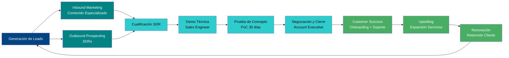

# SECCIÓN 4: PLAN MARKETING Y COMERCIAL

## 4.1 Marketing Estratégico: DAFO, Segmentación y Posicionamiento

El análisis DAFO de VELMAK revela una posición estratégica excepcionalmente favorable en el mercado europeo de scoring financiero, caracterizada por fortalezas tecnológicas y regulatorias únicas que crean barreras de entrada significativas para competidores potenciales. Las fortalezas fundamentales incluyen la capacidad de proporcionar scoring financiero con IA explicable que cumple proactivamente con los requisitos de la AI Act europea, la utilización innovadora de datos alternativos que complementan la información crediticia tradicional, y una arquitectura tecnológica basada en microservicios que permite una integración flexible y escalable con los sistemas existentes de las instituciones financieras. Adicionalmente, VELMAK posee una ventaja competitiva derivada de su conocimiento profundo del entorno regulatorio europeo y su capacidad para operar como puente entre la innovación tecnológica y el cumplimiento normativo exigido por el sector financiero. Estas fortalezas se refuerzan mediante un equipo fundador multidisciplinar que combina experiencia técnica en machine learning con visión de negocio financiera, permitiendo desarrollar soluciones que no solo son tecnológicamente superiores sino que además responden a las necesidades reales del mercado.

Las debilidades identificadas en el análisis DAFO se centran principalmente en los desafíos inherentes a toda startup en fase inicial, incluyendo la falta de reputación establecida en el mercado financiero tradicional y recursos financieros limitados para competir con grandes burós de crédito que benefician de economías de escala significativas. La dependencia de proveedores externos para ciertos datos alternativos representa otra vulnerabilidad potencial, aunque esta se mitiga mediante la diversificación de fuentes y el desarrollo de capacidades propias de recolección y procesamiento de datos. La complejidad técnica del producto requiere un ciclo de ventas más extenso que el de soluciones más simples, lo que puede ralentizar inicialmente la adquisición de clientes. Sin embargo, estas debilidades son transitorias y se abordan sistemáticamente mediante la ejecución de estrategias específicas de construcción de marca, optimización de recursos y desarrollo de metodologías de venta eficientes que reduzcan los ciclos de conversión.

Las oportunidades del mercado europeo de scoring financiero son extraordinarias y se derivan de transformaciones estructurales que están redefiniendo el sector financiero. La creciente presión regulatoria hacia la transparencia algorítmica y la inclusión financiera crea una demanda insatisfecha por soluciones como la de VELMAK que combinan precisión técnica con explicabilidad regulatoria. La digitalización acelerada del sector financiero, impulsada por la pandemia y cambios en los comportamientos de los consumidores, ha generado una brecha de capacidades tecnológicas en muchas instituciones tradicionales que buscan activamente socios tecnológicos que les permitan competir eficazmente con nativos digitales. Adicionalmente, el crecimiento exponencial del ecosistema FinTech europeo crea un mercado creciente de clientes potenciales que requieren capacidades sofisticadas de evaluación de riesgo pero que carecen de los recursos para desarrollarlas internamente, representando así una oportunidad estratégica para VELMAK.

Las amenazas principales incluyen la resistencia al cambio característica del sector bancario tradicional, que puede retrasar las decisiones de adopción de nuevas tecnologías, y la posible entrada de competidores grandes con recursos significativos que podrían replicar parcialmente la propuesta de valor de VELMAK. La evolución regulatoria constante, aunque representa una oportunidad, también constituye una amenaza al requerir inversiones continuas en cumplimiento y adaptación tecnológica. Sin embargo, estas amenazas se mitigan mediante la estrategia de diferenciación de VELMAK, que no compite por precio sino por valor añadido único, y mediante la construcción de barreras de entrada basadas en conocimiento regulatorio especializado y acumulación de datos propietarios que mejoran continuamente la precisión de los modelos.

La segmentación de mercado de VELMAK se define estratégicamente como exclusivamente B2B, enfocándose en instituciones financieras y empresas tecnológicas del sector financiero europeo, excluyendo deliberadamente el mercado B2C de usuarios finales. Este segmento primario se divide en tres subsegmentos principales con características y necesidades diferenciadas. El primer subsegmento está compuesto por bancos tradicionales y cajas de ahorros que enfrentan la presión dual de la transformación digital y la necesidad de modernizar sus sistemas heredados de scoring para mantener su competitividad frente a neobancos y FinTechs. El segundo subsegmento incluye neobancos y FinTechs emergentes que, aunque nativas digitalmente, carecen de la profundidad analítica y experiencia regulatoria necesaria para desarrollar sistemas de scoring sofisticados que cumplan con los estándares europeos de IA explicable. El tercer subsegmento, potencialmente más lucrativo, está integrado por proveedores de servicios financieros especializados incluyendo plataformas de buy-now-pay-later, servicios de evaluación de riesgo para terceros, y empresas de tecnología financiera que requieren capacidades de scoring precisas y auditables para operar legalmente en múltiples jurisdicciones europeas.

El posicionamiento de VELMAK se establece como la alternativa transparente, ética y moderna frente a los sistemas "caja negra" y los burós de crédito tradicionales como Experian, Equifax y Coface. Este posicionamiento se fundamenta en tres pilares diferenciadores: la capacidad de proporcionar scoring financiero con explicaciones detalladas y comprensibles que cumplen con los requisitos regulatorios más exigentes, la utilización de datos alternativos innovadores que permiten evaluar el riesgo de segmentos de población tradicionalmente excluidos, y una arquitectura tecnológica moderna basada en APIs que facilita la integración con los sistemas existentes de las instituciones financieras. VELMAK se posiciona no como un sustituto de los burós tradicionales, sino como una capa de inteligencia complementaria que permite a las instituciones financieras mejorar sus capacidades de evaluación de riesgo mientras cumplen con las nuevas exigencias de transparencia y ética algorítmica. Este posicionamiento se refuerza mediante una marca asociada a la innovación, la responsabilidad social y la excelencia técnica, creando una percepción de valor premium que justifica los precios premium del modelo SaaS.

## 4.2 Marketing Operativo (Las 4Ps en un modelo SaaS)

El producto de VELMAK se define como un servicio SaaS de alto valor consumible mediante API RESTful acompañado de un dashboard directivo que proporciona una experiencia completa de gestión y monitorización del scoring financiero. La API RESTful constituye el componente central del producto, permitiendo a las instituciones financieras integrar capacidades avanzadas de scoring directamente en sus sistemas existentes mediante llamadas HTTP estándar que retornan no solo una puntuación de riesgo sino también explicaciones detalladas del razonamiento behind each decisión. El dashboard directivo complementa la funcionalidad de la API proporcionando una interfaz visual intuitiva para la monitorización de métricas clave, la configuración de parámetros de scoring, la visualización de tendencias de riesgo y la gestión de usuarios y permisos dentro de la organización cliente. Este producto se caracteriza por su arquitectura basada en microservicios que garantiza escalabilidad horizontal, su capacidad de procesamiento en tiempo real con latencias inferiores a 200 milisegundos, y su cumplimiento intrínseco con los requisitos regulatorios europeos de protección de datos y transparencia algorítmica.

La estrategia de precios de VELMAK se estructura mediante un modelo de suscripción escalable (Tiered Pricing) diseñado para acomodar las necesidades y capacidades de diferentes tamaños de instituciones financieras mientras maximiza el valor capturado a medida que los clientes crecen y utilizan más intensivamente el servicio. El nivel Starter está dirigido a pequeñas FinTechs y neobancos emergentes, con un coste fijo mensual de 5.000€ que incluye hasta 10.000 evaluaciones de scoring mensuales, soporte técnico estándar y acceso a la documentación básica de integración. El nivel Professional atiende a bancos medianos y FinTechs establecidas con 15.000€ mensuales por hasta 50.000 evaluaciones, incluyendo adicionalmente soporte prioritario, acceso a funciones avanzadas de personalización y consultoría inicial de integración. El nivel Enterprise ofrece capacidades ilimitadas para grandes instituciones financieras con 50.000€ mensuales más un coste variable de 0.10€ por evaluación adicional, incluyendo soporte dedicado 24/7, un gerente de cuenta personal, y servicios de consultoría estratégica continua. Este modelo de precios genera ingresos recurrentes predecibles (MRR) mientras permite a los clientes escalar su uso de manera flexible y alineada con su crecimiento.

La estrategia de distribución (Plaza) de VELMAK combina la venta directa B2B con alianzas estratégicas con integradores de software bancario y proveedores de core banking systems para maximizar el alcance y acelerar la penetración en el mercado. La venta directa se ejecuta mediante un equipo comercial especializado que identifica prospectos cualificados, desarrolla relaciones estratégicas con decisores clave en instituciones financieras, y gestiona el ciclo completo de ventas desde el contacto inicial hasta el cierre y postventa. Las alianzas con integradores de software bancario permiten a VELMAK acceder a carteras existentes de clientes y ofrecer su solución como módulo complementario de sistemas ya implantados, reduciendo significativamente los tiempos de implementación y los costes de adquisición. Adicionalmente, VELMAK desarrolla relaciones con consultoras especializadas en transformación digital del sector financiero que actúan como canales indirectos de distribución, recomendando e implementando la solución de VELMAK en sus proyectos de modernización de clientes institucionales.

La estrategia de comunicación (Promoción) de VELMAK se centra en el marketing de contenidos hiper-especializado que demuestre liderazgo intelectual y genere confianza en el sector financiero, complementado con una presencia estratégica en eventos y foros especializados. La estrategia de contenidos se materializa mediante la publicación regular de whitepapers técnicos sobre mitigación de sesgos en algoritmos de IA, estudios de caso sobre la reducción de tasas de morosidad mediante datos alternativos, y artículos de opinión sobre la evolución regulatoria y su impacto en el scoring financiero. VELMAK participa activamente en los congresos FinTech más importantes de Europa, incluyendo Money20/20, Web Summit y eventos especializados en regulación bancaria, donde presenta casos de éxito y participa en paneles de discusión sobre el futuro de la evaluación de riesgo. Adicionalmente, se organiza una serie de webinars demostrativos mensuales dirigidos a diferentes perfiles de instituciones financieras, mostrando en tiempo real las capacidades del sistema y respondiendo preguntas técnicas de audiencias especializadas. Esta estrategia de comunicación se refuerza mediante campañas de relaciones públicas enfocadas en publicaciones especializadas del sector financiero y tecnológico, generando cobertura mediática que construye la reputación de VELMAK como líder en scoring financiero con IA explicable.

## 4.3 Plan Comercial y Ciclo de Ventas B2B

La estructura del equipo comercial de VELMAK se diseña estratégicamente para abordar las complejidades específicas de la venta enterprise de tecnología sofisticada al sector financiero, diferenciando roles especializados que cubran cada fase del ciclo de ventas mientras maximicen la eficiencia y tasa de conversión. Los Sales Development Representatives (SDRs) constituyen la primera línea del equipo comercial, enfocándose en la prospección sistemática y cualificación inicial de oportunidades mediante investigación avanzada de mercado, identificación de instituciones financieras con necesidades explícitas de modernización de sistemas de scoring, y generación de leads cualificados mediante campañas de inbound marketing y outreach personalizado. Los Account Executives (AEs) asumen la responsabilidad de gestionar el ciclo completo de ventas con prospectos cualificados, desarrollando relaciones estratégicas con decisores clave como Chief Risk Officers, Chief Technology Officers y Chief Data Officers, presentando la propuesta de valor de VELMAK y negociando los términos contractuales hasta el cierre del acuerdo. El rol crítico del Sales Engineer o Data Translator complementa al equipo comercial actuando como puente técnico entre las capacidades del producto y las necesidades específicas de cada cliente, defendiendo la validez y robustez del algoritmo ante los equipos técnicos del cliente y traduciendo requisitos de negocio en especificaciones técnicas implementables.

El método de venta consultiva de VELMAK se fundamenta en una aproximación basada en el valor y la confianza, alejándose de estrategias transaccionales centradas únicamente en el precio para enfocarse en demostrar el impacto transformador que la solución puede tener en las operaciones y resultados del cliente. Este método comienza con una fase profunda de diagnóstico de las necesidades específicas del cliente, incluyendo el análisis de sus sistemas actuales de scoring, la identificación de puntos de dolor como tasas de morosidad elevadas o exclusiones injustificadas, y la comprensión de sus objetivos estratégicos de transformación digital. A continuación, se desarrolla una propuesta personalizada que cuantifica el valor esperado de la implementación de VELMAK, incluyendo proyecciones de reducción de costes, mejora en la precisión del riesgo, y cumplimiento regulatorio mejorado. Este enfoque consultivo se refuerza mediante la demostración técnica de capacidades y la presentación de casos de éxito de instituciones similares, creando una narrativa convincente que posiciona a VELMAK como socio estratégico en lugar de simple proveedor tecnológico.

El ciclo de ventas B2B de VELMAK se caracteriza por su duración extendida y complejidad, reflejando la naturaleza enterprise de los clientes y el impacto crítico de las decisiones de evaluación de riesgo en sus operaciones. El ciclo típicamente se extiende entre seis y doce meses, comenzando con la fase de prospección y cualificación donde los SDRs identifican y validan oportunidades potenciales. La siguiente fase involucra reuniones de descubrimiento donde los AEs y Sales Engineers comprenden profundamente las necesidades del cliente y presentan una visión preliminar de la solución. Le sigue la fase de demostración técnica donde se realizan presentaciones detalladas del producto y se discuten aspectos específicos de integración y cumplimiento regulatorio. La fase crítica de Prueba de Concepto (PoC) permite al cliente potencial validar la efectividad del sistema con sus propios datos históricos en un entorno controlado, generalmente durante un período de 30 días, demostrando concretamente la reducción en tasas de morosidad y la mejora en la precisión del scoring. Finalmente, la fase de negociación y cierre involucra la definición de términos contractuales, negociación de precios según el modelo tiered apropiado, y preparación para la implementación post-venta.

La herramienta principal de conversión en el ciclo de ventas de VELMAK es la ejecución de Pruebas de Concepto (PoC - Proof of Concept) gratuitas o a bajo coste durante 30 días, diseñadas para permitir al banco cliente validar empíricamente la reducción de su tasa de morosidad (NPL) con sus propios datos históricos antes de comprometerse con un contrato anual. Estas PoCs se implementan en un entorno seguro y aislado donde el cliente puede procesar un subconjunto representativo de su cartera de crédito utilizando el sistema de VELMAK, comparando los resultados con sus sistemas actuales y midiendo métricas clave como mejora en la precisión predictiva, reducción de falsos negativos, y capacidad de identificar oportunidades de negocio previamente no detectadas. El proceso de PoC incluye soporte técnico dedicado, sesiones de formación para el equipo del cliente, y reportes periódicos de progreso que demuestran el valor generado. Esta estrategia reduce significativamente el riesgo percibido por el cliente y acelera la decisión de compra al proporcionar evidencia concreta del retorno de inversión esperado, convirtiendo la propuesta abstracta de valor en resultados tangibles y medibles.

El equipo de Customer Success de VELMAK asume un rol estratégico en el ciclo de ventas y postventa, enfocándose en maximizar el valor obtenido por los clientes y facilitar el upselling de servicios adicionales. Este equipo gestiona la implementación inicial, asegurando una integración técnica fluida con los sistemas existentes del cliente y proporcionando formación completa a todos los usuarios involucrados en el proceso de scoring. Durante el primer año de la relación, el equipo de Customer Success realiza reuniones trimestrales de revisión para identificar oportunidades de optimización, resolver proactivamente cualquier desafío técnico, y explorar necesidades adicionales que puedan ser atendidas mediante servicios complementarios. Esta aproximación centrada en el éxito del cliente no solo mejora las tasas de retención y reduce el churn, sino que additionally genera oportunidades de upselling y cross-selling que aumentan el valor lifetime de cada cliente. El equipo de Customer Success también actúa como canal valioso de feedback para el equipo de producto, proporcionando insights sobre nuevas funcionalidades demandadas y mejoras necesarias que alimentan el roadmap de desarrollo futuro de VELMAK.

