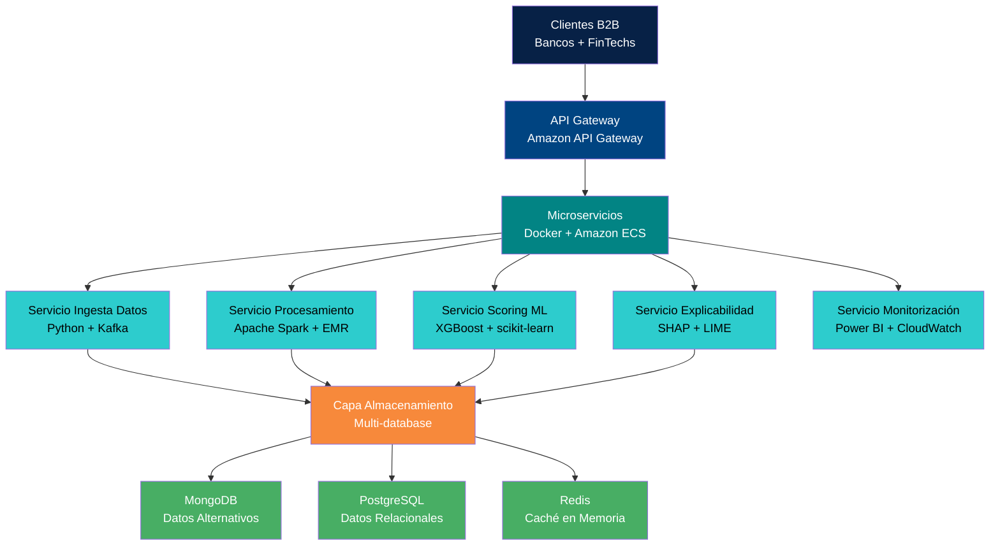
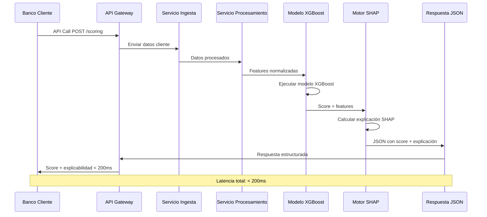
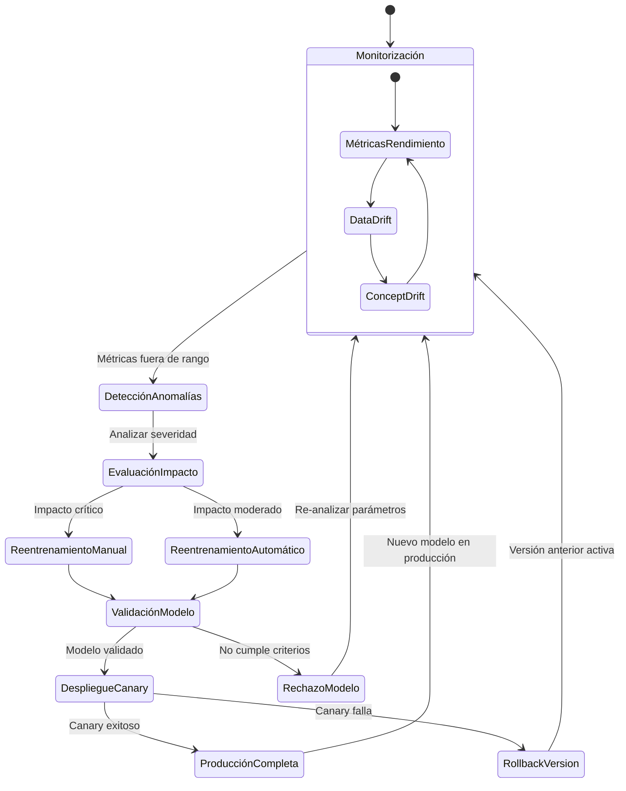
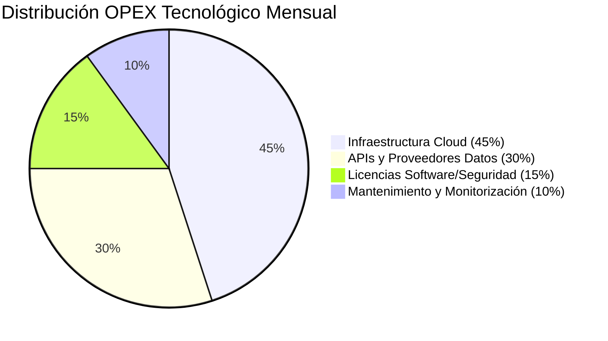

# SECCIÓN 5: PLAN DE PRODUCCIÓN Y OPERACIONES

## 5.1 Localización e Infraestructura Tecnológica (Cloud & Tech Stack)

La decisión estratégica de establecer la sede operativa de VELMAK en Madrid responde a una evaluación exhaustiva de factores que incluyen el acceso a talento tecnológico especializado, la proximidad a centros de decisión financiera europea, y la existencia de un ecosistema FinTech maduro que facilita la colaboración con instituciones financieras y reguladores. Madrid se consolida como hub tecnológico europeo con un creciente ecosistema de startups especializadas en IA y Big Data, proporcionando acceso a perfiles técnicos altamente cualificados en data science, machine learning engineering y cloud architecture. Adicionalmente, la capital española ofrece ventajas logísticas significativas para operar a nivel paneuropeo, incluyendo excelentes conexiones aéreas con principales centros financieros europeos como Londres, Frankfurt y París, y un marco regulatorio estable que facilita la expansión internacional. La presencia de sedes de grandes instituciones financieras y multinacionales tecnológicas en Madrid crea un entorno propicio para establecer alianzas estratégicas y acceder a clientes potenciales de alto valor.

La infraestructura tecnológica de VELMAK se diseña como 100% cloud-native, seleccionando AWS como plataforma principal por su madurez, cumplimiento regulatorio europeo mediante centros de datos en Frankfurt e Irlanda, y ecosistema de servicios especializados en machine learning y procesamiento de datos a gran escala. Esta arquitectura cloud-native permite a VELMAK operar con una base de costes variable que escala con la demanda, eliminando la necesidad de inversiones masivas en infraestructura propia y facilitando la expansión geográfica mediante despliegue en múltiples regiones AWS según las necesidades de cumplimiento de soberanía de datos de los clientes. La elección de AWS se complementa con una estrategia multi-cloud que contempla la posibilidad de desplegar servicios críticos en Microsoft Azure para clientes con preferencias específicas de proveedor, garantizando así flexibilidad estratégica y mitigación de riesgos de vendor lock-in.

El stack tecnológico seleccionado se fundamenta en Python como lenguaje principal de desarrollo, aprovechando su ecosistema maduro de librerías especializadas en machine learning como scikit-learn, XGBoost, TensorFlow y PyTorch, junto con frameworks de IA explicable como SHAP y LIME que son fundamentales para el cumplimiento regulatorio. Para el procesamiento distribuido de datos a gran escala, se implementa Apache Spark mediante AWS EMR, permitiendo procesar volúmenes masivos de datos alternativos y transaccionales con latencias controladas y escalabilidad horizontal. La mensajería en tiempo real se gestiona mediante Apache Kafka desplegado en Amazon MSK, proporcionando una capa de comunicación asíncrona y escalable que permite la ingesta de datos de múltiples fuentes simultáneamente, incluyendo APIs de Open Banking, agregadores de huella digital y sistemas de clientes institucionales. Las bases de datos se estructuran mediante un enfoque poliglota, utilizando MongoDB para almacenar datos alternativos no estructurados y semi-estructurados, PostgreSQL para datos relacionales y transaccionales, y Redis como capa de caché en memoria para optimizar tiempos de respuesta en consultas frecuentes.

La arquitectura de microservicios constituye el pilar fundamental del diseño técnico de VELMAK, permitiendo el desarrollo, despliegue y escalado independiente de componentes especializados según las necesidades del negocio. La capa de API Gateway, implementada mediante Amazon API Gateway, actúa como punto de entrada único que gestiona autenticación, autorización, rate limiting y routing hacia los microservicios correspondientes. Los microservicios principales incluyen el servicio de ingesta de datos, el servicio de procesamiento y feature engineering, el servicio de scoring con modelos de machine learning, el servicio de explicabilidad mediante SHAP, y el servicio de monitorización y logging. Cada microservicio se despliega en contenedores Docker gestionados mediante Amazon ECS, con auto-scaling automático basado en métricas de CPU, memoria y número de peticiones, garantizando así un rendimiento consistente incluso bajo picos de demanda. La comunicación entre microservicios se realiza mediante gRPC para comunicaciones internas de baja latencia y REST para APIs externas, manteniendo una arquitectura híbrida que optimiza tanto el rendimiento interno como la compatibilidad con sistemas clientes.

## 5.2 Proceso Productivo del Dato (End-to-End Pipeline)

El proceso productivo de VELMAK se diseña como una cadena de montaje de datos altamente optimizada que transforma datos brutos en scoring financiero explicable con latencias controladas inferiores a 200 milisegundos, garantizando así una experiencia de usuario en tiempo real para las instituciones financieras clientes. La materia prima del proceso consiste en la ingesta de datos desde múltiples fuentes heterogéneas que incluyen APIs de Open Banking proporcionadas por bancos bajo el marco regulatorio PSD2, agregadores de datos de huella digital que capturan comportamiento digital de usuarios, y sistemas internos de los clientes que proporcionan información histórica de transacciones y comportamiento crediticio. Esta ingesta se realiza mediante conectores especializados que normalizan y validan los datos en tiempo real, aplicando reglas de calidad y consistencia antes de su almacenamiento en la capa de datos crudos, garantizando así que solo información verificada y estructurada ingrese al pipeline de procesamiento.

La etapa de procesamiento y feature engineering constituye el corazón técnico del pipeline productivo, donde los datos brutos se transforman en variables predictoras mediante algoritmos especializados que extraen patrones significativos y características relevantes para la evaluación de riesgo crediticio. Este proceso incluye la limpieza y normalización de datos, la imputación de valores faltantes mediante técnicas avanzadas de machine learning, la creación de features temporales que capturan tendencias y patrones estacionales, y la aplicación de técnicas de reducción de dimensionalidad para optimizar el rendimiento computacional. El feature engineering se realiza mediante pipelines de Apache Spark que procesan datos tanto batch como streaming, permitiendo actualizar características en tiempo real según llegan nuevas transacciones o eventos de comportamiento digital. Adicionalmente, se implementan técnicas de feature selection automatizadas que identifican las variables más predictivas para cada modelo específico, optimizando así la precisión y la interpretabilidad de los resultados.

La ejecución del modelo de IA explicable representa la etapa diferenciadora del pipeline productivo, donde se aplica el algoritmo de scoring principal basado en XGBoost, reconocido por su precisión en problemas de clasificación y su capacidad para manejar datos heterogéneos. El modelo XGBoost se entrena con datasets históricos que incluyen tanto datos tradicionales como alternativos, utilizando técnicas de validación cruzada y optimización de hiperparámetros para garantizar robustez y generalización. Paralelamente a la generación del score principal, se ejecuta el motor de explicabilidad basado en SHAP (SHapley Additive exPlanations) que calcula la contribución de cada variable al resultado final, proporcionando así una comprensión detallada del razonamiento detrás de cada decisión de scoring. Esta explicabilidad se genera en tiempo real mediante técnicas de aproximación que permiten calcular valores SHAP eficientemente sin sacrificar precisión, garantizando así que cada petición reciba no solo una puntuación de riesgo sino también una explicación comprensible que cumple con los requisitos regulatorios de transparencia algorítmica.

La entrega final del score se realiza mediante un API RESTful que retorna un JSON estructurado con múltiples componentes, incluyendo la puntuación de riesgo principal, las explicaciones detalladas de cada factor contribuyente, metadatos sobre el modelo utilizado, y métricas de confianza basadas en la similitud del caso evaluado con los datos de entrenamiento. Este JSON se diseña para ser fácilmente integrable con los sistemas existentes de los clientes, incluyendo sistemas de core banking, plataformas de gestión de riesgos, y aplicaciones de frontend para usuarios finales. La respuesta se optimiza mediante técnicas de compresión y caché inteligente que reducen el tiempo de transmisión y mejoran la experiencia del usuario. Adicionalmente, se implementa un sistema de logging y auditoría completa que registra cada petición y respuesta con metadatos detallados, permitiendo así trazabilidad completa y cumplimiento con requisitos regulatorios de explicabilidad y rendición de cuentas.

## 5.3 Control de Calidad y MLOps (Monitorización Continua)

El control de calidad del sistema VELMAK se implementa mediante un marco de MLOps sofisticado que garantiza la degradación controlada del rendimiento de los modelos y la detección proactiva de anomalías que puedan afectar la precisión del scoring financiero. Este marco se fundamenta en la monitorización continua de múltiples métricas de rendimiento que incluyen la precisión predictiva del modelo, la distribución de las predicciones generadas, los tiempos de respuesta del sistema, y la calidad de los datos de entrada. La monitorización se realiza mediante dashboards en tiempo real construidos con Power BI que proporcionan visibilidad completa sobre la salud del sistema a operadores técnicos y equipos de gestión, permitiendo identificar tendencias anómalas y patrones que requieran intervención. Adicionalmente, se implementan alertas automáticas configuradas para notificar al equipo de MLOps cuando las métricas clave se desvían de umbrales predefinidos, asegurando así una respuesta rápida ante cualquier deterioro del rendimiento.

El control del Data Drift constituye un componente crítico del sistema de calidad, implementando técnicas estadísticas avanzadas para detectar cambios en la distribución de los datos de entrada que puedan afectar la validez del modelo. Este control se realiza mediante comparaciones periódicas entre la distribución de los datos actuales y los datos utilizados durante el entrenamiento del modelo, utilizando métricas como Population Stability Index (PSI), Kolmogorov-Smirnov test, y Jensen-Shannon divergence. Cuando se detecta un data drift significativo, el sistema automáticamente activa protocolos de evaluación que incluyen el análisis del impacto potencial en la precisión del modelo y la recomendación de acciones correctivas que pueden ir desde el reentrenamiento del modelo hasta la recolección de nuevos datos de entrenamiento. Este enfoque proactivo permite a VELMAK mantener la precisión de sus modelos incluso cuando el entorno de datos evoluciona rápidamente, un factor crítico en el sector financiero donde los patrones de comportamiento pueden cambiar significativamente durante crisis económicas o transformaciones del mercado.

El Concept Drift monitoring complementa el control de Data Drift mediante la detección de cambios en las relaciones subyacentes entre las variables predictoras y el resultado objetivo, representando así cambios en los conceptos fundamentales que el modelo ha aprendido. Este control se implementa mediante técnicas de monitorización de la precisión del modelo en producción, comparando las predicciones generadas con resultados reales cuando estos están disponibles, y mediante análisis de la estabilidad de las características más importantes del modelo. El sistema utiliza métodos como el Drift Detection Method (DDM) y el Early Drift Detection Method (EDDM) para identificar cambios conceptuales de manera temprana, permitiendo así intervenciones proactivas antes de que la degradación del rendimiento afecte significativamente a los clientes. Cuando se detecta un concept drift, el sistema evalúa automáticamente la necesidad de reentrenamiento, considerando factores como la magnitud del drift, la disponibilidad de nuevos datos de entrenamiento, y el impacto potencial en las operaciones de los clientes.

El ciclo MLOps de reentrenamiento se diseña como un proceso automatizado半-automático que combina la detección inteligente de necesidades de actualización con la validación humana crítica para asegurar la calidad y fiabilidad de los nuevos modelos desplegados. Este ciclo comienza con la fase de monitorización continua que detecta anomalías o degradaciones en el rendimiento, seguida por una fase de evaluación automática que determina si el reentrenamiento es necesario basándose en umbrales predefinidos y análisis estadísticos. Si se determina la necesidad de reentrenamiento, el sistema automáticamente inicia el proceso de preparación de datos, incluyendo la recolección de nuevos datos relevantes, la validación de calidad, y el feature engineering actualizado. El reentrenamiento se realiza mediante pipelines automatizados que prueban múltiples configuraciones de hiperparámetros y técnicas de ensemble, seleccionando el modelo óptimo según métricas de precisión y explicabilidad. Finalmente, el nuevo modelo pasa por un proceso de validación riguroso que incluye pruebas de backtesting con datos históricos, evaluación de sesgos algorítmicos, y validación de cumplimiento regulatorio antes de su despliegue en producción mediante técnicas de canary deployment que minimizan el riesgo de interrupciones del servicio.

## 5.4 Proveedores Estratégicos y Costes Operativos Fijos (OPEX)

Los proveedores estratégicos de VELMAK constituyen el ecosistema tecnológico y de datos que hace posible la operación del sistema de scoring financiero, clasificándose en tres categorías principales que incluyen proveedores de infraestructura cloud, proveedores de datos y APIs especializadas, y partners tecnológicos complementarios. Los proveedores de infraestructura cloud están liderados por Amazon Web Services como plataforma principal, proporcionando servicios computacionales, almacenamiento, networking y herramientas especializadas en machine learning mediante AWS SageMaker, Amazon EMR y Amazon MSK. La relación con AWS se complementa con acuerdos enterprise que proporcionan soporte prioritario, descuentos por volumen de consumo, y acceso a equipos especializados en arquitectura cloud y cumplimiento regulatorio financiero. Adicionalmente, se mantienen contratos con proveedores de seguridad cloud como Cloudflare para protección DDoS y CDN, y con especialistas en compliance como OneTrust para gestión de privacidad y consentimientos de datos.

Los proveedores de datos y APIs especializadas representan el segundo pilar del ecosistema estratégico, incluyendo agregadores de datos financieros que proporcionan acceso a APIs de Open Banking bajo el marco PSD2, y burós de crédito tradicionales como Experian y Equifax utilizados inicialmente para calibrar y validar los modelos de VELMAK. La relación con estos proveedores se estructura mediante contratos de nivel enterprise que garantizan acceso prioritario a datos, calidad consistente de la información, y soporte técnico especializado para integraciones complejas. Los agregadores de datos financieros como Plaid, Tink o TrueLayer proporcionan conectividad normalizada con múltiples bancos europeos, reduciendo significativamente la complejidad técnica de la ingesta de datos transaccionales. Adicionalmente, VELMAK mantiene acuerdos con proveedores de datos alternativos especializados en huella digital, comportamiento online, y datos de geolocalización que enriquecen significativamente la capacidad predictiva de los modelos de scoring.

Los partners tecnológicos complementarios incluyen proveedores de software especializado en monitoring y observabilidad como Datadog y New Relic, herramientas de colaboración y desarrollo como GitHub y Atlassian, y plataformas de comunicación segura como Slack enterprise. Estos partners son fundamentales para mantener la eficiencia operativa del equipo técnico y garantizar la calidad y fiabilidad del servicio proporcionado a los clientes. Adicionalmente, VELMAK mantiene relaciones estratégicas con consultoras especializadas en transformación digital del sector financiero que actúan como canales de distribución y partners de implementación, proporcionando acceso a clientes enterprise y complementando las capacidades internas con experiencia especializada en integración con sistemas legacy bancarios.

Los costes operativos fijos proyectados de VELMAK se estiman entre 25.000€ y 40.000€ mensuales, distribuidos estratégicamente entre las diferentes categorías de proveedores para garantizar un equilibrio óptimo entre calidad del servicio y eficiencia económica. El componente principal de estos costes, aproximadamente el 45% del total, se destina a consumo de infraestructura cloud, incluyendo computación para procesamiento de machine learning, almacenamiento de datos masivos, networking y servicios especializados. El 30% de los costes se asigna a APIs y proveedores de datos, incluyendo licencias de acceso a APIs de Open Banking, suscripciones a burós de crédito tradicionales para calibración, y costes por transacción de agregadores de datos. El 15% restante se destina a licencias de software y servicios de seguridad, incluyendo herramientas de monitoring, plataformas de desarrollo, y servicios de ciberseguridad y compliance. El 10% final se reserva para mantenimiento y monitorización continua, incluyendo soporte técnico enterprise, actualizaciones de sistemas, y servicios de consultoría especializada para optimización de arquitectura y procesos.

