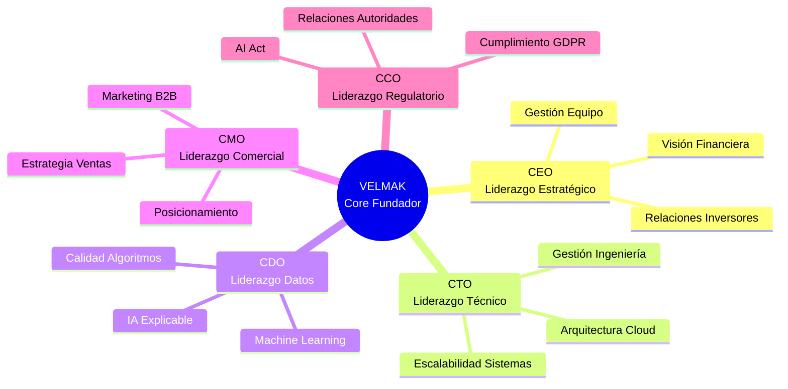
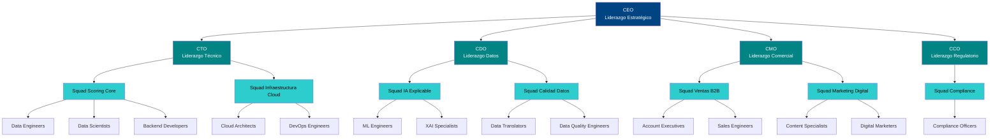
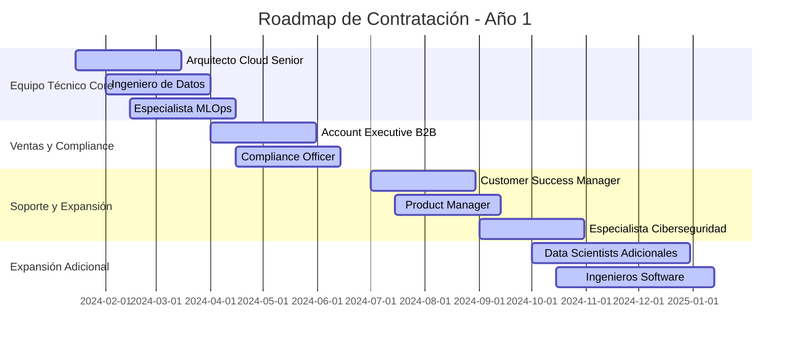
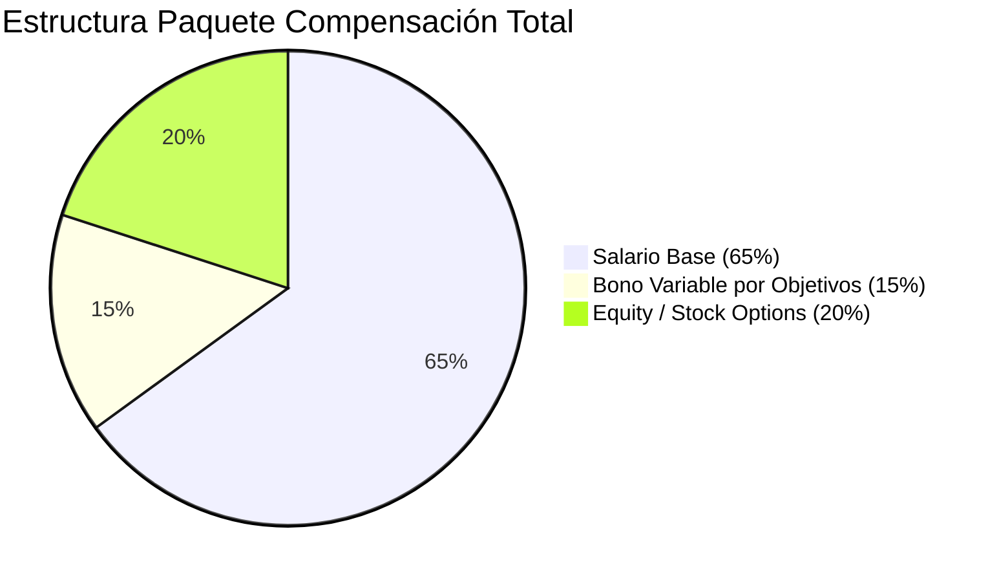

# SECCIÓN 6: PLAN DE RECURSOS HUMANOS

## 6.1 El Equipo Promotor (Founders) y Liderazgo Estratégico

El equipo promotor de VELMAK se compone de cinco perfiles complementarios que proporcionan el equilibrio perfecto entre visión de negocio, profundidad técnica y experiencia regulatoria necesaria para ejecutar con éxito un proyecto de alta complejidad tecnológica en el sector financiero. Esta composición multidisciplinar mitiga significativamente el riesgo de ejecución al combinar la experiencia estratégica del sector financiero con el conocimiento técnico profundo de inteligencia artificial y la visión comercial necesaria para penetrar mercados enterprise. El liderazgo dual entre áreas de negocio y tecnología permite tomar decisiones equilibradas que consideran tanto la viabilidad comercial como la factibilidad técnica, evitando así los desajustes comunes en startups tecnológicas donde predominan perfiles exclusivamente técnicos o exclusivamente comerciales. Esta estructura de liderazgo equilibrada facilita additionally la comunicación con diferentes tipos de stakeholders, desde inversores y reguladores hasta clientes institucionales y equipos técnicos, garantizando así una gestión coherente y consistente en todas las interacciones de la empresa.

El liderazgo de negocio de VELMAK está encabezado por el CEO, perfil con experiencia demostrada en transformación digital del sector financiero y profundo conocimiento del mercado europeo de servicios FinTech, complementado por el Chief Marketing Officer (CMO) con especialización en marketing B2B enterprise y experiencia previa en comercialización de productos tecnológicos complejos a instituciones financieras. Este binomino de liderazgo comercial proporciona la visión estratégica necesaria para identificar oportunidades de mercado, desarrollar relaciones con clientes institucionales, y construir una marca sólida en el competitivo ecosistema FinTech europeo. El CEO aporta additionally experiencia en gestión de equipos multidisciplinares y liderazgo en entornos de alta incertidumbre, mientras que el CMO contribuye con capacidades estratégicas de posicionamiento, desarrollo de canales de distribución y construcción de narrativas de valor que resuenen con decisores de compra en el sector financiero.

El liderazgo técnico de VELMAK se fundamenta en la sinergia entre el Chief Technology Officer (CTO) y el Chief Data Officer (CDO), perfiles que combinan profundidad técnica con visión estratégica de negocio en áreas críticas para el éxito del proyecto. El CTO aporta experiencia en arquitectura de sistemas cloud-native, gestión de equipos de ingeniería ágil y despliegue de productos a escala, garantizando así la robustez y escalabilidad de la infraestructura tecnológica que sustenta el servicio de scoring. Por su parte, el CDO aporta conocimiento especializado en data science, machine learning y explicabilidad algorítmica, áreas fundamentales para diferenciar la propuesta de valor de VELMAK en un mercado cada vez más exigente en términos de transparencia y cumplimiento regulatorio. Esta combinación de liderazgo técnico permite a VELMAK desarrollar productos tecnológicamente superiores mientras se asegura que estos productos respondan efectivamente a las necesidades reales del mercado financiero y cumplan con los requisitos regulatorios más exigentes.

La experiencia complementaria del equipo directivo se refuerza mediante la inclusión de un Chief Compliance Officer (CCO) con experiencia previa en regulación financiera y protección de datos en instituciones bancarias europeas, perfil fundamental para navegar el complejo entorno regulatorio que afecta a las startups FinTech. Este liderazgo regulatorio proporciona a VELMAK una ventaja competitiva significativa al anticipar cambios normativos, desarrollar productos compliant desde el diseño, y construir relaciones constructivas con autoridades supervisoras. La experiencia combinada del equipo fundador en diferentes sectores y disciplinas crea una perspectiva holística que permite identificar riesgos y oportunidades que podrían pasar desapercibidos para equipos más homogéneos. Adicionalmente, esta diversidad de experiencias facilita la toma de decisiones más robustas mediante el análisis de problemas desde múltiples ángulos, reduciendo así la probabilidad de sesgos cognitivos y puntos ciegos que podrían afectar negativamente el desarrollo del negocio.

## 6.2 Estructura Organizativa y Organigrama

La estructura organizativa de VELMAK se diseña deliberadamente para evitar las jerarquías tradicionales y rígidas que caracterizan a las corporaciones bancarias, adoptando en cambio un modelo basado en metodologías ágiles que favorezcan la colaboración, la toma de decisiones descentralizada y la rápida adaptación a cambios del mercado. Esta estructura se fundamenta en la formación de squads multifuncionales que combinan perfiles técnicos, de negocio y de producto, trabajando de manera autónoma en objetivos específicos con métricas claras de éxito. Los squads se organizan alrededor de productos o flujos de valor específicos, como el squad de scoring core, el squad de explicabilidad algorítmica, el squad de integración cliente y el squad de crecimiento y expansión. Cada squad opera con un alto grado de autonomía mientras mantiene una fuerte alineación estratégica con los objetivos generales de la empresa, creando así un equilibrio óptimo entre agilidad local y coherencia global.

La colaboración estrecha entre equipos técnicos y equipos de negocio constituye un pilar fundamental de la estructura organizativa, rompiendo las barreras tradicionales entre desarrollo de producto y comercialización que generan ineficiencias y desalineaciones en muchas organizaciones tecnológicas. Los Data Engineers y Data Scientists trabajan codo a codo con los Data Translators y el equipo comercial B2B en un entorno de colaboración continua donde el feedback del mercado se integra directamente en el ciclo de desarrollo del producto. Esta aproximación permite a VELMAK asegurar que el algoritmo de scoring siempre responda efectivamente a las necesidades evolutivas del mercado financiero, incorporando rápidamente nuevas funcionalidades demandadas por clientes y adaptándose a cambios regulatorios que afectan la evaluación de riesgo crediticio. La colaboración se facilita mediante rituales ágiles como daily standings conjuntos, sprint planning compartidos y demo sessions donde los equipos técnicos presentan avances directamente al equipo comercial y a stakeholders clave.

El liderazgo en esta estructura organizativa se ejerce mediante un modelo de liderazgo servidor donde los directivos actúan como facilitadores y coaches en lugar de supervisores tradicionales, eliminando así las barreras jerárquicas que pueden ralentizar la toma de decisiones y la innovación. El CEO mantiene la visión estratégica general y las relaciones con inversores y stakeholders externos, mientras que el CTO y CDO lideran el desarrollo técnico y la estrategia de datos respectivamente. El CMO dirige las iniciativas comerciales y de marketing, trabajando estrechamente con los squads para asegurar que las iniciativas de producto estén alineadas con las necesidades del mercado. Este modelo de liderazgo distribuido permite una toma de decisiones más rápida y contextualizada, ya que los equipos que están más cerca del problema tienen la autonomía para tomar decisiones operativas mientras mantienen la alineación estratégica con la visión general de la empresa.

La estructura organizativa se complementa con mecanismos de coordinación y gobernanza que aseguran la coherencia y alineación entre los diferentes squads y áreas funcionales. Se establecen councils transversales que reúnen a representantes de diferentes squads para coordinar iniciativas que afectan a múltiples equipos, como la arquitectura tecnológica común, las prácticas de MLOps o las estrategias de cumplimiento regulatorio. Adicionalmente, se implementan rituales de empresa como all-hands meetings semanales donde se comparten avances, desafíos y aprendizajes a nivel organizacional, fomentando así una cultura de transparencia y aprendizaje continuo. Esta estructura organizativa híbrida combina la agilidad y autonomía de los squads con la coordinación necesaria para mantener la coherencia estratégica y operativa en una organización en rápido crecimiento.

## 6.3 Plan de Contratación y Perfiles Clave (Hiring Plan)

La estrategia de contratación de VELMAK para el primer año se diseña para pasar del equipo fundador de cinco personas a un equipo de diez a doce empleados altamente especializados que puedan ejecutar eficazmente el roadmap de producto y las iniciativas comerciales planificadas. Este crecimiento controlado permite mantener la agilidad y cultura de startup mientras se desarrollan las capacidades necesarias para escalar operaciones y servir clientes enterprise. El plan de contratación se estructura por trimestres, priorizando inicialmente la consolidación del equipo técnico core y posteriormente la expansión de las capacidades comerciales y de soporte. Esta aproximación secuencial permite a VELMAK construir una base técnica sólida antes de invertir agresivamente en crecimiento comercial, reduciendo así el riesgo de prometer capacidades que no pueden ser entregadas efectivamente.

El primer trimestre se enfoca en la contratación de perfiles técnicos fundamentales para consolidar el producto y asegurar la calidad y escalabilidad de la infraestructura tecnológica. Las posiciones críticas en esta fase incluyen un Arquitecto Cloud Senior con experiencia en AWS/Azure y arquitecturas de microservicios para liderar el diseño y evolución de la infraestructura cloud-native, y un Ingeniero de Datos especializado en pipelines de Big Data y procesamiento streaming para optimizar los flujos de ingesta y procesamiento de datos. Adicionalmente, se busca un especialista en MLOps con experiencia en despliegue de modelos de machine learning en producción y monitorización de漂移, rol fundamental para asegurar la calidad y fiabilidad del servicio de scoring. Estas contrataciones iniciales permiten al equipo fundador enfocarse en las áreas estratégicas mientras los nuevos empleados se hacen cargo de la ejecución técnica detallada.

El segundo trimestre amplía el equipo con perfiles especializados en ventas enterprise y cumplimiento regulatorio, áreas críticas para comenzar a generar ingresos y asegurar la viabilidad regulatoria del negocio. Se contrata un Account Executive con experiencia demostrada en venta de soluciones tecnológicas complejas a instituciones financieras, perfil fundamental para ejecutar la estrategia de ventas consultivas y cerrar los primeros clientes enterprise. Paralelamente, se incorpora un Compliance Officer especializado en GDPR, AI Act y regulación financiera europea, rol indispensable para navegar el complejo entorno regulatorio y asegurar que todos los aspectos del producto y operaciones cumplan con los requisitos legales. Estas contrataciones permiten a VELMAK iniciar operaciones comerciales formales mientras se fortalece el marco de cumplimiento regulatorio, reduciendo así los riesgos legales y reputacionales.

El segundo semestre del año uno se enfoca en la expansión de capacidades de soporte, producto y crecimiento, preparando a la organización para servir una base creciente de clientes y escalar operaciones. Las contrataciones en esta fase incluyen un Customer Success Manager para gestionar la relación con clientes iniciales y asegurar la obtención de valor del servicio, un Product Manager para coordinar el desarrollo de nuevas funcionalidades basadas en feedback del mercado, y un especialista en seguridad cibernética para fortalecer las defensas del sistema contra amenazas crecientes. Adicionalmente, se consideran contrataciones adicionales de Data Scientists e Ingenieros de Software según las necesidades específicas que surjan durante la ejecución del roadmap de producto. Esta expansión controlada del equipo permite a VELMAK mantener el equilibrio entre crecimiento y calidad, asegurando que cada nuevo empleado contribuya efectivamente a los objetivos estratégicos de la empresa.

## 6.4 Retención de Talento, Compensación y Cultura

La estrategia de retención de talento de VELMAK aborda directamente el desafío fundamental de competir contra los salarios y beneficios ofrecidos por grandes bancos y corporaciones tecnológicas, desarrollando un paquete de compensación total que combina remuneración competitiva con participación en el éxito a largo plazo de la empresa. Los salarios base se posicionan en el percentil 75 del mercado para perfiles tecnológicos especializados en el sector FinTech europeo, garantizando así competitividad inicial sin comprometer la sostenibilidad financiera de la startup. Estos salarios base se complementan con un sistema de bonos variables ligados al logro de objetivos individuales y de equipo, creando así incentivos alineados con el rendimiento y contribución al éxito de la empresa. El componente diferenciador de la estrategia de compensación consiste en planes de equity mediante Phantom Shares o Stock Options con un periodo de maduración (vesting) de cuatro años y un cliff de un año, diseñados para alinear los intereses de los empleados con el éxito a largo plazo de VELMAK y retener talento crítico durante las fases cruciales de desarrollo del negocio.

El plan de equity se estructura mediante la asignación de Phantom Shares que otorgan derechos económicos equivalentes a la propiedad de acciones reales sin diluir la propiedad de los fundadores, permitiendo así mantener el control mientras se ofrece participación significativa en el éxito futuro de la empresa. Estas Phantom Shares se asignan en cantidades variables según la criticidad y nivel de responsabilidad de cada posición, con asignaciones más generosas para perfiles técnicos clave y roles de liderazgo. El periodo de vesting de cuatro años con cliff de un año significa que los empleados deben permanecer en la empresa al menos un año para comenzar a adquirir derechos sobre las acciones asignadas, y el vesting completo se realiza mensualmente durante los cuatro años siguientes. Esta estructura crea incentivos poderosos para la retención a largo plazo mientras permite a VELMAK conservar talento crítico durante las fases iniciales de alto riesgo y crecimiento acelerado.

La cultura organizacional de VELMAK se diseña deliberadamente como remote-first, flexible y orientada al aprendizaje continuo, proporcionando un entorno de trabajo que atraiga y retenga talento tecnológico de alta calidad que valora la autonomía, el impacto y el desarrollo profesional. El modelo remote-first permite a VELMAK acceder a talento global sin las limitaciones geográficas de las empresas tradicionales, reduciendo significativamente los costes de operación mientras se ofrece flexibilidad a los empleados. Esta flexibilidad se complementa con políticas de trabajo flexible que permiten a los equipos organizar sus horarios según sus preferencias personales y las necesidades del negocio, fomentando así el equilibrio entre vida laboral y personal. La cultura de aprendizaje continuo se materializa mediante presupuestos individuales de formación, acceso a plataformas de aprendizaje online, y organización regular de knowledge sharing sessions donde los empleados comparten aprendizajes y mejores prácticas con sus colegas.

El desarrollo profesional y el crecimiento de carrera constituyen pilares fundamentales de la estrategia de retención, proporcionando trayectorias claras de desarrollo que permitan a los empleados visualizar su futuro dentro de VELMAK. Se establecen programas de mentoría que conectan a empleados junior con líderes experimentados, facilitando así la transferencia de conocimiento y el desarrollo de habilidades técnicas y de liderazgo. Adicionalmente, se implementan procesos de promoción interna basados en métricas objetivas de rendimiento y contribución, creando así oportunidades de crecimiento que no requieran salir de la empresa para avanzar profesionalmente. La cultura de feedback continuo se refuerza mediante evaluaciones de desempeño regulares, sesiones de 360-degree feedback, y conversaciones de desarrollo individuales que ayudan a cada empleado a identificar áreas de mejora y planificar su desarrollo profesional dentro de la organización.

