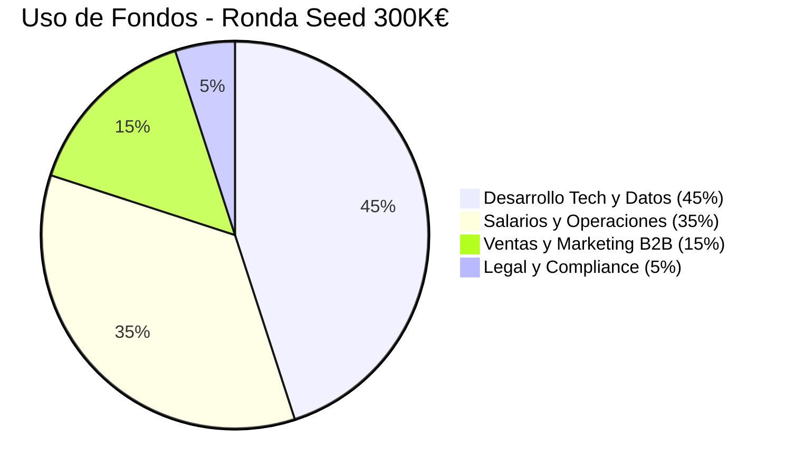
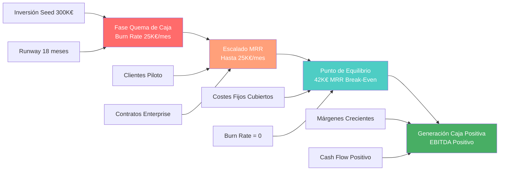

# SECCIÓN 7: PLAN ECONÓMICO-FINANCIERO

## 7.1 Necesidades de Inversión y Fuentes de Financiación

La necesidad de inversión inicial para VELMAK se cuantifica en una ronda Pre-Seed/Seed de 300.000€, capital fundamental para cubrir el burn rate proyectado durante los primeros 18 meses de operación hasta alcanzar un nivel de ingresos recurrentes que permita la autosuficiencia financiera. Esta inversión se considera estratégica y mínima para desarrollar un producto tecnológicamente robusto, construir el equipo fundacional, y ejecutar las primeras iniciativas comerciales que validen el modelo de negocio en el mercado real. El cálculo del burn rate se fundamenta en proyecciones conservadoras de costes fijos incluyendo salarios del equipo promotor, costes de infraestructura cloud, licencias de software especializado, y gastos legales y regulatorios necesarios para operar legalmente en el sector FinTech europeo. La duración de 18 meses de runway proporciona a VELMAK el tiempo suficiente para desarrollar el producto, validar la propuesta de valor con clientes iniciales, y comenzar a generar ingresos recurrentes sin la presión inmediata de buscar financiación adicional.

El uso de fondos (Use of Funds) se distribuye estratégicamente para maximizar el impacto en el desarrollo del negocio mientras se mantiene una estructura de costes eficiente que permita extender el runway al máximo posible. El 45% de la inversión, equivalentes a 135.000€, se destina al desarrollo tecnológico y construcción de capacidades de datos, incluyendo contratación de perfiles técnicos clave, adquisición de infraestructura cloud, y desarrollo del algoritmo de scoring con IA explicable. El 35% de los fondos, aproximadamente 105.000€, se asigna a salarios y operaciones básicas, cubriendo los costes del equipo fundador durante el periodo inicial y gastos operativos esenciales como oficina, software de productividad y servicios básicos. El 15% restante, unos 45.000€, se invierte en ventas y marketing B2B, incluyendo desarrollo de material comercial, participación en eventos FinTech, y ejecución de las primeras campañas de generación de leads cualificados. Finalmente, el 5% de la inversión, aproximadamente 15.000€, se reserva para aspectos legales y de compliance, incluyendo constitución de la sociedad, registro de propiedad intelectual, y asesoramiento regulatorio inicial.

La estrategia de financiación mixta combina capital privado que aporte valor estratégico más allá del capital financiero, con apalancamiento público que minimice la dilución inicial del equipo fundador. El componente principal de financiación privada provendrá de Business Angels con experiencia en el sector tecnológico y FinTech, proporcionando no solo capital sino también mentoría estratégica y acceso a redes de contacto relevantes. Adicionalmente, se buscará la participación de Family Offices especializados en tecnología y fondos de Venture Capital en fase inicial que comprendan el ciclo de desarrollo largo característico de las empresas B2B SaaS. El componente de financiación pública se materializará mediante préstamos participativos de ENISA (Empresa Nacional de Innovación, S.A.), que ofrecen condiciones ventajosas para startups tecnológicas españolas incluyendo periodos de carencia y tipos de interés preferenciales. Esta combinación de fuentes de financiación permite a VELMAK optimizar la estructura de capital, minimizando la dilución mientras se accede a conocimiento especializado y redes de contacto que aceleren el desarrollo del negocio.

La estrategia de desembolso de fondos se planifica por hitos para asegurar el uso eficiente del capital y mantener la disciplina financiera durante la fase inicial. El primer 50% de la inversión se desembolsará inmediatamente tras el cierre de la ronda para cubrir los costes de constitución, contratación de los primeros perfiles técnicos clave, y establecimiento de la infraestructura tecnológica básica. El 25% adicional se liberará tras seis meses, condicionado al logro de hitos técnicos específicos como el desarrollo del MVP funcional y la finalización de las primeras integraciones con APIs de Open Banking. El 25% restante se desembolsará a los doce meses, vinculado a métricas de validación comercial incluyendo la firma de los primeros contratos piloto y la generación de ingresos recurrentes iniciales. Esta estructura de desembolso por hitos alinea los intereses de inversores y fundadores, asegurando que el capital se utilice eficientemente y que la empresa mantenga el foco en la ejecución de los objetivos críticos para alcanzar la sostenibilidad financiera.



## 7.2 Previsiones Financieras a 3 Años (P&L)

Las proyecciones financieras de VELMAK para el horizonte de tres años reflejan una trayectoria de crecimiento típica de una startup B2B SaaS en el sector FinTech, caracterizada por una inversión inicial significativa seguida de una aceleración exponencial de los ingresos una vez validado el modelo de negocio. El Año 1 se centra fundamentalmente en el desarrollo del producto y la validación inicial del mercado, con ingresos proyectados de 50.000€ provenientes principalmente de contratos piloto con clientes early adopters y pruebas de concepto pagadas. Los costes totales durante este primer año ascienden a 300.000€, incluyendo el burn rate completo de la ronda seed, desarrollo tecnológico intensivo, y la construcción inicial del equipo comercial y de operaciones. Esta inversión inicial genera una pérdida neta de 250.000€, completamente cubierta por la financiación seed y considerada una inversión necesaria para construir las capacidades fundamentales que sustentarán el crecimiento futuro.

El Año 2 marca el inicio de la tracción comercial acelerada, con ingresos escalando significativamente hasta alcanzar los 300.000€ mediante la conversión de clientes piloto a contratos anuales y la adquisición de nuevos clientes enterprise. Los costes durante el segundo año aumentan a 400.000€, reflejando la expansión del equipo para soportar el crecimiento de clientes, inversiones en marketing y ventas escaladas, y el aumento de costes de infraestructura cloud proporcional al volumen de transacciones procesadas. La pérdida neta del Año 2 se reduce a 100.000€, mostrando una mejora sustancial en la eficiencia operativa y un camino claro hacia la sostenibilidad financiera. Esta reducción de pérdidas demuestra la validación del modelo de negocio y la capacidad de VELMAK para generar ingresos recurrentes crecientes mientras mantiene el control de los costes operativos.

El Año 3 representa la consolidación del modelo de negocio y la escalabilidad del servicio de scoring a nivel europeo, alcanzando ingresos de 800.000€ mediante la expansión de la base de clientes y el upselling de servicios adicionales a clientes existentes. Los costes se estabilizan en 500.000€ durante el tercer año, reflejando economías de escala en la infraestructura tecnológica y una estructura de costes más eficiente con márgenes crecientes. Este año marca un hito fundamental al generar un EBITDA positivo de 300.000€, demostrando la viabilidad económica del modelo de negocio y la capacidad de VELMAK para generar flujos de caja positivos de manera sostenible. El EBITDA positivo del Año 3 posiciona a VELMAK para una siguiente ronda de financiación Serie A con valoración significativamente superior, permitiendo acelerar la expansión geográfica y el desarrollo de nuevas líneas de producto.

La evolución de la cuenta de pérdidas y ganancias refleja una estrategia deliberada de inversión front-loaded seguida de una explotación eficiente de las capacidades desarrolladas. Los márgenes brutos mejoran progresivamente desde el Año 1 al Año 3, pasando de aproximadamente 60% en la fase inicial a márgenes superiores al 75% en el Año 3, reflejando economías de escala en la infraestructura cloud y una mayor eficiencia en la entrega del servicio. Los costes de ventas y marketing como porcentaje de ingresos disminuyen significativamente del Año 2 al Año 3, demostrando el efecto del brand equity y el poder de las referencias de clientes satisfechos en la reducción del coste de adquisición de nuevos clientes. Esta evolución financiera valida la sostenibilidad del modelo de negocio y posiciona a VELMAK como una inversión atractiva para rondas de financiación posteriores con múltiplos de valoración crecientes.

```mermaid
xychart-beta
    title "Evolución Financiera - Ingresos vs Costes Totales"
    x-axis ["Año 1", "Año 2", "Año 3"]
    y-axis "Euros (€)" 0 --> 900000
    line [50000, 300000, 800000]
    line [300000, 400000, 500000]
    bar [50000, 300000, 800000]
    bar [300000, 400000, 500000]
```



## 7.3 Análisis del Punto Muerto (Break-Even)

El análisis del punto de equilibrio de VELMAK revela que la empresa alcanzará la sostenibilidad financiera una vez que los ingresos recurrentes mensuales (MRR) alcancen aproximadamente 42.000€, momento en el cual el burn rate se vuelve cero y la empresa comienza a generar caja positiva de manera sostenible. Este cálculo se fundamenta en la estructura de costes fijos mensuales proyectada una vez alcanzada la escala operativa óptima, incluyendo salarios del equipo consolidado, costes de infraestructura cloud a escala, y gastos operativos estabilizados. El modelo de negocio SaaS con altos márgenes brutos permite que cada euro adicional de ingresos por encima del punto de equilibrio contribuya directamente al beneficio neto, creando así un apalancamiento financiero significativo una vez superados los costes fijos. Esta característica del modelo SaaS posiciona a VELMAK para un crecimiento altamente rentable una vez alcanzada la masa crítica de clientes.

La ruta hacia el break-even se planifica estratégicamente para finales del Año 2 o principios del Año 3, proporcionando un runway suficiente para validar el modelo de negocio y construir una base sólida de clientes recurrentes. Esta timeline se considera realista y conservadora, basándose en ciclos de venta típicos del sector B2B enterprise que oscilan entre seis y doce meses, y en la necesidad de construir una masa crítica de clientes para alcanzar los 42.000€ de MRR. El camino hacia el break-even incluye hitos intermedios como alcanzar 10.000€ de MRR durante el Año 1, 25.000€ de MRR a mediados del Año 2, y finalmente los 42.000€ de MRR que marcan la sostenibilidad financiera. Cada hito intermedio se acompaña de optimizaciones operativas que mejoran la eficiencia y reducen el burn rate, acelerando así la llegada al punto de equilibrio.

La estructura de costes variables frente a fijos en el modelo de VELMAK favorece significativamente la alcanzabilidad del break-even, ya que los costes principales de infraestructura cloud y procesamiento de datos son variables y escalan con el volumen de clientes y transacciones. Los costes fijos se concentran principalmente en salarios del equipo y gastos operativos básicos, representando aproximadamente el 60% de la estructura de costes total una vez alcanzada la escala. Esta estructura permite que los ingresos adicionales generen márgenes crecientes a medida que la empresa escala, ya que los costes adicionales por cliente nuevo son relativamente bajos comparados con los ingresos recurrentes generados. El modelo de pricing tiered, con márgenes brutos superiores al 80% en los niveles superiores, acelera adicionalmente la llegada al break-even al permitir que clientes de mayor valor contribuyan desproporcionadamente a la cobertura de costes fijos.

El análisis de sensibilidad del break-even demuestra la robustez del modelo de negocio frente a diferentes escenarios de crecimiento y eficiencia operativa. En un escenario conservador con un 20% menor crecimiento de ingresos, el break-even se retrasaría aproximadamente seis meses, pero aún sería alcanzable durante el Año 3. En un escenario optimista con una adquisición de clientes un 30% superior a las proyecciones, el break-even podría alcanzarse a mediados del Año 2, acelerando significativamente la generación de caja positiva. Esta sensibilidad favorable del modelo de negocio proporciona flexibilidad estratégica a VELMAK para adaptarse a condiciones cambiantes del mercado mientras mantiene la viabilidad financiera a largo plazo. El break-even representa no solo un hito financiero, sino también el punto de inflexión estratégico donde VELMAK transicionará de startup en fase de validación a empresa en fase de crecimiento sostenible.



## 7.4 Unit Economics y Ratios Financieros Clave

El análisis de unit economics de VELMAK revela la salud excepcional del modelo de negocio B2B SaaS, caracterizado por métricas que demuestran una alta rentabilidad por cliente y una sostenibilidad financiera sólida a largo plazo. El Coste de Adquisición de Cliente (CAC) en el entorno B2B enterprise se estima en aproximadamente 15.000€, incluyendo costes de marketing, salarios del equipo comercial, y gastos asociados al ciclo de ventas consultivo que típicamente se extiende entre seis y doce meses. Este coste de adquisición, aunque elevado en términos absolutos, se justifica por el alto valor del contrato medio y el largo ciclo de vida del cliente en el sector financiero. El Valor del Ciclo de Vida del Cliente (LTV) se proyecta en aproximadamente 60.000€, calculado basándose en el contrato medio anual de 30.000€, una tasa de retención del 90%, y un ciclo de vida esperado de aproximadamente tres años para clientes enterprise en el sector FinTech.

La relación crítica entre LTV y CAC alcanza un ratio de 4:1, superando significativamente el umbral mínimo de 3:1 considerado saludable para modelos de negocio SaaS. Este ratio favorable indica que por cada euro invertido en adquisición de clientes, VELMAK genera cuatro euros de valor a lo largo del ciclo de vida del cliente, proporcionando un margen sustancial para reinversión en crecimiento y generación de beneficios. La alta rentabilidad por cliente se refuerza adicionalmente por la naturaleza recurrente de los ingresos y los bajos costes variables asociados a la prestación del servicio una vez adquirido el cliente. Los costes de servir a un cliente adicional son principalmente marginales, limitados al consumo adicional de infraestructura cloud y soporte, permitiendo así márgenes crecientes a medida que la empresa escala su base de clientes.

La Tasa de Cancelación (Churn Rate) representa un indicador crítico de la salud del negocio, proyectándose para mantenerse por debajo del 5% anual, nivel considerado excelente en el sector B2B SaaS enterprise. Esta baja tasa de churn se fundamenta en la alta calidad predictiva y explicabilidad del algoritmo de scoring, que genera un valor difícil de replicar por parte de la competencia y crea altas barreras de cambio para los clientes. Adicionalmente, la estrategia de customer success proactiva y el desarrollo continuo de funcionalidades basadas en feedback del mercado refuerzan la retención de clientes. El bajo churn rate es fundamental para la sostenibilidad del LTV, ya que cada punto porcentual de reducción en churn aumenta significativamente el valor esperado del ciclo de vida del cliente y mejora la eficiencia general del modelo de negocio.

El Margen Bruto de API se proyecta superior al 80%, reflejando la eficiencia de la infraestructura cloud-native y la optimización de los costes de procesamiento de datos. Este margen excepcional se logra mediante una arquitectura tecnológica escalable que permite procesar volúmenes crecientes de transacciones con incrementos marginales en los costes de infraestructura. Adicionalmente, el modelo de pricing tiered con precios crecientes según el volumen de uso permite capturar una mayor proporción del valor generado por clientes de alto consumo, mejorando aún más los márgenes brutos promedio. La combinación de altos márgenes brutos, bajo churn rate, y una relación LTV:CAC favorable crea un modelo de negocio altamente escalable y rentable, posicionando a VELMAK para un crecimiento exponencial una vez validada la propuesta de valor en el mercado.

Los ratios financieros clave adicionales refuerzan la solidez del modelo de negocio, incluyendo un Ratio de Margen Bruto superior al 80%, un Ratio de EBITDA que evoluciona desde -500% en el Año 1 a +37.5% en el Año 3, y un Ratio de Conversión de Leads a Clientes que se proyecta en aproximadamente el 15% para leads cualificados. Estos ratios demuestran la transición exitosa desde una fase de inversión intensiva a una fase de generación sostenible de beneficios y caja positiva. La métrica de Months to Recover CAC, calculada como LTV/CAC dividido por el margen bruto, se proyecta en aproximadamente 18 meses, indicando que la inversión en adquisición de clientes se recupera en menos de dos años, timeframe considerado excelente en el sector B2B enterprise. Este conjunto de métricas financieras saludables posiciona a VELMAK como una inversión atractiva para rondas de financiación posteriores y demuestra la viabilidad económica sostenible del modelo de negocio.

```mermaid
mindmap
  root((Unit Economics<br>B2B SaaS))
    LTV<br>Lifetime Value
      "60.000€ por cliente"
      "Contrato medio 30K€/año"
      "Retención 90% (3 años)"
    CAC<br>Customer Acquisition Cost
      "15.000€ por cliente"
      "Marketing + Ventas B2B"
      "Ciclo 6-12 meses"
    Churn Rate<br>Tasa Cancelación
      "< 5% anual"
      "Calidad algoritmo"
      "Barreras cambio"
    Margen API<br>Margen Bruto
      "> 80% bruto"
      "Infraestructura eficiente"
      "Pricing tiered optimizado"
    Ratio LTV:CAC
      "4:1 (óptimo)"
      "Por cada € invertido<br>genera €4 de valor"
    Months to Recover CAC
      "18 meses"
      "Recuperación < 2 años"
      "Excelente sector B2B"
```
