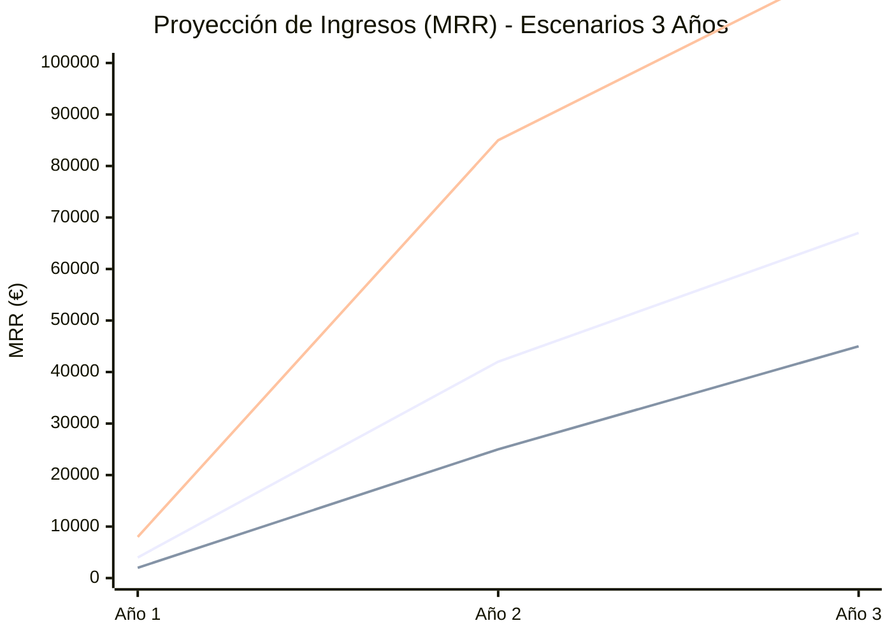
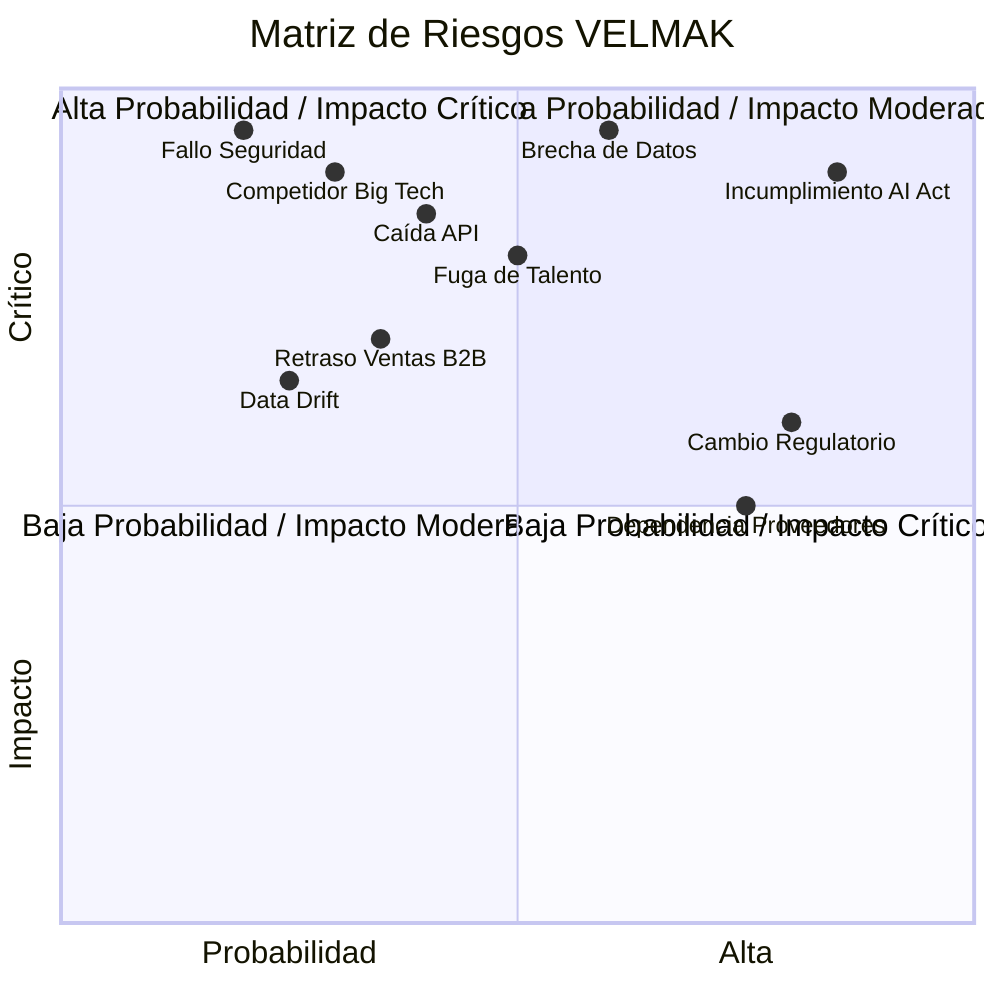
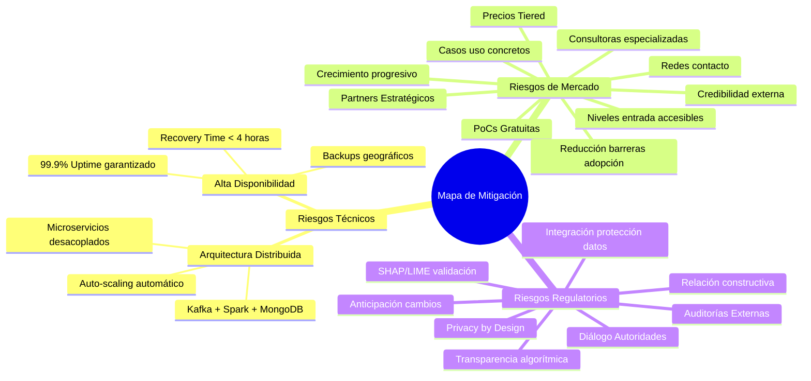
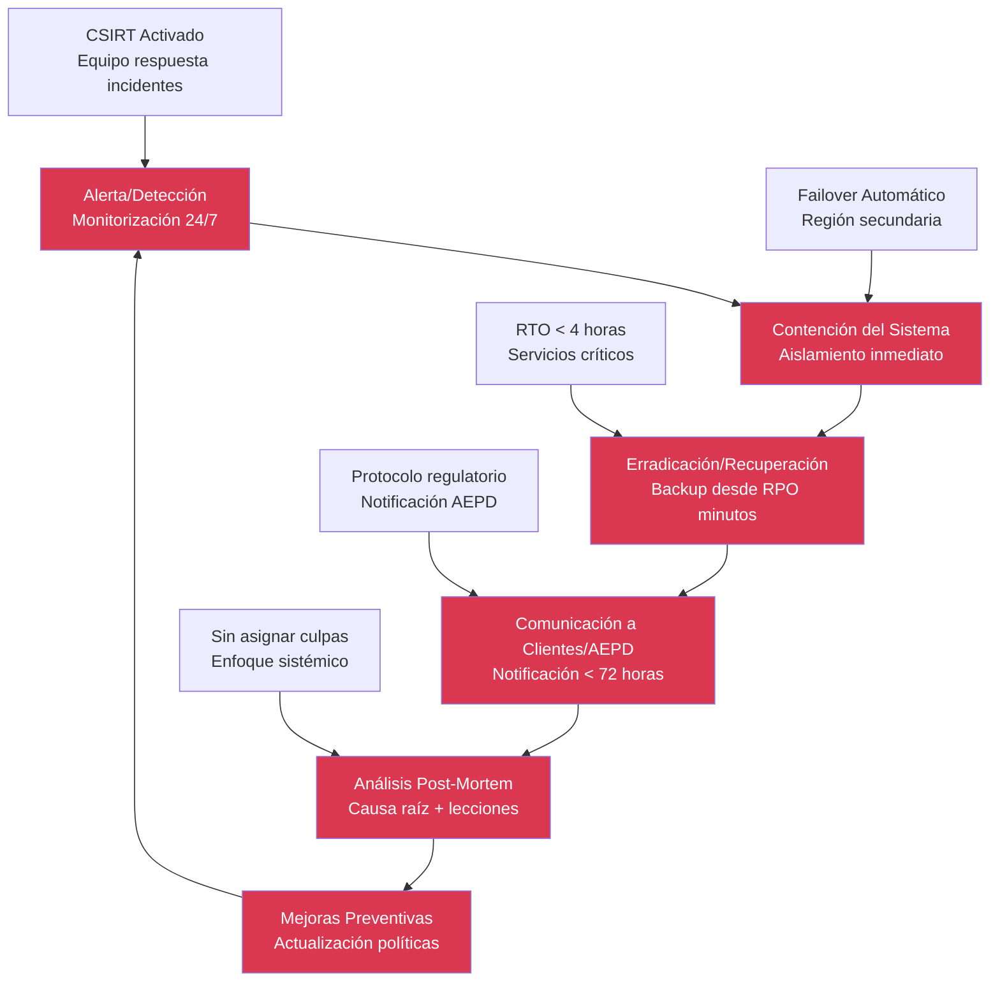

# SECCIÓN 8: PLAN DE CONTINGENCIAS

## 8.1 Análisis de Escenarios Macro (Sensibilidad)

El análisis de sensibilidad de VELMAK contempla tres escenarios macroeconómicos y de adopción que permiten evaluar la resiliencia del modelo de negocio frente a diferentes condiciones del mercado y variables externas. El escenario Base o Moderado representa la trayectoria más probable donde VELMAK cumple con las proyecciones financieras iniciales, alcanzando el break-even en el mes 24 mediante una adopción gradual y constante de clientes B2B en el sector FinTech europeo. Este escenario se fundamenta en ciclos de ventas típicos de 6-12 meses, una tasa de conversión de leads cualificados del 15%, y un crecimiento orgánico sostenido que permite alcanzar los 42.000€ de MRR necesarios para la sostenibilidad financiera. La ejecución exitosa del escenario base requiere una gestión eficiente del capital seed, mantenimiento del runway durante 18 meses, y ejecución consistente de la estrategia de ventas consultivas con validación mediante PoCs.

El escenario Optimista contempla una adopción acelerada del servicio mediante la firma de un contrato estratégico con un Tier 1 Bank que actúa como catalizador del crecimiento y valida masivamente la propuesta de valor de VELMAK en el mercado. Este escenario se materializaría mediante la conversión exitosa de un PoC con una institución financiera de primer nivel, generando un efecto multiplicador en el mercado que duplicaría los ingresos proyectados para el Año 2 y adelantaría el break-even al mes 18. La adopción viral se fundamentaría en el efecto network de las referencias de clientes enterprise, la credibilidad instantánea generada por el respaldo de una institución financiera líder, y la aceleración de ciclos de ventas posteriores mediante la reducción de barreras de confianza. Este escenario permitiría a VELMAK acceder a una ronda Serie A con valoración significativamente superior y acelerar la expansión geográfica a mercados europeos adicionales.

El escenario Pesimista considera una combinación adversa de factores incluyendo retrasos significativos en la adopción B2B, endurecimiento del entorno regulatorio que aumenta los requisitos de compliance, y una posible crisis económica que reduce la inversión en tecnología por parte de las instituciones financieras. En este escenario, los ciclos de ventas se extenderían hasta 18 meses, la tasa de conversión disminuiría al 8%, y los ingresos del Año 2 se limitarían a 150.000€ frente a los 300.000€ proyectados. La respuesta a este escenario requeriría la implementación inmediata de medidas de conservación de capital incluyendo reducción de costes no esenciales, reestructuración del equipo para optimizar el burn rate, y búsqueda de financiación puente para extender el runway adicionalmente. La estrategia de mitigación incluiría additionally el enfoque en clientes de menor tamaño con ciclos de venta más cortos y la exploración de modelos de freemium para reducir barreras de adopción iniciales.

La gestión proactiva de estos escenarios mediante monitorización constante de indicadores clave permite a VELMAK adaptar su estrategia operativa y financiera según las condiciones del mercado. Los indicadores de alerta temprana incluyen la duración promedio de ciclos de ventas, la tasa de conversión de leads, el coste de adquisición de clientes, y los cambios regulatorios emergentes en el ámbito FinTech europeo. La implementación de dashboards en tiempo real que monitorean estos KPIs facilita la detección temprana de desviaciones respecto al escenario base, permitiendo activar protocolos de respuesta predefinidos antes de que las desviaciones se conviertan en crisis críticas. Este enfoque de gestión por escenarios proporciona a VELMAK la agilidad necesaria para navegar la incertidumbre inherente al mercado de startups tecnológicas mientras mantiene la disciplina financiera y el foco estratégico.

## 8.2 Identificación y Clasificación de Riesgos

La identificación sistemática de riesgos de VELMAK revela múltiples categorías de amenazas que requieren evaluación y gestión proactiva para garantizar la sostenibilidad del negocio a largo plazo. Los riesgos técnicos incluyen la caída crítica de la infraestructura de ingesta de datos que podría interrumpir el servicio de scoring y afectar la confianza de los clientes, la degradación masiva del modelo predictivo debido a data drift o concept drift no detectados oportunamente, y fallos de seguridad que comprometan la integridad de los datos financieros procesados. Estos riesgos técnicos se caracterizan por su alto impacto potencial en la operación del negocio y su probabilidad moderada dada la complejidad tecnológica del servicio y la dependencia de múltiples sistemas externos para la ingesta de datos. La materialización de estos riesgos podría resultar en pérdida de clientes, daños reputacionales significativos, y posibles sanciones regulatorias por interrupción del servicio.

Los riesgos de mercado abarcan el rechazo inicial de las instituciones financieras a confiar en sistemas de IA para decisiones crediticias críticas, la aparición de competidores de gran escala como Google, Amazon o Microsoft que podrían ofrecer soluciones similares con precios agresivos, y cambios en las necesidades del mercado que hagan obsoleta la propuesta de valor actual de VELMAK. El rechazo del mercado representa un riesgo de alto impacto y probabilidad moderada, especialmente considerando la naturaleza conservadora del sector financiero y la resistencia tradicional a la adopción de tecnologías disruptivas en procesos críticos. La entrada de competidores Big Tech constituye un riesgo de alto impacto y probabilidad creciente, dada la creciente inversión de estas empresas en servicios FinTech y su capacidad para ofrecer soluciones integradas con ecosistemas existentes. Los cambios en las necesidades del mercado representan un riesgo de impacto moderado pero alta probabilidad, considerando la rápida evolución tecnológica y las cambiantes expectativas de los consumidores y empresas.

Los riesgos regulatorios incluyen multas severas por brechas de datos o incumplimiento del GDPR, sanciones por violación de la AI Act europea, y cambios regulatorios que aumenten los requisitos de capital o licencias para operar servicios de scoring financiero. Las brechas de datos constituyen un riesgo de impacto crítico y probabilidad moderada, considerando el creciente número de ciberataques dirigidos al sector FinTech y las estrictas normativas de protección de datos europeas. El incumplimiento de la AI Act representa un riesgo de alto impacto y probabilidad alta, dada la naturaleza innovadora del servicio y la evolución continua del marco regulatorio europeo sobre IA. Los cambios regulatorios en requisitos de capital o licencias constituyen un riesgo de impacto moderado pero alta probabilidad, especialmente considerando la tendencia regulatoria hacia mayor supervisión del sector FinTech y la protección del sistema financiero.

Los riesgos operativos y de talento completan el panorama de amenazas, incluyendo la fuga de talento técnico clave hacia competidores o empresas tecnológicas consolidadas, la dependencia de proveedores críticos como AWS o agregadores de datos, y la falta de liquidez para alcanzar el break-even en los plazos planificados. La fuga de talento representa un riesgo de alto impacto y probabilidad moderada, considerando la alta demanda de perfiles especializados en IA y FinTech y la capacidad de grandes corporaciones para ofrecer paquetes compensativos superiores. La dependencia de proveedores críticos constituye un riesgo de impacto moderado pero alta probabilidad, dada la concentración del mercado cloud y de servicios de datos financieros. La falta de liquidez representa un riesgo de impacto crítico y probabilidad moderada, especialmente considerando las dificultades típicas de las startups para acceder a financiación en etapas tempranas y los posibles retrasos en la generación de ingresos recurrentes.

## 8.3 Estrategias de Mitigación (Prevención)

Las estrategias de mitigación técnica de VELMAK se fundamentan en una arquitectura distribuida y resiliente que garantiza alta disponibilidad del servicio mediante la implementación de múltiples capas de redundancia y tolerancia a fallos. La infraestructura basada en Kafka para mensajería en tiempo real, Apache Spark para procesamiento distribuido, y MongoDB como base de datos NoSQL proporciona escalabilidad horizontal y resistencia a fallos individuales de componentes. La implementación de microservicios desacoplados permite la actualización y mantenimiento de componentes específicos sin afectar la disponibilidad general del servicio, mientras que las estrategias de auto-scaling automático garantizan que la infraestructura pueda absorber picos de demanda sin degradación del rendimiento. Adicionalmente, se implementan backups automáticos con replicación geográfica y planes de recuperación ante desastres que permiten restaurar el servicio en tiempo récord ante interrupciones críticas.

La mitigación del riesgo de mercado se aborda mediante una estrategia de adopción gradual que reduce las barreras de entrada para clientes potenciales y valida la propuesta de valor mediante evidencia tangible. La oferta de Pruebas de Concepto (PoC) gratuitas permite a instituciones financieras evaluar el servicio sin compromiso financiero inicial, reduciendo significativamente la resistencia a la adopción y generando casos de uso concretos que pueden ser utilizados como referencias. La estrategia de precios tiered con niveles de entrada accesibles facilita la captura de clientes de menor tamaño que pueden convertirse en clientes enterprise a medida que crecen y validan el valor del servicio. Adicionalmente, se desarrolla un programa de partners estratégicos con consultoras especializadas en transformación digital del sector financiero, aprovechando sus redes de contacto y credibilidad para acelerar la penetración en el mercado y reducir los ciclos de ventas.

La mitigación regulatoria se materializa mediante un programa de cumplimiento proactivo que incluye auditorías externas regulares de los algoritmos de explicabilidad, implementación de privacy by design en todas las fases del desarrollo, y mantenimiento de un diálogo constructivo con autoridades supervisoras. Las auditorías externas de los sistemas SHAP/LIME proporcionan validación independiente de la transparencia y equidad algorítmica, generando confianza tanto en clientes como en reguladores. La implementación de principios de privacy by design asegura que la protección de datos personales se integre desde el diseño del producto, minimizando riesgos de incumplimiento del GDPR. El diálogo proactivo con autoridades supervisoras como el Banco de España y la AEPD permite anticipar cambios regulatorios y adaptar los sistemas antes de que los requisitos se vuelvan obligatorios, reduciendo así el riesgo de sanciones y multas.

La mitigación de riesgos operativos y de talento se implementa mediante políticas de retención competitivas y diversificación de proveedores para reducir la dependencia crítica. El paquete de compensación total que combina salarios competitivos con equity y beneficios flexibles crea incentivos poderosos para la retención de talento clave. Adicionalmente, se implementan programas de desarrollo profesional continuo y oportunidades de crecimiento interno que proporcionan trayectorias claras de carrera dentro de la organización. La diversificación de proveedores cloud mediante estrategia multi-cloud y el desarrollo de conectores con múltiples agregadores de datos reduce la dependencia de proveedores individuales y proporciona alternativas inmediatas ante interrupciones de servicio. Estas estrategias combinadas crean una operación resiliente capaz de absorber impactos externos sin comprometer la continuidad del negocio.

## 8.4 Plan de Respuesta y Continuidad de Negocio (DRP)

El Plan de Recuperación ante Desastres (Disaster Recovery Plan) de VELMAK se diseña para garantizar la continuidad del servicio ante escenarios críticos como ciberataques masivos, caídas regionales de infraestructura cloud, o brechas de datos comprometedoras. Este plan establece objetivos estrictos de Recovery Time Objective (RTO) de menos de 4 horas para restaurar servicios críticos y Recovery Point Objective (RPO) de minutos para minimizar la pérdida de datos, asegurando así que las interrupciones del servicio tengan un impacto mínimo en las operaciones de los clientes. La estrategia de recuperación se fundamenta en una arquitectura multi-región con replicación sincrónica de datos críticos y failover automático que permite redirigir el tráfico a la región secundaria sin intervención manual. Los procedimientos de recuperación incluyen activación inmediata del equipo de respuesta a incidentes, comunicación proactiva con clientes sobre el estado del servicio, y restauración escalonada de funcionalidades según su criticidad.

El protocolo de comunicación de crisis establece canales y responsables claros para garantizar una respuesta coordinada y transparente ante incidentes críticos. El equipo de respuesta a incidentes (CSIRT) se activa inmediatamente upon detection de una amenaza crítica, con roles predefinidos incluyendo líder de incidente, coordinador técnico, responsable de comunicación, y enlace legal y regulatorio. La comunicación interna se realiza mediante canales seguros y redundantes incluyendo Slack, email cifrado, y sistemas de comunicación de emergencia externos. La comunicación externa se gestiona mediante un protocolo escalonado que prioriza la notificación a clientes afectados, autoridades regulatorias, y stakeholders clave según la naturaleza y severidad del incidente. Las plantillas de comunicación pre-aprobadas permiten respuestas rápidas y consistentes mientras se investiga la causa raíz del problema.

La respuesta regulatoria ante incidentes de seguridad sigue estrictamente los plazos establecidos por la normativa europea, especialmente la obligación de notificar a la Agencia Española de Protección de Datos (AEPD) en un plazo inferior a 72 horas ante brechas de datos personales. El procedimiento incluye la evaluación inmediata del alcance del incidente, identificación de los tipos de datos afectados, determinación de las consecuencias potenciales para los derechos y libertades de los individuos, y preparación de una notificación completa que incluya la naturaleza de la brecha, las medidas correctivas implementadas, y las recomendaciones para las personas afectadas. Adicionalmente, se establecen protocolos de coordinación con otras autoridades relevantes incluyendo el Banco de España, el CNMV, y autoridades de protección de datos de otros países europeos cuando los datos afectados trascienden las fronteras nacionales.

El análisis post-mortem constituye una fase fundamental del plan de respuesta, permitiendo aprender de los incidentes para mejorar continuamente la resiliencia del sistema y los procedimientos de respuesta. Este análisis se realiza sin asignar culpas, enfocándose exclusivamente en identificar las causas raíz, las fallas en los procesos o sistemas que permitieron el incidente, y las oportunidades de mejora preventiva. Los resultados del post-mortem se documentan sistemáticamente y se traducen en acciones concretas incluyendo actualización de políticas, mejora de controles técnicos, y capacitación adicional del equipo. Las lecciones aprendidas se comparten internamente para elevar la conciencia de seguridad en toda la organización y externamente con clientes y reguladores para demostrar el compromiso continuo con la mejora de la seguridad y resiliencia del servicio.

