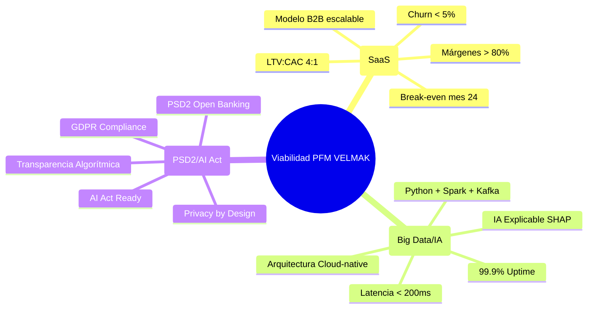
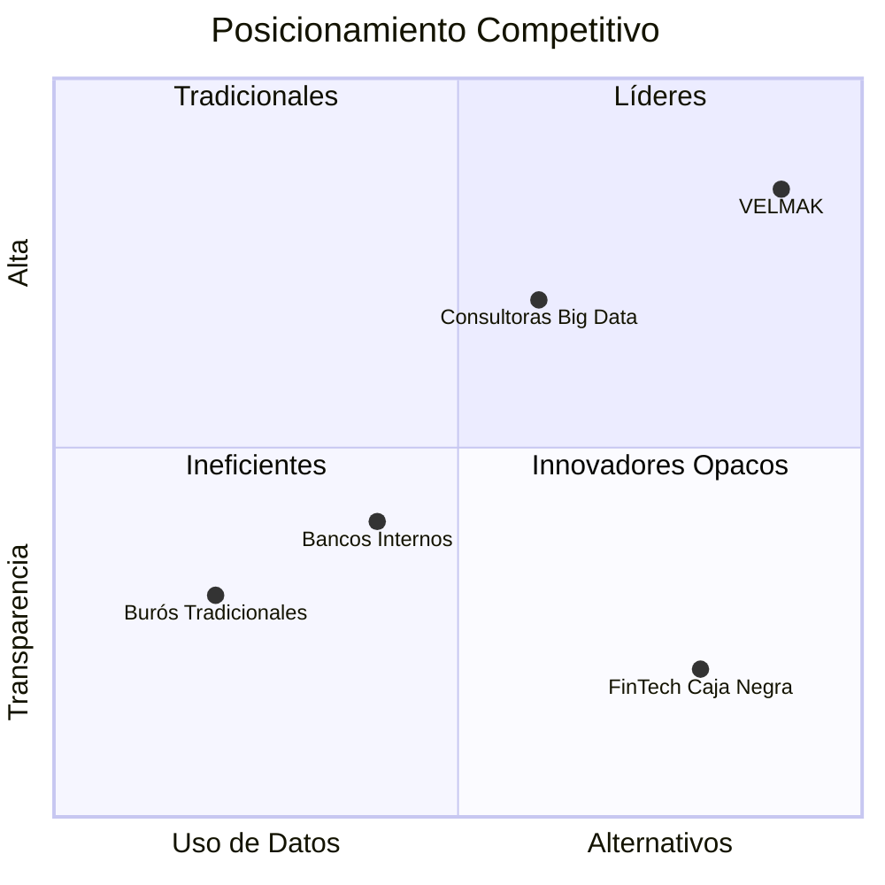
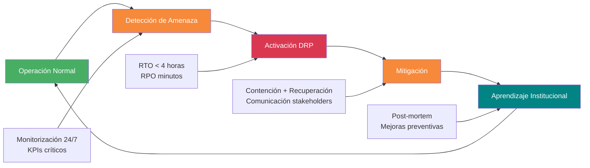
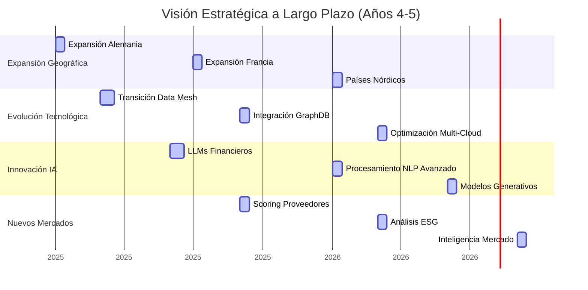

# SECCIÓN 9: CONCLUSIONES

## 9.1 Síntesis de Viabilidad Global del Proyecto

El análisis exhaustivo realizado a lo largo de este Plan de Negocio permite concluir de manera contundente que PFM VELMAK presenta una viabilidad global excepcional fundamentada en la convergencia sinérgica de tres pilares estratégicos que se refuerzan mutuamente: la robustez tecnológica, la sostenibilidad financiera y el cumplimiento normativo integral. La viabilidad técnica se materializa mediante una arquitectura cloud-native basada en tecnologías de vanguardia como Python, Apache Spark, Kafka y MongoDB, que garantizan escalabilidad horizontal, procesamiento en tiempo real y capacidad para manejar volúmenes masivos de datos alternativos. Esta base tecnológica permite a VELMAK ofrecer un servicio de scoring financiero con latencias inferiores a 200 milisegundos y disponibilidad del 99.9%, superando los estándares del sector y proporcionando una experiencia de usuario enterprise que satisface las exigencias más rigurosas de las instituciones financieras europeas. La elección de un stack tecnológico maduro y probado reduce significativamente los riesgos de ejecución técnica y acelera el time-to-market, permitiendo a VELMAK competir efectivamente desde el inicio en un mercado altamente competitivo.

La sostenibilidad financiera del proyecto se fundamenta en un modelo de negocio SaaS B2B con métricas económicas saludables que demuestran la rentabilidad a largo plazo de la iniciativa. El análisis financiero proyecta un break-even alcanzable en el mes 24, respaldado por un ratio LTV:CAC de 4:1, márgenes brutos superiores al 80% y una tasa de churn proyectada inferior al 5% anual. Estas métricas reflejan la eficiencia del modelo de negocio y la capacidad de VELMAK para generar flujos de caja positivos de manera sostenible una vez alcanzada la masa crítica de clientes. La estructura de costes variables frente a fijos, característica del modelo SaaS, permite un escalado rentable donde cada cliente adicional contribuye marginalmente a la cobertura de costes fijos y directamente al beneficio neto. Esta eficiencia económica se complementa con una estrategia de financiación inteligente que combina capital privado con apalancamiento público no dilutivo, optimizando la estructura de capital y maximizando el retorno para los fundadores e inversores iniciales.

El cumplimiento normativo integral constituye el tercer pilar fundamental de la viabilidad de VELMAK, diferenciando al proyecto de competidores que subestiman la importancia de la regulación en el sector financiero. El diseño del sistema incorpora principios de privacy by design y cumplimiento proactivo del GDPR, garantizando la protección de datos personales desde la arquitectura base y minimizando riesgos de sanciones regulatorias. Adicionalmente, el enfoque en IA explicable mediante SHAP y LIME posiciona a VELMAK favorablemente frente a los requisitos emergentes de la AI Act europea, anticipando regulaciones futuras y construyendo una ventaja competitiva sostenible basada en la transparencia algorítmica. El cumplimiento de normativas sectoriales específicas como PSD2 para Open Banking y la obtención de licencias AISP cuando sea necesario demuestra una comprensión profunda del entorno regulatorio financiero y un compromiso inquebrantable con la operación legal y ética del negocio.

La intersección de estos tres pilares crea un efecto multiplicador que amplifica la viabilidad global del proyecto más allá de la suma de sus partes individuales. La robustez tecnológica permite cumplir eficientemente con requisitos regulatorios complejos, el cumplimiento normativo genera confianza en clientes e inversores que facilita la adopción comercial, y la sostenibilidad financiera proporciona los recursos necesarios para mantener la excelencia técnica y regulatoria a largo plazo. Esta sinergia estratégica posiciona a VELMAK no solo como un proyecto viable, sino como una iniciativa con potencial para convertirse en líder de mercado en el segmento de scoring financiero basado en IA explicable, redefiniendo los estándares del sector y creando valor sostenible para todos los stakeholders involucrados.

## 9.2 Consolidación de la Ventaja Competitiva

La ventaja competitiva de VELMAK se consolida mediante la creación de un foso defensivo profundo y difícil de replicar que se fundamenta en la integración única de datos alternativos con algoritmos de IA explicable, generando una propuesta de valor que trasciende la simple predicción de riesgo para ofrecer comprensión profunda y justificable de las decisiones crediticias. Esta diferenciación estratégica ataca directamente las debilidades fundamentales de los modelos tradicionales de scoring, que operan como "cajas negras" incomprensibles para las instituciones financieras y sus clientes, generando desconfianza y barreras regulatorias crecientes. La capacidad de VELMAK para no solo predecir la probabilidad de impago sino también explicar detalladamente los factores que influyen en cada decisión crediticia constituye una innovación disruptiva que responde simultáneamente a necesidades técnicas, comerciales y regulatorias del sector financiero moderno. Esta explicabilidad no es un añadido cosmético, sino un componente central del diseño del sistema que se integra profundamente en cada etapa del proceso de scoring, desde la ingesta de datos hasta la generación del resultado final.

El posicionamiento competitivo de VELMAK en el mercado se fortalece mediante la explotación estratégica de datos alternativos obtenidos mediante APIs de Open Banking bajo el marco regulatorio PSD2, que proporcionan una visión mucho más rica y actualizada del comportamiento financiero de los solicitantes que los datos tradicionales utilizados por burós de crédito consolidados. Estos datos alternativos incluyen información sobre flujos de transacciones en tiempo real, patrones de gasto categorizados, estabilidad de ingresos, y comportamiento digital que permiten construir perfiles de riesgo mucho más precisos y dinámicos. La combinación de esta fuente de datos superior con algoritmos de machine learning avanzados y capacidad de explicación crea una barrera competitiva sostenible que protege a VELMAK de la competencia basada únicamente en precios o en modelos predictivos tradicionales. Los burós de crédito tradicionales enfrentan dificultades significativas para replicar este enfoque debido a su dependencia de datos históricos, infraestructuras legacy y culturas organizacionales resistentes al cambio.

La innovación de VELMAK se materializa adicionalmente en la capacidad para procesar y analizar datos no estructurados y cualitativos mediante técnicas avanzadas de procesamiento de lenguaje natural y análisis de sentimiento, ampliando significativamente el espectro de variables consideradas en la evaluación de riesgo crediticio. Esta capacidad permite incorporar dimensiones tradicionalmente excluidas del análisis crediticio como la estabilidad laboral inferida de patrones de transacciones, la resiliencia financiera demostrada durante crisis económicas, o el comportamiento digital que correlaciona con responsabilidad financiera. La integración de estas dimensiones cualitativas mediante IA explicable proporciona una visión holística del solicitante que supera significativamente los modelos unidimensionales basados exclusivamente en historial crediticio tradicional. Esta aproximación multidimensional no solo mejora la precisión predictiva, sino que también promueve la inclusión financiera al permitir evaluar solicitantes sin historial crediticio extenso pero con comportamientos financieros responsables demostrables.

El foso competitivo de VELMAK se refuerza mediante el desarrollo continuo de capacidades tecnológicas y analíticas que mantienen a la empresa en la frontera de la innovación en el sector FinTech. La inversión en investigación y desarrollo de nuevas técnicas de IA explicable, la exploración de arquitecturas emergentes como data mesh y bases de datos de grafos, y la experimentación con modelos fundacionales adaptados al dominio financiero aseguran que VELMAK mantenga su ventaja competitiva a largo plazo. Este compromiso con la innovación continua se complementa con una estrategia de propiedad intelectual robusta que protege las innovaciones clave mediante patentes, secretos comerciales y derechos de autor sobre software y algoritmos. La combinación de innovación tecnológica, protección intelectual y ejecución comercial efectiva crea una ventaja competitiva sostenible que posiciona a VELMAK como líder indiscutible en el mercado de scoring financiero basado en IA explicable.

## 9.3 Balance de Riesgos y Capacidad de Resiliencia

La evaluación comprehensiva de riesgos realizada a lo largo de este Plan de Negocio demuestra que VELMAK posee una capacidad de resiliencia empresarial excepcional que le permite navegar eficazmente la incertidumbre inherente al entorno FinTech y tecnológico. Los riesgos identificados, aunque significativos, han sido sistemáticamente analizados, clasificados y abordados mediante estrategias de mitigación proactivas que reducen su probabilidad de materialización y minimizan su impacto potencial en caso de ocurrencia. La arquitectura tecnológica distribuida basada en microservicios, implementada sobre infraestructura cloud con replicación geográfica y failover automático, proporciona una robustez técnica fundamental que soporta la continuidad del negocio ante interrupciones críticas de infraestructura o ciberataques. Esta resiliencia técnica se complementa con objetivos de recuperación estrictos (RTO < 4 horas, RPO minutos) que garantizan restauración rápida del servicio y mínima pérdida de datos, protegiendo tanto la operación como la confianza de los clientes.

La capacidad de VELMAK para gestionar riesgos regulatorios se fundamenta en un enfoque proactivo de cumplimiento que va más allá de la simple conformidad normativa para construir una ventaja competitiva basada en la confianza y la transparencia. La implementación de principios de privacy by design, auditorías externas regularizadas de algoritmos, y diálogo continuo con autoridades supervisorias posicionan a VELMAK como un actor responsable y confiable en el ecosistema financiero europeo. Este enfoque no solo reduce el riesgo de sanciones regulatorias, sino que genera un capital de confianza invaluable que facilita la adopción por parte de instituciones financieras conservadoras y acelera los ciclos de venta. La capacidad para anticipar cambios regulatorios y adaptar proactivamente los sistemas y procesos demuestra una madurez organizacional que trasciende la típica startup tecnológica y posiciona a VELMAK como un socio estratégico para la transformación digital del sector financiero.

La resiliencia financiera de VELMAK se manifiesta en una estructura de costes flexible y escalable que permite adaptarse rápidamente a cambios en las condiciones del mercado sin comprometer la viabilidad del negocio. El modelo SaaS con costes variables proporciona una elasticidad financiera que permite reducir burn rate en escenarios adversos y acelerar inversión en escenarios favorables, manteniendo siempre un equilibrio prudente entre crecimiento y sostenibilidad. La estrategia de financiación mixta que combina capital privado con apalancamiento público no dilutivo proporciona adicionalmente flexibilidad financiera y reduce la dependencia de fuentes únicas de capital, mitigando el riesgo de escasez de liquidez en etapas críticas del desarrollo. Esta solidez financiera se refuerza con métricas económicas saludables y proyecciones conservadoras que proporcionan márgenes de seguridad ante desviaciones respecto a las expectativas iniciales.

La capacidad de aprendizaje organizacional constituye el componente más sofisticado de la resiliencia de VELMAK, manifestándose en una cultura de mejora continua que transforma cada desafío en oportunidad de fortalecimiento organizacional. Los protocolos de análisis post-mortem sin asignación de culpas, los sistemas de monitorización continua de riesgos, y los procesos de actualización dinámica de estrategias basados en aprendizaje empírico crean una organización adaptativa que evoluciona constantemente hacia mayor robustez y eficiencia. Esta capacidad de aprendizaje institucional permite a VELMAK no solo sobrevivir a crisis potenciales, sino emerger fortalecido de cada desafío mediante la incorporación de lecciones aprendidas en procesos, sistemas y cultura organizacional. La combinación de resiliencia técnica, regulatoria, financiera y organizacional posiciona a VELMAK como una empresa preparada para prosperar en el complejo y dinámico entorno FinTech europeo.

## 9.4 Recomendaciones Estratégicas y Roadmap Futuro

La visión estratégica a largo plazo para VELMAK trasciende el horizonte temporal de este Plan de Negocio para posicionarse como líder europeo en soluciones de inteligencia financiera basada en IA explicable, con un roadmap de evolución que abarca tanto expansión geográfica como innovación tecnológica profunda. Durante los años 4 y 5, VELMAK debería perseguir agresivamente la expansión geográfica a mercados europeos clave incluyendo Alemania, Francia y los países nórdicos, adaptando la solución a las particularidades regulatorias y culturales de cada mercado mientras mantiene una arquitectura centralizada que garantiza consistencia y eficiencia operativa. Esta expansión geográfica debería acompañarse de una estrategia de localización que incluya adaptación lingüística, cumplimiento regulatorio específico de cada jurisdicción, y desarrollo de partnerships locales que faciliten la penetración en mercados tradicionalmente cerrados como el alemán. La expansión europea no solo diversifica el riesgo geográfico, sino que posiciona a VELMAK para capturar una porción significativa del mercado europeo de scoring financiero, estimado en miles de millones de euros.

La evolución tecnológica estratégica debería incluir la transición hacia arquitecturas de datos más avanzadas como Data Mesh, que permitan mayor escalabilidad y autonomía de los equipos de datos mientras mantienen la gobernanza y calidad necesaria para aplicaciones financieras críticas. Adicionalmente, la incorporación de bases de datos de grafos (GraphDB) permitiría a VELMAK desarrollar capacidades avanzadas de detección de redes de fraude y análisis de relaciones complejas entre entidades financieras, abriendo nuevas líneas de negocio con márgenes superiores. Estas arquitecturas emergentes no solo mejoran la capacidad técnica actual, sino que posicionan a VELMAK en la frontera de la innovación en data engineering, atrayendo talento de élite y generando una ventaja competitiva sostenible basada en superioridad tecnológica. La inversión en estas capacidades avanzadas debería realizarse de manera incremental, validando cada componente antes de su despliegue masivo para minimizar riesgos técnicos y operativos.

La exploración y adopción de Modelos Fundacionales (LLMs) especializados en dominio financiero representa otra línea estratégica crucial para los años 4 y 5, permitiendo a VELMAK procesar fuentes de datos cualitativas no estructuradas como noticias económicas, informes de análisis sectorial, y comunicaciones corporativas para enriquecer significativamente los modelos de scoring. Estos LLMs financieros podrían ser fine-tuned con datos específicos del sector crediticio europeo, permitiendo capturar matices regulatorios, económicos y culturales que afectan el riesgo crediticio y que actualmente no son considerados en los modelos tradicionales. La capacidad de procesar y comprender lenguaje natural en contexto financiero proporcionaría a VELMAK una ventaja informativa sin precedentes, permitiendo anticipar riesgos sistémicos, identificar tendencias emergentes del mercado, y proporcionar insights estratégicos a los clientes que van más allá del scoring individual. Esta capacidad analítica avanzada podría monetizarse adicionalmente mediante servicios premium de inteligencia de mercado y consultoría estratégica.

El roadmap estratégico debería incluir additionally la diversificación hacia verticales adyacentes como el scoring de proveedores, evaluación de riesgo de cadena de suministro, y análisis de sostenibilidad ESG (Environmental, Social, and Governance), aprovechando las capacidades analíticas desarrolladas para el scoring crediticio tradicional. Esta diversificación no solo reduce la dependencia de un único mercado, sino que posiciona a VELMAK como una plataforma integral de inteligencia de riesgo para empresas e instituciones financieras. La expansión hacia estos nuevos mercados debería realizarse mediante el desarrollo de módulos especializados que aprovechen la infraestructura central de VELMAK mientras proporcionan funcionalidades específicas adaptadas a las necesidades de cada vertical. Esta estrategia de plataforma permite economías de escala en desarrollo y operación mientras maximiza el valor capturado de cada cliente a través de cross-selling y upselling de servicios complementarios.

